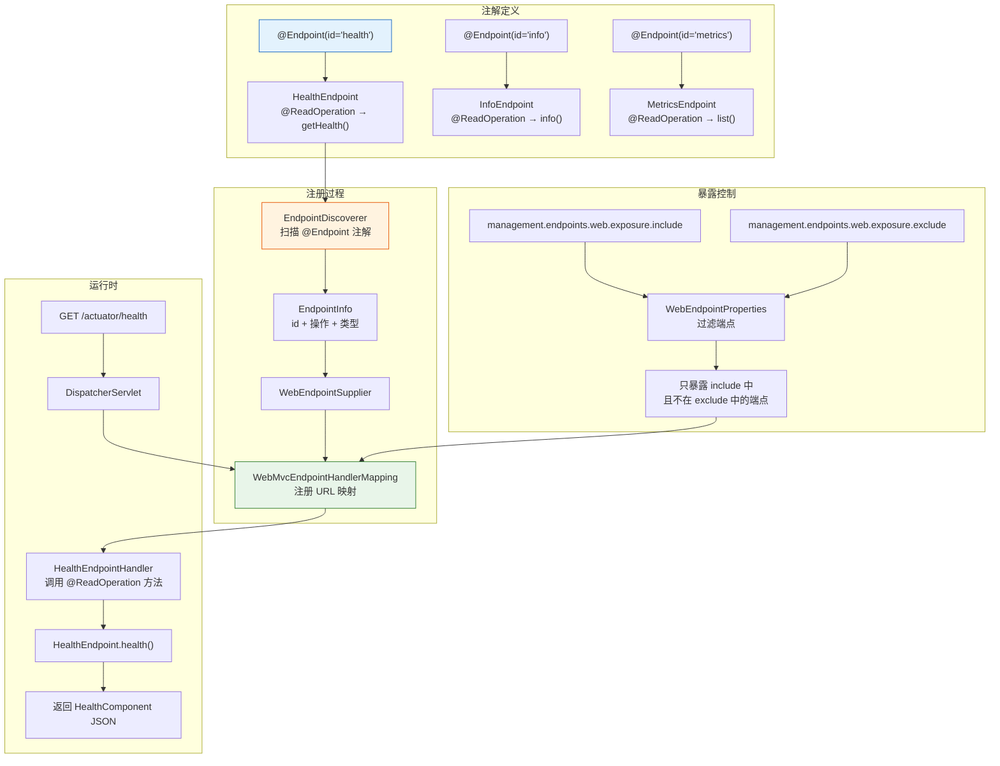
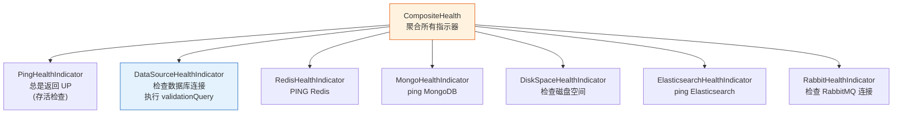
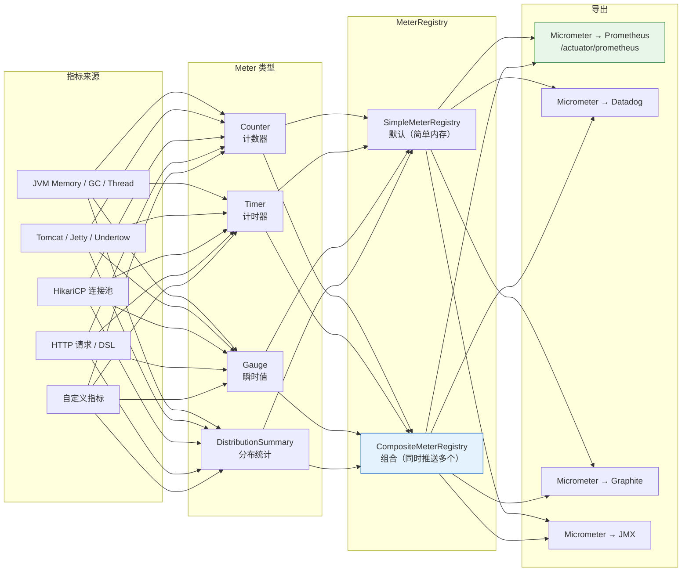
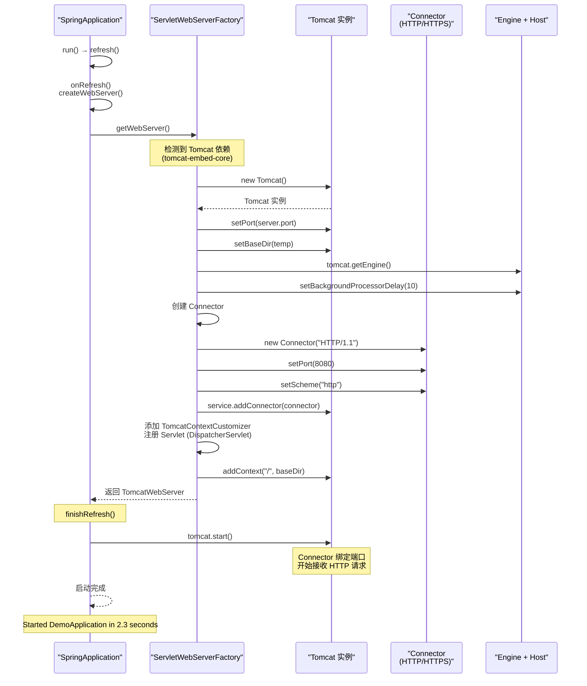
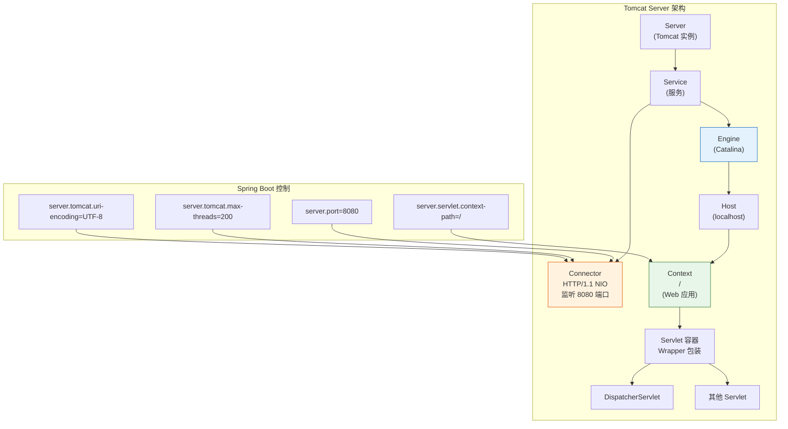

# Actuator 监控与嵌入式服务器

> 本文为系列第 8 篇，覆盖：Actuator 端点源码体系、HealthIndicator 健康检查、Micrometer 指标、嵌入式 Tomcat/Jetty/Undertow 启动源码、WebServerFactoryCustomizer、生产配置。

---

## 第一部分：Actuator 端点体系

### 1.1 Actuator 端点注册源码



### 1.2 端点注解定义

```java
// @Endpoint — 声明一个端点
@Target(ElementType.TYPE)
@Retention(RetentionPolicy.RUNTIME)
@Documented
public @interface Endpoint {
    String id();             // 端点 ID（如 "health"、"info"）
    boolean enableByDefault() default true;  // 默认启用
}

// 端点操作注解
@Target(ElementType.METHOD)
@Retention(RetentionPolicy.RUNTIME)
public @interface ReadOperation {      // GET 请求
    String[] produces() default {};
}

@Target(ElementType.METHOD)
@Retention(RetentionPolicy.RUNTIME)
public @interface WriteOperation {     // POST 请求
    // ...
}

@Target(ElementType.METHOD)
@Retention(RetentionPolicy.RUNTIME)
public @interface DeleteOperation {    // DELETE 请求
    // ...
}
```

### 1.3 HealthEndpoint 源码

```java
// HealthEndpoint.java
@Endpoint(id = "health")
public class HealthEndpoint {

    private final HealthContributorRegistry registry;     // 所有 HealthIndicator 注册中心
    private final HealthEndpointGroups groups;            // 端点分组（如 liveness/readiness）

    @ReadOperation
    public HealthComponent health() {
        // 获取默认组的健康状态
        HealthResult outcome = this.health(new HealthEndpointGroups.SecurityContext(null));
        return outcome.getHealth();
    }

    // 实际逻辑：聚合所有 HealthIndicator 的结果
    private HealthResult health(HealthEndpointGroups.SecurityContext securityContext) {
        // 1. 获取当前组名（默认 "health"）
        HealthEndpointGroup group = this.groups.get("health");

        // 2. 调用 HealthContributorRegistry 汇总
        Health health = aggregateContributors(group, securityContext);

        // 3. 返回聚合后的 Health
        return new HealthResult(health, group);
    }

    private Health aggregateContributors(HealthEndpointGroup group,
                                           HealthEndpointGroups.SecurityContext securityContext) {
        // 遍历所有注册的 HealthIndicator
        Map<String, HealthContributor> contributors = group.getContributors();

        for (Map.Entry<String, HealthContributor> entry : contributors.entrySet()) {
            String name = entry.getKey();         // "db", "redis", "diskSpace"
            HealthContributor contributor = entry.getValue();

            if (contributor instanceof NamedContributor) {
                // 获取每个指示器的健康状态
                HealthComponent component = ((HealthContributor) contributor).getHealth(securityContext);
                // ...
            }
        }

        // 最终状态取最差级别：UP < UNKNOWN < DOWN < OUT_OF_SERVICE
        return Health.up().build();
    }
}
```

### 1.4 HealthIndicator 接口

```java
// HealthIndicator.java — 单个健康检查组件
@FunctionalInterface
public interface HealthIndicator {
    Health health();  // 返回健康状态
}

// Health.java — 不可变的健康结果
public final class Health {
    private final Status status;       // UP / DOWN / UNKNOWN / OUT_OF_SERVICE
    private final Map<String, Object> details;

    public static Health.Builder up() {
        return new Health.Builder(Status.UP);
    }
    public static Health.Builder down(Throwable ex) {
        return new Health.Builder(Status.DOWN, ex);
    }

    // 聚合：取最差的状态
    public static Health aggregate(Health... healths) {
        Status worst = Status.UP;
        for (Health h : healths) {
            if (h.getStatus().getCode() > worst.getCode()) {
                worst = h.getStatus();  // DOWN > UNKNOWN > UP
            }
        }
        return Health.status(worst).build();
    }
}
```

### 1.5 自定义 HealthIndicator

```java
@Component
public class ExternalApiHealthIndicator implements HealthIndicator {

    @Override
    public Health health() {
        try {
            boolean apiReachable = checkExternalService();
            if (apiReachable) {
                return Health.up()
                    .withDetail("service", "payment-gateway")
                    .withDetail("latencyMs", 45)
                    .build();
            } else {
                return Health.down()
                    .withDetail("error", "timeout > 5s")
                    .build();
            }
        } catch (Exception e) {
            return Health.down(e).build();
        }
    }
}
```

### 1.6 内置 HealthIndicator 列表



---

## 2. Micrometer 指标体系

### 2.1 指标架构



### 2.2 内置指标

```json
// GET /actuator/metrics
{
  "names": [
    "jvm.memory.used",
    "jvm.memory.max",
    "jvm.gc.pause",
    "http.server.requests",
    "process.cpu.usage",
    "hikaricp.connections.active",
    "system.cpu.usage",
    "logback.events"
  ]
}
```

### 2.3 自定义 Metrics

```java
@Component
public class OrderMetrics {
    private final Counter orderCreatedCounter;
    private final Timer orderProcessingTime;

    public OrderMetrics(MeterRegistry meterRegistry) {
        // 用 Builder 构建（比 meterRegistry.counter(...) 更丰富）
        this.orderCreatedCounter = Counter.builder("orders.created")
            .description("总创建订单数")
            .tag("service", "order")
            .register(meterRegistry);

        this.orderProcessingTime = Timer.builder("orders.processing.time")
            .description("订单处理耗时")
            .publishPercentiles(0.95, 0.99)  // P95 / P99
            .register(meterRegistry);
    }

    // 计数器
    public void recordOrderCreated() {
        orderCreatedCounter.increment();
    }

    // 计时器
    public Timer.Sample startTimer() {
        return Timer.start();
    }

    public void stopTimer(Timer.Sample sample) {
        sample.stop(orderProcessingTime);
    }
}
```

---

## 3. 嵌入式 Web 服务器源码

### 3.1 Web 服务器启动流程



### 3.2 TomcatServletWebServerFactory 源码

```java
// TomcatServletWebServerFactory.java — 创建嵌入式 Tomcat
public class TomcatServletWebServerFactory extends AbstractServletWebServerFactory
        implements ConfigurableTomcatWebServerFactory {

    private int port = 8080;                        // 端口
    private String contextPath = "";                // 上下文路径
    private String protocol = "org.apache.coyote.http11.Http11NioProtocol"; // NIO 协议
    private Charset uriEncoding = StandardCharsets.UTF_8;  // URI 编码

    // ★ 创建嵌入式 Tomcat
    @Override
    public WebServer getWebServer(ServletContextInitializer... initializers) {
        // 1. 禁用 JNDI（嵌入环境不需要）
        disableMBeanRegistry();

        // 2. 创建 Tomcat 实例
        Tomcat tomcat = new Tomcat();

        // 3. 设置基础目录（临时目录）
        File baseDir = (this.baseDirectory != null) ? this.baseDirectory : createTempDir("tomcat");
        tomcat.setBaseDir(baseDir.getAbsolutePath());

        // 4. 创建 Connector
        Connector connector = new Connector(this.protocol);
        connector.setThrowOnFailure(true);

        // 5. 设置端口
        connector.setPort(this.port);

        // 6. 应用自定义 ConnectorCustomizer
        for (TomcatConnectorCustomizer customizer : this.tomcatConnectorCustomizers) {
            customizer.customize(connector);
        }

        // 7. 将 Connector 添加到 Service
        tomcat.getService().addConnector(connector);

        // 8. 配置 Engine
        customizeConnector(connector);
        tomcat.setConnector(connector);

        // 9. 创建 Context（Web 应用上下文）
        // 这里注册 DispatcherServlet 等
        prepareContext(tomcat.getHost(), initializers);

        // 10. 返回 TomcatWebServer 包装
        return getTomcatWebServer(tomcat);
    }

    // 自定义 Connector（SSL、压缩等）
    private void customizeConnector(Connector connector) {
        // 设置 URI 编码
        connector.setURIEncoding(this.uriEncoding.name());

        // 设置额外的 Connector 属性
        if (this.connectionTimeout > 0) {
            connector.setProperty("connectionTimeout", String.valueOf(this.connectionTimeout));
        }
        if (this.maxKeepAliveRequests > 0) {
            connector.setProperty("maxKeepAliveRequests", String.valueOf(this.maxKeepAliveRequests));
        }
    }
}
```

### 3.3 Tomcat 内部结构



### 3.4 自定义嵌入式服务器

```java
// 方式 1：直接配置
server:
  port: 8080
  servlet:
    context-path: /api
  tomcat:
    max-threads: 200                # 最大线程
    min-spare-threads: 20           # 最小空闲线程
    max-connections: 10000          # 最大连接数
    accept-count: 100               # 等待队列
    connection-timeout: 5000        # 连接超时(ms)
    uri-encoding: UTF-8
    max-http-form-post-size: 10MB   # 表单最大大小
    max-swallow-size: -1            # 不限制 swallow

// 方式 2：WebServerFactoryCustomizer（推荐）
@Component
public class TomcatCustomizer implements WebServerFactoryCustomizer<TomcatServletWebServerFactory> {

    @Override
    public void customize(TomcatServletWebServerFactory factory) {
        // 连接器级自定义
        factory.addConnectorCustomizers(connector -> {
            connector.setProperty("compression", "on");
            connector.setProperty("compressionMinSize", "1024");
            connector.setProperty("compressableMimeType",
                "text/html,text/xml,text/plain,text/css,application/javascript");
        });

        // 添加 Valve
        factory.addContextCustomizers(context -> {
            context.addValve(new AccessLogValve());
        });

        // SSL 配置
        factory.setSslStoreProvider(new SslStoreProvider() { ... });
    }
}
```

### 3.5 切换服务器

```xml
<!-- 排除 Tomcat，使用 Undertow -->
<dependency>
    <groupId>org.springframework.boot</groupId>
    <artifactId>spring-boot-starter-web</artifactId>
    <exclusions>
        <exclusion>
            <groupId>org.springframework.boot</groupId>
            <artifactId>spring-boot-starter-tomcat</artifactId>
        </exclusion>
    </exclusions>
</dependency>

<dependency>
    <groupId>org.springframework.boot</groupId>
    <artifactId>spring-boot-starter-undertow</artifactId>
</dependency>
```

### 3.6 三种服务器对比

| 维度 | Tomcat | Jetty | Undertow |
|------|--------|-------|----------|
| **类型** | 传统 Servlet 容器 | 轻量 Servlet 容器 | 高性能 NIO 服务器 |
| **内存占用** | 中 | 低 | 极低 |
| **启动速度** | 较慢 | 快 | 最快 |
| **连接数** | 高 | 中 | 极高 |
| **文件上传** | 原生支持 | 需额外配置 | 原生支持 |
| **Spring Boot 默认** | ✅ | ❌ | ❌ |
| **适用场景** | 传统企业应用 | 嵌入环境、开发工具 | 高并发、微服务 |

### 3.7 SSL 配置

```yaml
server:
  ssl:
    enabled: true
    key-store: classpath:keystore.p12
    key-store-password: changeit
    key-store-type: PKCS12        # 推荐 PKCS12 而非 JKS
    key-alias: tomcat
  # 可选：HTTP 自动重定向到 HTTPS
  http-to-https-redirect: true
```

---

## 4. 生产配置最佳实践

### 4.1 Actuator 安全配置

```yaml
management:
  server:
    port: 9090                    # 用不同端口暴露（不占用业务端口）
    address: 127.0.0.1            # 只监听本地（通过反向代理控制访问）
  endpoints:
    web:
      exposure:
        include: health,info,metrics,prometheus
        # 生产环境不要暴露 env, beans, threaddump, heapdump
  endpoint:
    health:
      show-details: when-authorized  # 认证后才显示详情
      show-components: when-authorized
```

### 4.2 健康检查分组

```yaml
management:
  endpoint:
    health:
      group:
        liveness:
          include: ping,my-custom-check
          show-details: always
          status:
            http-mapping:
              UP: 200
              DOWN: 503
        readiness:
          include: db,redis,diskspace
```

### 4.3 整合 Prometheus + Grafana

```xml
<dependency>
    <groupId>io.micrometer</groupId>
    <artifactId>micrometer-registry-prometheus</artifactId>
</dependency>
```

```yaml
management:
  endpoints:
    web:
      exposure:
        include: health,info,prometheus
```

Prometheus 配置 `prometheus.yml`:
```yaml
scrape_configs:
  - job_name: 'spring-boot-app'
    metrics_path: '/actuator/prometheus'
    static_configs:
      - targets: ['localhost:8080']
```

---

## 总结

| 知识点 | 要点 |
|--------|------|
| **端点注册** | `@Endpoint(id)` → `EndpointDiscoverer` 扫描 → `WebMvcEndpointHandlerMapping` 注册 |
| **健康检查** | `HealthIndicator` 返回 `Health(UP/DOWN)` → 聚合取最差状态 |
| **指标体系** | Micrometer: `Meter`(Counter/Timer/Gauge) → `MeterRegistry` → Prometheus/Datadog |
| **Tomcat 启动** | `TomcatServletWebServerFactory.getWebServer()` → 创建 Tomcat + Connector + Context |
| **自定义服务器** | `WebServerFactoryCustomizer<TomcatServletWebServerFactory>` |
| **生产安全** | Actuator 独立端口 + 地址绑定 + 最小暴露原则 |
