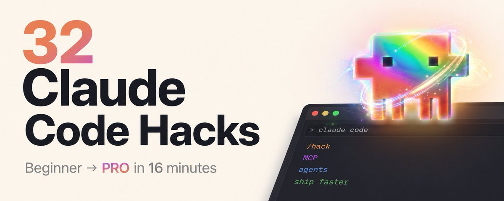

# 32个 Claude Code 黑科技：从入门到高手只需16分钟

> **来源：** [32 Claude Code hacks that take you from beginner to PRO in 16 minutes](https://x.com/0xcodez/status/2060723834617999592) — Codez
>
> **核心数据：** 现在 GitHub 上 4% 的公开 commits 由 Claude Code 编写——大约每天 13.5 万次。普通用户大概只掌握了 32 个技巧中的 6 个。

> 本文基于 Anthropic 官方文档、Claude Code 发布说明和帮助中心高级用户技巧整理。每个技巧都是 2026 年 5 月真实可用的——不是传闻，不是已废弃，不是"即将推出"。
>
> 32 个技巧分为三层，从你的首次会话开始，一直到运行并行的 agent 团队，甚至合上笔记本后还能自动完成工作。

---

## Part 1 · 基础篇

### 01. 对每个项目运行 `/init`

在新项目或已有项目中的第一件事。`/init` 会扫描你的代码库并编写一个 `CLAUDE.md` 文件，记录你的架构、约定和关键文件。

- 从此以后，每次会话都会自动加载这些上下文
- 不再需要每次重新解释你的项目结构

### 02. 设置 `/statusline` — 终端中的迷你仪表盘

这是**最好的抗焦虑升级**。`/statusline` 生成一个脚本，在你的会话底部固定一个实时状态栏——显示模型、上下文百分比、费用、分支等信息。

- 不再需要猜测上下文是否快爆炸了

### 03. 使用语音模式 — 说话比打字快 3 倍

语音模式现已对所有用户在 Claude Code、Desktop 和 Cowork 中可用。Anthropic 团队自己主要靠语音写代码。

- 说话速度大约是打字速度的 3 倍
- 同样的时间，提示词更详细 → 输出更好
- 不是噱头，是实打实的提速

### 04. 保持上下文小巧 — 不要倾倒整个代码库

只给 Claude 当前任务需要的内容。把大问题拆成小步骤。

- 越少噪音 = 越好输出
- 这是最容易被忽略的基本原则

### 05. 用 `/context` 诊断 token 膨胀

`/context` 精确显示什么在吃掉你的 token——系统提示、文件、MCP 服务器、对话历史——按百分比分解。

- 如果某个会话感觉沉重，这是你要运行的第一个命令
- 通常一个你不需要的 MCP 服务器正占用着 30% 的窗口

### 06. 在 60% 时压缩 — 任务之间及时清理

当上下文达到 ~60% 时，运行 `/compact`——Claude 会总结较旧的消息，让你重新获得窗口空间。

- 你可以主动指定保留什么：`/compact but preserve the auth decisions and DB schema`
- 切换到完全不同的任务时，`/clear` 清空会话（但 `CLAUDE.md` 依然加载，不会从零开始）

### 07. 始终从"规划模式"开始

按 Shift+Tab 切换模式，直到进入 Plan Mode。Claude 可以阅读、搜索、研究——但在你批准之前不会修改任何内容。

- 它会先列出方案，提出澄清问题，列出将涉及的文件
- 你可以在一句话中发现错误假设，而不是改写四十个文件
- 这一个习惯能大幅减少改动次数

### 08. 把 Claude 当作初级开发者

不要说"写个函数做 X"，而是问"我们应该怎么处理 X？有什么取舍？"

- 先推理问题，比从命令中模式匹配能产生更好的代码
- 你也能了解它的假设——真正的 bug 往往藏在那里

### 09. 让 Claude 主动提问 — "直到你 95% 确信为止"

在任何非平凡请求后追加这句提示：

> "Continuously ask me questions until you're 95% confident you understand what I need and what you'll do."

- 三轮澄清永远好过三轮重写
- 在规划模式（技巧 07）下效果特别好

### 10. 把自检步骤编入待办清单

当 Claude 创建待办清单时，让它把验证步骤作为实际事项加入：

> "Take a screenshot. Open DevTools and check for errors. Run the tests."

- 再加上这句神奇的话：**"Don't move to the next todo until you're 95% confident the current one is good."**
- 从此不再出现"看起来完成但其实没完成"的功能

---

## Part 2 · 控制篇

### 11. 部署子 agent 进行并行工作

告诉 Claude "use subagents" 来处理复杂任务。每个子 agent 有自己的上下文窗口，可以使用不同的模型，并行工作——研究、测试、探索——然后将结果汇报回主会话。

- 搭配模型层级（技巧 15）使用：子 agent 跑便宜的 Haiku，主线程留在 Opus 上

### 12. 构建自定义 Skills — 可复用的 Markdown 工作流

在 `.claude/skills/<name>/` 下放一个 `SKILL.md` 文件，Claude 会在任务匹配描述时自动加载。

- Skill 只是 frontmatter + markdown 指令
- 按需加载（休眠时 ~100 tokens，使用时 ~5K），即使安装几十个也不会占用上下文

### 13. 用 Hooks 处理"必须做的事"

Hooks 是在特定事件下自动触发的 shell 脚本：PreToolUse、PostToolUse、会话开始/结束、子 agent 完成等。

- 它们在模型推理之外运行，所以**不会被跳过**
- 典型用途：编辑时自动格式化、阻止危险 bash 命令、提交前运行 lint

### 14. 用权限编辑实现安全自治

不要用 `--dangerously-skip-permissions` 裸奔。使用 `/permissions` 命令（或 `~/.claude/settings.json`）来显式允许安全命令、禁止危险命令。

- **拒绝规则优先于允许规则**，所以即使通用允许规则匹配，危险模式仍被拦截
- 同样速度，零风险

### 15. 按任务匹配模型 — 有目的地使用 Opus、Sonnet、Haiku

在会话中切换模型：`/model opus` 用于架构设计和棘手的调试，`/model sonnet` 用于日常开发，`/model haiku` 用于便宜的探索性任务（如"找到所有引入 X 的文件"）。

- 一个模型包打天下，不是在浪费能力就是在浪费钱

### 16. 用 `/memory` 就地编辑 CLAUDE.md

在会话中突然想起某个约定应该永久保留时，运行 `/memory` 直接打开 `CLAUDE.md`。

- 比切换到编辑器修改快得多
- 改动立即为会话的剩余部分生效

### 17. 用 `/review` 进行内置代码审查

`/review` 是一个内置的 skill，它会以结构化的审查视角检查你最近的改动——安全性、代码风格、边界情况。

- 比问同事更快
- 能捕捉到原始会话遗漏的问题（因为当时处于构建模式，而非审查模式）

### 18. 用 `/cost` 追踪开销

`/cost` 显示当前会话的 token 使用量和美元成本。

- 用来找出哪些会话在悄悄烧钱（通常是：MCP 服务器太大、上下文太长）
- 配合状态栏（技巧 02）让成本始终可见

### 19. 按 Esc Esc 回退 — 会话的"撤销"按钮

双击 Escape 键，Claude 会回退到对话中的某个先前节点。

- 当会话跑偏时至关重要——不是硬扛或重来，而是回退到偏航之前重新表达
- 大多数用户从不知道这个功能存在

### 20. 键入 `#` 快速记忆标记 — 不离开当前流就能更新 CLAUDE.md

以 `#` 开头任何一行，Claude 会将其视为记忆指令——将内容添加到 `CLAUDE.md`，不打断你的工作流。

- 适合在发现约定的瞬间捕获它：`# always use named exports, never default`

---

## Part 3 · 规模化篇

> 技巧 21-32 — Claude Code 作为平台。包含 5 月 28 日发布的新功能。

### 21. 用 git worktrees 运行并行会话

Claude Code v2.1.50+ 原生支持。`--worktree feature-name` 让两个 Claude 会话在同一个仓库上互不干扰。

- 每个 worktree 是独立的隔离分支，有自己的工作目录
- 三个 Claude 会话，三个分支，零冲突
- 完成后像任何 git 分支一样合并回去

### 22. 用 API 端点替代 MCP

MCP 会将所有工具的完整定义加载到上下文中——一个典型的 5 服务器设置可能会在你说出第一个词之前就吃掉 55K tokens。

- 如果你只需要一件事（比如读取一个 Notion 数据库），直接硬编码 API 端点
- 灵活性降低，但成本远低
- **MCP 用于探索，硬编码用于生产**

### 23. 用 `/loop` 处理周期性任务

需要 Claude Code v2.1.72+。`/loop 5m check the deployment status` 每隔五分钟在同一会话中重复运行该提示。

- 非常适合监控部署、观察 PR、轮询构建状态
- Loop 是会话作用域的，3 天后自动过期以确保安全

### 24. 调度 Desktop 任务

对于比会话生命周期更长的自动化，使用 Claude Desktop 的定时任务功能。

- 每次触发打开一个全新的会话（不与之前运行共享上下文）
- 但**能在终端退出和笔记本重启后继续存在**
- 适用场景：早晨 issue 分类、每周指标拉取、夜间日志扫描

### 25. 使用 Routines 实现"笔记本关机"自动化

Routines 运行在 Anthropic 的基础设施上——你的笔记本可以关机。

- 通过 API 调用、GitHub 事件或固定 cron 调度 routine
- 配合子 agent 实现连贯的夜间工作：**"review yesterday's PRs, summarize, post to Slack at 8am"**
- 这是异步团队一直缺失的编排层

### 26. 从手机上控制会话

本地启动会话，扫描二维码到手机上，随时随地继续操控。

- 你的代码永远不会离开你的机器——只有控制通道通过手机
- 适用场景：在办公桌前启动重型任务，散步时监控，健身房中批准权限

### 27. 对困难问题使用 UltraThink

在你的提示词中输入 "ultrathink"，Claude 会在响应前分配最大扩展思考预算。

- 不要在小修复上使用——但架构决策、复杂调试或涉及全系统的重构，质量提升是真实可见的
- Tokens 更贵，但**犯错的代价更大**

### 28. 构建 agent 团队 — 子 agent 之间互相通信

子 agent（技巧 11）是隔离工作的。而 agent 团队让它们共享任务列表、相互通信、互相分配工作。

- 你可以直接与任何团队成员对话，而不需要通过主 agent 中转
- 更贵、运行时间更长——但对于大型多领域项目，凝聚力的价值值得

### 29. 安装 Context7 MCP — 任何库的最新文档

Claude 的训练有截断日期，所以它可能会推荐已废弃的 API。

- Context7 MCP 在 Claude 编写任何代码之前注入数千个库的最新、版本特定的文档——React、Next.js、Postgres，你随便说
- 一次安装，所有库的质量跃升

### 30. 浏览插件市场 — 预构建的 Skills 和 agents

插件市场充满了预打包的 Skills、agents 和命令。

- 在你自己动手构建之前先浏览——很有可能已经有人发布了你要的东西
- Context7（技巧 29）就是其中一个例子

### 31. 触发动态工作流 — 最多 1000 个子 agent 并行

**两天前随 Claude Opus 4.8 一起发布。** 动态工作流让 Claude 接受一个太大而无法在单个会话中完成的任务，规划它，扩展到最多 1000 个并行子 agent，运行第二波 agent 来反驳每个发现，迭代直到结果一致，然后交给你整合后的答案。

- **编排方案存在于一个 JavaScript 脚本**（Claude 动态编写）中——而非上下文窗口——这正是 500-agent 运行可行的原因
- 激活只需一个关键词：**"create a workflow"**
- 需要 Claude Code v2.1.154+
- Max 和 Team 用户默认开启；Enterprise 由管理员启用；Pro 用户在 `/config` 中手动开启
- 上限：每个工作流 1000 个子 agent
- 成本：显著高于单 agent 运行——在任务规模证明值得时才使用

### 32. 设置 `/effort ultracode` — 让 Claude 决定何时扩展

动态工作流的配套功能。`/effort ultracode` 将推理强度设为 xhigh，并让 Claude 自动判断任务是否需要触发工作流。

- 一个请求可以变成按顺序执行的多个工作流：一个用于理解代码，一个用于应用修改，一个用于验证
- 会话作用域：开启后持续有效，直到你更改或开始新会话
- 日常任务降回 `/effort high`，因为 ultracode 消耗的 tokens 显著高于标准会话
- Anthropic 自己的建议：**搭配 Auto Mode 使用**，这样并行子 agent 不会被权限提示阻塞

---

## ⚠️ 让初学者永远是初学者的坏习惯

1. **没有 CLAUDE.md** — 每次会话都要重新解释项目，每次得到的回答都是错的
2. **从不检查 `/context`** — 看不见的膨胀无法修复
3. **跳过规划模式** — 四十个文件的 diff 去修复一句话的误解
4. **YOLO 权限** — 速度快很好，直到 `rm -rf` 跑错了目录
5. **一个模型打天下** — 把 Opus tokens 浪费在 Haiku 级别的任务上
6. **忽略插件市场** — 构建已经存在的 skill
7. **不看本周发了什么** — 最大的功能（动态工作流、ultracode）往往悄悄发布

---

## 总结

Claude Code 变强不是因为某个单一功能。它变强是因为 32 个功能**叠加**在一起：

| 基础层 | 控制层 | 规模层 |
|--------|--------|--------|
| `/init` 建上下文 | 子 agent 并行 | 动态工作流 1000 agent |
| `/statusline` 状态栏 | Skills 工作流 | git worktrees |
| 语音模式 3× 快 | Hooks 强制规则 | Routines 离线运行 |
| 小上下文原则 | 模型按需切换 | UltraThink 深度思考 |
| Plan Mode 规划 | `/review` 代码审查 | 手机远程控制 |
| 自检清单 | `/cost` 成本追踪 | Context7 最新文档 |

- `CLAUDE.md` 提供上下文
- Plan Mode 捕捉假设
- Skills 打包工作流
- Hooks 强制执行规则
- Worktrees 并行化
- MCP 连接外部
- **动态工作流编排一千个 agent**

大多数人只会使用其中 6 个功能，然后在 Claude 犯错时抱怨，继续走人。而今天正在贡献那 4% commits 的人，正是那些**不断叠加技巧的人**。

**选择一个你还没用的技巧**——很可能是 `/init` 或 Plan Mode——明天就用上。然后再加一个。从新手到高手的差距，恰好就是这份清单，一步一个脚印地应用。

---

*整理于 2026-05-31，原文来自 [Codez (@0xCodez)](https://x.com/0xcodez/status/2060723834617999592)*
