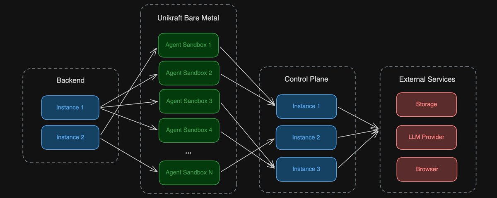

# 我们如何构建安全、可扩展的 AI Agent 沙箱基础设施

> **来源：** [How We Built Secure, Scalable Agent Sandbox Infrastructure](https://x.com/larsencc/status/2027225210412470668)
> **作者：** Larsen Cundric（Browser Use 联合创始人）



从 AWS Lambda 到 Unikraft 微型 VM，配备一套控制平面架构。

---

## 我们是怎么走到这一步的

Browser Use 运行着数以百万计的 Web Agent。我们一开始只有纯浏览器 Agent，跑在 AWS Lambda 上——每次调用都是隔离的、伸缩瞬间完成、没有什么需要担心泄密的事。

然后我们加入了代码执行能力。Agent 可以编写和运行 Python、执行 Shell 命令、创建文件。我们把这个功能做成一个隔离的沙箱，Agent 通过工具调用它。安全性没问题：代码是跑在沙箱里的，不是后端上。

但 **Agent 的主循环仍然和 REST API 跑在同一个后端进程**。一重新部署？所有正在运行的 Agent 全部挂掉。内存密集型的 Agent？拖慢整个 API。两种本质完全不同的工作负载挤在同一个进程里。

---

## 两种模式

当 Agent 可以运行任意代码时，它能接触到机器上的一切：环境变量、API 密钥、数据库凭据、内部服务。必须将它从你的基础设施和机密信息中隔离出来。有两种方法：

### 模式 1：隔离工具（Isolate the Tool）

Agent 跑在你的基础设施上。危险操作（代码执行、终端访问）在单独的沙箱里运行。Agent 通过 HTTP 调用沙箱。代码跑在一个没什么可泄露的地方。

### 模式 2：隔离 Agent（Isolate the Agent）

整个 Agent 跑在一个零机密的沙箱里。它通过一个持有所有凭据的控制平面与外界通信。

Agent 变得可丢弃：没有机密可窃取，没有状态需要保留——你可以随时杀掉它、重启它、独立伸缩它。控制平面持有真相。

> **Browser Use 的选择：** 从模式 1 起步，最终迁移到了模式 2。

---

## 沙箱（The Sandbox）

同一套容器镜像在所有环境里运行：
- **生产环境：** Unikraft 微型 VM
- **本地开发和评测：** Docker 容器

一个配置开关（`sandbox_mode: 'docker' | 'ukc'`）控制供应代码走哪条路径。

### 生产环境：Unikraft

每个 Agent 获得一个独立的 Unikraft 微型 VM，**启动时间不到 1 秒**。通过 Unikraft Cloud 的 REST API 在 AWS 专属裸机上进行供应。

沙箱从外界只接收三个环境变量：
- `SESSION_TOKEN`
- `CONTROL_PLANE_URL`
- `SESSION_ID`

**没有 AWS 密钥、没有数据库凭据、没有 API token。**

Unikraft 开箱即用地提供了 scale-to-zero（自动缩零）。沙箱空闲时，VM 挂起；有请求进来时，从挂起状态恢复。处于查询间隔期的沙箱几乎不产生成本，但后续任务来了又能瞬间唤醒。

我们还将沙箱分布在多个 Unikraft 区域（metro），防止单个区域成为瓶颈。

### 开发与评测：Docker

在本地和评测 Pipeline 中，同一套镜像以 Docker 容器运行。同样的镜像、同样的入口点、同样的控制平面协议。你可以在开发笔记本上运行完全相同的 Agent，可以在评测中并行启动几百个实例，再部署到 Unikraft 做生产环境。

### 安全加固

在任何 Agent 代码运行之前，沙箱会做以下几件事：

**1. 仅字节码执行。** 在 Docker 构建期间，将所有 Python 源码编译成 `.pyc` 字节码，然后删除所有 `.py` 文件。Agent 框架代码作为 root 加载到内存中。加载完成后，源码就消失了。

**2. 权限降级。** 入口点以 root 启动（需要读取 root 拥有的字节码），然后立即通过 `setuid`/`setgid` 降级到 `sandbox` 用户。从那时起，一切都在非特权状态下运行。

**3. 环境变量剥离。** 将 `SESSION_TOKEN`、`CONTROL_PLANE_URL`、`SESSION_ID` 读入 Python 变量后，立刻从 `os.environ` 中删除它们。如果 Agent 检查环境变量，它们已经不存在了。而且 Token 在沙箱网络之外也毫无用处——VM 位于私有 VPC 中，除了与控制平面通信外没有其他权限。

---

## 控制平面的工作方式

把控制平面想象成一个代理服务。沙箱**没有直接对外部的访问权限**。每个请求都必须经过控制平面。需要调用 LLM？走控制平面。需要上传文件到 S3？走控制平面。这是 Agent 与其 VM 之外的任何事物通信的唯一途径。

它是一个**无状态的 FastAPI 服务**。来自沙箱的每个请求携带一个 `Bearer: {session_token}` 头。控制平面通过 token 查找会话、验证会话是否仍处于活跃状态、然后用真实的凭据执行操作。

### LLM 代理

对于每次 LLM 调用，沙箱**只发送新的消息**。控制平面在数据库中拥有完整的历史记录，在每次调用时重建完整的上下文，然后转发给 LLM 提供商。这让沙箱保持无状态——你可以杀掉它再建一个新的，对话可以从断点处继续。

控制平面还负责执行成本限制和计费。沙箱只专心完成任务就好。

### 通过 Presigned URL 同步文件

沙箱有一个 `/workspace` 目录，Agent 在这里读写文件。一个文件同步服务监视文件变化，并定期同步到 S3——但沙箱从未见过 AWS 凭据。相反，它通过控制平面申请 presigned URL：

1. 沙箱检测到 `/workspace` 中有文件变化
2. 沙箱调用 `POST /presigned-urls`，带上文件路径
3. 控制平面生成受限到当前会话的 S3 预签名上传 URL
4. 沙箱直接使用这些 URL 上传文件到 S3

下载以相反的方式工作。沙箱获得直接的 S3 范围访问权限，但从不持有任何 AWS 凭据。

### 网关协议（Gateway Protocol）

在沙箱内部，Agent 通过一个 "Gateway" 协议与控制平面通信：

```python
class AgentGateway(Protocol):
    async def invoke_llm(self, new_messages, tools, tool_choice) -> LLMResponse: ...
    async def persist_messages(self, messages) -> None: ...
```

在生产环境中，`ControlPlaneGateway` 向控制平面发送 HTTP 请求。在本地开发和评测中，`DirectGateway` 直接调用 LLM 并在内存中保存历史记录。Agent 代码不知道自己在用哪个——同一套接口、同一套行为、不同的后端实现。

---

## 伸缩（Scaling）

控制平面是无状态的：验证 token、执行操作、返回结果。需要更多 Agent？启动更多沙箱。需要更高吞吐量？在负载均衡器后面加控制平面实例。每一层都能根据自身的瓶颈独立伸缩。

后端运行在 ECS Fargate 上，位于 ALB 后面的私有子网中。控制平面基于 CPU 利用率自动伸缩。沙箱通过 Unikraft 独立伸缩。每个会话获得自己的 VM，Unikraft 负责跨区域的调度。

---

## 总结

对于可以执行代码的 Agent，有两种沙箱化方式：
1. **隔离工具**——代码执行在沙箱里，Agent 留在后端
2. **隔离 Agent**——整个 Agent 放在沙箱里，通过控制平面与外界通信

Browser Use 选择了**模式 2**。控制平面持有所有凭据，为所有操作（LLM 调用、文件存储、计费）充当代理。沙箱只接收三个环境变量，没有其他任何权限。生产环境用 Unikraft 微型 VM，开发和评测用 Docker。同一套镜像跑遍所有环境。

**代价**是每次操作多一次网络跳转、从维护一个服务变成三个。在实践中，相比 LLM 的响应时间，这个延迟可以忽略不计；而运维复杂度也是运维团队本来就会处理的事情。

**关键要点：你的 Agent 应该没有什么值得偷的，也没有什么值得保留的。**

---

*整理于 2026-05-19，来源：[x.com/larsencc/status/2027225210412470668](https://x.com/larsencc/status/2027225210412470668)*
