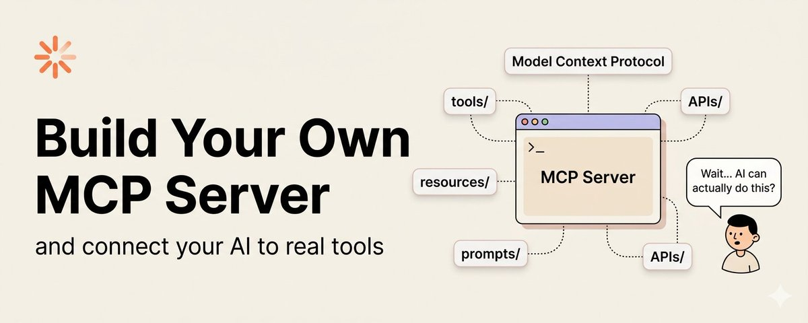

# 搭建你自己的 MCP Server——从零开始的完整指南

> **来源：** [Build Your Own MCP Server](https://x.com/techwith_ram/status/2036401174715207817)



现在的情况是：你的 AI 听起来很聪明……但当你让它真正做点什么事的时候，它就卡住了。

它能写、能解释、能做计划——但没法真正访问你的工具和数据。

这就是 MCP 要解决的差距。一旦你弄懂了它，很多事都会变得清晰起来。

---

## MCP 到底是什么？

想象你雇佣了一个天才助理。他们会写、会推理、会归纳、会规划。但每次你让他们"查一下今天的日历"或"看看那个客户的订单"，他们就摊摊手——因为他们访问不了你的系统。

这就是 **Model Context Protocol（MCP）** 要解决的问题。

它是一个**开放协议**，给 AI 模型提供了一种标准化的方式，让它们能和外部工具、数据源对话。可以把它想象成 AI 界的 USB——你不会在每次买新设备时重新发明插头，直接插上就能用。

**MCP 之于 AI 工具，就像 HTTP 之于 Web。** 一份通用的契约，让一切互通。

在 MCP 出现之前，每次 AI 集成都是定制的。调用天气 API 的代码和查询数据库的代码完全不一样。开发者不得不手工编写胶水代码，模型也需要针对每个集成做特别的训练或提示。简直是一团乱。

MCP 标准化了这套握手过程。你写一个 server，只写一次。任何兼容 MCP 的 AI 客户端——Claude、GPT、Gemini，或者任何未来支持该规范的模型——都能自动发现并使用你的工具。

---

## 为什么你该在意？

你可能会想："我们已经有 function calling 了，为什么还需要 MCP？"

好问题。Function calling 确实能让模型在你的应用内部调用函数——但那些函数是你自己定义的，你自己托管，而且每个应用都在重复造轮子。MCP 在四个关键点上不同：

- **标准化：** 一套规范，任意客户端。写一次 MCP server，任意兼容的 AI 都能直接用，不需要改。
- **可发现：** Server 在运行时广播自己的能力。AI 自动知道有哪些工具可用。
- **沙箱隔离：** Server 是一个单独的进程。AI 主机永远不会直接访问你的文件或数据库——只能通过你暴露的接口。
- **可组合：** 同时挂载多个 MCP server。Claude 获得所有工具的统⼀视图。

简言之，MCP 把一次性的 AI 集成变成了可复用、可互操作的组件。

---

## MCP 如何工作？

MCP 遵循经典的**客户端-服务器**架构。但我们要精确搞清楚谁是谁，因为这里经常把人搞晕。

MCP 世界里有三个角色：

- **Host（主机）：** 用户运行的应用程序（Claude Desktop、IDE、自定义聊天 UI）。它内部同时包含一个 AI 模型和一个 MCP 客户端。
- **MCP Client（客户端）：** 存在于 Host 内部。管理与一个或多个 MCP server 的连接。
- **MCP Server（服务器）：** 你编写和部署的轻量级进程。通过标准的 JSON-RPC 接口暴露能力（tools、resources、prompts）。

关键的思维模型是：**AI 模型永远不会直接和你的数据库对话**。它跟 MCP Client 对话，Client 跟你的 Server 对话，你的 Server 才去跟数据库对话。每一跳都是干净和可控的。

---

## 你必须理解的核心概念

MCP 有三个基本原语。理解好它们，其他东西就水到渠成了。

### 1. Tools（工具）

Tools 是 **AI 可以调用的操作**——那些会产生副作用或获取动态数据的东西。比如：发邮件、跑查询、调 API。

每个 Tool 有一个名称、一段描述（AI 通过描述来理解什么时候用这个工具），以及一个 JSON Schema 来定义它的输入参数。

### 2. Resources（资源）

Resources 是 **AI 可以读取的数据**——文件、文档、数据库行。和 Tools 不同，它们是只读的，通过 URI 来标识（比如 `file:///path/to/doc.md` 或 `db://customers/42`）。

Resources 可以是静态的（每次都一样）或动态的（从你的 server 实时获取）。

### 3. Prompts（提示词模板）

Prompts 是你的 server 暴露的**可复用提示词模板**。它们可以包含动态参数，像宏一样工作——用于标准化你的 AI 如何处理特定领域的常见任务。

> **Tools = 做**某件事。
> **Resources = 读取**某样东西。
> **Prompts = 以标准化的方式说**某些话。

理论够了。来动手吧。

---

## 你的第一个 MCP Server

我们将使用官方的 **TypeScript SDK**。它目前最成熟，工具链也最好。

### 前提条件

- Node.js 18+ 已安装
- 你习惯用的终端
- Claude Desktop（后面测试用）

### 1. 创建新项目

新建一个目录并初始化 Node 项目：

```bash
# Create project folder
mkdir my-mcp-server && cd my-mcp-server
npm init -y

# Install the MCP SDK and TypeScript tooling
npm install @modelcontextprotocol/sdk
npm install -D typescript @types/node ts-node

# Init TypeScript config
npx tsc --init
```

### 2. 更新 tsconfig.json

确保你的 TypeScript 配置兼容现代 Node：

```json
{
  "compilerOptions": {
    "target": "ES2022",
    "module": "Node16",
    "moduleResolution": "Node16",
    "outDir": "./dist",
    "strict": true,
    "esModuleInterop": true
  }
}
```

### 3. 创建你的 Server 文件

创建 `src/index.ts`——这是 MCP server 的核心：

```typescript
import { Server } from '@modelcontextprotocol/sdk/server/index.js';
import { StdioServerTransport } from '@modelcontextprotocol/sdk/server/stdio.js';
import {
  CallToolRequestSchema,
  ListToolsRequestSchema,
} from '@modelcontextprotocol/sdk/types.js';

// 1. Create the server instance
const server = new Server(
  {
    name: 'my-first-mcp',   // Your server's identity
    version: '1.0.0',
  },
  {
    capabilities: {
      tools: {},   // We're advertising that we have tools
    },
  }
);

// 2. Define what tools exist (the "menu")
server.setRequestHandler(ListToolsRequestSchema, async () => {
  return {
    tools: [
      {
        name: 'greet',
        description: 'Returns a friendly greeting for a given name',
        inputSchema: {
          type: 'object',
          properties: {
            name: {
              type: 'string',
              description: 'The name of the person to greet',
            },
          },
          required: ['name'],
        },
      },
    ],
  };
});

// 3. Handle tool calls (the actual execution)
server.setRequestHandler(CallToolRequestSchema, async (request) => {
  if (request.params.name === 'greet') {
    const { name } = request.params.arguments as { name: string };

    return {
      content: [
        {
          type: 'text',
          text: `Hello, ${name}! 👋 This came from your MCP server!`,
        },
      ],
    };
  }

  throw new Error(`Unknown tool: ${request.params.name}`);
});

// 4. Start the server using stdio transport
async function main() {
  const transport = new StdioServerTransport();
  await server.connect(transport);
  console.error('MCP server running on stdio');
}

main().catch(console.error);
```

你的 server 运行时做两件事：首先，通过 **ListTools** 告诉客户端"我有这些工具"。然后当 AI 决定用某个工具时，触发 **CallTool**，你处理它。这就是整个契约。

---

## 添加 Tools、Resources 和 Prompts

### 添加一个真正的 Tool（含外部调用）

这个工具获取某个城市的当前天气。模式和之前一样，但现在有一个真正的 **fetch** 调用了：

```typescript
{
  name: 'get_weather',
  description: 'Get current weather for a city',
  inputSchema: {
    type: 'object',
    properties: {
      city: { type: 'string', description: 'City name' },
    },
    required: ['city'],
  },
}

// In your CallTool handler:
case 'get_weather': {
  const { city } = args as { city: string };
  const res = await fetch(
    `https://wttr.in/${encodeURIComponent(city)}?format=j1`
  );
  const data = await res.json();
  const temp = data.current_condition[0].temp_C;
  return {
    content: [{ type: 'text', text: `${city}: ${temp}°C` }]
  };
}
```

### 添加 Resources

Resources 通过两个 handler 暴露：一个列出所有可用资源，另一个按 URI 读取特定资源：

```typescript
import {
  ListResourcesRequestSchema,
  ReadResourceRequestSchema,
} from '@modelcontextprotocol/sdk/types.js';

// List available resources
server.setRequestHandler(ListResourcesRequestSchema, async () => ({
  resources: [
    {
      uri: 'company://docs/handbook',
      name: 'Company Handbook',
      mimeType: 'text/plain',
    },
  ],
}));

// Read a resource by URI
server.setRequestHandler(ReadResourceRequestSchema, async (req) => {
  if (req.params.uri === 'company://docs/handbook') {
    const content = await fs.readFile('./handbook.md', 'utf-8');
    return {
      contents: [{ uri: req.params.uri, mimeType: 'text/plain', text: content }],
    };
  }
  throw new Error('Resource not found');
});
```

### 添加 Prompts

```typescript
server.setRequestHandler(ListPromptsRequestSchema, async () => ({
  prompts: [
    {
      name: 'summarize_ticket',
      description: 'Summarize a support ticket in 2 sentences',
      arguments: [
        { name: 'ticket_id', description: 'The ticket ID', required: true },
      ],
    },
  ],
}));

server.setRequestHandler(GetPromptRequestSchema, async (req) => {
  const { ticket_id } = req.params.arguments!;
  const ticket = await fetchTicket(ticket_id);
  return {
    messages: [
      {
        role: 'user',
        content: {
          type: 'text',
          text: `Summarize this ticket in 2 sentences:\n\n${ticket.body}`,
        },
      },
    ],
  };
});
```

---

## 传输层（Transport）详解

MCP 将协议与传输层分离。同样的 JSON-RPC 消息可以通过不同通道传输，取决于你的部署方式。主要有两种选项：

- **stdio**：用于本地工具、CLI 应用和开发。工作原理：Host 将你的 server 作为子进程启动。消息通过 stdin/stdout 传递。
- **HTTP + SSE**：用于远程服务器、Web 部署和多用户场景。工作原理：Server 监听 HTTP 端口。客户端通过 POST 发送请求，服务器通过 SSE 推送响应。

```typescript
import express from 'express';
import { SSEServerTransport } from '@modelcontextprotocol/sdk/server/sse.js';

const app = express();
app.use(express.json());

// SSE endpoint — client connects here first
app.get('/sse', async (req, res) => {
  const transport = new SSEServerTransport('/message', res);
  await server.connect(transport);
});

// Message endpoint — client POSTs requests here
app.post('/message', async (req, res) => {
  await transport.handlePostMessage(req, res);
});

app.listen(3000);
console.log('MCP HTTP server on http://localhost:3000');
```

对于本地开发（和 Claude Desktop 通信），**stdio 几乎总是正确的选择**。它非常简单：不需要端口、不需要认证、不需要 CORS。就是一个进程和另一个进程对话。

当你需要把 server 暴露给远程用户或部署到云端时，切换到 HTTP + SSE。

---

## 实战：文件浏览器 MCP

来构建一些真正有用的东西。一个能让 Claude **读取和列出**你本地文件的 MCP server。这是实用型 MCP server 的"Hello World"。

```typescript
import { Server } from '@modelcontextprotocol/sdk/server/index.js';
import { StdioServerTransport } from '@modelcontextprotocol/sdk/server/stdio.js';
import {
  CallToolRequestSchema, ListToolsRequestSchema
} from '@modelcontextprotocol/sdk/types.js';
import * as fs from 'fs/promises';
import * as path from 'path';

const server = new Server(
  { name: 'file-explorer', version: '1.0.0' },
  { capabilities: { tools: {} } }
);

server.setRequestHandler(ListToolsRequestSchema, async () => ({
  tools: [
    {
      name: 'list_directory',
      description: 'List files and folders in a directory',
      inputSchema: {
        type: 'object',
        properties: {
          dirPath: { type: 'string', description: 'Absolute path to directory' },
        },
        required: ['dirPath'],
      },
    },
    {
      name: 'read_file',
      description: 'Read the contents of a text file',
      inputSchema: {
        type: 'object',
        properties: {
          filePath: { type: 'string', description: 'Absolute path to file' },
        },
        required: ['filePath'],
      },
    },
  ],
}));

server.setRequestHandler(CallToolRequestSchema, async (req) => {
  const args = req.params.arguments as Record<string, string>;

  switch (req.params.name) {
    case 'list_directory': {
      const entries = await fs.readdir(args.dirPath, { withFileTypes: true });
      const formatted = entries
        .map(e => `${e.isDirectory() ? '📁' : '📄'} ${e.name}`)
        .join('\n');
      return { content: [{ type: 'text', text: formatted }] };
    }
    case 'read_file': {
      const content = await fs.readFile(args.filePath, 'utf-8');
      return { content: [{ type: 'text', text: content }] };
    }
    default:
      throw new Error(`Unknown tool: ${req.params.name}`);
  }
});

const transport = new StdioServerTransport();
await server.connect(transport);
```

> ⚠️ **安全警告：**
> 绝不要在生产环境中暴露不加限制的文件读取工具。始终验证请求的路径是否在允许的根目录范围内。使用 `path.resolve()` 并检查结果是否以你允许的前缀开头。

---

## 将 Server 连接到 Claude

你的 Server 已经准备好了。现在把它挂载到 Claude Desktop 上，让你能真正和它对话。

### 1. 构建你的 Server

先把 TypeScript 编译成 JavaScript：

```bash
npx tsc
# Output will be in ./dist/index.js
```

### 2. 打开 Claude Desktop 配置

找到你操作系统的配置文件：

- **macOS:** `~/Library/Application Support/Claude/claude_desktop_config.json`
- **Windows:** `%APPDATA%\Claude\claude_desktop_config.json`

### 3. 添加你的 Server 到配置文件

```json
{
  "mcpServers": {
    "file-explorer": {
      "command": "node",
      "args": ["/absolute/path/to/my-mcp-server/dist/index.js"],
      "env": {}
    }
  }
}
```

### 4. 重启 Claude Desktop

完全退出并重新打开 Claude。你的 Server 会出现在工具面板中。试着问："列出我 Desktop 文件夹里的文件"。

---

## 常见陷阱与调试技巧

你一定会遇到这些问题。快速排查清单：

**❌ "Server not found" 或无法连接**

最常见的问题。检查 `claude_desktop_config.json` 中的路径。JSON 中的路径必须是**绝对路径**（mac 上以 `/` 开头，Windows 上以 `C:\` 开头）。相对路径不行，因为 Claude Desktop 不知道你的工作目录是哪里。

**❌ "Tool returned an error" 没有详细信息**

在你的整个 tool handler 外面加个 **try/catch**，把错误作为文本内容返回而不是直接抛出异常。这样 Claude 就能读到并帮你解释错误了。

```typescript
try {
  // ... your tool logic
} catch (err) {
  return {
    content: [{ type: 'text', text: `Error: ${(err as Error).message}` }],
    isError: true,
  };
}
```

**❌ stdout 污染导致连接崩溃**

使用 stdio transport 时，**永远不要用 console.log**。stdio 通道专用于 MCP 消息；任何其他字节都会破坏数据流。改用 **console.error**（它会输出到 stderr，与 stdio 隔离）。

**❌ Schema 不匹配：AI 用错误的参数调用你的工具**

在你的 **input schema** 中要尽可能具体。模糊的描述会让 AI 猜错参数类型。在描述字符串中添加示例，这非常有帮助。

**🛠 使用 MCP Inspector**

Anthropic 提供了一个调试工具：**npx @modelcontextprotocol/inspector**。运行它，指向你的 server，你就可以手动触发工具调用并测试你的 server，完全不需要涉及 Claude。当有什么东西不工作时，先用这个工具。

```bash
npx @modelcontextprotocol/inspector node dist/index.js
```

---

MCP 生态发展非常快。查看 [modelcontextprotocol.io](https://modelcontextprotocol.io/) 获取最新的规范更新，[github.com/modelcontextprotocol](https://github.com/modelcontextprotocol) 获取社区 server 来学习。

现在去构建点什么吧。你的 AI 助理已经等不及要拿到你工具的钥匙了。

Cheers! 🥂

---

*整理于 2026-05-18，来源：[x.com/techwith_ram/status/2036401174715207817](https://x.com/techwith_ram/status/2036401174715207817)*
