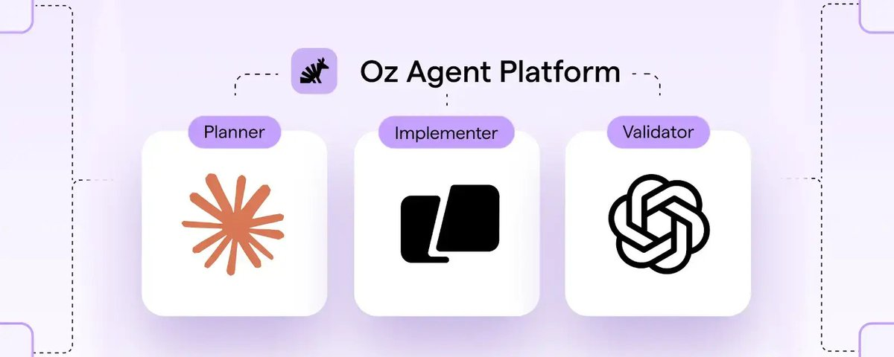

# Oz 发布多 Harness 编排：统一的云 Agent 控制平面

> **来源：** [Introducing multi-harness orchestration](https://x.com/zachlloydtweets/status/2056780898675167656) — Zach Lloyd (@zachlloydtweets) / Warp

Warpspeed 发布了 **Oz** 的重大升级——使其成为市场上**首个真正多 Harness 的云 Agent 控制平面**。

核心理念：公司不应把未来押在单一模型或单一 Harness 上。Oz 提供一个统一系统，随着生态快速演进，编排、治理和扩展 Agent。

**本次发布要点：**
- 云中更多 Agent Harness：在云端启动、跟踪和控制 Claude Code、Codex 和 Warp Agent
- 自动化复杂长任务：自动多 Agent 编排，支持本地或云端并行子 Agent
- 跨 Harness Agent Memory：唯一跨 Harness 记忆系统，跨会话/仓库/项目保留知识
- 扩展自托管选项：可在 Kubernetes 或直接执行中运行
- 增强成本和使用控制
- 大量增量改进

---

## 为什么需要多 Harness

Warp 与工程领导者深入交流后发现共同需求：**今年就要大规模部署云 Agent，但要以受控、可治理的方式。** 团队需要：

1. **选择权** — 不锁定在单一 Agent Harness 上，不同任务用不同 Harness
2. **可度量** — 比较各 Harness 的有效性
3. **自托管** — 在自有基础设施上运行，数据完全归属和掌控

Oz 的 Agent 基础设施层正为此构建。

## 云中更多 Agent Harness

Oz 现在支持在云端运行 **Claude Code** 和 **Codex** 作为 Agent Harness（除了本地 Warp Agent）。Oz 一直是多模型的，但现在公司可以要求 Oz 直接使用特定 Harness 来解决问题。

**一个统一控制面板**：启动、跟踪、治理和操控任意 Agent，统一访问控制、审计日志和权限管理。

## 自动多 Agent 编排

Oz 可以自动编排子 Agent——针对大型功能构建、代码迁移、生产部署等困难的长周期任务，并行部署和跟踪多个 Agent。

跨 Harness 工作，内置自动跟踪、操控面板，显示各子 Agent 的进展情况。

## Agent Memory（跨 Harness 记忆）

**Agent Memory** 是一个覆盖所有组织知识的索引，让 Oz 能把正确的知识拉入任何 Agent 任务的上下文中。

| 特性 | 说明 |
|------|------|
| **可插拔数据源** | 知识可来自文件（如 Skills）、MCP、数据库或其他企业应用 |
| **可写入** | Oz 完成任务后可自动向知识库添加内容 |
| **自我学习** | 代码审查 Agent 学会团队编码风格，生产 Agent 记住系统部署拓扑，数据分析 Agent 学习数据结构 |
| **数据归属** | 公司自持 Agents 的记忆——Warp 可代为存储，但公司也应构建自己的组织知识体系 |
| **跨 Harness** | 可从 Claude Code 和 Codex 会话中形成记忆 |

## 更好的控制

- **按团队计费和独立额度上限**
- **细化权限**：单个 Agent 可拥有内部服务的细粒度权限，遵循最小权限原则——处理生产系统的 Agent 与访问 CRM 的 Agent 权限完全不同
- **更灵活的自托管**：支持 Docker / 无 Docker / Kubernetes Pod / 现有远程开发环境
- **API & SDK 优先**：扩展 API 支持从 Agent 会话中获取返回值（包括工件和原始对话）
- **会话交接**：支持本地 ↔ 云端、云端 ↔ 云端之间的无缝会话交接——手机上启动，笔记本上继续，回云端通宵运行

---

## 总结

Oz 正把自己定位为**Agent 的编排层**——不绑定任何单一 Harness，而是提供一个随模型和 Harness 能力提升而扩展的统一系统。多 Harness 支持、跨 Harness 记忆、自动多 Agent 编排、自托管和细粒度权限控制，是其帮助企业大规模部署 Agent 的核心武器。

---

*整理于 2026-05-20，来源：https://x.com/zachlloydtweets/status/2056780898675167656*
