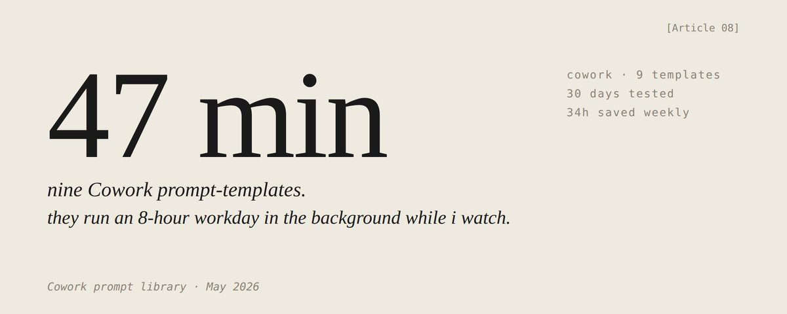

# 9 个 Claude Cowork Prompt 模板，把 8 小时工作日压缩到 47 分钟

> **原文**：[@Mnilax 在 X 上的长文](https://x.com/mnilax/status/2056783455472554008)  
> **数据**：473 ❤️ · 36 🔁 · 2.4K 🔖 · 533K 阅读  
> **保存日期**：2026-05-22

---

**47 分钟**——这是作者在一个"过去需要 8 小时的完整工作日"中，手放在键盘上的**中位数时间**。

那 8 小时的实际任务时间仍然发生了——只在后台发生，9 个 Cowork prompt 模板在做工作，需要决策时才 ping 作者。

每个模板 8-40 行，针对一个以前每天或每周手动做的具体任务。每个模板有 30 天的前后对比实测数据。

**每周总回收时间：34 小时。** 不是预测，是作者 4 月（没有这些模板）和 5 月（有了）之间的实际日志差值。

---

## 关于 Cowork 的设置

作者从 4 月 9 日 GA 开始使用 Cowork。到 5 月安装了全部 11 个官方插件，连接了 12 个实际需要的连接器，创建了 9 个自定义斜杠命令。

> 连接器和插件不如人们想的那么重要。斜杠命令更重要。

**Slash 命令 = 带结构化输入的保存 prompt。** 输入 `/morning-brief`，Cowork 弹个表单让你填字段，你填完走开，prompt 做剩下的。

大多数公开的 Cowork 内容在讲装哪个插件——这是错的层级。**插件是厨房，斜杠命令才是菜谱。** 你可以买下所有厨房但没菜谱仍然做不出菜。

这 9 个是从约 30 个尝试中筛选出来的，21 个没用。后面会解释三个共同属性和两个失败模式。

---

## 9 个模板速览

### 1. 每日情报简报：47 min → 4 min

每天早上 7:30 运行。拉取隔夜 Gmail、Slack DM、当天日历、Polymarket 头寸和三个关注的新闻源。输出一页纸，三个部分：10 点前需要处理的、可等的、噪音。

> `TERMINATION:` 语句起了真正的作用。**没有它，同一 prompt 膨胀到 1,400 字**的执行概要和"关键要点"区块。有了它，输出是一页可打印的纸。
>
> "不要总结摘要"这个子句：输出长度减少 60%，质量无损。

### 2. 竞争格局扫描：3h → 18 min

按需运行。拉取多达 8 个命名竞争对手的产品页面、定价、近期博客、X 动态、招聘帖子和融资信息。与作者自己的定位笔记（在 Google Drive 中）交叉比对。

> **"不要预测未来"节省了每次 40 分钟。** Cowork 的默认行为是在每份报告底部加一个"战略展望"部分。战略展望总是那三个观察结果换了个说法。切掉它什么也不损失。

### 3. 邮件分类与回复草稿：90 min → 11 min

每天运行三次：9am、1pm、5pm。按谁在等、等了多久来排序收件箱，为每封需要回复的邮件起草回复，留在 Gmail 标签里，一次批量审核发送。

> **重要经验——"最后 5 封已发送邮件"**的语音匹配是草稿能直接发送还是需要重写的分水岭。没有它，Cowork 写商学院英语；有它，草稿听起来像作者本人，有时甚至忘记哪封是自己改过的。
>
> 另一个关键行：**"不要为你已经起草过的线程生成回复"**——第一周日志显示 Cowork 每天早上重新起草相同的线程，三天积了三份重复草稿。

### 4. 会议准备档案：30 min → 3 min

任何外部会议前 2 小时运行。拉取与参会人的所有过往接触点、最近五封邮件、任何共享文档、他们自上次交流以来的公开资料更新、以及三个应带的开放问题。

> **"砍掉它。"** Cowork 想把所有东西都放进去。4 页的会议准备是个礼貌的干扰。1 页的版本才会被读。

### 5. 每周状态报告：2h → 7 min

周五下午 4 点运行。拉取 Linear 已关闭 Issue、本周创建的 Notion 文档、Slack 频道摘要和日历，重构实际做了的工作。

> **"不要发明指标"是整篇文章最重要的规则。** Cowork 会凭空生成数字当它觉得受众期待一个数字。作者第一周抓到它三次生成无源的"团队速度"估算。现在它写"未追踪"然后继续。

### 6. 文档审查与 Q&A：90 min → 9 min

对任何超过 10 页的 PDF 或文档运行。全文阅读，生成结构化 Q&A（关键问题+答案），标出不一致，标记与作者以往写过内容矛盾的地方。

> 最后的 `TERMINATION:` 语句是关键。Cowork 对文档审查的默认输出是线性逐段走读，长度为原文的 30%。没用。结构化 Q&A 格式把同一输入变成了 30 秒可用的东西。

### 7. Polymarket 持仓审计：45 min → 3 min

每天运行三次。读取作者开放的 Polymarket 头寸、当前市场价格和过去 12 小时内涉及相关市场的新闻。标记需要关注的头寸。

> **"不要推荐新头寸"的原因：这个模板是审计，不是持仓生成器。** Cowork 绝对会试图建议新交易如果你让它这么做。把交易建议混入审计会让两者都变差。

### 8. 研究深度挖掘：4h → 28 min

对任何需要完整引用研究简报的主题运行。**使用子 agent（sub-agents）并行工作**，每个负责一个来源类别。每个子 agent 报告回协调器做综合。

> **Sub-agents 是整个堆栈中节省最大的单项。** 4 小时到 28 分钟不是调优胜利——是五个工人同时做五件事。`TERMINATION:` 行防止每个工人过度抓取自己类别的数据。

### 9. 内容复用：90 min → 12 min

拿一篇已完成的长文，生成平台适配版本：X 线程、LinkedIn 帖子、博客摘录（简讯用）、内部 Slack 分享、邮件简报。

> **"永远不要在跨渠道使用相同的开场白"**——21 个被放弃模板中最常被违反的规则。没有它，五个改编版本都用某个版本的"三周前我注意到……"开头，结果在所有账号上读起来像内容工厂。有了它，每个渠道有自己的钩子。

---

## 成功的 9 个共享的三个属性

失败的 21 个至少违反其中一条：

### 1. 显式终止条件（Termination Criterion）

每个存活模板都以 `TERMINATION:` 结尾。这一行命名一个 Cowork 可以通过查看输出来检查的条件：**页数、字段数、结构完整性**。不是"要彻底"或"要完整"——是可检查的具体条件。

> 没有它，每个 prompt 膨胀填满整个 Cowork 会话块。有了它，中位会话时长从 **2h 20m 降至 14 分钟**。

### 2. 结构化输出形状，而非自由形式综合

每个存活模板将输出指定为**带具体内容的命名部分**。模型填入形状，而不是发明形状。

被放弃的模板输出类似"总结并综合"——未定义的容器，模型用任何看起来很炫酷的东西填充。

### 3. 第一行定义角色

每个存活模板的第一行命名一个角色：幕僚长、仅审计、协调员、内容复用员。**角色限制模型认为它应该产出的内容。**

> 没有角色行，模板试图一下子做所有事。

---

## 两个失败模式

| 失败模式 | 占比 | 原因 |
|---------|------|------|
| **没有干净停止**（No clean stop） | 14/21 | 没有 `TERMINATION`，模型在整个时间块内迭代。输出越长越差 |
| **任务蔓延**（Mission creep） | 7/21 | 没有角色定义，"邮件分类"试图像预测回复率、推荐新联系人。"审计"试图像推荐新头寸 |

---

## 34 小时怎么算出来的

原始模板级别每周节约总计 **72 小时**。

实际报告的 34 小时是因为：
- 某些模板有重叠（分类和会议准备都拉 Gmail，不重复计算）
- 减去审核 Cowork 输出和调优 prompt 的时间（约 35 小时/周）
- 不计算在做其他有用事情的同时后台运行的时间

**第一周约 18 小时 → 第三周 34 小时。调优比原始 prompt 更重要。**

---

## 如何使用

1. 通过 Plugin Create 流程，将每个模板作为斜杠命令放入 Cowork
2. 方括号内的输入需要指向实际数据源（Gmail、Slack、Google Drive、Linear、Notion、Polymarket 等）
3. 每个模板跑**一周再调优**——按原样用，一周日志能看出哪里在产你不想要的东西
4. **裁切而非添加**——跳过的部分、总为空的指标，直接删掉

> 调优比原始 prompt 重要得多。

---

## 三个核心原则

| 原则 | 作用 |
|------|------|
| ✅ **显式终止** | 怕膨胀，设可检查的输出条件 |
| ✅ **形状先于内容** | 定义输出结构，不让模型发明形状 |
| ✅ **角色先行** | 第一行命名角色，锁死模型行为范围 |

---

## 关联阅读

- [Codex 用到极致指南](../agent-engineering/codex-max-usage-guide-dotey.md) — Codex 的持久对话流、Goals、Automations 等概念与本文的 Cowork slash commands 异曲同工
- [The Software Factory Trap](../agent-engineering/software-factory-trap-dhasandev.md) — 本文的 prompt templates 就像"工厂里的专业技能固化"，正是那份关于 ontology + epistemology 讨论的实践案例
- [Agent Harness 从理论到实践](../agent-engineering/harness-from-theory-to-practice.md) — 9 个模板本质上就是 Harness 的"技能层"（Skills），将 AI 的工作范围+产出形状+终止条件显式定义
