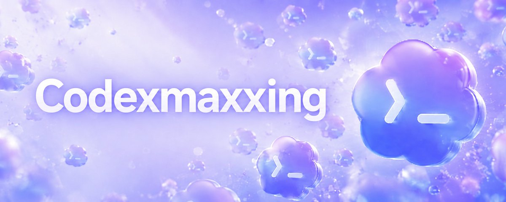

# 来自 Codex 官方团队的分享：如何把 Codex 用到极致

> **原文**：[@dotey 翻译整理的 Codex 官方团队分享](https://x.com/dotey/status/2057250417638035555)  
> **原始作者**：jason（@jxnlco），来自 Codex 官方团队  
> **翻译整理**：宝玉（@dotey）  
> **数据**：1.8K ❤️ · 436 🔁 · 50 💬 · 357K 阅读  



---

大多数开发者刚接触代码编辑类的 AI 智能体（AI Agent）时，通常只让它们干一件事：写代码。比如让它检查一下代码库，生成个差异对比（diff），跑跑测试，然后再提个合并请求（pull request）。

写代码确实依然是 Codex 的核心强项。但仔细想想，我们在电脑上做的大部分工作，本质上其实都和代码息息相关：执行终端命令、浏览网页、调用应用程序接口、导出文档、响应各种事件，或者是触发自动化流程。当 Codex 开始延伸到这些领域时，它给人的感觉就不再只是一个狭义上的"编程助手"了，而是进化成了一个能帮你搞定各种电脑工作的"全能打工人"。

Codex 的新特性让这种转变变得触手可及。现在的对话流（thread）可以记住你们的上下文、调用各种工具、展示生成的文件（artifacts），还能在不同的提示词之间无缝衔接，再也不用每次聊完都"重新认识"一遍了。

想要彻底榨干 Codex 的潜能，你需要把下面这些绝招组合起来用：

- 能够长期保存记忆的**持久对话流（durable threads）**
- 在你掌控全局时，灵活使用**语音输入、任务干预（steering）和任务排队（queuing）**
- 借助**浏览器、电脑操控（computer-use）、MCP 服务器**以及各类**连接器**，让 Codex 的手伸向代码库之外的地方
- 当你离开电脑时，利用**对话流自动化（thread automations）和 Goals** 让它继续搬砖
- 熟练使用**侧边栏（side panel）**，随时审查它生成的代码、文档、幻灯片和其他文件

---

## 一、持久对话流（Durable Threads）

持久对话流是可以长时间运行的 Codex 对话流，能在你多次使用的过程中，始终为你保留工作上下文。

把对话流"置顶（Pinned threads）"是让这些持久对话随叫随到的好办法。这对于那些需要反复推进的工作流来说简直是神器，比如：

- 一个专属的**"幕僚长"对话流**（帮你处理日常杂务）
- 一个专门负责**产品发布**的对话流
- 一个负责**审查文档**的对话流
- 一个专门盯着**外部数据**的监控对话流

它们不是那种聊完即焚的闲聊框，而是**持久的工作空间**。随着时间的推移，Codex 可以随时回到这些对话中，它会记得你之前做过的决定、你的个人偏好以及当前的进度。如果没有这个功能，你每次都得从零开始把这些背景信息重新喂给它。

> **置顶快捷键**让这个操作变得极为实用。只要按下 `Command-1` 到 `Command-9`，你就能瞬间穿越回这些保存好的专属对话流里继续工作。

---

## 二、语音输入（Voice Input）

语音输入之所以好用，是因为它能在你把想法字斟句酌地敲成文字之前，先把你脑子里最原始、最粗糙的念头捕捉下来。

Codex 内置了语音输入功能。这对于那些"嘴上说得清，打字嫌麻烦"的模糊想法特别管用。比如：

> *"我记得有个叫 Ben 的人在 Slack 上提过这事儿。细节我忘了。你去帮我找找看。"*

对于一个会自己搜索、收集上下文并向你汇报的 AI 智能体来说，这几句话就足够它干活了。

当你脑子里有一个大概的想法，但还没完全成型时，花两三分钟对着它"碎碎念"，把思绪一股脑倒出来，效果也出奇的好。

**录音转写也是同样的道理。** 一份未经修饰的会议记录，或者一段口述的计划草案，往往比一份简短的总结更有价值。因为那些粗糙的记录里，保留了你犹豫的语气、强调的重点，以及那些还没讲完的灵光一现。

---

## 三、任务干预与排队（Steering & Queuing）

当你把语音输入和对运行中任务的直接控制结合起来时，它的威力才真正显现出来。

### 任务干预（Steering）

在当前任务还没完成时，中途打断 Codex 并给它指引新的方向。当你发现 AI 跑偏了，需要在它撞南墙之前纠正它时，这个功能就派上用场了。比如，在让它审查网站时，你可以一边在侧边栏上指指点点，一边直接开口打断它的工作：

- "把这个调小一点"
- "这两个元素之间的间距看着不太对劲"
- "这句文案写错了"

### 任务排队（Queuing）

在 Codex 完成当前步骤后，给它安排接下来的活儿。它不会打断正在进行的任务，而是把新任务排在队伍后面：

> *"等这活儿干完之后，把预览链接发到 Slack 给审核人看看。"*

| | 任务干预（Steering） | 任务排队（Queuing） |
|---|---|---|
| 时机 | 当前任务执行中 | 当前任务完成后 |
| 效果 | 改变 Codex 正在做的事 | 安排接下来要做的事 |
| 场景 | 发现跑偏、需要立刻纠正 | 串联多个步骤、编排工作流 |

这两个功能都能让你在任务执行的过程中，始终保持一种"人机合一"的掌控感。

---

## 四、工具与触达范围（Tools & Reach）

当一个对话流有了连续的记忆后，下一个问题就是：它能触碰到什么？Codex 的触角可以向外一层层延伸：

| 工具 | 用途 | 区别 |
|------|------|------|
| `$browser` | 在侧边栏中运行的应用内浏览器 | 适合网页审查、标注、标记修改 |
| `@chrome` | 获取你浏览器的登录状态 | 需要你账号登录状态的浏览器内工作流 |
| `@computer` | 通过桌面 GUI 完成任务 | 专治只能通过图形界面点来点去的任务 |

**MCP 服务器和各类连接器** 把这种能力进一步延伸到了你的整个工作流中。Slack 集成、各种 MCP 工具连接器之所以重要，是因为很多关键任务在变成代码之前，最初往往只是一条聊天消息、一封收件箱里的邮件，或者一个日程安排问题。

**技能（Skills）** 让那些重复的工作流可以被反复利用。一旦某个工作流被证明好用，你可以将它固化为技能，这样 Codex 下次就能直接跑通，而不需要从头开始重新学习这个流程。

---

## 五、随时随地工作（Work From Anywhere）

"随时随地与 Codex 协同工作"的理念，彻底打破了我们"必须坐在电脑前才能干活"的传统限制。一个任务可以在你装满文件、权限和本地环境的 Mac 电脑上启动，然后当你离开工位用手机查看时，它依然在默默推进。

这在很多碎片时间里非常有用：你可以让 Codex 在电脑上跑一个耗时很长的任务，然后自己离开工位去喝杯咖啡。如果在外面时它有问题问你，你可以直接用手机回复、批准它的下一步行动，或者在回座位前就给它指派新的方向。

> **你的本地环境安安静静地待在那里干活，而你的人却可以自由移动。**

---

## 六、自动化（Automations）

自动化功能能让 Codex 按照你设定的时间表自动干活。

| 类型 | 适用场景 | 说明 |
|------|---------|------|
| **定时自动化**（Scheduled） | 每天从零开始的任务 | 生成日报、例行检查代码库 |
| **对话流自动化**（Thread） | 带有历史记忆的持续任务 | 定时唤醒，回同一对话流继续推进 |

### 对话流自动化的实战

把对话流置顶固然好用，但它毕竟还得等你主动回去找它。而"对话流自动化"则可以每隔几分钟或几小时自己去查岗，一直跑到满足某个条件为止，甚至还能根据情况自己调整查岗的频率。

**用例：幕僚长对话流（每 30 分钟跑一次）**

1. 去查一下我的 Slack 和 Gmail 里有没有需要处理但还没回的消息
2. 帮我排个优先级
3. 如果有人向我提问，尽可能深入地去查资料，然后帮我起草一份回复，但不要直接发送

当你回到电脑前时，那些最耗时耗力的"收集背景资料"的工作往往已经做完了。作为人类，你只需要做最后拍板发出去的决定。

**高级用例：动画制作反馈循环**

审核人在 Slack 里发了一个视频 → 对话流自动化定时检查讨论进度 → 一旦有修改意见进来 → 自动渲染一版新的 → 在原贴里 @ 审核人并回复新视频 → 如果集成接口没法自动上传，甚至能调动电脑桌面自动化把最后一步走完。

> 这个完整的闭环跨越了**接收反馈的 Slack**、**负责渲染的代码库**，以及**负责最终上传的桌面自动化工具**。

---

## 七、目标设定（Goals）

当一个任务有一个清晰的终点线，并且 AI 智能体可以不断朝着那个终点努力时，Goals 的威力就彻底爆发了。

**Goals：** 运行时间更长的 Codex 任务，有一个明确的终点线，AI 会在一段时间内持续向它冲刺。

### ❌ 糟糕的目标

> 把这个 Markdown 文件里的计划实现一下。

### ✅ 优秀的目标

必须有**可衡量的成功标准**。比如：一位工程师想把一个内部工具从 Python 迁移到 Rust，他可以建好新目录，设定好目标，并画一条明确的终点线：

> 直到所有单元测试全部通过，这个新版本的开发才算完成。

目标设定 = **持续执行** + **验证器（Verifier）**。你作为人类来定义想要的结果、何时停止的条件，以及用来判断 Codex 有没有离终点更近的信号。

### 好用的验证器

- ✅ 一套完整的测试用例
- ✅ 一项基准性能测试
- ✅ 一个能稳定复现的 Bug
- ✅ 一个验证矩阵
- ✅ 一个必须始终跑通的端到端工作流

> 有野心固然重要，但没有验证机制的野心，就只是在许愿而已。

---

## 八、侧边栏（The Side Panel）

侧边栏功能让你生成的工作成果始终和你们的聊天窗口并排在一起。你再也不用把文件导出来，然后痛苦地在不同软件之间切来切去了，直接在原位就能审查。生成的成果可能是代码，但也可能是幻灯片、PDF 文件、网页、表格，或者任何其他生成的东西。

### 擅长处理四种工作

1. **检查生成文件（Artifacts）** — 直接原地查看 Markdown、电子表格、数据表、文档和幻灯片
2. **标注需要修改的地方** — 不打断现有工作流，直接检查、做标记、修改文件
3. **操作网页界面** — 让 Codex 检查渲染好的网页，控制它，甚至直接响应你在网页上做的标注
4. **审查代码或文件的变更** — 评论全部留在这个工作闭环里

### 尤其好用的场景

| 场景 | 说明 |
|------|------|
| 单个 `index.html` | 轻量级静态展示，连服务器都不用搭 |
| Storybook | 审查 UI 组件 |
| Remotion Studio | 代码生成的动画 |
| 浏览器幻灯片 | 在浏览器里放映 |
| 数据应用（Data Apps） | 用于数据分析流 |

对话流自动化还能随着时间推移悄悄更新这些静态文件，等你回来时总能看到最新的进展。

---

## 九、共享记忆（Shared Memory）

当那些长时间运行的对话流能够打破单次聊天的界限，把记忆共享出去时，它们的作用将发生质的飞跃。

**共享记忆：** 存储在单一对话之外的持久上下文，它可以让未来的工作能够基于一些明确的、可追溯的信息继续推进。

### 推荐做法：Obsidian 知识库锚定

一个相对稳妥的做法是，把这些持久的对话流"锚定"在一个 Obsidian 知识库（vault）里。建一个存放纯文本文件的文件夹，简单直白，方便你随时查看、修改、移动，而且能保存很久。团队可以把这个文件夹放在任何云盘里（Git、Dropbox、Google Drive 等）。

```
vault/
├── TODO.md
├── people/
├── projects/
├── agent/
└── notes/
```

### AGENTS.md 指南示例

在最外层目录下放一个 `AGENTS.md`，给 Codex 定规矩：

- 把 `~/vault` 当作你长期的工作记忆区
- 尽量把笔记整理得有条理，别搞得到处都是碎片记录
- 准确地把待办事项、人员、项目、每日总结和草稿分类放好
- 把做过的决定、遇到的卡点、负责人、日期和有用的链接好好保存下来
- 如果没有什么实质性的新进展，不要随意修改知识库里的文件

### 关键原则

> **代码库是用来存代码的。知识库是用来存不断滚动的上下文的**：牵涉到哪些人、改了什么、卡在哪里、接下来谁跟进，以及那些如果在两次聊天中间断掉就会彻底消失的细节。

重要的上下文绝不应该仅仅锁死在某一次聊天的文字记录里。把它们写下来，放在下一个对话流能够立刻接手的地方。

### 官方记忆功能

Codex 自己在 **设置 > 个性化 > 记忆** 中提供官方的记忆功能，像是系统自带的本地记事本，用来记住你的个人偏好、常用的工作流以及一些经常踩的坑。不过，这个功能是**用来辅助你清晰写下来的上下文**的，而不是取代它。Chronicle 记忆组件也是同样的思路，它能帮 Codex 从你最近屏幕上发生的事情中提取并构建记忆。

---

## 十、从代码向外延伸（From Code Outward）

Codex 虽然还是以写代码为本行起家，但现在，围绕代码的诸多周边工作，都能在这同一套系统里搞定了：

- **MCP 服务器** — 连接本地数据和工具的通用标准
- **网页界面** — 应用内浏览器审查与标注
- **电脑桌面控制** — 专治 GUI 操作
- **对话流自动化** — 人不在场时系统依然运转
- **侧边栏审查** — 原地检查生成文件

这彻底改变了我们控制它的方式：

| 控制方式 | 作用 |
|---------|------|
| **任务干预（Steering）** | 在中途打断并纠正 |
| **任务排队（Queuing）** | 安排下一步工作 |
| **对话流自动化** | 人不在场时持续运转 |
| **目标设定（Goals）** | 画清晰终点线，持续冲刺 |

> 如今的 Codex 已经可以扛起一个完整的工作流：从听取指令、执行任务，一直到最终文件的审查。哪怕这些工作早已经超出了代码库的范畴，它也依然游刃有余。

---

## 关联阅读

- [The Software Factory Trap — 软件工厂陷阱](../agent-engineering/software-factory-trap-dhasandev.md) — 与本文互补：你用 Codex 这些能力时，如何避免掉入"建工厂本身变成了产品"的陷阱
- [Agent Harness 从理论到实践](../agent-engineering/harness-from-theory-to-practice.md) — 理解 Codex 这些能力背后的 Harness 工程学原理
- [瘦 Harness，胖技能](../agent-engineering/thin-harness-fat-skills-garry-tan.md) — Garry Tan
