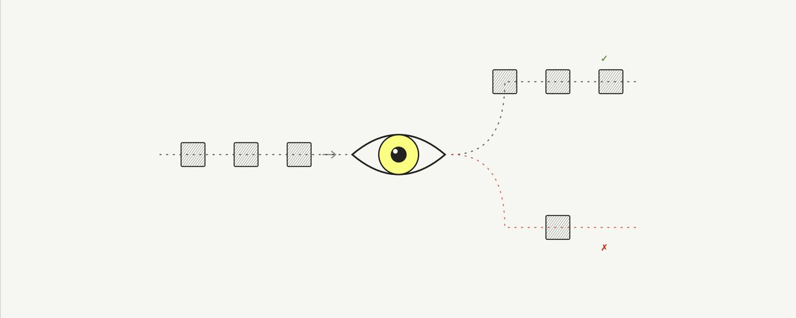

# AI Evaluation（评估）完全入门：手动、代码、LLM-as-a-Judge

> **来源：** [Evals, explained](https://x.com/lotte_verheyden/status/2056754091817361670) — Lotte Verheyden（Langfuse Academy 系列）



---

> 本文是 Langfuse Academy 系列的一部分，完整介绍 AI Engineering 生命周期。

---

## 评估在 AI Engineering 循环中的位置

AI Engineering Loop 是团队持续改进 AI 系统的方式。它将生产环境中发生的事情（tracing、monitoring）与开发过程中的结构化迭代（datasets、experiments、evaluation）连接起来。每次上线改进都会产生新数据，团队不断地循环这个过程。

**离线评估（Offline Evaluation）** 是循环中**运行实验**和**发布改动**之间的步骤。你有一个数据集，你针对它运行了应用，现在你需要判断输出是否足够好。

---

## 评估的典型演进路径

大多数情况下，你会从**人工审查输出**开始，建立对应用中"好"和"坏"的直觉。然后识别出值得检查的特定失败模式。一旦能精确定义它们，就通过专用的 evaluator 进行自动化。

```
人工审查 → 识别失败模式 → 定义评判标准 → 自动化评估
```

人工审查不是一次性步骤。好的生产环境设置包含**持续的人工专家审查**，以捕捉新的失败模式并保持自动评估的校准。

---

## 三种评估方法

### 1. 手动评估（Manual Evaluation）

手动查看输出并评分/记录质量意见。

这是建立对应用实际行为理解的关键过程。没有这一步，你不知道应用在哪挣扎、"好"对你的用例到底意味着什么。正是这种理解告诉你之后该构建哪些自动评估器以及如何定义它们的标准。

> **跳过这一步直接跳到自动化的团队，往往会在测量一些根本不重要的事情上浪费精力。**

手动评估还产生**人类标签（human labels）**，作为后续验证自动评估器的 ground truth。

### 2. 基于代码的评估（Code-based Evaluation）

基于代码的评估器用确定性逻辑检查可验证的属性。**快速、便宜、结果一致。**

适合的场景：
- 输出是否为有效 JSON 或符合要求的 schema
- 输出是否包含（或不包含）特定关键词或模式
- 输出是否在长度限制内
- 生成的 SQL 是否可以无错执行

**局限性：** 无法评估"意义"。代码可以检查输出是否包含"退款"这个词，但无法检查输出是否正确解释了退款政策。

### 3. LLM-as-a-Judge

使用语言模型对输出进行评分。这是克服 AI 应用/Agent 核心评估问题的方法——**AI 输出的质量取决于对文本质量的评判**。

适合评估需要理解语言的特性：
- 回复是否与问题相关
- 语气是否符合目标受众
- 摘要是否抓住了原文的关键点
- 回复是否完整覆盖了用户的所有意图

**LLM Judge 的缺陷：**

| 问题 | 说明 |
|------|------|
| **不自动等于人类专家** | 模型没有人类专家的领域上下文 |
| **需要校准** | 需要针对人类偏好校准，验证它测量的确实是你想测量的 |
| **共享盲点** | 尤其是当 Judge 和应用的 LLM 使用同一模型家族时 |

这些不是回避 LLM Judge 的理由。一个经过人类标签校准、同时由代码检查作为支撑的 LLM Judge，是可靠的评估器。

---

## 基于参考 vs 无参考评估

基于代码和 LLM-as-a-Judge 的评估器都可以分为两类：

| | 基于参考（Reference-based） | 无参考（Reference-free） |
|---|---|---|
| **做法** | 将输出与预定义的期望输出（正确答案/golden response）对比 | 不依赖参考答案，独自评估输出质量 |
| **优势** | 更精确，有明确标准 | 可应用于未见过的生产数据 |
| **局限** | 始终需要预定义参考答案 | 需要更精心设计的评估标准 |

---

## 实践建议

### 何时设置评估器

问自己：这是一个**一次性修复**还是**泛化问题**？
- 一次性的 prompt 改动就能解决 → 直接改，不需要评估器
- 清晰识别出一个需要在不同输入上反复测试的失败模式 → 就该设置评估器

### 应该评估什么

> **评估器越精确定义"好"或"坏"，它越有用。**

✅ **推荐：使用二进制评分（pass/fail）**。二进制评分迫使你清晰定义可接受和不可接受之间的界限。

❌ 避免使用分级评分（1-5 分）。分级评分引入模糊性——3 分和 4 分之间的区别是什么？这使得评分更难解释，在不同评估器之间和不同时间点之间的一致性也更差。

### 结合三种评估方法

每个你关心的质量维度都应该有自己的评估器。成熟的生产环境通常会组合使用所有三种方法。

```
最终应用质量 = 手动评估（ground truth）+ 代码检查（确定性）+ LLM Judge（语义理解）
```

---

## 从哪开始

1. **人工审查输出**——建立对"好"和"坏"的直觉
2. **写下你想捕捉的特定失败模式**——定义得越清晰越好
3. **只在需要反复测试时才设置自动评估器**——不要过早自动化

---

## 后续步骤

如果评估结果足够好，就可以发布改动。上线后循环重新开始：更新后的系统产生新的 traces、新的 monitoring 信号和新的改进机会。

一些评估器还应延伸到离线实验之外。无参考评估器、用户反馈信号和其他生产安全的检查可以应用于**实时流量**，以确认生产环境的质量与你部署前看到的一致。

> 如果生产行为符合预期，你就更有信心继续扩展。如果不符合，把这些情况捕获到 traces 中，转为数据集样本，运行下一轮实验。这就是闭环。

---

### 关联文章

- [LangSmith Engine：我们如何构建一个专门改进 Agent 的 Agent](../ai-tools/langsmith-engine-building-agent-for-improving-agents.md) — Palash Shah（LangSmith Engine 自动创建评估器的实践）
- [Anthropic Prompting 101 Workshop](../ai-tools/anthropic-prompting-101-workshop.md) — Prompt 层面的评估
- [Thin Harness, Fat Skills](../ai-tools/agent-engineering/thin-harness-fat-skills-garry-tan.md) — Agent 架构中的评估定位

---

*Processed on 2026-05-20 from https://x.com/lotte_verheyden/status/2056754091817361670*
