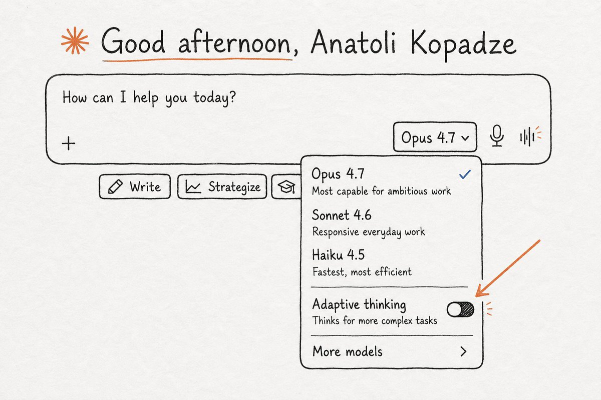
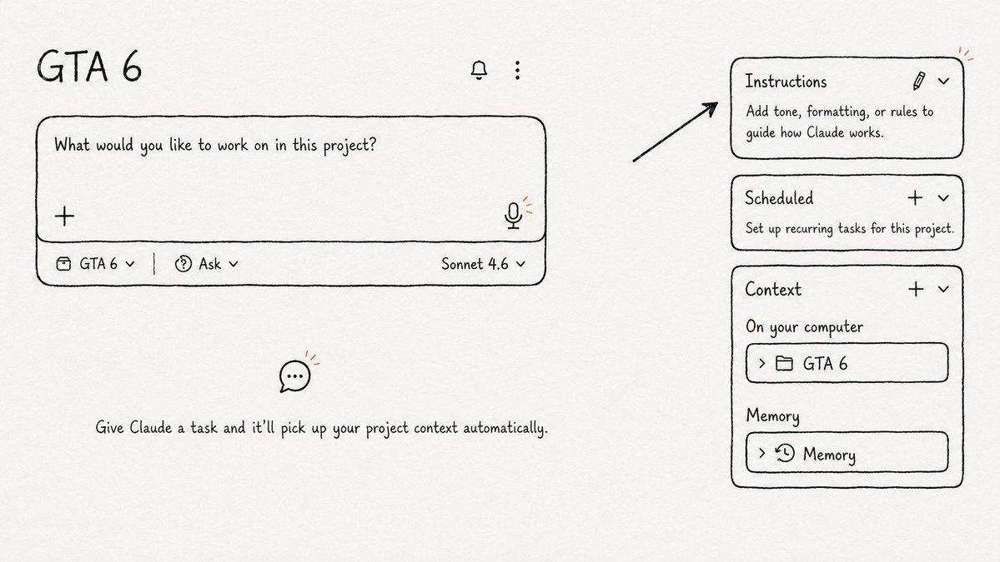
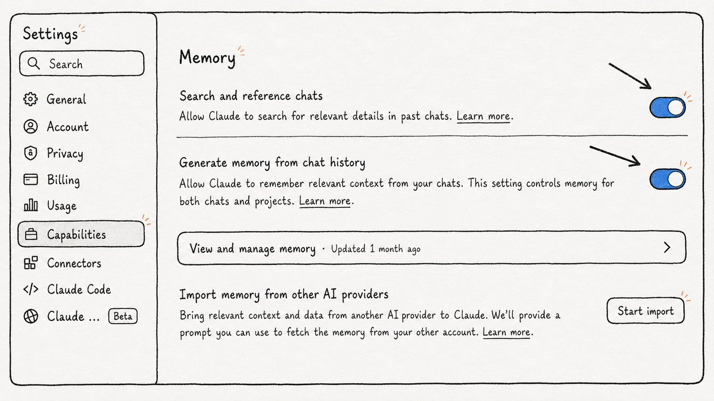
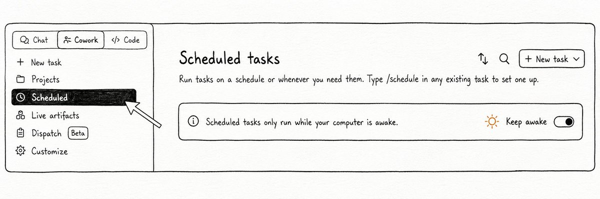
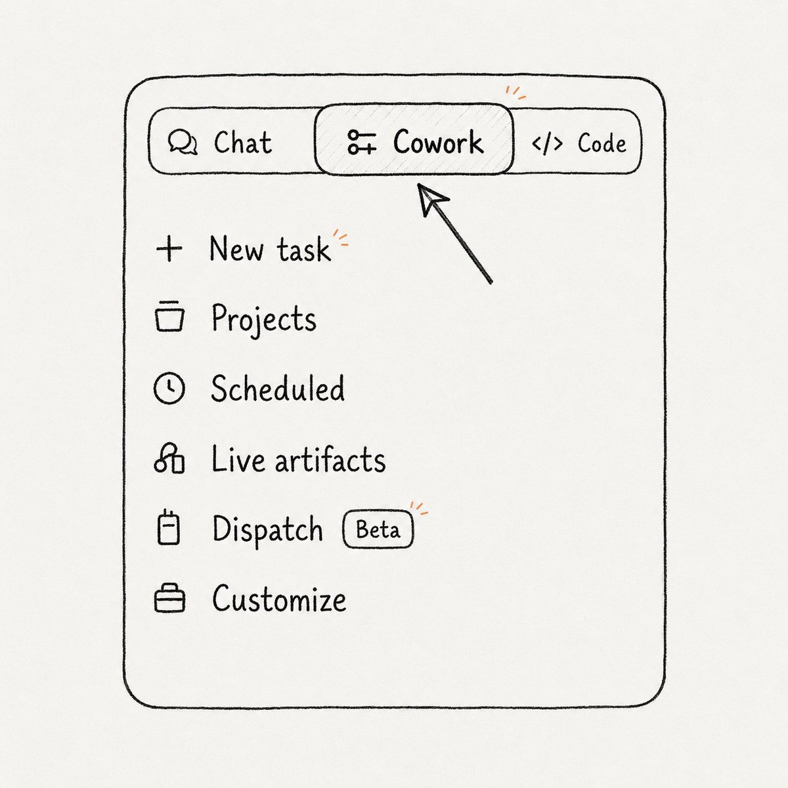
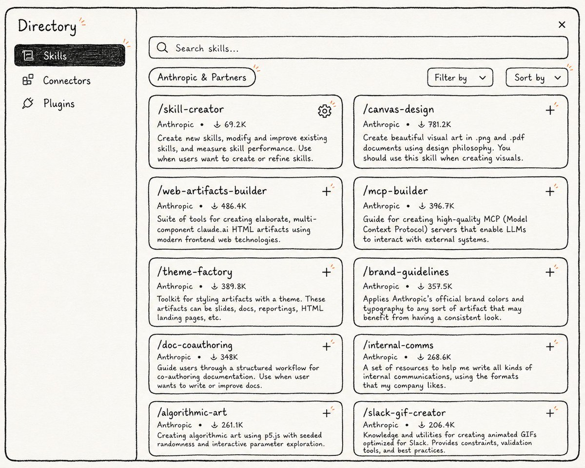
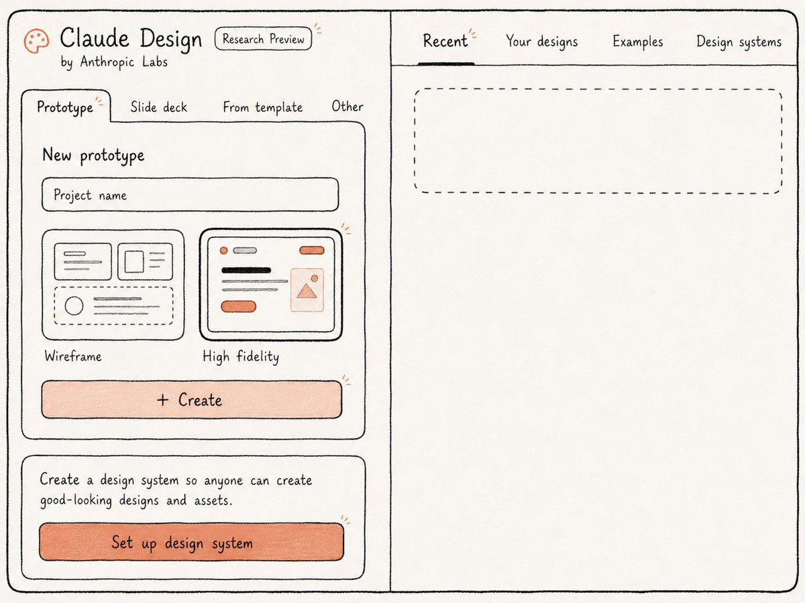
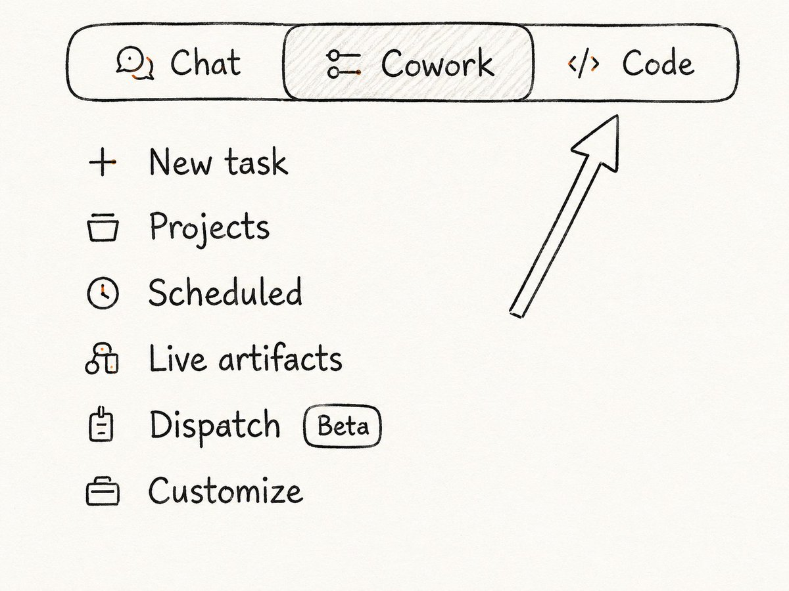

# Claude 能做的所有事——多数人根本不知道

> **来源：** [Claude Can Do All of This. Most People Have No Idea.](https://x.com/AnatoliKopadze/status/2057813254617858078)
> **作者：** Anatoli Kopadze
> **整理日期：** 2026-05-29

Claude 能做的事远超大多数人的想象。本文是一份完整指南，覆盖了所有值得了解的功能——去哪找、怎么打开、以及立即可用的提示词。

挑一个最适合你工作流的，今天花几分钟设置好。每个功能只需几分钟就能配置好，之后每天都有回报。

---

## 一、隐藏在常规 Claude 里的高阶功能

### 1. Projects——真正记住你的 Claude

每次打开新对话，Claude 都是从零开始。它不知道你的名字、你的工作、你的偏好——全都不记得。大多数人接受了这一点，每次对话都重新解释一遍。

**Projects 解决了这个问题。** 你创建一个 Project，上传你的文档，写入长期有效的指令——Claude 会永久记住这一切。下周打开时，它完全接得上。

如果你还没用过 Projects，这是读完本文后最先要去搞定的。

> **如何设置：** Claude.ai → Projects → New Project → 上传相关文档 + 填写 Project Instructions



**示例——Project Instructions 模板（可直接粘贴）：**

```markdown
我是 [姓名]，在 [公司/项目] 担任 [角色]。

## 关于这个项目
每周输出一份 AI 和 Crypto 领域的 newsletter，面向开发者和投资者。订阅者 35,000 人。风格：直接、分析型、偶尔带点调侃。

## 写作规则
- 短段落。最多 3 句。
- 编选内容用散文体，不用 bullet points。
- 数字优于形容词。写"节省 3 小时"，不写"节省大量时间"。
- 禁用词汇：delve、groundbreaking、game-changing、leverage（动词）、utilize。
- 可以正常使用缩写（Contractions fine and encouraged）。

## 内容规则
- 假设读者知道 LLM 是什么。不需要解释基础概念。
- 每次以最反直觉或最出人意料的角度开头。
- 每篇文章必须有具体的"所以呢"——读者看完应该做什么或想什么。

## 文件结构
- 草稿放 /drafts
- 已发布的文章放 /published，加日期前缀：YYYY-MM-DD-title.md
- 研究笔记放 /research
```

---

### 2. Artifacts——在聊天里直接运行的交互应用

很多人以为 Claude 只能输出文字、不能真正构建东西。这不对。

**Artifacts 是 Claude 在侧边栏里构建的可交互产物**——一个计算器、习惯追踪器、小游戏、带图表的仪表盘。不是一段需要你复制粘贴的代码，而是一个真正能用的界面。你打开、点击、使用，全程不离开对话。

SVG 图形、交互式图表、Mermaid 图表——全部支持。免费版也有。多数人从没试过。

> **怎么用：** 在 Claude 对话中，直接说"给我建一个……"它就会在 Artifacts 面板里生成。如果没出现，可以点击对话上方的 Artifacts 按钮手动打开面板。



**试试这个提示词：**

```markdown
帮我建一个习惯追踪器，作为可交互的应用。

我要追踪 5 个日常习惯。
每天打完勾就行。
显示每个习惯的 7 天连续记录（streak）。
如果某天没完成，连续记录归零。
设计：深色背景，干净简洁风格。
让勾选框有满足感的点击交互——勾选时加点小动画。
数据刷新页面不丢失。
```

---

### 3. Extended Thinking（扩展思维）——Claude 的深度推理模式

大多数 Claude 用户从来没打开过这个。**Extended Thinking 模式下，Claude 会一步步推理问题再做回答——而且你能看到整个过程。**

对于简单问题不需要。但在复杂决策、策略分析、或者你希望 Claude 真正"思考"而不是做模式匹配的情况——输出质量的差异是显著的。

> **怎么打开：** Claude.ai 对话界面上方 → 更多选项（⋮）→ 开启 Extended Thinking。部分模型默认有推理上限（如 8K tokens），Pro 用户可调更高。



**面对真实决策时用这个提示词：**

```markdown
我在两个选项中做选择，我希望你在回答之前先仔细思考。

选项 A：[描述选项 A]
选项 B：[描述选项 B]

我的情况：[你的背景、约束条件、什么最重要]

在回答之前，请思考以下内容：
- 每个选项的二阶和三阶后果
- 我可能在情感上过度高估或低估了什么
- 有哪些我不知道的信息会影响这个决定
- 如果出了问题，哪个选项有更好的防御机制

然后给出你的实际推荐和推理过程。
```

---

### 4. Memory——Claude 记住你是谁

**开启记忆功能后，Claude 会随着时间推移建立关于你的档案。** 你的工作、你的项目、你喜欢怎样的沟通方式、你当前在做什么。

开一个新对话，它已经知道上下文。你再也不用自我介绍。

**它是默认关闭的。多数人不知道它的存在。**

> **怎么开：** Claude.ai → 设置（Settings）→ 找到 Memory 开关 → 打开

**触发记忆的提示词（在对话中说一次即可）：**

```markdown
帮我记住以下信息，以后不用再问了：

我叫 [姓名]，在 [公司/项目] 做 [角色]。
我目前的主要关注点是 [做什么]。
我的用户/客户是 [谁]。

当我寻求帮助时，默认使用以上背景。
我偏好的沟通风格：[直接/详细/随意/正式]
我反感的内容：[例如 bullet points、冗长开场白、过多谨慎措辞]

请全部保存到记忆。
```



---

## 二、角色扮演——一个提示词改变一切

Claude 不必永远是"一个 AI 助手"。给它一个具体角色，它会全身心投入——改变它提问的方式、反驳的内容、绝不放过的细节。

### 5. 个人心理咨询师

大多数人把 Claude 当作一个"确认机器"。他们描述问题，Claude 说"听起来很难"，然后给出五条建议。

好的心理咨询不是这样的。**这个提示词让 Claude 变成一个 CBT（认知行为疗法）治疗师**——用提问代替回答，用挑战代替认同。

**适合场景：** 反复纠结的决策、说不清的焦虑、需要一个清晰的局外人视角的时候。

```markdown
你是一位有 20 年经验的认知行为治疗师。我会告诉你我正在困扰的事情。

你的方法：
- 不要立刻给建议。先通过提问帮我理解自己的思维模式。
- 注意认知扭曲——灾难化、非黑即白、读心术、预言式思维——发现时指出来。
- 一次只问一个问题。不要一次性给我太多。
- 如果我能通过你的问题自己得出结论，那就是目标。不要直接给我答案。
- 保持温暖但不虚伪。如果我的想法明显是扭曲的，不要为了好受而迎合我。
- 如果我觉得我在回避什么重要的事，直接点出来。

不要以临床介绍开头。直接问我怎么了。
```

---

### 6. 严厉导师

默认情况下，Claude 会同意你的观点。它补充你的想法，支持你的推理，找到积极面。**这几乎总是错的事。**

这个提示词取消了这一点。Claude 不再认同你，而是压力测试你。**它找到薄弱的假设、缺失的考虑、你的计划在什么地方会出问题。**

这让人不舒服。这就是它有用的原因。

```markdown
你是一个极其诚实的导师。你创建并搞砸过多家公司。你见过一百个人信心满满地犯同样的错误。

你的工作不是鼓励我——而是在我犯下昂贵的错误之前保护我。

规则：
- 如果你认为我错了，直接反驳。具体说明为什么。
- 指出我没看到的东西，尤其是我因为不希望计划失败而正在回避的东西。
- 问那些我没想到要问自己的尖锐问题。
- 如果某件事是个坏主意，就说它是坏主意。不要用"另一方面……"来平衡。
- 每次回答结束时，指出在继续推进之前我应该考虑的最重要的那件事。

我马上要分享一个想法。不要客气。
```

---

### 7. 私人教练

网上到处都是通用的健身建议。但它们不针对你的时间安排、你的伤病、你的设备、你的实际目标。

**把你的真实数据给 Claude，它会制定一个真正的计划。** 不是模板。不是你在任何健身网站上都能找到的东西。一个围绕你的情况构建的程序，当你报告反馈时它会动态调整。

```markdown
你是一位专业的私人教练和运动营养师。请为我制定一个完整的训练计划。

我的情况：
年龄：[年龄]
当前体重/体脂：[细节]
目标：[减肥/增肌/耐力提升/全面提升]
可用设备：[健身房/居家/仅有哑铃/等]
每周可训练天数：[天数]
每次时长：[分钟]
伤病/限制：[细节 或"无"]
当前水平：[初学者/中级/高级]

为我制定一个 12 周计划。给出每周的完整计划——动作、组数、次数、休息时间。解释你为什么这样安排——我想理解背后的逻辑，而不仅仅是跟着做。开始后，我会每周汇报进展，你根据感受调整。
```

---

### 8. 演练困难对话

大多数人走进困难对话时毫无准备。他们知道自己想说什么，但不知道对方会怎么回。

**Claude 扮演对方。真正地扮演。** 它会以对方实际的方式回应，当你的论点站不住脚时会反驳，让你努力争取一个好的结果。练几次之后，真实的对话就容易了。

```markdown
我需要准备一场困难对话。我希望你扮演对方，让我先演练一遍。

对方：[描述是谁——老板、客户、联合创始人等]
我需要说的内容：[你需要问或告诉对方的事]
为什么困难：[你害怕什么 / 可能会出什么问题]
对方是什么样的人：[性格、通常的反应模式、他们关心什么]

全程保持角色。用对方真正会有的方式回应——而不是我希望对方怎么回。如果我说了站不住脚或没有说服力的话，反驳它。

每轮对话后，短暂跳出角色，告诉我刚才做得好和不好的地方——然后回到角色。最后给我完整的复盘总结：我做得好的、需要调整的、以及实际对话中最需要记住的事。

从角色开始。我开口后你再回。
```

---

### 9. 魔鬼代言人

你已经下定决心了。你已经想过所有反对意见了。你确信。

**这正是让 Claude 攻击这个决定的时刻。** 不是礼貌的担忧。是完整的反对理由。它最可能失败的三种方式。因为你希望它成功而没看到的东西。

五分钟。在投入之前。不要等到之后。

```markdown
我已经做了一个决定，我希望你在投入之前建立最有力的反对理由。

这个决定：[描述你具体打算做什么]
我的理由：[为什么你认为是好主意]
我已经考虑过的：[你已经想到的反对意见]

你的任务：
- 针对这个决定建立最强有力的反对理由。
- 不要用积极方面来平衡。我已经相信它了——我需要反面意见。
- 找出我假设可能出错的地方。
- 描述这个决定失败或反噬的最可能的三种方式。
- 告诉我我在低估什么。
- 告诉我要让这个决定成为真正的坏主意，我需要相信什么。

毫不留情。如果这是个错误，我需要现在就知道。
```

---

## 三、Claude 的产品功能——多数人不知道它们存在

### 10. Claude in Chrome——看到你正在看什么的 Claude

多数人在单独的标签页里用 Claude，手动复制粘贴需要的内容。这是困难模式。

**Claude in Chrome 是一个浏览器扩展，让 Claude 能完整看到你当前标签页的内容并对其操作。** 它读页面内容、点击链接、填写表单、导航到新 URL。你用自然语言描述任务，然后放手让它做。

> **设置方法：** Chrome Web Store 搜索 "Claude for Chrome" → 安装 → 用你的 Claude 账号登录。点击扩展图标打开侧边栏。Claude 现在可以看到并操作你打开的任意页面。



**示例任务（直接说）：**

```markdown
我在这个招聘列表页面。

浏览所有可见的招聘信息，提取：职位名称、公司名、薪资范围（如有）、前 3 个要求。

按薪资从高到低排序，建一个对比表格。

如果有分页，点开下一页继续，直到覆盖所有结果。
```

---

### 11. Claude Cowork——住在你桌面上的 Claude

网页端 Claude 没有对你电脑的访问权限。它看不到你的文件。你需要手动粘贴一切。

**Cowork 是一个桌面应用，让 Claude 直接访问你的文件系统。** 它读取你的实际文件、编辑文档、创建新文件、整理文件夹——不需要你把任何东西复制到聊天框。

> **获取方式：** 访问 claude.ai/cowork 下载桌面端。支持 macOS、Windows、Linux。



---

### 12. Scheduled Tasks——你睡觉时 Claude 在工作

多数人把 Claude 当作需要主动激活的东西：打开聊天、输入请求、等待输出、关掉标签页。

**Scheduled Tasks 改变了这一点。** 你设置一次任务，Claude 在选定时间和频率自动执行——不需要你触发。每天早上、每周一、每小时——Claude 自动运行并把结果保存到你的文件夹。

> **设置方法：** Claude 界面 → Scheduled Tasks → 创建新任务 → 设置时间/频率 → 编写任务说明



**示例——每日简报任务：**

```markdown
每天早上 7:30 执行以下操作：
1. 搜索过去 24 小时最重要的 AI 和 Crypto 新闻
2. 挑选最重要的 5 篇——关注那些令人惊讶、反直觉、或对开发者和投资者有真正影响的内容
3. 每篇故事写：标题、两句话摘要、为什么重要
4. 结果保存到 /briefs 文件夹，文件名为 "brief-[日期].md"

风格直接、分析性强。不要废话。3 分钟内读完。
```

---

### 13. Cowork Skills——像安装插件一样安装新能力

**Skills 是预构建的指令集，赋予 Claude 在 Cowork 中的特定能力。** 不用每次都解释一遍需要什么，安装一次 skill，Claude 就知道如何处理这类任务——无论是做 PowerPoint、处理 PDF、还是运行特定的工作流。

想象成手机上的 App。手机本身功能够用，装了对的 App 就更强大了。

> **如何安装：** Cowork → Customize → Skills 查看已安装的 → 左侧侧边栏 Browse plugins → 找到插件 → 安装。插件的 skills 会自动出现在 Skills 标签页中，Claude 在需要时会自动使用。

---

### 14. CLAUDE.md——Claude 每次自动读取的规则文件

在 Cowork 和 Claude Code 中，你可以在项目文件夹里创建一个 `CLAUDE.md` 文件。**Claude 在每次会话开始时都会自动读取它，不需要你请求。**

你的编码规范。你的写作风格规则。你公司里有特定含义的术语。品牌语气指南。写一次，Claude 永远遵守。

```markdown
# Project: AI Newsletter

## 关于这个项目
每周输出 AI 和 Crypto newsletter，订阅者 35,000。

## 写作规则
- 短段落。最多 3 句。
- 散文体，不用 bullet points。
- 不用 em dash，用连字符或重组句子。
- 数字优先："节省 3 小时"不写"节省大量时间"。
- 禁用：delve, groundbreaking, game-changing, leverage（动词）, utilize。

## 内容规则
- 假设读者知道 LLM 是什么。
- 以最反直觉的角度开头。
- 每篇文章必须有具体的"所以呢"。

## 文件结构
- 草稿放 /drafts
- 已发布的放 /published，格式 YYYY-MM-DD-title.md
- 研究笔记放 /research
```

---

### 15. Claude Code——在终端里写代码、测试、修复的 AI

有些人还不知道可以用 Claude 写代码。不是片段——是完整的生产级代码、整个功能、复杂的重构。你用自然语言描述需求，Claude 来写。

**Claude Code 在此基础上更进一步。** 它直接在开发环境内工作——不是在聊天窗口里。它读取你的实际代码库、写新代码、跑测试、读错误信息、循环修复 bug 直到任务完成。

集成 VS Code 和 JetBrains。你可以把它丢进 GitHub Actions，让它自动审查或提交 PR，完全不需要你操作。

> **安装：** `npm install -g @anthropic-ai/claude-code` 或在 VS Code 扩展市场搜索 Claude Code。



---

### 16. Claude Design——AI 做视觉设计

多数人不知道这个产品存在。**Claude Design 是 Anthropic Labs 的一个独立工具，用于视觉工作**——产品一页纸介绍、Pitch Deck、原型、落地页布局。

你描述需求，Claude 构建它。可导出为 PPTX、Canva、PDF 或 HTML。对于不是设计师的人来说，它把一小时的 Figma 操作变成十分钟的对话。

> **访问方式：** 直接打开 `claude.ai/design`，无需额外步骤。

---

### 17. Prompt Caching——API 调用成本降低 90%（开发者功能）

面向在 Claude API 上构建的开发者。**如果你的请求包含大量重复上下文块**——长系统提示词、参考文档、代码库——每次调用你都在为重新处理这些相同的 token 付费。

**Prompt Caching 将这些内容存储在服务端。** 后续调用复用缓存而不用重新处理。缓存命中可降低最多 90% 成本，响应速度明显更快。如果在大规模构建时没在用这个，你浪费了一大笔钱。

> **使用方法：** 在你想要缓存的 content block 中加上 `"cache_control": {"type": "ephemeral"}`。
> 缓存持续 5 分钟，每次使用重置计时器。
> 适用于系统提示词、大文档和工具定义。

```json
{
  "model": "claude-opus-4-6",
  "system": [
    {
      "type": "text",
      "text": "[你的大段系统提示词或参考文档]",
      "cache_control": {"type": "ephemeral"}
    }
  ],
  "messages": [
    {
      "role": "user",
      "content": "[用户消息——每次调用会变的这里]"
    }
  ]
}

// 首次调用后系统提示词被缓存。
// 5 分钟内的每次后续调用复用缓存。
// 缓存命中 = 省 90% + 响应更快。
```

---

## 总结

现在你知道的关于 Claude 的东西，比大多数每天都在用的人还要多。

**从这份列表里挑一个功能。就一个。今天就把它设置好。** 不是所有功能都需要一次性搞完——知道它们存在就已经是胜利的一半。

准备好下一个的时候，再回来翻这篇。

---

*整理于 2026-05-29，来源：Anatoli Kopadze 的 X/Twitter 文章*
