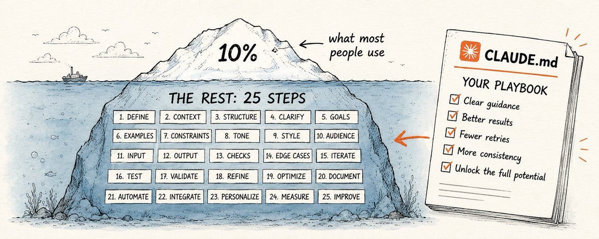
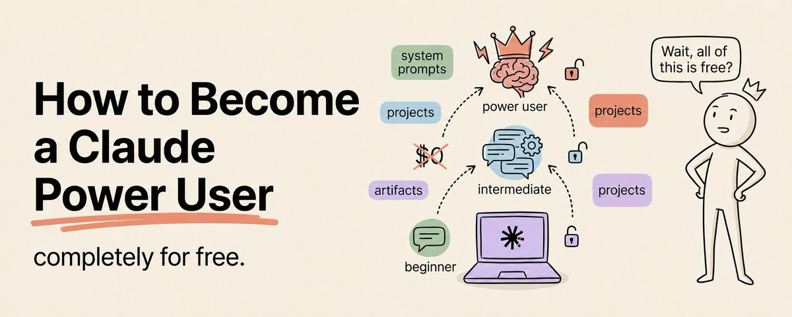

# 大部分人只用到了 Claude 的 10%——这 25 个步骤 + 30 天进阶路线图

> **来源：** [Most People Use 10% of Claude. Here Are the 25 Steps That Unlock the Rest.](https://x.com/DamiDefi/status/2056309008412160200) + [How to Become a Claude Power User (Full Course)](https://x.com/eng_khairallah1/status/2056670039101841411)

用了两年 Claude，大部分日常用户其实一直在重复同样的三个动作：问问题、拿答案、关标签页。

这根本不是用 Claude——这更像是借了一个大脑，还没等它热机就还回去了。

普通用法和 Claude 真正能力之间的差距，不在于复杂度，而在于**配置**。花五分钟做好设置，就能彻底改变之后的每一次对话。下面这 25 步就是那些能持续产生复利的技巧。前 18 步对所有人都有效，后 7 步是给想走得更远的人准备的。

---

## 第一部分：没人做的初始化设置

### 01. 创建 Project，而不是单次对话

普通的 Claude 对话记忆能力堪比金鱼。会话一结束，上下文全丢。第二天回来你得重新自我介绍一遍，重新解释目标，重新粘贴同样的背景信息——第一百次了。

Project 能跨会话保留上下文。设置一次背景信息，之后的每一次对话，Claude 都已经知道你是谁、在做什么、喜欢什么工作方式。

去 Claude 侧边栏点 Projects → 创建一个 → 命名。后面所有对话都跑在 Project 里。

### 02. 告诉 Claude 你是谁

没有针对性的输入只能产出泛泛的输出。让 Claude 的回复质量立刻提升的最快办法：在问任何问题之前，先精确告诉它它在跟谁合作。

**提示词模板：**
> *我的名字是 [你的名字]。*
> *我的工作是 [你的角色或职业]。我的主要职责是 [2-3 件你日常做的事]。*
> *目前我最重要的目标是 [1-3 个具体目标]。*
> *我主要用 Claude 来做 [列举你的使用场景]。*
> *我的背景和知识水平：[你擅长什么、正在学什么、什么是新手]。*
> *我喜欢的信息接收方式：[例如直接简洁 / 详细带例子 / 逐步指导]。*
> *我不想要的：[例如不需要免责声明、不要官方口吻、不要重复我的问题]。*
> *我关心的话题和领域：[你的兴趣、行业、细分方向]。*

把这段话放到 Project 的 knowledge base 里。设置一次，永久生效。

### 03. 生成你的 Custom Instructions

知道你是谁和知道怎么跟你合作是两回事。Custom Instructions 往深了一层：定义 Claude 在每个会话中的默认行为——该做什么、绝不该做什么、用什么语气跟你说话。

先填好上一步的模板，然后运行这个：

**提示词：**
> *根据你了解到关于我的一切，为我写一份这个 Claude Project 的 custom instructions。内容应包括：*
> *- 描述我是谁、我做什么*
> *- 设定默认沟通风格和格式*
> *- 告诉 Claude 在跟我合作时绝对不要做什么*
> *- 定义我希望的回复语气*
> *- 包含我在每个会话中想要的所有默认行为*
> *用第二人称写，让 Claude 读起来像是一套关于如何帮助我的规则。要具体。不要泛泛的建议。控制在 400 字以内。*

把输出粘贴到 Project Instructions 里。这条指令就是 Claude 为你量身定制的操作系统。

### 04. 训练 Claude 模仿你的真实文风

Claude 在没有示例的情况下写出来的东西，默认全是一种模式：精雕细琢、略带官方感、一看就是 AI 写的。你能感觉出来，你的读者也能。解决办法不是更好的提示词——是让 Claude 看看你实际的文字是什么样的。

**提示词：**
> *以下是我写的 3 篇文章示例：[粘贴示例1][粘贴示例2][粘贴示例3]*
> *详细分析我的写作风格。观察：句子长度、节奏、词汇选择、如何开头结尾段落、我避免什么、正式还是随意、任何让你的写作与众不同的模式。*
> *之后，当我要求你写任何东西时，完全匹配这个风格。不要默认使用你自己的模式。*

把分析结果保存到 Project 里。你的个人文风就是档案了。

### 05. 不同上下文用不同 Project

一个 Project 试图同时服务你的工作、个人生活、副业和研究——会发生上下文污染。Claude 从你的营销简报学到的东西会渗透进财务分析；关于客户的信息会污染你的创意工作。

不同的上下文需要不同的 Project。每个 Project 有各自的 instructions、knowledge base、memory。没有任何信息会串到另一个里去。合适的 Project 给合适的任务。

---

## 第二部分：如何真正用 Claude 思考

### 06. 别再问问题，交给它问题场景

问问题得到的是答案。给出问题场景得到的是思考。这两者输出质量的差距是巨大的。

Claude 不是一个信息检索工具。它不是查资料的——它做的是推理。而推理质量直接取决于你交给它的问题质量。

不要问「这是什么」——描述你的情况，让 Claude 和你一起分析。你能得到围绕你实际上下文展开的分析，而不是教科书式的定义。

**提示词：**
> *我现在是 [描述你的处境和你在思考的问题]。带我梳理相关的权衡、我可能遗漏的地方、以及如果你在我的位置会怎么做。*

### 07. 开工前让 Claude 先采访你

Claude 的第一稿建立在你它对你情况的各种假设上——而这些假设经常是错的。让 Claude 在产出任何结果之前先收集信息，是这份清单里杠杆率最高的技巧之一。输出质量更高，迭代更快，浪费在事后修正上的时间也更少。

**提示词：**
> *在开始之前，先问我 5 个最关键的问题，这些问题能帮你做好这件事。*
> *我回答完，再开始。*

### 08. 告诉 Claude 谁会看结果、搞砸的代价是什么

同样的提示词，Claude 会根据答案有多重要产出不同质量的回答。在开始之前告诉它事情的利害关系：谁会读到这些？搞错会怎样？正确的答案有多重要？

在复杂任务上，当 Claude 知道答案不是随便的时，输出质量会明显变化。

**提示词：**
> *这个结果会被 [具体受众] 看到。如果我搞错了，后果是 [具体后果]。在回答之前仔细思考。展示你的推理过程。*

### 09. 复杂问题时启用 Extended Thinking

标准 Claude 给的是快答案。Extended Thinking 给的是有推理过程的答案。简单任务无所谓。但在复杂决策、策略性工作、或者任何需要 Claude 真正与问题搏斗而非模式匹配的场合——打开它。

点击大脑图标再发送。或者在提示词里加上：

**提示词：**
> *在回答之前仔细思考。逐步解决问题。展示你的推理。指出你哪些地方不确定。然后给出你的结论。*

### 10. 让 Claude 攻击你的想法，而不是改进它

大部分人让 Claude 完善自己的思路。Claude 会往上加内容、扩展它、找到支持证据——于是你得到的是赞同。

赞同在你需要知道一个想法到底好不好的时候毫无价值。你需要的是攻击。在投入时间和金钱之前，把你的方案交给 Claude，让它找出所有问题。

「批评」和「攻击」的区别在于：批评讲礼貌，攻击才到位。

**提示词：**
> *这是我的方案：[描述方案]*
> *你的任务是摧毁它。找出我做的每一个可能出错的假设。找出它可能失败的每一种方式。尽可能激烈地反驳。不要礼貌。不要加修饰语。只管攻击。*
> *之后，用最有力的论据为我辩护。构建最强有力的证据证明我是对的。*
> *最后，告诉我你实际的想法。*

### 11. 让 Claude 帮你写提示词

如果你不确定怎么措辞才能得到最好的输出——让 Claude 帮你写提示词。

这听起来像悖论，但它不是。Claude 处理过的提示词比你一辈子写的都多。它知道哪些结构能产出更好的结果。

**提示词：**
> *我需要 Claude 帮我 [描述你的实际任务]。*
> *为这个任务写一个最优提示词。包括角色、上下文、格式指令、以及任何能提升输出质量的约束。*
> *然后用这个提示词立刻执行。*

### 12. 复杂提示词用 XML 标签

当一个提示词包含多个组件——指令、上下文、示例、输入——Claude 有时会混淆它们之间的界限。XML 标签能彻底消除这种歧义。它精确告诉 Claude 每个部分从哪里开始、到哪里结束。任何超过两个部分的提示词，用了 XML 标签后输出精度都能立刻提升。

**提示词：**
> *<instructions>*
> *[你的具体任务和规则]*
> *</instructions>*
> *<context>*
> *[Claude 需要的背景信息]*
> *</context>*
> *<examples>*
> *[好的输出长什么样]*
> *</examples>*
> *<input>*
> *[需要处理的实际内容]*
> *</input>*

### 13. 为重复任务建立 Skill

每次重复解释同一个任务框架，你都在花 tokens 记录一个应该被保存下来的流程。

Skill 是一个可复用的工作流，以 markdown 文件形式保存。建一次，每次调用都按同样方式执行。新闻简报格式、调研简报、客户邮件、会议纪要——每个都可以建一个 Skill。

**提示词：**
> *我大概 [频率] 做一次 [描述你的重复性任务]。*
> *每次做的时候我需要：[列出你始终需要的输出]*
> *我始终能提供的输入有：[列出你带到任务中的信息]*
> *为我写一个可复用的 Skill 文件（markdown 格式），每次我需要运行这个工作流时加载它。包含触发词、流程步骤、输出格式、质量标准。*

---

## 第三部分：更少的 Tokens，更好的输出

### 14. 开工前指定长度

Claude 按自己的判断会写到它觉得够了为止——这几乎总是比你需要的长。在第一个字出来之前就告诉它格式和长度。更短的提示词，更聚焦的输出，更少的阅读时间，更省的 tokens。

**提示词：**
> *最多 3 句话回答。*
>
> *给我 5 个要点。不要解释。只要要点。*
>
> *控制在 150 字以内。*

### 15. 永久消除开场白

Claude 几乎每次回复都从同样的东西开始：你没要求的确认、重复一遍你的问题、免责声明、最后再来个总结一遍刚才说过的话。这些全是没必要的。既费 tokens 又费时间。

加到 Custom Instructions 里一次，所有会话就都消失了。

**提示词：**
> *永远不要以开场白、确认回复或重复我的问题开始。直接给出答案。除非我特别要求，否则不要加总结。除非话题真的需要，否则不要加免责声明。*

### 16. 话题变了就新开一个对话

一个长对话混合了多个话题，每次回复都因为携带了不需要的上下文而更贵。而且会渗透——你第一小时讨论的内容会微妙地影响第三小时 Claude 的输出。

话题变了就在同一个 Project 里新开一个对话。保留 Project 级别的记忆，丢弃不必要的包袱。

### 17. 在上下文窗口衰退前做交接

输出质量在你注意到之前早就开始下滑了。上下文窗口填满后，更早的指令权重降低，Claude 开始犯那些在干净会话里不会犯的错误。等你感觉到下降时，它已经发生好一会儿了。

在长会话结束之前，跑一个 handoff：

**提示词：**
> *在本次会话结束前，写一份 handoff 笔记，涵盖：*
> *- 我们做了什么*
> *- 做了什么决定以及原因*
> *- 什么正在进行中*
> *- 下次会话优先做什么*
> *保存为 [文件名]。我会新开一个会话，先读这份笔记。*

### 18. 把 Claude 当作思考伙伴，而不是答案机器

最被低估的 Claude 设置不是一个技术功能——而是一条指令。大部分人找 Claude 要产出。真正获得最大价值的人在找 Claude 帮他们思考。

这个提示词能把任何会话变成一次结构化的自我反思，外加一个真诚的外部视角：

**提示词：**
> *我想跟你聊件事。你的第一反应不是给建议。*
> *先问我问题，充分理解状况：实际发生了什么、我对此的感受、我已经尝试过什么、我希望的结果是什么。*
> *全面了解之后，反馈你听到的内容——不仅是事实，还有它们背后似乎潜藏的东西。*
> *然后，只有在这之后，才给出你的观点。要真诚，不是让人安心。告诉我你实际的想法，包括那些我可能不想听到的。*
> *以下是我在想的：[描述你想思考的事情]*

---

## 第四部分：拿来即用的模板

### 19. 用费曼学习法理解任何东西

最快真正理解一件事的方法：用简单的语言解释它。

**提示词：**
> *用类比和日常例子给我解释 [主题]。不要术语。假设我对这个领域完全没基础。*
> *每次类比之后，通过问我一个问题来确认我是否真的理解了。根据我的回答，继续深入或调整解释。*
> *一直做到我能用我自己的话复述出来，且不用任何技术术语为止。*

### 20. 按你真实的旅行方式制定行程

模板式旅行建议到处都是。这个提示词根据你的节奏、偏好和实际最看重的东西制定专属计划。

**提示词：**
> *我正在计划去 [目的地] 的旅行。待 [天数]。预算大约每天 [金额]，含住宿。*
> *我实际旅行的方式是：[描述你的风格——慢早晨还是满日程、当地小店还是地标打卡、活跃还是放松、独自还是结伴]。*
> *我想避免的：[人群、旅游陷阱、贵餐厅、长距离交通]。*
> *按天制定行程。每天包含住哪里、做什么、吃什么、以及需要知道的交通安排。标注需要提前预约的项目。*

### 21. 把银行账单转化成决策

大部分人看到自己的支出只会感到模糊的不安。这个提示词把数字转化成具体行动。

**提示词：**
> *我会粘贴我上个月的支出。分析并告诉我：*
> *1. 我在哪些类别上花得最多*
> *2. 哪些支出不符合我声明的目标*
> *3. 哪些可以削减但不会明显影响生活质量*
> *4. 我可能在哪些重要的事情上花钱不够*
> *5. 一个能产生最大财务影响的具体改变*
> *以下是我的支出：[粘贴你的银行账单或支出清单]*
> *我目前的财务目标：[描述你想达成的目标]*

### 22. 在你爱上自己的商业想法之前先做压力测试

大部分人评估商业想法的时候，已经说服自己它好得不行了。这个提示词在那之前就运行过滤器。

**提示词：**
> *我有一个商业想法想在做压力测试之后再做大量投入。*
> *想法如下：[详细描述——是什么、为谁服务、怎么赚钱、为什么你觉得它能成]*
> *你的任务是找出所有问题。具体来说：*
> *1. 我做了哪些可能是错的假设*
> *2. 谁已经在做类似的事，我为什么可能输给他们*
> *3. 目标客户为什么可能实际上不会为此付费*
> *4. 这个想法要成功需要哪些条件成真——以及这些条件可能性有多大*
> *5. 这个想法最大的单一问题*
> *要具体。泛泛的风险没有用。给我每个问题的真实版本。*
> *之后，告诉我这个想法需要变成什么样才能实际有效。*

### 23. 根据你实际的阅读习惯获取书单

五本关于某个主题的书不叫推荐。根据你已经知道什么、怎么读、想从阅读中获得什么来挑选的五本才是。

**提示词：**
> *我想要一个关于 [主题或目标] 的阅读清单。*
> *我对这个领域已有的了解：[你的当前水平]*
> *我读过且喜欢的书：[列出 2-3 本]*
> *我试过但没读完的：[列出 1-2 本及原因]*
> *我的阅读方式：[速读浏览 / 慢读精注 / 只听有声书]*
> *我希望从阅读中得到：[具体结果或理解]*
> *给我 5 本书，按与这个画像的匹配度排序。每本告诉我它真正适合谁、你能从中得到什么、以及应该通读还是只读特定章节。*

### 24. 准备好进入任何艰难对话

大部分艰难的对话搞砸，不是因为关系本身出了问题——而是走进对话之前没有经过思考。这个提示词在你走进那个房间之前把思考完成。

**提示词：**
> *我即将和 [谁] 进行一场关于 [什么] 的艰难对话。*
> *我的目标是 [想要的结果]。*
> *我的担忧是 [你担心什么]。*
> *对方可能会 [你预期对方的反应]。*
> *帮我准备：*
> *1. 确定我必须说清楚的最重要的一件事*
> *2. 预判他们可能的反对意见及如何回应*
> *3. 我即使想说也绝对不该说的话*
> *4. 如何开口，让对话不至于一开始就陷入防御状态*
> *然后跟我进行角色扮演。尽可能真实地扮演对方，包括对方的反驳。*

### 25. 用结构化框架过滤任何决策

大多数决策之所以难，是因为它们是一团浆糊。实际选项没有清晰定义，评估标准不明确，真正的问题埋在表面问题之下。这个提示词把它们全部拆开。

**提示词：**
> *我需要做一个关于 [描述决策] 的决定。*
> *背景是：[描述情况、约束条件、你知道什么、你不知道什么]。*
> *按以下结构帮我梳理这个决策：*
> *1. 实际要做的决定是什么（可能不是我刚才说的那个）*
> *2. 真正的选项有哪些——包括我还没考虑到的*
> *3. 我应该用什么标准来评估它们*
> *4. 有什么信息如果我知道了会改变答案*
> *5. 现有最佳证据指向什么*
> *6. 如果是朋友遇到同样情况，我会建议什么*
> *之后，给出你的推荐——并且告诉我你觉着我在回避什么。*

---

---

## 第五部分：30 天进阶路线图——从普通用户到超级用户

> 以下内容整合自 Khairallah AL-Awady 的 30 天进阶课程。如果说上面 25 步是核心技巧合集，这份路线图就是把这些技巧放进**时间框架**，每天推进一点。
> 来源：[@eng_khairallah1 — How to Become a Claude Power User (Full Course)](https://x.com/eng_khairallah1/status/2056670039101841411)

大多数人用 Claude 像用搜索引擎——问问题、看答案、关标签页。日复一日，没有系统、没有上下文、没有复利。

少数人把 Claude 当作自己职业生活的**操作系统**——它知道你的项目、偏好、写作风格和质量标准，能自主执行工作流，按计划产出交付物，无需催促就能自我改进。

这 30 天是你从普通用户到超级用户的完整路径。

---

### 第一周：打好大多数人跳过的基本功

#### Day 1-2：学会真正的提示词

大多数人的提示词像发短信——简短、模糊、缺少所有 Claude 需要的信息。

好的提示词和差的提示词之间的差距不是聪明，而是**结构**。

一个优秀提示词有五个组成部分：

| 要素 | 说明 | 差 vs 好 |
|------|------|----------|
| **角色 Role** | 告诉 Claude 它是谁 | ❌ "你是一个有用的助手" | ✅ "你是一位资深 SaaS 财务分析师" |
| **上下文 Context** | 提供背景信息 | ❌ "分析这些数据" | ✅ "这是某 SaaS 公司准备 B 轮融资的数据" |
| **任务 Task** | 精确描述要求 | ❌ "找找趋势" | ✅ "识别 3 个最重要的收入趋势并解释每个对融资的意义" |
| **格式 Format** | 指定输出样式 | 不指定 = Claude 猜 | ✅ "用要点列表 / 两页报告 / 一段话" |
| **约束 Constraints** | 说出不想要的 | 不说 = 套话连篇 | ✅ "不要用行话，不要加免责声明，不超过 500 字" |

花两天时间，对每个提示词都套用这个框架。到第二天结束时，你的输出质量会比之前显著提升。

#### Day 3-4：理解上下文窗口

Claude 有一个上下文窗口——单次对话中能容纳的总信息量。Opus 4.7 和 Sonnet 4.6 支持高达 20 万 tokens（标准 API），某些层级可达 100 万 tokens。

**实际影响：** 对话变长后，较早的消息会失去注意力权重。Claude 不是忘掉它们——但模型对离当前 query 较远的内容关注度会下降。

**实操规则：** 对于长篇任务，把最重要的上下文放在**最前面**。关键指令、标准、参考资料放开头。当前任务放结尾。Claude 最关注最接近当前 query 和最开头的内容。

#### Day 5-7：设置 Project 和 Memory

一周结束时，你至少应该有 3 个 Project：

| Project | 用途 | 上传内容 |
|---------|------|---------|
| **主工作** | 日常核心工作 | 风格指南、当前项目简报、质量标准、2-3 个最佳输出示例 |
| **研究与分析** | 行业研究 | 关注领域、偏好信源、研究模板 |
| **写作与沟通** | 各种文本输出 | 你自己写的邮件、报告、文档（Claude 模仿你的语气） |

同时开启 **Memory**。告诉 Claude 需要记住的事实："我在 [公司]工作。我的受众是 [谁]。我喜欢 [这些格式]。永远不要用 [这些短语]。"让 Claude 跨会话建立你的持久档案。

> **这一周做完，你已经超越了 90% 的 Claude 用户。**

---

### 第二周：建立你的第一个工作流

工作流是一个可重复的过程，持续产生一致的输出。不再每次从头打字，而是定义一次流程，需要时直接运行。

#### Day 8-9：研究型工作流

创建一份可复用的提示词模板：

> 研究 [主题] 用于 [项目]。搜索网络，找到最近且相关的 10 个来源。对每个来源，用 2 句话提取关键洞察。识别所有来源中最重要 3 个趋势。标记任何矛盾信息。输出结构化简报：执行摘要（3 句）、关键发现（前 5 个，附证据）、开放问题、建议下一步。

保存这个模板。每次做研究时替换变量。它用 5 分钟替代了一个小时的重复劳动。

#### Day 10-11：写作型工作流

两步法：

**Step 1：** "根据我的上下文和以下简报，为 [格式] 写一份关于 [主题] 的详细大纲。包含一个钩子、5-7 个小节及每个小节的关键点、以及一个推动 [行动] 的结尾。先不要写全文。"

**Step 2（审阅大纲后）：** "基于通过的大纲写完整稿。匹配本 Project 示例中我的写作风格。目标 [字数] 字。用 [语气]。尽量包含具体的数字和例子。"

两步法比一次成稿好得多——大纲阶段就能发现结构问题。

#### Day 12-14：决策型工作流

> 我需要做一个关于 [决策] 的决定。上下文是：[详情]。从三个视角分析：
> 1) **乐观情况**——如果一切完美运行会发生什么
> 2) **悲观情况**——风险和失败模式是什么
> 3) **务实情况**——在现实约束下预期结果如何
> 每个视角给出 3 个具体论据。然后给出你的推荐，附置信度（高/中/低），并说明什么信息会改变你的答案。

> **第二周结束时，你建立了三个工作流，每周节省数小时。大多数人连一个都不会建。**

---

### 第三周：走向自主执行

这是普通用户和超级用户的分水岭。你不再把 Claude 当作反应式工具，而是一个自主系统。

#### Day 15-17：设置 Claude Cowork

Claude Cowork 让 Claude 在你的电脑上自主操作——读文件、写文件、处理数据、创建文档、运行多步骤任务，无需你每一步都指导。

打开 Cowork 标签页，指向一个工作文件夹，从工作流库里分配一个任务，观察它独立执行。

**入门：** "读取 /Reports 下每个文件。创建一个汇总文档，用表格列出每个报告的关键指标。保存到 /Summaries，文件名包含今天日期。"

**进阶：** "读取上周和这周的竞争对手分析。识别变化。写一页关于三个最重要竞争动态的简报。按给我经理的格式排版。"

#### Day 18-19：连接你的工具

在 Settings 里连接 Claude 工作需要的每个服务：**Google Drive、Slack、Gmail、Calendar、Notion**。

每个连接都倍增 Claude 的能力：
- Google Drive 连接后，Claude 可以直接读你的文档，不需你复制粘贴
- Slack 连接后，Claude 可以直接发送摘要到团队频道
- Calendar 连接后，Claude 可以在排期时参考你的日程

#### Day 20-21：安排第一次自动化

用 Claude Cowork 或 Claude Code 设置一个按计划自动运行的任务：

> "每周一早上 8 点，读取 [工具] 中的任务列表，识别本周三个最高优先级项，在 Google Drive 中创建周计划文档，为每项推荐时间块。"

> "每周五下午 4 点，汇总本周所有文件中和通讯中提到的工作内容，创建周报。"

> **这一刻，你从使用 Claude 转变为管理 Claude。它现在主动为你工作，而不是等你问。**

---

### 第四周：复利与优化

#### Day 22-24：精炼一切

回到每个已建好的工作流，实际运行一遍，批判性评估输出。对每个不够优秀的输出问自己：提示词少了什么？什么上下文能修复这个问题？什么约束能消除这个不足？

基于学到的优化每个提示词。这一步决定了系统是"勉强能用"还是"持续产出优秀"。

#### Day 25-26：建立你的知识库

把 Claude 的最佳输出存到一个专用文件夹或 Notion 数据库，按主题和项目分类。在开始新工作时，先加载相关的历史输出作为上下文：

> "这是我们在 [主题] 上过去一个月产出的所有内容。在此基础上展开——不要重复已经做过的。聚焦新内容、变化、以及还有哪些空白。"

你的知识库把 Claude 从一个没有记忆的工具，变成了一个拥有**机构知识**的系统。

#### Day 27-28：教会一个人

巩固自己理解最快的方法是教给别人。找一个还在低级使用 Claude 的同事，帮他们设置 Project、Memory 和一个工作流。

当你能向从未做过的人解释清楚你的系统时，你就真正内化了它。

#### Day 29-30：设计你理想的 Claude 操作系统

回顾最后两天，构建完整系统蓝图：
- **工作流地图：** 你的角色需要哪些工作流？哪些已建好？哪些还缺？下一个加什么？
- **连接地图：** Claude 应该连哪些工具？哪些连了？哪些还缺？
- **每周节奏：** 哪些每天自动运行？哪些每周自动运行？哪些你手动触发？

写下这张地图。它将成为你的个人 Claude 操作系统说明书——每月随着需求变化和 Claude 能力扩展而更新。

---

### 第 31 天：你打开电脑时，世界不一样了

- 周一的早晨规划文档已经在 Google Drive 里——Claude 早上 8 点创建的
- 研究简报躺在项目文件夹中——上周五的任务生成的
- 团队周报自动发布到了 Slack
- 打开工作 Project 的新对话，Claude 已经知道你的项目、受众、质量标准、写作语气——你什么都不用解释，直接开干
- 你用两句话描述需求。Claude 第一次输出就符合你的标准——因为经过了 30 天的反馈迭代
- 你的早晨花在需要**你真正判断力**的工作上：策略、关系、决策。其余全部自动处理

这才是超级用户的真正定义。不是知道技巧，不是背命令，而是拥有一个**运转的系统**。

> 大多数人永远不会构建这个系统。接下来的一年，他们还是会在每次会话中向 Claude 重新介绍自己。还是会得到泛泛的输出。还是会觉得 Claude "还行。"
>
> 那些花 30 天实践这份路线图的人，将在一个完全不同的水平上工作。
>
> **从第一周开始。Project 设置只需要 15 分钟。Memory 需 5 分钟。第一个工作流需 10 分钟。今晚之前，你就能超越 90% 的 Claude 用户。**

---

*关注 [@eng_khairallah1](https://x.com/eng_khairallah1) 获取更多 AI 课程与解析。*

---

## 写在最后

从 Claude 获得最大价值的人，不是技术知识最多的人。而是那些愿意花 20 分钟做好设置、提供真实上下文、把 Claude 当作思考工具而非问答机器的人。

大多数人读到这里，下一个对话还是会跟以前一样。

花一次时间设置好。永久改变你的工作方式。

---

*关注 @DamiDefi 获取更多 Claude AI 工具和策略。如果对你有用，可以分享给一个还在把 Claude 当搜索引擎用的人。*

---

*整理于 2026-05-20，来源：[x.com/DamiDefi/status/2056309008412160200](https://x.com/DamiDefi/status/2056309008412160200) + [x.com/eng_khairallah1/status/2056670039101841411](https://x.com/eng_khairallah1/status/2056670039101841411)*
