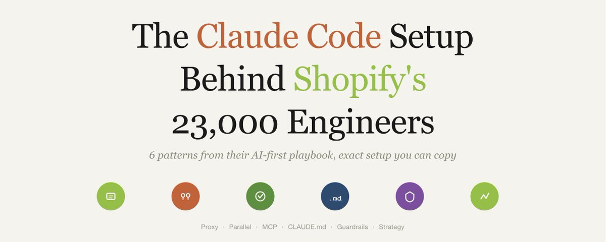

# Shopify 两万三千名工程师背后的 Claude Code 配置

> **来源：** [The Claude Code Setup Behind Shopify's 23,000 Engineers (Exact Config You Can Copy)](https://x.com/zodchiii/status/2056319284641460626) — 作者 darkzodchi (@zodchiii)



Shopify 的 23000 名工程师正在争分夺秒，目标是在今年 Q3 之前实现 96% 的编码自动化。

他们并行运行多个 Claude Code Agent，每个负责代码库的不同部分，工程师只需审核和合并。Bessemer 发布了他们的完整 AI-first 行动手册。以下是他们的具体配置 —— 你可以在 5 分钟内复制。

---

## 基础设施层（这套方案为什么行得通）

Shopify 并没有标准化某一个人工智能工具，而是标准化了底层的接入层。

他们构建了一个内部 LLM Proxy，所有 AI 请求都通过这一个网关路由。Claude Code、GitHub Copilot、Cursor —— 全部走同一套基础设施。

这带来了：
- **集中化的成本控制**
- **统一的使用分析**
- **随时切换模型的能力**，而不需要改变任何工程师的工作流

> 对小型团队的启示：不要只选一个工具就全力投入。先搭建好基础设施，这样你能同时试验多种工具，同时保持对成本和数据的控制。

---

## 模式 1：并行 Agent，而非单次对话

Shopify 的高级工程师并不把 Claude Code 当做一个「一次提示一次回复」的工具。

他们同时启动多个 Agent，各自处理代码库的不同部分：
- 一个 Agent 重构认证模块
- 另一个写测试
- 第三个更新文档

工程师的工作变成了：审核输出，丢弃不合适的，合并正确的。

工程副总裁 Farhan Thawar 称之为 **「编排智能系统」**。

---

## 模式 2：延展式批评循环

并非所有任务都适合并行。对于复杂的架构决策，Shopify 工程师会运行单个 Agent 进行多轮「自批评循环」：

1. Agent 生成方案
2. 自我评估
3. 修订方案
4. 继续在长推理周期中持续优化

他们不接受第一个输出，而是让 Agent **与自己辩论**。

结果：比单次提示好得多，因为 Claude 在你指出之前就已经自己发现了错误。

---

## 模式 3：Shopify AI Toolkit (MCP)

2026 年 4 月，Shopify 开源了一个 MCP 服务器，将 Claude Code 直接连接到 Shopify 的文档、GraphQL API 模式和实时商店操作。一键安装。

这个 MCP 服务器为 Claude Code 提供了 7 个工具：
- 搜索最新的 Shopify 文档（不是陈旧的训练数据）
- 针对实时模式验证 GraphQL 查询
- 通过 Shopify CLI 执行商店操作
- 创建商品、管理元字段、修改主题
- 用自然语言运行批量操作

没有这个工具，Claude 会幻觉 API 字段、凭空捏造组件模式。有了它，Claude 处理的是真实平台数据。

---

## 模式 4：CLAUDE.md 作为团队基础设施

Shopify 不把 CLAUDE.md 当成个人配置文件。它是**团队基础设施**，提交到 git，共享给全部 23000 名工程师。

关键洞察：**把所有规范和约定都塞进 CLAUDE.md 反而会降低性能**。每一次对话你都在为所有这些内容付费。少即是多。

---

## 模式 5：策略优先的验证方式

这是 Shopify 的路线和大多数团队最大的不同：

- **2024 年**：工程师 70% 时间花在执行上，30% 在策略上
- **2026 年**：Shopify 翻转了这个比例

因为 AI 处理了绝大多数编码工作，工程师现在：
- **70% 时间**花在策略上：梳理用户流程、验证市场需求、选择正确架构
- **30% 时间**花在执行上

Farhan 的团队估算大约 **20% 的生产力提升**。不是来自写更多代码，而是来自：
- 测试 10 种方案而不是 2 种
- 更快的原型迭代
- 更高质量的交付成果

---

## 模式 6：安全自治 + 护栏

Shopify 不会让 Agent 为所欲为。他们的护栏配置：

| ✅ 允许 | ❌ 拒绝 |
|---------|---------|
| 读取、写入、测试、提交 | 推送到远程、部署到生产、删除数据库、读取密钥 |

默认模式：`acceptEdits`。对于任何不可逆的操作，人类必须在审核环节介入。

---

## 你现在就能复制的方案

不需要 23000 名工程师。以下是入门版本：

### 第 1 步：标准化你的 CLAUDE.md

把团队的编码规范、架构决策、关键约定写进 CLAUDE.md，提交到仓库。但**只放真正重要的内容** —— 每多一条都会消耗推理上下文。

### 第 2 步：设置并行 Agent

同时打开多个 Claude Code 会话，分配不同的模块。你自己承担 review 角色。

### 第 3 步：安装相关的 MCP 服务器

找到你项目相关技术栈的 MCP 接入点（数据库模式、API 文档、部署工具），让 Agent 能访问真实数据。

### 第 4 步：添加护栏

```yaml
允许: 读取, 写入, 测试, lint, 提交
拒绝: 推送, 部署, 删除, 密钥
默认模式: acceptEdits
```

### 第 5 步：翻转时间分配比

停止把 70% 的时间花在执行上。让 Agent 去写代码。把你的时间花在**决定应该存在什么代码**上。

---

## 最关键的指标

Shopify 那 20% 的生产力提升，不是来自写更多代码，而是来自：
- **探索 10 种方案而不是 2 种**
- **更快地原型验证**
- **更早地发现错误**

真正把 Claude Code 用好的团队，不是那些提示词写得最漂亮的团队，而是**那些搭建了基础设施，让 Agent 能安全地、并行地在真实代码库上工作的团队**。

> **2026 年 Q3 之前实现 90% 的自主编码。这不是愿景声明，这是一个 deadline，23000 名工程师正在为此工作。**

---

📌 作者每天在 Telegram 频道分享关于 AI、金融和 Vibe Coding 的笔记：https://t.me/zodchixquant

---

*整理于 2026-05-19，来源：https://x.com/zodchiii/status/2056319284641460626*
