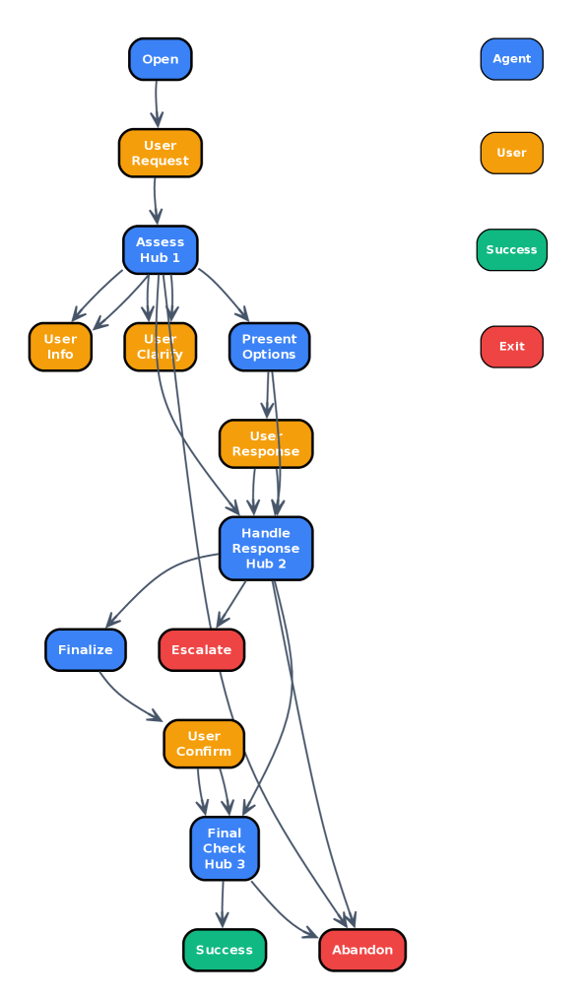

# 潜入地下——把流程写进权重

> 工作流跑一趟，前沿模型烧一次。如果能把流程一次编进小模型里呢？编译一次，跑一千次。

## 问题

你要做一个客服 agent——一个帮客户订机票的助手。

今天主流做法是这样：上面挂一个协调器（orchestrator），每次用户说话，协调器判断现在该走哪一步、该用哪个 prompt，然后把指令注射给大模型。LangGraph、CrewAI、Google ADK、OpenAI Agents SDK……全是一套路子。

这套模式能跑，但有一个要命的成本：**每说一句话，协调器就调度一次，大模型就调用一次，一整份流程说明就塞进一次上下文。**

如果你用的是前沿模型（比如 Claude、GPT），每句话都按 token 计费。更麻烦的是——流程说明里可能有你的商业规则，你不得不把它交给第三方 API 供应商。

*旧路*：不这么干，把流程写进 system prompt 让模型自己照着跑——这叫 *in-context 自协调*。Dennis 团队自己之前证明了这招效果极好（质量 4.53-5.00/5.00）。但问题是：每句话你都得用前沿模型，每句话流程说明都塞进上下文，token 账单翻倍，私有流程暴露给第三方。

不用协调器，但解不了成本和安全。

*转折*：作者看到一条完全不同的路——**把流程编译进一个小模型的权重里**。不是让模型照着流程图跑，是让流程图变成模型的"本能"。模型不知道自己按流程在走——它就是知道该问下一句话。

## 翻译

### 地上 vs 地下

图 1 讲清了两种架构的差别：

*地上架构（surface orchestration）*：用户 → 协调器 → LLM → 协调器 → LLM → 协调器 → ... 每走一步，协调器在中间转一手。

*地下架构（subterranean）*：用户 → 小模型（直接对话）。流程不在上下文里，在权重里。协调器只在训练时出现一次——生成训练数据——上线之后再也不露面。

作者把这第二种模型叫做 *subterranean agent*——潜在地下的 agent。

### 怎么编译

四步走，极其简单：

1. 把业务流程画成流程图：节点是对话轮次，边是状态跳转
2. 按所有合法路径走一遍，用前沿模型（Claude Sonnet 4.5）生成合成对话
3. 在一个小模型上做全参数微调（不是 LoRA——LoRA 在此不 work，试过了）
4. 部署。不用协调器，不加流程说明，只给一个极简 system prompt："你是个订票助手"

训练完的模型在线上讲的是自然对话——它不会说"当前处于节点 7"，它只是自然地知道：客人确认了目的地，该问出发日期了。

### 三道大坎，一一跨过

作者在三个场景上测试了这个想法：订机票（14 步）、Zoom 技术支持（14 步）、保险理赔（55 步、6 个决策枢纽）。每个场景 200 组对话，跟 LangGraph 协调器 + in-context 基线比对。

#### 第一道坎：质量

3B 模型在订机票场景上，跟同样 3B 模型的显式协调器正面比——编译版在 5 项指标上赢了 4 项（p<0.001）。一致性 +0.22，任务成功率 +0.18，自然度 +0.17。

但是跟前沿模型的 in-context 基线比，差距在"优雅处理边缘情况"和"自然度"这两项上——3B 只做到了前沿的 82%。

把模型换到 8B（Qwen3-8B），差距就收窄了。Zoom 支持场景下，8B 编译版优雅处理达到前沿的 92%，自然度 97%，信息准确度 87%。把 3B 在订机票上的老指标拉出来对比：8B 的优雅处理从 82% 跳到 92%——**模型大了，就够用了。**

三个场景汇总：**8B 编译模型达到前沿质量的 87-98%**，跟 LangGraph + Claude Sonnet 4.5（比它大 70 倍）不相上下。

而且失败率更低：订机票 5.5% vs 协调器 24%，保险 9% vs 17%。

#### 第二道坎：成本

这是最有杀伤力的数字。

编译模型每次对话的成本是 in-context 基线的 **1/128 到 1/462**。

两个原因叠加：自托管比 API 调用便宜约 65 倍（按 token 单价算）；编译模型每次只需要极短的 system prompt 和用户输入，而 in-context 每次要把整份流程说明塞进去。保险场景有 55 个节点 2381 条路径——流程说明非常长，因此压缩效果最显著，达到 462 倍。

而且编译模型跑本地，延迟还快 2.8 倍。

#### 第三道坎：灵活性

"流程改了你怎么办？再训练一次不也要命？"

作者做了实验：配置变了的时候，**重新编译一次只要 30-50 分钟**。8 张 A100 并行训练，50 分钟搞定。这是个 CI/CD 周期的时长，不是"大家以为的要好几周"。

## 核心概念

### 1. Subterranean Agent（地下 agent）

这是全文的核心概念。协调器不在线上出现，所有的流程知识都藏在权重里。模型只需要一个极简的 system prompt，用户的对话直接流进模型——模型自给自足。

类比：传统协调器像机场的调度员，每一架航班都需要他指挥。地下 agent 像自动驾驶——调度员只负责在跑道设计阶段工作，飞机自己飞。

### 2. Full Fine-Tuning vs LoRA

一个重要的发现：LoRA（参数高效微调）在这个任务上不 work。作者扫描了 rank 16-128，没有接近全参数微调的效果。理由是：流程内化需要改变模型的状态追踪行为——这是比风格对齐更深的改变。全参数微调不是"奢侈"，是**必要条件**。

### 3. 55 节点流程可编译

保险理赔有 55 个节点、6 个决策枢纽、2381 条唯一路径、嵌套循环（文件审核 → 补交 → 再审）。编译没有在规模上崩塌——2381 条路径被映射成 6264 条对话训练，8B 模型在 50 分钟内学完。

### 4. 流程的"本能化"

推理时模型看不到流程图。但它的输出自动遵循流程的结构——该问的时候问，该跳的时候跳，该升级的时候升级。这不是"照着说明书做"，是"已经把说明书背进骨髓了"。

## 洞见

**持久的结构进权重，瞬态的状态留 prompt。**

这是全文最有穿透力的原则。你流程里的东西（订机票要问哪几个问题、什么场景要升级到人工）是持久不变的。你把它们编译进权重，它们不占上下文空间，不花 API 的每一笔 token 钱。而用户说的每一个具体问题（"我要去北京""我想改签"）是瞬态的，它们留在 prompt 里刚刚好。

两个东西放对了地方，成本和质量就同时优化了。

## 博导审稿

*选题眼光*：极好。这问了一个工业界一直知道但不愿面对的问题——"这么多协调器框架，是不是大部分人用错了？"30 万 GitHub star 的生态背后，可能只是一种惯性。

*方法成熟度*：干净。同一模型对比（3B 编译 vs 3B 协调器）直接隔离了编译的效果。三道坎逐一回应，实验设计公正。几个让人放心的地方：用了独立 GPT-4.1 judge 做 cross-check 避免 Claude 自评偏差；失败率统计和 p 值都给了；LoRA 不 work 这个负面结果也诚实报告了。

*预设检查*：最大潜在问题——合成训练数据用 Claude Sonnet 4.5 生成，如果目标部署场景的真实对话分布和合成分布有偏移，编译后的模型能适应吗？作者没讨论这个。另外，全参数微调每次要 30-50 分钟，如果团队每天改好几次流程，这个周期还受得了吗？

*实验诚意*：好。200 组每组，5 项评分标准，跨三个完全不同规模的场景（14/14/55 节点）。但不完美的点是——没有做真实用户测试。所有"用户"都是模型模拟的。

*判决*：*weak accept to strong accept*。工程洞察力突出，实验设计扎实，对工业界有直接指导意义。

## 启发

- 如果你的 agent 处理的是**固定流程但高吞吐量**的场景（客服、工单处理、理赔等），编译进小模型是巨大的成本杠杆——128-462 倍
- 如果你担心私有流程暴露给 API 供应商，编译方案让你完全自托管，流程不出机房
- 如果你的流程经常改，50 分钟的编译周期意味着你可以把它放进日常 CICD
- 如果你在用 LoRA 做流程内化，**换全参数微调**——LoRA 扫了 rank 16-128 都不行

---

*Compiling Agentic Workflows into LLM Weights: Near-Frontier Quality at Two Orders of Magnitude Less Cost*
*Simon Dennis et al., i14, University of Melbourne, 2026*
*整理于 2026-06-01*
