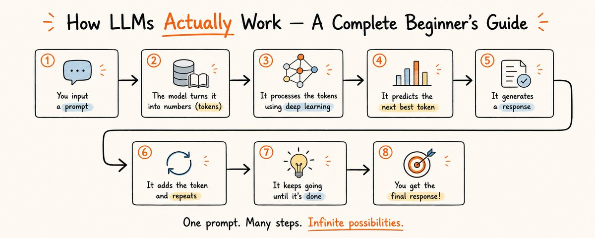

# LLM 究竟如何工作 —— 完整入门指南

> 你用过 LLM，被它们惊艳过，也可能被它们搞糊涂过、恼火过甚至吓到过。但你真的知道当你输入一个问题，它会回以流畅自信的大段回答时，背后在发生什么吗？
>
> 大多数人以为电脑里住着一个小天才。真相更奇怪——也更有趣。读完这篇指南，你会比 95% 随口谈论 LLM 的人更懂它。



---

## 一、LLM 到底是什么？

LLM = Large Language Model（大语言模型）。逐字拆解：

**Large** → 巨大——数十亿到数万亿的"参数"（数字旋钮）
**Language** → 语言——专门处理文本
**Model** → 模型——一个数学近似，不是真正的智能

**让人惊讶的事实：** 本质上，LLM 就是一个**花哨的自动补全**。它不会像人一样"思考"、"知道"或"理解"。它是一个读取了海量文本的系统，学会了以惊人的精度预测下一个词。

> 🧠 **心理模型**
> 把 LLM 想象成手机上的输入法自动补全——但这个自动补全吞下了大部分互联网、书籍、代码和维基百科，然后练习了**一万亿次**预测下一个词。

---

## 二、唯一的技巧：预测下一个词

LLM 做的一切都源于这一个朴素的技能：**猜下一个词**。

给你一个句子填空：

> "天空是____"

你的大脑瞬间会给出候选：蓝色、灰蒙蒙、晴朗、阴天。你还会给它们排序——"蓝色"远比"意大利面"更可能。这个排序就是 LLM 做的事情，只不过它对词汇表中的每个词都分配一个概率。

模型选择一个词（通常是可能性高的，再加一点随机性），加到句子末尾，然后重复整个过程——预测下一个词，再下一个，再再下一个。把几千次这样的预测串起来，就有了论文、代码、诗歌和邮件。

> 🧶 **类比**
> 就像一针一针织一条围巾。每一针（词）都依赖于前面的针。模型从不"提前看到整条围巾"——它只是一直织出下一个最合理的针脚，直到你让它停下。

---

## 三、Tokens：AI 实际阅读的单位

在预测任何东西之前，模型会把文本切分成 **tokens**。

一个微妙但关键的细节：LLM 不像我们一样"读"词。它们把文本拆成 tokens——可能是完整单词、单词的一部分、甚至单个字符。模型完全在这些 token 及其对应的数字中思考。

| 原始文本 | Token 化结果 |
|---------|-------------|
| "Hello" | ["Hello"] |
| "unbelievable" | ["un", "believe", "able"] |
| "I'm learning AI" | ["I", "'m", " learning", " AI"] |

> ✓ **这对你的意义**
> "上下文窗口"和定价是按 token 计算的，不是按词。当工具说"支持 128K tokens"时，大约相当于它同时记住一本 300 页的书。这也解释了为什么 LLM 有时会数错单词中的字母——它们不看字母，只看 tokens。

---

## 四、LLM 是如何训练的（3 阶段）

训练把一台空白的统计机器变成了一个有用的助手。原始模型刚下生产线时毫无用处——像一个没有记忆的大脑。把它变成 ChatGPT 或 Claude 需要三个大阶段。

### 阶段 1：预训练 —— "阅读互联网"

给模型喂海量文本（书籍、网站、代码），让它做一件事几十亿次：**预测下一个 token**。这里它吸收了语法、事实、推理模式和写作风格。

- 昂贵且缓慢——这就是 LLM 中 "Large" 的来源
- 需要数千张 GPU 运行数周甚至数月

### 阶段 2：监督微调 —— "学会成为助手"

人类编写示例对话展示理想答案。模型学习有用的格式：回答问题、遵循指令、保持礼貌。

### 阶段 3：基于人类反馈的强化学习 —— "学会偏好"

人类对回答进行排序（好/坏），模型被推向人们喜欢的回答，远离有害或无用的回答。这是让它感觉友好和安全的"抛光"步骤。

> ◆ **关键洞察**
> 模型在训练结束的那一刻起，"知识"就被冻结了。这就是为什么 LLM 可能不知道训练截止日期之后的事件——除非它连接到实时搜索或工具。

---

## 五、模型"内部"到底有什么？

没有事实数据库，没有答案文件夹，没有小图书馆。模型学到的所有东西都**压缩在参数中**——数十亿个数值"旋钮"（也叫权重）。

> 你可以把训练好的 LLM 看作一个**有损压缩版的互联网摘要**——就像一张模糊的 JPEG 图片。

这也是为什么 LLM 有时被称为"黑箱"：即使是构建它们的工程师，也无法指着某个旋钮说"这就是存法国首都的地方"。知识是散布在数十亿个数字中协同工作的。

> 🎚️ **类比**
> 想象一个带 1750 亿个旋钮的巨大调音台。训练就是一次一次地微调每个旋钮，直到音乐（预测结果）听起来对。没人能告诉你某个旋钮"是做什么的"——但它们一起奏出了美妙的音乐。

---

## 六、为什么 LLM 会自信地胡说八道

"幻觉"是预测机制的一个**特性**，不是随机的 bug。

因为 LLM 唯一的真本事是生成听起来合理的文本，所以它有时会输出听起来完全自信但完全错误的东西。这就是幻觉。

模型不是在说谎——它**没有真实概念**。它只是在预测"合适"的词，一个错误的事实和一个正确的事实一样流畅。一个虚构的书名或捏造的统计数据，在统计形状上和一个真实的一样。

> ⚠️ **重要提醒**
> 永远不要盲目信任 LLM 提供的事实、数据、引用、法律或医疗信息。把它当作一个**才华横溢、快速、偶尔过度自信的实习生**——重要的事情永远要验证。

---

## 七、如何真正用好它们

理解工作机制让你在使用它们时效率显著提升。以下原则直接源自 LLM 的工作原理：

### 1. 提供丰富的上下文

模型只知道对话中的内容加上它的训练数据。你提供的相关细节越多，它的预测越好。

```
❌ "写一封邮件"
✅ "写一封客户续约提醒邮件，语气友好但专业，提到我们的折扣期到周五结束"
```

### 2. 明确指定输出格式

要求格式、语气、长度和受众。

```
❌ "解释量子计算"
✅ "像给 12 岁小孩解释量子计算，3 个要点，每个不超过一句话"
```

### 3.迭代，不要期望一次完美

把它当作来回对话。像指导初级队友一样优化它的回答——**反复打磨**是第一生产力。

### 4. 重要的事要验证

用它来起草和思考，但有真实后果的事情要核对事实。

> ✓ **提示：提示词是一门技能**
> 输出质量很大程度上由输入质量决定。学会"写提示词"是从 AI 中获得价值的最具杠杆效应的技能——而且**不需要写代码**。

---

## 八、关键要点

| 常见误解 | 真相 |
|---------|------|
| LLM 在"思考" | 它只是在做高级自动补全 |
| LLM 有"理解" | 它只是统计上合理的文本预测 |
| LLM 知道真假 | 它没有真实概念，只关心"合适" |
| 训练后它继续学习 | 知识在训练结束时冻结 |
| 里面有个知识库 | 知识压缩在参数中，无法精确解释 |
| 幻觉是 bug | 是统计预测的必然结果 |

---

## 九、推荐的延伸阅读

如果这篇指南激发了你的好奇心，以下书籍可以带你深入：

- **Co-Intelligence: Living and Working with AI** — Ethan Mollick。关于在日常和工作中使用 AI 的最佳非技术书籍。实用、友好、接地气。
- **The Coming Wave** — Mustafa Suleyman（DeepMind 联合创始人）。大视野看 AI 走向何方及其社会意义。
- **You Look Like a Thing and I Love You** — Janelle Shane。一本搞笑又真正友好的 AI 思维入门书（还有它如何华丽地失败）。作为第一本读物最合适。

---

## 总结

LLM 不是魔法，不是有意识的实体，也不是搜索引擎。它是一个**见过数万亿词语的大型统计机器**，学会了预测哪些词最可能跟在其他词后面。

它擅长的事：写作、总结、头脑风暴、编码、翻译、解释概念。
它不擅长的事：精确的事实核查、数学计算、引用来源、理解当下（训练截止后的事）。

把它当作一个永远在线的、才华横溢但会犯错的助手。**给它好输入，给出好输出，验证重要的事。** 这就是使用它的全部智慧。

---

*整理于 2026-05-31，原文来自 [Swati Gupta (@hrswatigupta)](https://x.com/hrswatigupta/status/2060304091356791118)*
