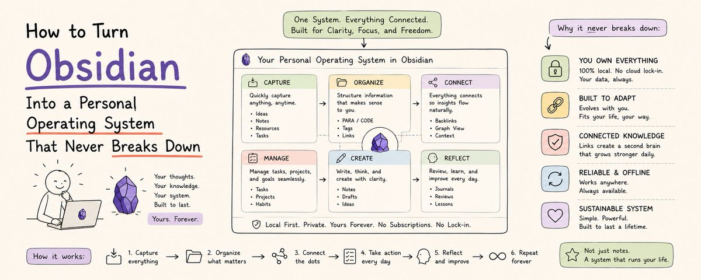

# 将 Obsidian 打造成永不崩溃的个人操作系统

> **来源：** [How to Turn Obsidian Into a Personal Operating System That Never Breaks Down](https://x.com/cyrilxbt/status/2056924424838815824) — CyrilXBT



---

大多数生产力系统崩溃的原因都一样：

**它们是为好日子设计的。**

好日子里你有时间和精力维护系统——正确归档笔记、更新项目状态、清空收件箱、处理所有流入的信息。

坏日子里系统变成了罪恶感的来源而非杠杆。收件箱四天没处理、笔记散落在随机文件夹、项目状态数周没更新。

你停止使用这个系统，因为维护它所消耗的能量比它节省的还多。

**Obsidian 个人操作系统的设计方式不同。** 它不是为好日子设计的，而是为了在坏日子里也能存活。

这套架构在你不堪重负时自我维护，在你状态不稳定时产生有用输出，无论你是否主动策展，它都能智能地复合增长。

---

## 为什么多数 Obsidian 系统会崩溃

在开始搭建之前，需要理解大多数人的系统为什么无法持久。三个原因：

**手动维护负担。** 系统要求你定期更新才能保持准确。项目状态需要手动更新，仪表盘需要手动刷新，标签需要手动应用。生活一忙，维护就跟不上，系统变得不可靠——然后被抛弃。

**复杂度随时间叠加。** 从简单结构开始，每次遇到当前系统无法处理的问题就加一层复杂度。六个月后，你拥有了一套需要 20 分钟导航、且需要阅读自己写的文档才能理解的繁复架构。

**没有智能层。** Vault 存储信息但不会推理。你捕获了想法但再也找不到它们。你做了会议记录但从未在相关时刻浮现行动项。系统只是一个档案库，不是智能体。

**个人操作系统架构同时解决了这三个问题：**
- 手动维护消失——因为通过 MCP 连接的 Claude Code 自动维护系统
- 复杂度受控——架构有固定数量的组件，每个有特定功能，没有组件重复
- 智能加入——Claude 读取 Vault、建立联系、浮现相关信息，生成 Vault 本身无法产生的输出

---

## 三层架构

### 第一层：存储层（Storage Layer）

Obsidian 本身。纯文本 Markdown 文件，按一致的结构组织。你生活中产生的每条信息都以人类可读、机器可读且永久保存的格式存在于此。

### 第二层：智能层（Intelligence Layer）

通过 Filesystem MCP 连接到 Vault 的 Claude Code。Claude 读取你的文件、在文件间建立联系、从中生成输出、根据你生活中发生的事情更新它们。

### 第三层：自动化层（Automation Layer）

运行在 $5/月服务器上的 N8N。它编排工作流、触发定时任务、调用 Claude API、在系统间传递信息——无需你任何手动触发。

这三个层把笔记集合变成了操作系统。去掉任何一层，你得到的东西就打了折扣：
- 存储没有智能 = 档案库
- 存储加智能没有自动化 = 你需要手动使用的工具
- **三合一 = 自主运行的系统**

---

## 永不崩溃的 Vault 结构

Vault 结构是一切的基础。搞对了，系统在增长中保持连贯；搞错了，就变成迷宫。

结构包含 **8 个文件夹**。Vault 中的每篇笔记恰好属于其中之一。没有文件夹是可选的，没有文件夹重叠。

```
00 - CAPTURE/
    所有未处理的内容都落在这里

01 - ACTIVE/
    projects/
        [project-name]/
            overview.md
            tasks/
            notes/
            outputs/
    areas/
        health/
        finances/
        relationships/
        learning/
        career/
    daily/
        [YYYY-MM-DD].md

02 - RESOURCES/
    research/
    references/
    templates/
    bookmarks/

03 - SYSTEM/
    CLAUDE.md
    skills/
    workflows/
    logs/

04 - GENERATED/
    briefings/
    summaries/
    analyses/
    drafts/

05 - QUEUE/
    Claude 的待处理任务

06 - CALENDAR/
    events/
    reviews/

07 - ARCHIVE/
    已完成的项目和过时内容
```

### 每个文件夹的设计逻辑

**00 - CAPTURE：** 捕获和处理是分开的活动。捕获凭思维速度，处理凭注意力速度。CAPTURE 文件夹不加判断地吸收一切，这样就不会因为处理速度太慢而丢失任何内容。

**01 - ACTIVE：** 只包含此刻活着的内容。你正在做的项目、你负责的生活领域、每日笔记。没有历史，没有愿景，只有当下。

**02 - RESOURCES：** 参考资料库。将来可能用到的东西，不是你正在做的事情。

**03 - SYSTEM：** 操作系统本身。CLAUDE.md、技能文件、工作流定义、日志。基础设施层。

**04 - GENERATED：** Claude 存放输出的地方。永远不要手动编辑这里的文件——它们是系统输出。

**05 - QUEUE：** Claude 任务的收件箱。你把描述需求的文件丢在这里，Claude 处理它们，输出落入 GENERATED。

**06 - CALENDAR：** 跟踪基于时间的信息。即将发生的事件、定期回顾。按"何时"而非"什么"组织的信息。

**07 - ARCHIVE：** 完成后移到这里。完成的项目、过时的参考资料。永远不删除，只归档。

---

## 让系统智能的 CLAUDE.md

CLAUDE.md 是在任何工作流运行之前告诉 Claude 你生活一切的文档。没有它，每次 Claude 会话从零开始；有了它，每次会话都拥有完整的上下文——你是谁、你在做什么、现在什么最重要。

```markdown
# Personal Operating System — CLAUDE.md

## Identity
Name: [你的名字]
Role: [你的主要角色]
Location: [你的城市]

## Life Areas and Current Status
Health: [简要状态 — 例："训练半程马拉松，每周跑 4 次"]
Finances: [简要状态 — 例："攒首付，目标 2026 年 12 月"]
Relationships: [简要状态 — 例："伴侣：[名字]。需要维护的关键友谊：[名字]"]
Learning: [简要状态 — 例："正在学习：[主题]。目标：[成果]"]
Career: [简要状态 — 例："当前职位：[职称]。目标：[目标]"]

## Active Projects
[项目名]: [一句话描述] | Status: [状态] | Next: [具体下一步行动]
[为每个活跃项目重复]

## Current Priorities
1. [本周最重要的事]
2. [第二重要]
3. [第三重要]

## Standards for Generated Content
Voice: [你的写作和沟通方式]
Format preferences: [你的偏好]
What you never want: [具体需要避免的事]

## Operating Rules
- 永远不删除文件。移动到 ARCHIVE 并加时间戳
- 不经人类审查绝不发送通信内容
- 始终为生成的文件添加 YYYY-MM-DD 日期戳
- 每次重要操作记录到 SYSTEM/logs/operations.md
- 不确定存放位置时，使用 GENERATED 并标记

## Update Schedule
本文件定期审阅和更新：[你的计划 — 例如每周一早晨]
```

**最重要的一条维护习惯：** 每周一早晨更新 Current Priorities 部分。五分钟诚实的反思——这周到底什么最重要——会极大提升系统生成内容的相关性。

---

## 让系统成为操作系统的五个工作流

五个工作流将 Vault 从存储系统转变为操作系统。每个都自动运行，每个都输出到 GENERATED，每个都不需要你手动干预就能自我维护。

### 工作流 1：每日晨间简报

每天早上 6 点，读取 Vault 并生成简报。

**Claude 提示词：**

```
Read CLAUDE.md for full life context.

Generate a morning briefing covering:

MOST IMPORTANT TODAY: 基于当前优先级，今天唯一最重要的事

SCHEDULE: CALENDAR/events/ 中标注在今天的事件。
为每个准备一句话简报。

OPEN LOOPS: 昨天每日笔记中以 OPEN: 开头的事项

PROJECT PULSE: 对于 CLAUDE.md 中每个活跃项目：
一句话说状态，一句话说下一步行动

WEEKLY FOCUS: 如果今天是周一，阅读上周每日笔记，
识别本周最重要的一件事

格式控制在 300 字以内。从 MOST IMPORTANT TODAY 开始。
保存到：GENERATED/briefings/[DATE]-morning.md
```

这条简报在你打开笔记本之前就已经运行完毕。你三分钟读完，在看到任何通知之前就知道什么最重要。

### 工作流 2：捕获处理器

每天晚上 8 点，处理 00 - CAPTURE 中的所有内容。

**Claude 提示词：**

```
Read all files in the CAPTURE folder created today.

For each captured item:

1. 识别类型：
   TASK: 需要行动的事
   IDEA: 以后开发或研究的想法
   REFERENCE: 存储以备将来使用的信息
   NOTE: 关于某个活跃事项的上下文或观察
   EVENT: 需要上日历的时间性事项

2. 归入正确位置：
   TASK → 在相关项目/领域中创建任务笔记，设定截止日期
   IDEA → 归档到 RESOURCES/research/ 加日期
   REFERENCE → 归档到 RESOURCES/references/ 按主题
   NOTE → 追加到相关项目或每日笔记
   EVENT → 在 CALENDAR/events/ 中创建事件文件

3. 处理完后将原始捕获文件移到 ARCHIVE

4. 所有处理操作记录到 SYSTEM/logs/capture-log.md
```

这意味着 00 - CAPTURE 每晚自我清空。没有堆积，没有丢失，每条捕获都自动到达它该去的地方。

### 工作流 3：每周回顾生成器

每周日晚上 7 点，生成本周回顾。

**Claude 提示词：**

```
Read all daily notes from the past 7 days.
Read all project notes modified this week.
Read CLAUDE.md for current life context and priorities.

生成周回顾包含：

WHAT MOVED FORWARD:
本周具体进展。每个进展的原因。具体到项目、行动和结果。

WHAT DID NOT MOVE:
诚实地评估什么停滞了。每个停滞项最可能的原因。

THE WEEK'S PATTERN:
本周反复出现的一个主题或洞察。是否预示着需要改变什么。

NEXT WEEK'S PRIORITIES:
下周按影响排名的三个具体优先级。
对于每项：为什么重要、下一步具体行动是什么。

ONE DECISION:
此刻悬而未决的最重要决策。
你掌握了什么信息来做决定。
再拖延一周的成本是多少。

保存到：GENERATED/summaries/[DATE]-weekly-review.md
更新 CLAUDE.md 的 Current Priorities 部分为下周前三项。
```

过去做周回顾需要 45 分钟盯着笔记回忆发生了什么。现在只需要 10 分钟阅读系统生成的回顾，再加 2 分钟补充遗漏的内容。

### 工作流 4：队列处理器

每 2 小时检查 05 - QUEUE 中是否有你放入的文件。

命名约定很简单：文件名包含动词 + 主题：
```
RESEARCH-stoic-philosophy-applications.md
SUMMARIZE-project-meeting-notes.md
DRAFT-email-to-landlord-about-repairs.md
PLAN-trip-to-portugal-october.md
DECIDE-whether-to-accept-new-client.md
```

**Claude 提示词：**

```
Check the QUEUE folder for any unprocessed files.

For each file found:
1. 读取文件名识别任务类型
2. 读取文件内容获取具体指令
3. 执行任务，如果 SYSTEM/skills/ 中有相关技能则使用
4. 保存输出到 GENERATED/[task-type]/[DATE]-[topic].md
5. 将队列文件移到 ARCHIVE/queue-processed/
6. 所有处理记录到 SYSTEM/logs/queue-log.md

如果任务需要 Vault 中不存在的信息：
在输出中标记为 NEEDS HUMAN INPUT: [需要什么]
```

队列处理器是整个系统中最强大的工作流，因为它处理任何东西。凌晨想到要做的事，丢个文件到 QUEUE，凌晨 2 点处理完毕，醒来时输出在等着你。

### 工作流 5：项目健康监控

每周一早上 7 点，检查所有活跃项目。

**Claude 提示词：**

```
Read CLAUDE.md for the list of active projects.
Read the overview.md file in each active project folder.
Read any project files modified in the last 7 days.

For each project generate a health assessment:

STATUS: On track / At risk / Stalled / Blocked

EVIDENCE: 什么具体指向这个状态。
要具体——命名文件、日期、具体观察。

NEXT ACTION: 这个项目在未来 48 小时内最需要的一件事

FLAG: 超过 7 天没有任何活动的项目。
这些需要人工关注。

保存健康报告到：GENERATED/briefings/[DATE]-project-health.md

对于任何被 FLAG 的项目：
在 QUEUE 中创建文件 REVIEW-[project-name].md，
包含情况摘要。
```

项目健康监控在问题变成危机之前就浮现出来。一个项目停滞了 7 天，在周一一早就会被标记，而不是在截止日期到来时才发现。

---

## 反崩溃机制

### 捕获安全网

所有内容先进入 00 - CAPTURE。捕获时不需要做任何决策——你永远不会因为不知道该把东西归到哪而跳过捕获。CAPTURE 文件夹吸收一切，处理器稍后归档。

这意味着系统在你忙碌的日子里完好无损。在完全没时间整理的日子里，你仍然捕获到 00 - CAPTURE，处理器当晚自动处理剩余部分。

### 永不删除规则

这个系统中没有任何东西被删除。项目完成移到 ARCHIVE，过时参考移到 ARCHIVE，处理完的捕获移到 ARCHIVE。

这意味着系统永远不会丢失信息。你不可能因为归档太激进而损坏系统——保留一切的代价为零，因为存储是无限的，而且系统从不需要你在日常操作中浏览归档。

### CLAUDE.md 单一事实源

Claude 运行所需的一切生活信息存在于一个文件中。一个文件需要更新，一个文件需要审阅，一个文件管控每个工作流。

当你的优先级变化时，更新 CLAUDE.md，每个后续工作流自动反映新现实。你不需要更新五个不同的文档，也不需要在不同会话中重复解释你的处境。

---

## 一个周末的搭建顺序

按这个精确顺序搭建。抵制同时构建一切的冲动。

### 周六上午：存储层（2 小时）
- 创建 8 个文件夹
- 设置 CLAUDE.md，填入真实的当前信息
- 为最活跃的项目写一个 overview.md，带上一致的属性

### 周六下午：智能层（1 小时）
- 安装 Claude Desktop
- 配置 Filesystem MCP，指向你的 Vault
- 手动运行第一条晨间简报，验证基于 CLAUDE.md 的输出是否准确

### 周六晚上：第一个队列任务（30 分钟）
- 在 QUEUE 中放一个文件，包含真实任务（比如一直想研究的话题）
- 让 Claude 处理它，审查输出，记下需要改进 CLAUDE.md 的地方

### 周日上午：自动化层（2 小时）
- 设置 N8N
- 将晨间简报工作流建成 cron 任务
- 按计划时间运行，验证输出自动出现在 GENERATED

### 周日下午：其余工作流（2 小时）
- 添加捕获处理器、每周回顾生成器和队列处理器
- 如果需要，添加项目健康监控

到周日晚，五个工作流全部运行。个人操作系统已上线。

---

## "永不崩溃"在三个月后是什么样子

搭建这套系统三个月后，你会注意到一件事：

**系统一直在运行。**

不是因为你维护得完美——你没有。有几周你几乎没碰 Obsidian。有几天 CAPTURE 堆积了三天才想起处理。

但晨间简报每天早上照常运行。捕获每晚照常处理。周回顾每周日照常生成。项目健康监控每周一照常标记停滞项目。

**系统一直在运行——不管你是否在操作它。**

这就是生产力工具和操作系统之间的区别：

> 工具要求你使用它。
> 操作系统自主运行。

### 参考

- 原文：[CyrilXBT on X](https://x.com/cyrilxbt/status/2056924424838815824)
- 相关文章：[搭建 Obsidian Vault 自动运转业务](https://x.com/cyrilxbt/status/2054379666316693719)
- [Obsidian 仪表盘完整指南](./obsidian-dashboard-everything-that-matters-today.md)
