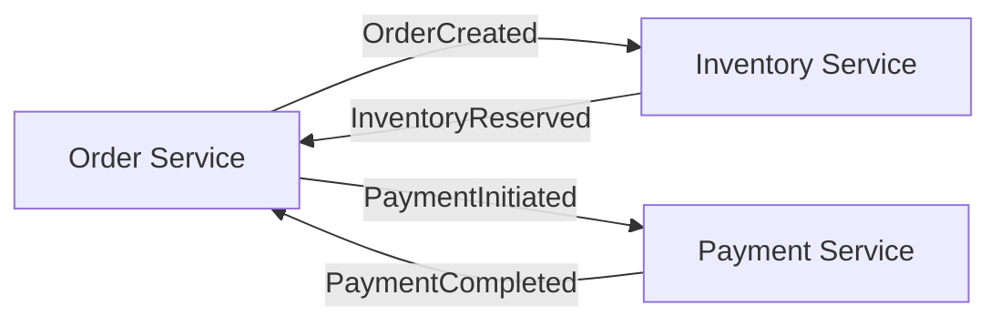
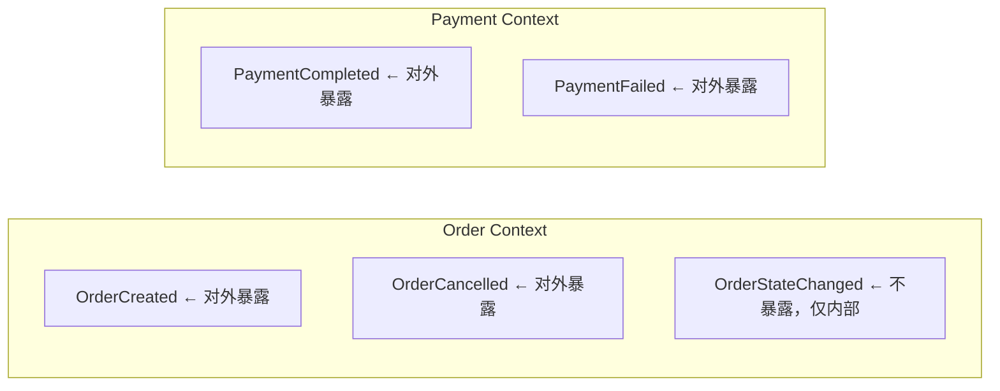

# Top 10 Event-Driven Architecture Pitfalls

> **演讲者**：Victor Rentea（Independent / Victor Rentea Consulting）  
> **会议**：Spring I/O 2026（2026 年 5 月，巴塞罗那）  
> **相关场次**：Devoxx Belgium Oct 2025、DevBcn 2026 等  
> **视频**：[Spring I/O 2026 版](https://youtu.be/blPlsapt7p4) · [Devoxx 版](https://www.youtube.com/watch?v=0SnuppAHOlQ)  
> **播放列表**：[Victor Rentea Best Talks](https://www.youtube.com/playlist?list=PLggcOULvfLL_MfFS_O0MKQ5W_6oWWbIw5)

---

## 关于演讲者

**Victor Rentea** 是欧洲知名的 Java/架构讲师和独立顾问。他拥有 20+ 年企业级开发经验，在全球顶级会议（Devoxx、Spring I/O、JAX London 等）上做过数十场特邀演讲，其中多场被评为 ⭐️ **top-rated**。

他的演讲风格务实、幽默，**从不讲理论空话**——所有材料均来自他为 150+ 家公司做咨询和培训时收集的真实 **war stories**。他不仅是 Clean Code、架构设计、事件驱动方面的权威，也是 IntelliJ IDEA 生产力领域的顶级专家。

> *"You send a message instead of calling a REST API — what can possibly go wrong?"*

---

## 演讲简介

> 欢迎来到**事件驱动架构游乐园** 🎪，这里每条消息都是一次过山车之旅！

在这个演讲中，Victor 带领听众经历 10 个"游乐设施"——每一个都对应一个真实团队踩过的坑：

- 重复投递的惊险回环
- 消息乱序的急转弯
- Dual-Write 的自由落体
- 消费者错误的迷魂阵
- 丢失消息的寻宝任务
- 隐私海盗的暗影伏击

> **核心主题**：从 REST API 转向事件驱动时最容易犯的 10 个错误，以及如何避免它们。

这 10 条陷阱**并非教科书理论**，而是从 150+ 家公司的真实生产环境中提炼出来的。无论你是架构师、开发者还是运维人员，这场演讲都会让你重新审视你的消息系统设计。

> *"No REST, just ride!"* 🎪

---

## 目录

- [陷阱 1：重复消息（Duplicated Messages）](#陷阱-1重复消息duplicated-messages)
- [陷阱 2：消息乱序（Out-of-Order Messages）](#陷阱-2消息乱序out-of-order-messages)
- [陷阱 3：Dual-Write 问题（Dual-Write Problem）](#陷阱-3dual-write-问题dual-write-problem)
- [陷阱 4：胖事件（Fat Events）](#陷阱-4胖事件fat-events)
- [陷阱 5：事件循环依赖（Event Circular Dependencies）](#陷阱-5事件循环依赖event-circular-dependencies)
- [陷阱 6：毒消息（Poison Messages）](#陷阱-6毒消息poison-messages)
- [陷阱 7：Schema 耦合（Schema Coupling）](#陷阱-7schema-耦合schema-coupling)
- [陷阱 8：分布式单体（Distributed Monolith）](#陷阱-8分布式单体distributed-monolith)
- [陷阱 9：用事件模拟 Request-Response](#陷阱-9用事件模拟-request-response)
- [陷阱 10：缺乏可观测性（Lack of Observability）](#陷阱-10缺乏可观测性lack-of-observability)
- [总结：什么时候不该用 EDA](#总结什么时候不该用-eda)

---

## 陷阱 1：重复消息（Duplicated Messages）

### ❌ 问题

分布式系统中，**Exactly-Once 投递是一个神话**。网络重试、生产者重试、消费者崩溃重启——每一条链路都可能导致同一条消息被投递多次。

| 场景 | 为什么产生重复 |
|------|---------------|
| Kafka 生产者重试 | `acks=all` + 重试 → 消息已提交但 ACK 丢失 → 重复 |
| 消费者崩溃 | 处理完成后未 Commit Offset → 重新消费 |
| 网络问题 | TCP 级别的重传可能导致服务端收到重复请求 |

### ✅ 解决方案：消费端幂等

幂等性是解决重复消息的唯一正确方式。不要依赖"broker 保证不重复"。

#### 方案 A：幂等键（Idempotency Key）

```java
@Component
public class OrderCreatedConsumer {

    private final Set<String> processedIds = ConcurrentHashMap.newKeySet();

    @KafkaListener(topics = "order-events")
    public void onOrderCreated(OrderCreatedEvent event) {
        // 1. 幂等检查
        String idempotencyKey = event.getEventId();
        if (processedIds.contains(idempotencyKey)) {
            log.info("Duplicate event skipped: {}", idempotencyKey);
            return;
        }

        // 2. 业务处理
        processOrder(event);

        // 3. 记录已处理
        processedIds.add(idempotencyKey);
    }
}
```

> **注意**：纯内存的去重集合在应用重启后会丢失。生产环境应使用**数据库唯一约束**或 **Redis 布隆过滤器**。

#### 方案 B：数据库唯一约束（推荐）

```sql
CREATE TABLE idempotency_keys (
    idempotency_key VARCHAR(64) PRIMARY KEY,
    created_at TIMESTAMP NOT NULL DEFAULT CURRENT_TIMESTAMP
);
```

```java
@Component
public class OrderCreatedConsumer {

    @Transactional
    public void onOrderCreated(OrderCreatedEvent event) {
        // 幂等键的唯一约束保证一笔业务只能处理一次
        idempotencyRepository.save(new IdempotencyRecord(event.getEventId()));

        // 业务处理
        orderService.process(event);
    }
}
```

#### 方案 C：利用业务本身的唯一性

如果业务本身有唯一约束（如订单 ID 的唯一索引），可以直接用数据库抛出的 `DuplicateKeyException` 来跳过重复：

```java
try {
    orderRepository.save(order);
} catch (DataIntegrityViolationException e) {
    log.info("Order already exists, skipping duplicate: {}", order.getId());
    return;
}
```

### 💡 Victor 的关键提示

> **"不要相信任何中间件宣称的 exactly-once。"**  
> Kafka 的 exactly-once（EOS）是通过事务 + 幂等生产者实现的，但那只保证**生产到消费的投递**不丢，不保证消费者**处理**过程中的不重复。

---

## 陷阱 2：消息乱序（Out-of-Order Messages）

### ❌ 问题

在事件驱动架构中，消息几乎从不按照发送顺序到达消费者，尤其是在以下场景：

| 场景 | 为什么乱序 |
|------|-----------|
| 多分区消费 | Kafka 同一个 Topic 的多个分区无法保证全局有序 |
| 网络延迟 | 先发的消息因网络原因后到 |
| 重试处理 | 消费失败重试可能导致后到的事件先被处理 |
| 多个生产者 | 多个服务同时发送事件，天然无法排序 |

### ✅ 解决方案

#### 方案 A：不依赖顺序设计

> **最根本的解决方案：设计你的业务逻辑不依赖消息顺序。**

```java
// ❌ 错误：依赖"更新必须在创建之后"
if (!userRepository.exists(event.getUserId())) {
    throw new IllegalStateException("User not found, cannot process update");
}

// ✅ 正确：upsert 语义，顺序无关
userRepository.upsert(event.getUserId(), event.getData());
```

#### 方案 B：使用序列号 + 乐观锁

```java
@Entity
public class Order {
    @Version
    private Long version;  // 乐观锁版本号

    // 业务字段...
}

// 消费者
@Transactional
public void onOrderUpdated(OrderUpdatedEvent event) {
    Order order = orderRepository.findById(event.getOrderId())
        .orElseThrow(() -> new IllegalArgumentException("Order not found"));

    if (event.getVersion() <= order.getVersion()) {
        log.warn("Stale event ignored: eventVersion={}, currentVersion={}",
            event.getVersion(), order.getVersion());
        return;
    }

    order.updateFrom(event);
    orderRepository.save(order);
}
```

#### 方案 C：分区内保证顺序（Kafka 专用）

```java
// 生产者：同类消息发到同一个分区
producer.send(new ProducerRecord<>(
    "order-events",
    String.valueOf(order.getId()),  // 同一订单走同一分区
    event
));
```

> 注意：这只保证**分区内**有序，不保证全 Topic 有序。全局有序意味着只有一个分区，会丧失 Kafka 的并行能力。

### 💡 Victor 的关键提示

> **"不要用消息系统的顺序来保证业务正确性。顺序是性能优化手段，不是正确性手段。"**

---

## 陷阱 3：Dual-Write 问题（Dual-Write Problem）

### ❌ 问题

Dual-Write 是指一个操作需要同时写两个独立的存储系统（比如：写数据库 + 发消息），但这两个操作无法在同一个事务中完成：

```java
// ❌ 典型 Dual-Write 问题
@Transactional
public void createOrder(CreateOrderCommand cmd) {
    Order order = orderRepository.save(Order.create(cmd));

    // ❌ 如果这里失败，订单已保存但事件没发出去！
    // ❌ 如果调用是先发消息再保存，消息已发但数据库回滚！
    kafkaTemplate.send("order-events", new OrderCreatedEvent(order.getId()));
}
```

| 失败场景 | 结果 |
|----------|------|
| DB 成功，MQ 失败 | 下游系统不知道有新订单 |
| MQ 成功，DB 回滚 | 下游系统收到一条"幽灵订单" |
| 消费者在消息到达时 DB 还没提交 | 消费者读不到订单数据 |

### ✅ 解决方案：Transactional Outbox 模式

#### 核心思想

```
同一个本地事务：把"发送消息"转化为"写 Outbox 表"
然后：一个独立的 Relay 进程读取 Outbox 表并推送到 MQ
```

```
┌─────────────────────────────────────┐
│          同一个本地事务                │
│  ├─ 业务表：INSERT INTO orders       │
│  └─ Outbox 表：INSERT INTO outbox    │
└──────────┬──────────────────────────┘
           │ 事务提交
           ▼
┌─────────────────────────────────────┐
│       Outbox Relay（定时/CDC）        │
│   读取 PENDING 记录 → 发 MQ → 标记完成  │
└─────────────────────────────────────┘
```

#### Outbox 表设计

```sql
CREATE TABLE outbox_events (
    id              BIGINT AUTO_INCREMENT PRIMARY KEY,
    event_id        VARCHAR(64)  NOT NULL UNIQUE,
    aggregate_type  VARCHAR(64)  NOT NULL,
    aggregate_id    VARCHAR(64)  NOT NULL,
    event_type      VARCHAR(128) NOT NULL,
    payload         JSON         NOT NULL,
    trace_id        VARCHAR(64),
    status          VARCHAR(16)  NOT NULL DEFAULT 'PENDING',
    retry_count     INT          DEFAULT 0,
    created_at      TIMESTAMP    NOT NULL DEFAULT CURRENT_TIMESTAMP,
    sent_at         TIMESTAMP
);
CREATE INDEX idx_outbox_status_created ON outbox_events(status, created_at);
```

#### 生产者端

```java
@Component
public class OrderEventPublisher {
    private final OutboxEventRepository outboxRepository;
    private final ApplicationEventPublisher eventPublisher;

    @Transactional
    public void publishOrderCreated(Order order) {
        // 1. 写 Outbox 表（和业务表同一个事务）
        outboxRepository.save(new OutboxEvent(
            UUID.randomUUID().toString(),
            "Order", String.valueOf(order.getId()),
            "OrderCreated",
            serialize(new OrderCreatedPayload(order))
        ));

        // 2. 可选：发布本地领域事件
        eventPublisher.publishEvent(new OrderCreatedDomainEvent(order.getId()));
    }
}
```

#### Outbox Relay

```java
@Component
public class OutboxRelayJob {
    @Scheduled(fixedDelay = 5000)
    @Transactional(propagation = Propagation.REQUIRES_NEW)
    public void relay() {
        List<OutboxEvent> pending = outboxRepository
            .findTop100ByStatusOrderByCreatedAtAsc("PENDING");

        for (OutboxEvent event : pending) {
            try {
                kafkaTemplate.send("order-events", event.getPayload());
                event.setStatus("SENT");
                event.setSentAt(Instant.now());
                outboxRepository.save(event);
            } catch (Exception e) {
                event.setRetryCount(event.getRetryCount() + 1);
                if (event.getRetryCount() >= 3) {
                    event.setStatus("FAILED");
                }
                outboxRepository.save(event);
                log.error("Outbox relay failed: {}", event.getEventId(), e);
            }
        }
    }
}
```

#### 变体方案

| 方案 | 延迟 | 侵入性 | 运维要求 |
|------|------|--------|----------|
| 定时轮询 | 秒级 | 低 | 无 |
| CDC（Debezium） | 近实时 | 极低 | 需 Debezium + Kafka Connect |
| 事务消息（RocketMQ） | 毫秒级 | 中 | RocketMQ 集群 |

### 💡 Victor 的关键提示

> **"Dual-Write 是分布式系统中最常见的根源性问题。每当有人跟你说'先发消息再写库'或'先写库再发消息'，你都要知道它们在同一个事务中是不可能的——除非用 Outbox 模式。"**

---

## 陷阱 4：胖事件（Fat Events）

### ❌ 问题

为了"方便消费者"，生产者把整个业务对象完整地塞进事件体里：

```java
// ❌ 胖事件：每次传递整个对象
{
  "eventType": "OrderCreated",
  "order": {
    "id": 12345,
    "userId": 789,
    "items": [{"productId": 1, "quantity": 2, "price": 19.99}, ...],
    "shippingAddress": { "street": "...", "city": "...", ... },
    "paymentInfo": { "cardLast4": "4242", "charged": 39.98, ... },
    "couponApplied": {"id": 5, "discount": 10.0, ...},
    "notes": "leave at the door",
    "source": "web",
    "campaignId": "spring2026",
    "recommendations": [...],
    "fraudScore": 0.02,
    "tags": ["new_user", "vip_potential"],
    "metadata": { ... }
  }
}
```

**带来的问题：**

| 问题 | 后果 |
|------|------|
| **Schema 容易变** | 订单结构一改，所有消费者都要重新部署 |
| **数据膨胀** | 每条消息携带大量无关数据，浪费带宽和存储 |
| **数据一致性假象** | 消费者拿到的是"下单那一刻的快照"，时间越长越陈旧 |
| **循环依赖** | 消费者依赖订单的完整结构 → 订单模块变更影响所有下游 |

### ✅ 解决方案：Thin Events + 按需回溯

#### 原则

> **事件只告诉消费者"发生了什么"，而不是"当前状态是什么"。**

```java
// ✅ Thin Event：只通知变化
{
  "eventId": "uuid-abc-123",
  "eventType": "OrderCreated",
  "orderId": 12345,
  "userId": 789,
  "timestamp": "2026-05-28T10:00:00Z",
  "summary": {
    "amount": 39.98,
    "itemCount": 3
  }
}
```

#### 什么时候用 Fat Events？

**有限的胖事件可以被接受**，但需要满足：

1. **消费者真的需要这些字段**，并且不会因为拿到数据就不再查询源服务
2. **字段是稳定、只读的**（如业务主键、时间戳、金额快照）
3. **有 Schema Registry 做版本管理**

#### Schema Registry 的最佳实践

```java
// 始终向后兼容
{
  "type": "record",
  "name": "OrderCreatedEvent",
  "fields": [
    { "name": "eventId", "type": "string" },
    { "name": "orderId", "type": "long" },
    { "name": "amount", "type": "double" },
    // ✅ 新增字段必须设置 default 值
    { "name": "currency", "type": "string", "default": "CNY" }
  ]
}
```

> **注意**：删除字段、修改字段类型、添加无默认值的 required 字段——都是破坏性变更。

### 💡 Victor 的关键提示

> **"Fat events look convenient until they're not. Once you send a fat event, you're effectively distributing your database schema across every service."**

---

## 陷阱 5：事件循环依赖（Event Circular Dependencies）

### ❌ 问题

服务 A 发事件 → 服务 B 消费并触发事件 → 服务 A 又消费这个事件，形成闭环：

```
ServiceA.publish(OrderCreated)
    → ServiceB.onOrderCreated → ServiceB.publish(InventoryUpdated)
        → ServiceA.onInventoryUpdated → ServiceA.publish(OrderUpdated)
            → ServiceB.onOrderUpdated → ServiceB.publish(OrderUpdated)
                → ServiceA.onOrderUpdated → ... 🔄🔁
```

这种循环可能在三种情况下发生：

| 场景 | 例子 |
|------|------|
| **直接的 A→B→A** | 订单服务发事件 → 库存服务消费 → 发库存事件 → 订单又消费 |
| **间接的多跳环** | A→B→C→A |
| **自我循环** | 同一个服务发了事件，自己的监听器又触发同类型事件 |

### ✅ 解决方案

#### 方案 A：显式映射事件流



**关键**：在架构设计阶段就画出事件流图，提前识别循环。

#### 方案 B：监听器里做"防回环"检查

```java
@Component
public class OrderEventConsumer {

    @EventListener
    public void onInventoryUpdated(InventoryUpdatedEvent event) {
        // ✅ 防止回环：只处理外部变化，不处理自己触发的
        if (event.getSource() == EventSource.ORDER_SERVICE) {
            log.debug("Ignoring self-triggered event");
            return;
        }
        // 处理业务...
    }
}
```

#### 方案 C：使用事件溯源或版本控制

每个事件携带"发起方"和"事件链"信息：

```java
public record EventHeader(
    String eventId,
    String originator,     // 事件发起方标识
    String correlationId,  // 关联 ID
    int ttl                // 最大传播跳数
) {}
```

在消费者中检查 `ttl`：

```java
if (header.ttl() <= 0) {
    log.warn("Event TTL exhausted, discarding: {}", header);
    return;
}
// 转发时减 TTL
publisher.publish(new WrappedEvent(header.withTtl(header.ttl() - 1), payload));
```

### 💡 Victor 的关键提示

> **"Event loops are the infinite recursion of distributed systems. They don't crash with a StackOverflowError — they just silently eat your infrastructure budget."**

---

## 陷阱 6：毒消息（Poison Messages）

### ❌ 问题

一条格式错误、数据异常或处理超时的消息，导致消费者持续失败。问题在于：

```
Consumer 收到坏消息
    → 处理失败 → 重试 → 仍然失败
        → 无限重试 → 占用线程池 → 阻塞后续消息
            → 整个 Topic 消费延迟 → 系统雪崩
```

**典型场景**：

```java
@KafkaListener(topics = "order-events")
public void onOrderCreated(OrderCreatedEvent event) {
    // ❌ 如果 event.getOrderId() 为 null
    //    或 event.getAmount() 为负数
    //    或数据库里关联记录不存在
    // → 抛异常 → Kafka 重试 → 无限循环
    orderService.process(event.getOrderId(), event.getAmount());
}
```

### ✅ 解决方案：Dead Letter Queue（DLQ）

#### 原则

在固定次数重试后，把失败消息移出主消费链路，放入死信队列：

```java
@KafkaListener(
    topics = "order-events",
    errorHandler = "globalErrorHandler"
)
public class OrderEventConsumer {

    // 关键：先校验，再处理
    @Transactional
    public void onOrderCreated(OrderCreatedEvent event) {
        // 1. 参数校验
        if (event.getOrderId() == null) {
            // 对于"不可恢复"的错误，直接记录并跳过
            log.error("Invalid event: orderId is null, eventId={}", event.getEventId());
            return; // 不抛异常，不会进重试
        }

        // 2. 幂等检查
        if (processedIds.contains(event.getEventId())) {
            return;
        }

        // 3. 业务处理（可重试）
        orderService.process(event.getOrderId());
    }
}
```

#### Spring Kafka 的 DQL 配置

```java
@Bean
public ConcurrentKafkaListenerContainerFactory<String, String>
        kafkaListenerContainerFactory(ConsumerFactory<String, String> consumerFactory) {
    var factory = new ConcurrentKafkaListenerContainerFactory<String, String>();
    factory.setConsumerFactory(consumerFactory);

    // 重试配置：最多重试 3 次
    factory.setRetryTemplate(new RetryTemplate() {{
        setBackOffPolicy(new FixedBackOffPolicy() {{
            setBackOffPeriod(1000); // 每次间隔 1 秒
        }});
        setRetryOperations(new SimpleRetryPolicy(3));
    }});

    // 超过重试次数 → 发到 DLQ
    factory.setErrorHandler((exception, data) -> {
        log.error("Event processing failed after retries, sending to DLQ. " +
            "topic={}, partition={}, offset={}",
            data.topic(), data.partition(), data.offset(), exception);
        kafkaTemplate.send("order-events-dlq", data.value());
    });

    return factory;
}
```

#### DLQ 治理

| 措施 | 说明 |
|------|------|
| **告警** | DLQ 中堆积超过 N 条时触发告警 |
| **重放** | 修复 Bug 后，从 DLQ 重新消费 |
| **审计** | 记录每条消息进入 DLQ 的原因和时间 |
| **自动修复** | 针对可修复的错误（如数据延迟到达），设置延时重放机制 |

### 💡 Victor 的关键提示

> **"One bad message should never be able to take down your whole system. DLQ isn't a nice-to-have — it's the emergency exit of event-driven architecture."**

---

## 陷阱 7：Schema 耦合（Schema Coupling）

### ❌ 问题

所有服务共享同一个事件 Jar 包 / Maven 模块：

```
shared-events.jar ← Order Service（依赖）
shared-events.jar ← Payment Service（依赖）
shared-events.jar ← Notification Service（依赖）
shared-events.jar ← Analytics Service（依赖）
```

**问题**：
- 改了 Order 的 Event → 4 个服务的所有消费者都要重新部署
- 加了新的字段 → 每个服务都得升级 Jar 包
- 一个服务改了一个字段名 → 所有服务编译失败

### ✅ 解决方案

#### 方案 A：每个服务自己定义事件结构

```java
// Order 服务定义的事件
@Value
public class OrderCreatedEvent {
    String eventId;
    Long orderId;
    Long userId;
    BigDecimal amount;
    Instant timestamp;
}

// Payment 服务消费时，只反序列化自己关心的字段
```

#### 方案 B：Schema Registry（推荐）

使用 Confluent Schema Registry + Avro / Protobuf / JSON Schema：

```json
{
  "type": "record",
  "name": "OrderCreated",
  "namespace": "com.example.order.event",
  "fields": [
    {"name": "eventId", "type": "string"},
    {"name": "orderId", "type": "long"},
    {"name": "amount",  "type": "double"}
  ]
}
```

**演化规则**（向后兼容）：

| 变更 | 是否兼容 | 说明 |
|------|----------|------|
| 新增字段（有默认值） | ✅ | 老消费者忽略即可 |
| 删除字段 | ⚠️ 小心 | 可能破坏新消费者 |
| 修改字段名 | ❌ | 破坏性变更 |
| 新类型定义新 Schema | ✅ | 完全独立演进 |
| 为字段添加默认值 | ✅ | 所有消费者都能解析 |

#### 方案 C：版本化事件

```java
{
  "eventType": "OrderCreated",
  "version": 2,
  "payload": {
    "orderId": 12345,
    "amount": 99.99
  }
}
```

消费端判断版本号：

```java
if (event.getVersion() == 1) {
    handleV1(event);
} else if (event.getVersion() == 2) {
    handleV2(event);
}
```

### 💡 Victor 的关键提示

> **"Shared event JARs are the distributed monolith of messaging. You wouldn't share a database between microservices — why share event schemas the same way?"**

---

## 陷阱 8：分布式单体（Distributed Monolith）

### ❌ 问题

每个服务订阅了所有其他服务的每一个事件：

```
Order Service: 监听 order-events, payment-events, inventory-events, user-events,
                 notification-events, analytics-events, crm-events...
Payment Service: 监听 order-events, payment-events, inventory-events, user-events...

→ 改一个事件 → 影响 N 个服务
→ 想升级一个服务 → 必须协调所有下游
→ 这不叫微服务，这叫"分布式的单体"
```

### ✅ 解决方案：DDD Bounded Context

#### 原则一：明确上下文边界



#### 原则二：只暴露"公共事件"

```java
// ✅ 对外事件：其他 Bounded Context 真正需要知道的消息
@Value
public class OrderCreatedPublicEvent {
    String eventId;
    Long orderId;
    BigDecimal amount;           // 外部需要
    Instant occurredAt;          // 外部需要
}

// ❌ 内部事件：只在自己的上下文中使用
@Value
public class OrderLineItemUpdatedEvent {
    Long orderId;
    int lineItemIndex;
    int oldQuantity;
    int newQuantity;
    String modifiedBy;           // 外部不需要知道这些
}
```

#### 原则三：事件按域隔离

| 事件类型 | 消费方 |
|----------|--------|
| `order.OrderCreated` | Payment、Notification、Analytics |
| `payment.PaymentCompleted` | Order、Notification |
| `inventory.InventoryLow` | Order、Procurement |

每个消费者只订阅自己真正需要的事件，不要订阅"所有内容"。

### 💡 Victor 的关键提示

> **"If changing one service requires deploying ten others, you don't have an event-driven architecture. You have a distributed monolith with extra latency."**

---

## 陷阱 9：用事件模拟 Request-Response

### ❌ 问题

服务 A 发事件给服务 B，然后**等待**服务 B 发回一个"成功"事件，才继续执行：

```java
public Order createOrder(CreateOrderCommand cmd) {
    Order order = orderRepository.save(Order.create(cmd));

    // 发事件 → 等待响应
    publisher.publishEvent(new OrderCreatedEvent(order));

    // ❌ 卡在这里等：轮询数据库？BlockingQueue？
    while (!paymentConfirmed) {
        Thread.sleep(100);  // 轮询！
    }

    return order;
}
```

**问题**：
- 完全失去了异步的优势——线程被阻塞，等同于同步调用
- 引入了竞态条件——如果"成功"事件先于"等待"到达怎么办？
- 如果事件丢失，调用永远挂起

### ✅ 解决方案：拥抱最终一致性

#### 正确的思维转变

| REST API（同步） | 事件驱动（异步） |
|-----------------|-----------------|
| 请求 → 等待响应 → 返回 | 请求 → 立即返回（Pending） |
| 强一致 | 最终一致 |
| 用户等待结果 | 用户稍后查看结果 |
| 失败马上知道 | 失败通过回调/通知 |

#### UI 层处理 Pending 状态

```java
// 前端状态机
{
  "orderStatus": "PENDING_PAYMENT",  // 用户下单后立即显示
  "displayMessage": "订单已提交，正在处理支付..."
}

// 轮询或 WebSocket 获取最终状态
// 最终 → "PAID" 或 "FAILED"
```

#### 后端实现

```java
@Service
public class OrderApplicationService {

    @Transactional
    public OrderIdResult createOrder(CreateOrderCommand cmd) {
        // 1. 保存订单（状态：PENDING）
        Order order = orderRepository.save(Order.createPending(cmd));
        // 2. 发布事件（通知 Payment 服务开始处理）
        publisher.publishEvent(new OrderCreatedEvent(order.getId(), order.getAmount()));
        // 3. 立即返回，不等待
        return new OrderIdResult(order.getId(), "PENDING");
    }
}

@Component
public class PaymentCompletionListener {

    @TransactionalEventListener(phase = TransactionPhase.AFTER_COMMIT)
    public void onPaymentCompleted(PaymentCompletedEvent event) {
        // 支付完成 → 更新订单状态
        Order order = orderRepository.findById(event.getOrderId());
        order.markAsPaid();
        orderRepository.save(order);
    }
}
```

### 💡 Victor 的关键提示

> **"If you're building a request-reply pattern over events, you're paying the complexity of event-driven architecture without getting any of its benefits. Just use REST."**

---

## 陷阱 10：缺乏可观测性（Lack of Observability）

### ❌ 问题

当一笔业务穿越 5 个服务、3 个 Topic、2 个数据库时：

```
用户下单 → Order Service → Kafka → Payment Service → Kafka → Notification Service → SMS

出了问题：
  "用户说付了钱但没收到通知"
  → 查找 5 个服务的日志
  → 时间戳对不上
  → 没有关联 ID
  → 花了 2 天找到问题
  → 结果只是配置问题
```

### ✅ 解决方案：分布式追踪 + Correlation ID

#### 方案 A：Correlation ID（基础）

每个事件 Header 中必须包含一个全局唯一的追踪 ID：

```java
public record EventHeaders(
    String correlationId,   // 全局追踪 ID
    String causationId,     // 触发当前事件的事件 ID
    String traceId,         // 分布式追踪 ID
    String originService,   // 事件发起方
    Instant timestamp       // 事件发生时间
) {}
```

生产环境中，使用 MDC 自动透传：

```java
// 在发送事件时注入
@EventListener
public void onOrderCreated(OrderCreatedEvent event) {
    String traceId = MDC.get("traceId");
    if (traceId == null) {
        traceId = UUID.randomUUID().toString();
    }

    kafkaTemplate.send("order-events",
        new EventMessage(
            new EventHeaders(traceId, event.getEventId(), "order-service", Instant.now()),
            event
        ));
}
```

#### 方案 B：OpenTelemetry + Jaeger/Zipkin（推荐）

```yaml
# 使用 Micrometer Tracing 自动埋点
management:
  tracing:
    enabled: true
    sampling:
      probability: 1.0  # 生产环境建议 0.1
  zipkin:
    tracing:
      endpoint: http://jaeger:9411/api/v2/spans
```

```java
// Spring Boot 3.2+ 自动注入 tracer
@Service
public class OrderService {

    private final Tracer tracer;

    @Transactional
    public Long createOrder(CreateOrderCommand cmd) {
        // 自动创建 Span
        Span span = tracer.nextSpan().name("createOrder");
        try (Tracer.SpanInScope ws = tracer.withSpan(span.start())) {
            // ... 业务逻辑
            return order.getId();
        } finally {
            span.end();
        }
    }
}
```

#### 需要关注的关键指标

| 指标 | 意义 | 告警条件 |
|------|------|----------|
| **端到端延迟** | 从事件发布到被消费的 p99 延迟 | > 5s |
| **消费积压（Lag）** | 消费者落后生产者的消息数 | > 1000 |
| **重试率** | 消费重试次数 / 总消费次数 | > 5% |
| **DLQ 数量** | 死信队列中的消息数 | > 10 |
| **事件处理成功率** | 成功处理 / 总接收到的事件数 | < 99.9% |
| **事件吞吐量** | 每秒处理的事件数 | 突降到 0 |

### 💡 Victor 的关键提示

> **"Without distributed tracing, debugging a failed transaction across 5 services is like finding a needle in a haystack while blindfolded. Don't start EDA without observability."**

---

## 总结：什么时候不该用 EDA

Victor 在演讲结尾给出了一个非常重要的提醒：

> **"Don't start with Event-Driven Architecture unless you actually have the scale or decoupling needs that justify it."**

### 自检清单

在引入 EDA（无论用 Kafka 还是 Spring 事件）之前，先回答这些问题：

| 问题 | 不适合 EDA | 适合 EDA |
|------|-----------|----------|
| **你的系统有几个服务？** | 1-3 个服务 | 10+ 服务，跨团队 |
| **你的单体能不能改？** | 可以，维护良好 | 已无法独立部署 |
| **你需要实时响应吗？** | 用户等结果 | 异步通知即可 |
| **你能承受最终一致性吗？** | 不能（强一致要求） | 可以 |
| **你的团队熟悉异步编程？** | 没有经验 | 有分布式系统经验 |
| **你的监控体系成熟吗？** | 基础监控 | 完善的可观测性 |

### EDA 引入的认知负载

```
额外复杂度（不是一次性投入，是持续维护）：
├── 幂等性设计         ← 每个消费者都要做
├── 乱序处理           ← 不能依赖顺序
├── 失败重试 + DLQ     ← 基础设施
├── 运维监控           ← 端到端追踪
├── Schema 治理        ← 版本管理
├── 事件文档           ← 不然没人知道事件在说什么
└── 测试复杂度         ← 异步逻辑比同步更难测
```

### Victor 的推荐演进路径

```
单体 → 模块化单体 → Spring 事件解耦 → Outbox 模式 → Kafka/RocketMQ
```

不要直接从单体跳到 Kafka。先尝试 Spring 本地事件解耦模块，再演进到 Outbox 确保可靠性，最后在真正需要跨服务传播时才引入 MQ。

---

## 与之前文章的关系

这份笔记与 [Spring 事件机制完全指南](spring-events-complete-guide.md) 是姊妹篇：

| 指南 | 侧重 |
|------|------|
| **Spring 事件机制完全指南** | 如何在代码层面正确使用 Spring 事件（From-the-trenches 实现） |
| **Top 10 EDA Pitfalls（本文）** | 事件驱动架构的**架构层面**注意事项（10 个最容易踩的坑） |

从"从入门到生产级"的第一篇到"这 10 件事不知道就要翻车"的第二篇，构成了完整的事件驱动知识体系。

---

*整理于 2026-05-28，基于 Spring I/O 2026 官网、Victor Rentea 演讲（多个场次）、GitHub Gist 社区笔记综合编写。*
