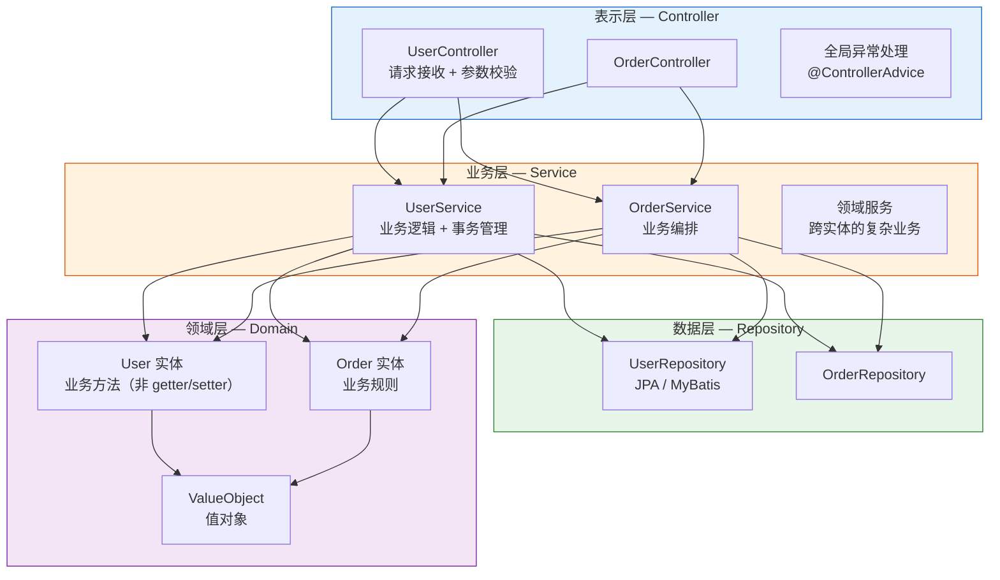
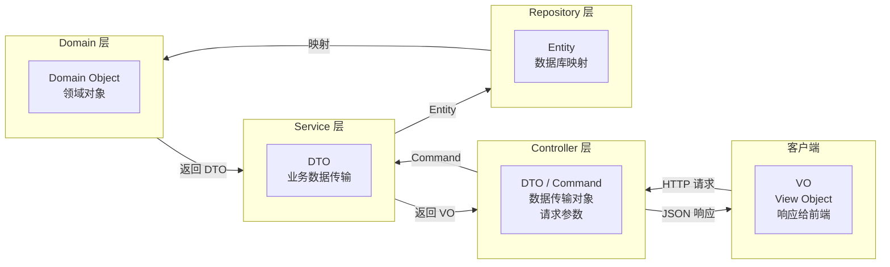
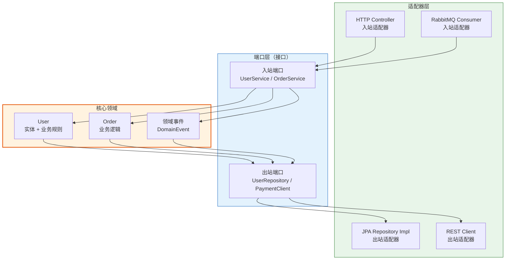
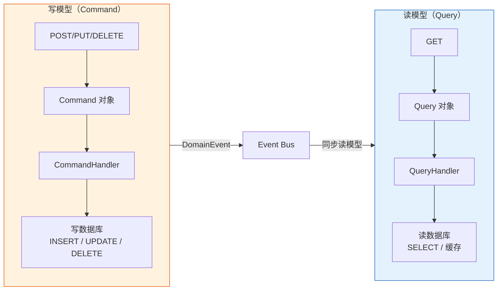

# Spring Boot 应用架构设计

> 本文为系列第 13 篇，覆盖：标准分层架构（Controller/Service/Repository）、包结构设计、DTO/VO/Entity 分离、依赖原则、设计模式实战（策略/模板方法/工厂）、六边形架构、CQRS 模式、ArchUnit 架构测试、常见反模式。

---

## 1. 标准四层架构

### 1.1 架构总览



### 1.2 依赖原则

```
Controller → Service → Repository
                      ↓
                    Domain（零依赖）
```

**核心原则：**
1. **上层依赖下层**：Controller 依赖 Service，Service 依赖 Repository
2. **领域层零依赖**：纯 POJO + 业务规则，不依赖 Spring / 数据库
3. **下层不感知上层**：Repository 不知道谁在调用它
4. **接口依赖**：Service 和 Repository 依赖接口，不依赖实现

### 1.3 分层职责

| 层 | 核心职责 | 不应做的事 |
|---|---------|-----------|
| **Controller** | 接收请求、参数校验、调用 Service、封装响应 | ❌ 不应包含业务逻辑 |
| **Service** | 业务逻辑编排、事务管理、调用 Repository | ❌ 不应包含 HTTP 相关代码 |
| **Repository** | 数据访问、查询封装 | ❌ 不应包含业务逻辑 |
| **Domain** | 实体行为、业务规则 | ❌ 不应依赖框架注解（@Entity 除外） |

---

## 2. 对象分类与转换

### 2.1 四种对象类型



| 对象类型 | 使用范围 | 说明 |
|---------|---------|------|
| **Entity** | 数据层 ↔ 领域层 | 与数据库表 1:1 映射，可包含业务方法 |
| **DTO（Data Transfer Object）** | 各层之间（Controller ↔ Service） | 减少数据传输量，解耦 |
| **VO（View Object）** | Controller → 客户端 | 自定义响应结构（不暴露内部字段） |
| **Command / Query** | 客户端 → Controller → Service | CQRS 模式：写请求用 Command，读用 Query |

### 2.2 完整分层示例

```java
// ===== Controller 层 =====
@RestController
@RequestMapping("/api/users")
public class UserController {

    @Autowired
    private UserService userService;

    @PostMapping
    public ApiResponse<UserResp> create(@Valid @RequestBody UserCreateReq req) {
        CreateUserCommand cmd = req.toCommand();
        UserDTO dto = userService.create(cmd);
        return ApiResponse.success(UserResp.from(dto));
    }

    @GetMapping("/{id}")
    public ApiResponse<UserResp> getById(@PathVariable Long id) {
        UserDTO dto = userService.findById(id);
        return ApiResponse.success(UserResp.from(dto));
    }
}

// ===== Service 层 =====
public interface UserService {
    UserDTO create(CreateUserCommand cmd);
    UserDTO findById(Long id);
}

@Service
@Transactional
public class UserServiceImpl implements UserService {

    @Autowired
    private UserRepository userRepository;

    @Override
    public UserDTO create(CreateUserCommand cmd) {
        if (userRepository.existsByUsername(cmd.getUsername())) {
            throw new BusinessException("Username already exists: " + cmd.getUsername());
        }

        User user = new User(cmd.getUsername(), passwordEncoder.encode(cmd.getPassword()), cmd.getEmail());
        user = userRepository.save(user);

        return UserDTO.builder()
            .id(user.getId())
            .username(user.getUsername())
            .email(user.getEmail())
            .active(user.isActive())
            .build();
    }
}

// ===== 领域层 =====
@Entity
@Table(name = "users")
public class User {

    @Id @GeneratedValue(strategy = GenerationType.IDENTITY)
    private Long id;

    @Column(unique = true, nullable = false)
    private String username;

    @Column(nullable = false)
    private String password;

    private String email;
    private boolean active = true;

    protected User() {} // JPA

    public User(String username, String password, String email) {
        this.username = username;
        this.password = password;
        this.email = email;
    }

    // ★ 业务方法
    public void deactivate() {
        if (!active) throw new IllegalStateException("Already deactivated");
        this.active = false;
    }

    public void updateEmail(String newEmail) {
        if (!newEmail.contains("@")) throw new IllegalArgumentException("Invalid email");
        this.email = newEmail;
    }

    // getters
}
```

### 2.3 MapStruct 编译时转换

```java
@Mapper(componentModel = "spring")
public interface UserConverter {
    UserConverter INSTANCE = Mappers.getMapper(UserConverter.class);

    @Mapping(target = "password", ignore = true)
    UserDTO toDTO(User user);

    @Mapping(target = "password", source = "password")
    User toEntity(CreateUserCommand cmd);

    List<UserDTO> toDTOList(List<User> users);
}
```

---

## 3. 设计模式实战

### 3.1 策略模式 — 回调分发

```java
// 处理不同类型的第三方回调
public interface CallbackStrategy {
    boolean supports(String type);
    void handle(CallbackRequest req);
}

@Component
public class PaymentSuccessCallback implements CallbackStrategy {
    @Override
    public boolean supports(String type) {
        return "payment.success".equals(type);
    }
    @Override
    public void handle(CallbackRequest req) {
        // 处理支付成功
    }
}

@Service
public class CallbackDispatcher {
    @Autowired
    private List<CallbackStrategy> strategies;  // ★ 注入所有实现

    public void dispatch(CallbackRequest req) {
        strategies.stream()
            .filter(s -> s.supports(req.getType()))
            .findFirst()
            .orElseThrow(() -> new UnsupportedCallbackException(req.getType()))
            .handle(req);
    }
}
```

### 3.2 模板方法模式 — 报表生成

```java
// 固定骨架，变化由子类/回调实现
@Component
public abstract class ReportGenerator {

    public Report generate(String type, LocalDate start, LocalDate end) {
        Report report = Report.create(type, start, end);

        // 1. 查询原始数据（子类实现）
        List<DataRow> rows = queryData(type, start, end);

        // 2. 聚合（子类实现）
        List<AggregateRow> aggregated = aggregate(rows);

        // 3. 填充
        report.setRows(aggregated);
        report.calculateTotal();

        return report;
    }

    protected abstract List<DataRow> queryData(String type, LocalDate start, LocalDate end);
    protected abstract List<AggregateRow> aggregate(List<DataRow> rows);
}
```

### 3.3 工厂模式 + 自动注册

```java
@Component
public class MessageHandlerRegistry {
    private final Map<Class<?>, MessageHandler<?>> registry = new HashMap<>();

    // ★ Spring 自动收集所有 MessageHandler，构造器自动注册
    @Autowired
    public MessageHandlerRegistry(List<MessageHandler<?>> handlers) {
        handlers.forEach(this::register);
    }

    @SuppressWarnings("unchecked")
    public <T> void dispatch(T message) {
        MessageHandler<T> handler = (MessageHandler<T>) registry.get(message.getClass());
        if (handler == null) {
            throw new IllegalArgumentException("No handler for: " + message.getClass());
        }
        handler.handle(message);
    }

    private <T> void register(MessageHandler<T> handler) {
        Class<?> msgType = resolveMessageType(handler);
        registry.put(msgType, handler);
    }
}
```

---

## 4. 六边形架构（端口适配器）



### 4.1 六边形架构 VS 分层架构

| 维度 | 分层架构 | 六边形架构 |
|------|---------|-----------|
| **依赖方向** | 上层 → 下层 | 外 → 内（端口接口向内） |
| **核心关注点** | 分层清晰 | 业务逻辑与框架解耦 |
| **入站适配器** | Controller | Controller、Message Listener、Schedule |
| **出站适配器** | Repository | JPA、REST、MQ Publisher 等 |
| **业务核心** | Service + Domain | 纯 UseCase + Domain Object |
| **适合场景** | CRUD 为主的业务 | 复杂业务逻辑、多协议接入 |

---

## 5. CQRS 模式



```java
// Command — 写操作
public record CreateUserCommand(String username, String password, String email)
        implements Command<UserDTO> {}

public class CreateUserHandler implements CommandHandler<CreateUserCommand, UserDTO> {
    // 写操作
}

// Query — 读操作
public record FindUserQuery(Long id) implements Query<UserDTO> {}

public class FindUserHandler implements QueryHandler<FindUserQuery, UserDTO> {
    // 读操作（可走缓存 / 专用读模型）
}
```

---

## 6. ArchUnit 架构测试

```xml
<dependency>
    <groupId>com.tngtech.archunit</groupId>
    <artifactId>archunit-junit5</artifactId>
    <scope>test</scope>
</dependency>
```

```java
@AnalyzeClasses(packages = "com.example")
class ArchitectureTest {

    // 1. Controller 只能依赖 Service
    @Test
    void controllerShouldOnlyDependOnService() {
        classes()
            .that().resideInAnyPackage("..controller..")
            .should().onlyDependOnClassesThat()
            .resideInAnyPackage("..service..", "..request..", "..response..",
                "java..", "org.springframework..")
            .check(importedClasses());
    }

    // 2. Service 不能依赖 Controller
    @Test
    void serviceShouldNotDependOnController() {
        noClasses()
            .that().resideInAnyPackage("..service..")
            .should().dependOnClassesThat()
            .resideInAnyPackage("..controller..")
            .check(importedClasses());
    }

    // 3. Domain 层不能依赖 Spring
    @Test
    void domainShouldNotDependOnSpring() {
        noClasses()
            .that().resideInAnyPackage("..domain..")
            .should().dependOnClassesThat()
            .resideInAnyPackage("org.springframework..")
            .check(importedClasses());
    }

    // 4. 循环依赖检测
    @Test
    void noCyclicDependencies() {
        slices()
            .matching("..(*)..")
            .should().beFreeOfCycles()
            .check(importedClasses());
    }
}
```

---

## 7. 常见反模式

| 反模式 | 问题 | 解决方案 |
|-------|------|---------|
| ❌ **上帝 Service** | 一个类数千行，处理多个业务 | 按业务域拆分 |
| ❌ **DTO 混用** | 用 Entity 直接作为 Response | VO / DTO 隔离 |
| ❌ **循环依赖** | ServiceA ↔ ServiceB | 事件驱动 / 中间层 |
| ❌ **贫血领域模型** | Entity 全是 getter/setter | 业务方法移入 Entity |
| ❌ **包结构混乱** | 不分层所有类混在一起 | 按功能分包 |
| ❌ **事务穿透** | 在 Controller 加 @Transactional | Service 层管理事务 |

---

## 总结

| 知识点 | 要点 |
|--------|------|
| **四层架构** | Controller → Service → Repository + Domain（纯业务） |
| **对象分离** | Entity / DTO / VO / Command 各司其职，MapStruct 编译时转换 |
| **策略模式** | List<Strategy> 自动注入，supports() 分发 |
| **六边形架构** | 领域核心零框架依赖，端口 + 适配器隔离 |
| **CQRS** | 写用 Command，读用 Query，可走缓存/专用读模型 |
| **ArchUnit** | 自动化架构完整性测试 |
| **反模式** | 上帝 Service、贫血模型、循环依赖 |
