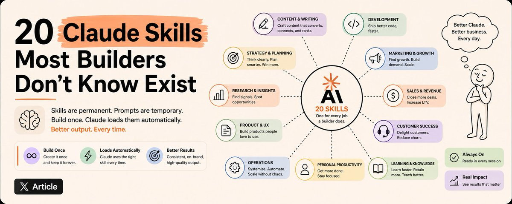

# 20 个 Claude Skill 模板：覆盖内容、研究、商业、代码、策略全品类

> **来源：** [20 Claude Skills Most Builders Don't Know Exist](https://x.com/sairahul1/status/2056665329305256232) — Rahul (@sairahul1)

**提示是一次性的。** 你写好，Claude 用完，会话结束。下次打开 Claude，它没了。你又写一次，这次稍微不同，稍微更差。每次会话的前五分钟都在重建上周已经搭好的上下文。

**Skill 是永久的。** 你构建一次，Claude 自动加载。每次会话开始，Claude 已经知道如何完成你需要的那件事——用你的语气、你的标准、你的规则。

大多数 Claude 用户从没构建过一个 Skill。

---

## Skill 到底是什么

Skill 是一个 `.md` 文件，为特定任务给 Claude 一份**永久岗位描述**。

不是提示词。是岗位描述。区别在于：提示词告诉 Claude 一次该做什么。Skill 告诉 Claude 每次特定任务出现时**该成为谁**。

你把它在 Claude 中保存一次。之后当任务匹配时，Claude 自动加载它。你不再重建上下文，不再得到泛泛的输出，不再从零开始。

## 如何安装本文的 Skill

| 平台 | 安装方式 |
|------|---------|
| **Claude.ai** | Settings → Sub-Agents → Add → 粘贴 Skill 块 → 命名 → 保存 |
| **Claude Code** | 在项目根目录创建 `.claude/agents/`，每个 Skill 保存为 `skillname.md`，Claude 自动发现 |
| **Claude Desktop** | Settings → Sub-Agents → Add，与 Claude.ai 相同 |

构建一次，永续运行。

---

## 第一类：内容与写作

### 01. Hook Forge（钩子锻造炉）

**功能：** 输入任何主题、角度或草稿开头，生成 10 个基于不同心理触发机制（好奇心、损失、对比、具体性、争议性）的钩子。你选一个能打的。

**什么时候用：** 你有想法但没有开头句。在写任何正文之前先运行这个。

### 02. Voice Locker（语音锁定器）

**功能：** 分析你的写作样本，将你的风格永久锁定到 Claude 中。之后 Claude 写的每一篇都像你——不是打磨过的 AI 助手，不是企业博客，而是你。

**什么时候用：** 第一次设置新 Claude Project 时。在任何其他事之前先运行这个。之后产生的所有内容都会更好。

### 03. Thread Architect（推文建筑师）

**功能：** 输入任何想法、文章或论点，构建成一条具有结构精度的 Twitter/X 线程——钩子、张力、收尾、CTA。不是想法的摘要，而是一个被构建来读到结尾的线程。

**什么时候用：** 你有一篇内容想要一个能打的线程版本——不只是文章要点的列表。

### 04. Repurpose Engine（复用引擎）

**功能：** 输入一篇长篇内容，一次性生成所有短格式版本——线程、LinkedIn 帖子、Newsletter 段落、三个独立钩子、一条引言配图文案。一个输入，六个输出。无需手动重新排版。

**什么时候用：** 完成任何长篇内容后需要分发，不想花三小时重新格式化。

### 05. Headline Lab（标题实验室）

**功能：** 输入任何文章或内容想法，生成 15 个覆盖不同已验证格式的标题——如何做、数字列表、问题、对比、秘密、警告。评分排名。你从前三名中选择并自信发布。

**什么时候用：** 完成了一篇文章，正在猜测标题。标题不是装饰。它们是 200 个读者和 20000 个读者之间的区别。

---

## 第二类：研究与分析

### 06. Brief Builder（简报构建器）

**功能：** 输入任何主题，构建一份初级分析师都能执行的调研简报：需要检查的信源、需要回答的问题、需要寻找的信号、以及那个会改变一切的关键发现。把模糊的调研请求转成结构化调查。

**什么时候用：** 你正准备调研某事，有主题但没结构。先建简报，再做研究。永远如此。

### 07. Contradiction Finder（矛盾发现器）

**功能：** 输入任何信息体、信源集或论点，找出信源之间相互矛盾的地方。揭示共识之下的真实复杂性。大多数研究会**抹平**矛盾。这个 Skill 专门找它们。

**什么时候用：** 你正从调研中构建论点，想在别人发现之前知道你哪些信源最薄弱。

### 08. Signal Scanner（信号扫描器）

**功能：** 输入一周的行业新闻、帖子或内容，将信号从噪音中分离出来。什么真正重要 vs 什么只是得到了关注。正在形成的模式 vs 一次性事件。你希望每**周一早上有人发给你的那份简报**。

**什么时候用：** 你积压了一堆行业内容，需要在周一开始前知道什么真的重要。

### 09. Assumption Auditor（假设审计员）

**功能：** 输入任何计划、论点或决策，揭示其中隐含的每一个假设——包括那些太明显以至于没人想到要质疑的。**你不知道自己在做的假设是搞垮项目的元凶。**

**什么时候用：** 你即将发布某个东西、推介某个东西、或为某个东西投入资源。**前一天运行这个。不是之后。**

### 10. Source Ranker（信源排名器）

**功能：** 输入关于任何主题的信源列表，按可信度、时效性和相关性排名。标记哪些该信、哪些该验证、哪些完全可以砍掉。阻止你建立在薄弱基础上的论点。

**什么时候用：** 你已收集好信源，即将开始写作。先排名。建立在最合适的三个上。砍掉其余的。

---

## 第三类：商业与运营

### 11. SOP Writer（SOP 写作器）

**功能：** 输入任何你描述的过程——不管是粗略笔记、要点还是语音备忘录转录——把它转成一份干净可执行的 SOP。包含负责人、工具、步骤，以及那个**必须永不自动化**的关键步骤。

**什么时候用：** 一个过程存在于你的脑海里或者混乱的笔记中，需要变成别人也能执行的东西。

### 12. Decision Framer（决策框架器）

**功能：** 输入任何你卡住的决策，重构为一个带有明确标准、真实选项和你实际需要的信息的结构化选择。阻止你在值得框架化的事情上凭感觉做决策。

**什么时候用：** 你思考一个决策超过一周还没决定。这说明你没有框架。先运行这个。

### 13. Meeting Extractor（会议提取器）

**功能：** 输入任何会议转录或粗略笔记，只返回四件重要的事：决定了什么、谁负责什么、什么被卡住了、以及没人说出口但会影响全局的那件事。

**什么时候用：** 每次会议结束。无例外。

### 14. Pricing Stress Tester（定价压力测试器）

**功能：** 输入你的定价模型，从三个方向进行压力测试——觉得太贵的客户、觉得便宜没好货的客户、以及即将降价打你的竞品。返回你的定价实际在传递什么信息，以及该改什么。

**什么时候用：** 你即将发布新定价，或者你一直在丢单但不确定为什么。

### 15. Offer Sharpener（方案打磨器）

**功能：** 输入任何方案——产品、服务或提案——打磨到价值无法被误解。找到你认为自己在卖的东西和买家认为自己在买的东西之间的差异。

**什么时候用：** 你在描述你的产品或服务时，对方一直在说"有意思"然后没买。这是个差距问题。这个 Skill 能找到它。

---

## 第四类：编码与开发

### 16. Code Explainer（代码解释器）

**功能：** 输入任何代码——不限语言或复杂度——用通俗语言在两层解释：对需要使用它的人说它做什么，对需要修改它的人说为什么这么设计。

**什么时候用：** 接手不是你写的代码、入职新开发者、或准备修改六个月没碰过的东西时。

### 17. PR Reviewer（PR 审查器）

**功能：** 审查任何 Pull Request 的 diff，返回五件重要的事：bug、缺失的测试、安全问题、风格违规、以及**值得在合并前认真讨论的那一个架构决策**。

**什么时候用：** 任何 PR 准备好审查时。先运行这个。它在 90 秒内捕获 80% 的问题。

### 18. Debug Partner（调试伙伴）

**功能：** 输入任何错误、堆栈跟踪或意外行为，系统化地逐步进行诊断。先找根因。临时修复被标记并拒绝。包含回归测试。

**什么时候用：** 你盯着一个 bug 超过 20 分钟。别猜了。运行这个。

---

## 第五类：策略与思考

### 19. Second Order Thinker（二阶思考者）

**功能：** 输入任何决策、行动或趋势，映射第二和第三阶后果——**效应产生的效应**。大多数人只思考一步。这个 Skill 强制三步。

**什么时候用：** 你即将做一个影响超过未来 30 天的决策。或者你在分析一个别人都只当一阶故事来对待的趋势。

### 20. Mental Model Applier（心智模型应用器）

**功能：** 输入任何问题或决策，应用三个最相关的心智模型。不是心智模型的列表。而是针对这个具体情境**正确的那几个**，应用以产生具体的洞察。

**什么时候用：** 你从一个角度思考一个问题太久。当你需要视角转换而不是更多信息时运行这个。

---

## 不舒服的真相

你一直在构建**会过期**的提示。

每次会话从零开始。每次泛泛的输出都是因为 Claude 不知道你是谁、你怎么思考、你持什么标准。你一直在手动填补这个差距——用几行在聊天结束时消失的上下文。

**Skill 永久修复它。**

20 个 Skill。一个下午的设置。之后每次会话都从 Claude 已经知道如何与你合作开始——你的标准、你的声音、你的规则已加载。

产出十倍的人并不更聪明。他们一次性构建了 Skill 并停止了每次会话重建。

打开文件夹。粘贴文件。停止从零开始。

---

### 速查表

| 类别 | 编号 | Skill | 一句话 |
|------|------|-------|--------|
| **内容与写作** | 01 | Hook Forge | 下笔前生成 10 个心理钩子 |
| | 02 | Voice Locker | 永久锁定你的写作风格 |
| | 03 | Thread Architect | 构建高留存率线程 |
| | 04 | Repurpose Engine | 一输入六输出多平台分发 |
| | 05 | Headline Lab | 15 个标题评分排名 |
| **研究与分析** | 06 | Brief Builder | 把模糊调研转成结构化方案 |
| | 07 | Contradiction Finder | 发现信源矛盾 |
| | 08 | Signal Scanner | 从噪音中分离信号 |
| | 09 | Assumption Auditor | 找到隐形假设 |
| | 10 | Source Ranker | 按可信度排名信源 |
| **商业与运营** | 11 | SOP Writer | 粗略笔记 → 可执行流程 |
| | 12 | Decision Framer | 卡住决策 → 结构化选择 |
| | 13 | Meeting Extractor | 只输出决定/负责人/阻塞/潜台词 |
| | 14 | Pricing Stress Tester | 三维定价压力测试 |
| | 15 | Offer Sharpener | 找到你卖的 vs 买家听的差距 |
| **编码与开发** | 16 | Code Explainer | 双层代码解释 |
| | 17 | PR Reviewer | 90 秒捕获 80% PR 问题 |
| | 18 | Debug Partner | 系统化根因诊断 |
| **策略与思考** | 19 | Second Order Thinker | 映射第二三阶后果 |
| | 20 | Mental Model Applier | 针对情境选对心智模型 |

---

*整理于 2026-05-20，来源：https://x.com/sairahul1/status/2056665329305256232*
