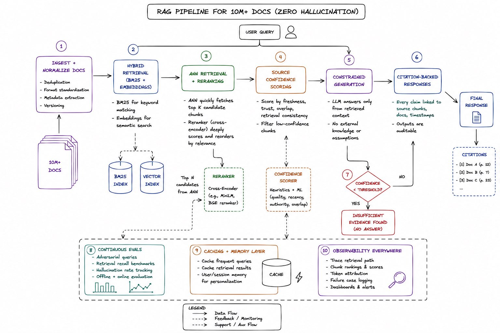

# Google L5 面试题：为 1000 万文档设计零幻觉 RAG 管道

> **原文**：[@adxtyahq 的推文](https://x.com/adxtyahq/status/2057410759236386866)  
> **数据**：2K ❤️ · 234 🔁 · 3.6K 🔖 · 146K 阅读  
> **保存日期**：2026-05-22

> *"Design a RAG pipeline for 10M docs with zero hallucination"*
>
> 据说这是 Google L5 面试轮里的一道题。比大多数经典分布式系统设计题要有趣得多。

---

## 核心观点

> **在 1000 万文档级别，检索质量比前沿模型本身更重要。**

## 管道 10 步架构

### 1. 摄入 + 规范化（Ingest + Normalize）

- 去重
- 统一格式
- 提取元数据
- 维护版本历史

### 2. 混合检索（Hybrid Retrieval：BM25 + Embeddings）

- **BM25**：处理精确关键词匹配
- **Embeddings**：捕获语义含义
- 纯语义搜索在大规模下通常精度不足，混合检索弥补各自短板

### 3. ANN 检索 + Reranking

- **ANN（近似最近邻）**：从数百万文档中快速拉出 top 候选 chunks
- **Reranker**：深度比较 query 与检索到的 chunks，提升最终相关性排序

### 4. 来源可信度评分（Source Confidence Scoring）

每个检索到的 chunk 基于以下维度打分：
- **时效性**（Freshness）
- **信任级别**（Trust Level）
- **重叠度**（Overlap with query）
- **检索一致性**（Retrieval Consistency）

> 低置信度的上下文不应该对生成产生重大影响。

### 5. 受约束生成（Constrained Generation）

模型**只允许使用检索到的上下文来回答**——禁止在检索上下文之外编造任何内容。

### 6. 引用溯源响应（Citation-Backed Responses）

每个主要声明都链接回：
- 确切的源 chunk
- 原始文档
- 时间戳

### 7. 幻觉回退层（Hallucination Fallback Layer）

如果检索置信度降至阈值以下：
> "Insufficient evidence found"（未找到足够证据）

——直接拒绝回答而非编造。

### 8. 持续评估（Continuous Evals）

持续运行：
- **对抗性 query**（Adversarial Queries）
- **检索召回率基准**（Retrieval Recall Benchmarks）
- **幻觉测试**（Hallucination Tests）

### 9. 缓存 + 记忆层（Caching + Memory Layer）

- 缓存高频企业 query 和检索路径
- 降低延迟，提高输出质量

### 10. 全链路可观测（Observability Everywhere）

追踪以下环节：
- 检索路径
- Chunk 排名
- Token 归因
- 失败点

---

## 关联阅读

- [LLMs 101 实践指南（2026）](../agent-engineering/llms101-practical-guide-2026-ahmad.md) — 本文的 RAG 设计落地所需的底层 LLM 知识（KV Cache、量化、推理引擎）
- [The Software Factory Trap](../agent-engineering/software-factory-trap-dhasandev.md) — RAG 管道的"证明也需要证明"——引用溯源和置信度评分系统
- [Agent Harness 从理论到实践](../agent-engineering/harness-from-theory-to-practice.md) — 将 RAG 管道作为 Harness 的"验证循环"集成为 Agent 基础设施
