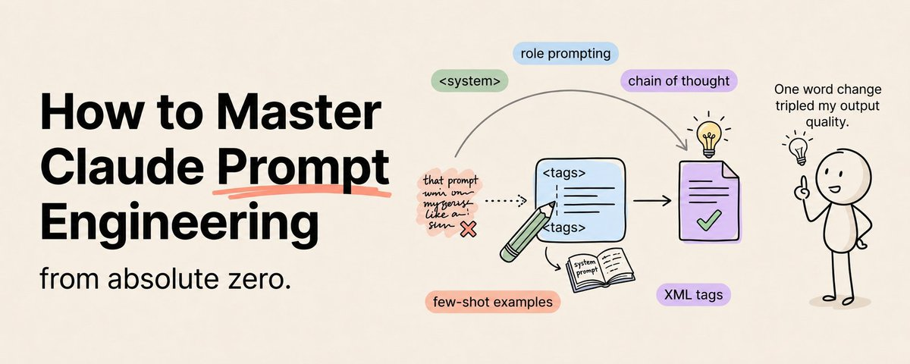

# Anthropic 官方提示词工作坊：Prompting 101

## 背景

2026 年 4 月底，Anthropic 团队在 **Code w/ Claude** 大会上发布了一场免费的提示词工作坊 **"Prompting 101"**，由应用 AI 团队的 **Hannah Moran** 和 **Christian Ryan** 主讲，全长 24 分钟，涵盖 **40 个具体技巧**。

Anthropic 的核心论点：绝大多数用户只用到了 Claude **30% 的能力**，剩下 70% 卡在提示词上。这次工作坊首次将内部"黄金法则、九段结构、思维链顺序"全部公开。

> 🌐 GitHub 互动教程：<https://github.com/anthropics/prompt-eng-interactive-tutorial>
> 📖 官方文档：<https://platform.claude.com/docs/en/build-with-claude/prompt-engineering/overview>
> 📺 视频回放：<https://www.youtube.com/watch?v=hnKsaWqUk7A>

---



---

## 入门篇：五部分框架（Five-Part Framework）

> 来源：Khairallah AL-Awady

在深入 Anthropic 的 40 个技巧之前，先建立一个最简可用的思维框架。**每个专家级 prompt 都包含五个部分，少任何一个都会拉低输出质量。**

| 部分 | 说明 | 好例子 | 差例子 |
|------|------|--------|--------|
| **1. Role（角色）** | Claude 以什么身份行动 | "你是 10 年 B2B SaaS 经验的产品营销经理" | 不设角色 → 默认"通用助手"语气 |
| **2. Context（上下文）** | Claude 需要知道什么 | 你的行业、受众、项目、目标 | "写一篇关于 AI 趋势的博客" |
| **3. Task（任务）** | 你到底要什么——精确的 | "找出合同中的三大风险因素，分别解释为什么重要，并提出修改建议" | "分析这份合同" |
| **4. Format（格式）** | 输出长什么样 | 表格/列表/邮件/带章节的报告 | 不指定 → Claude 随机选一个 |
| **5. Constraints（约束）** | 什么不能做 | "不超过 500 字，别用术语，不要免责声明" | 无约束 → 输出充满 AI 废话 |

> **一条 prompt 出问题时，99% 是因为这五个部分中至少有一个没填。**

**把这个框架背下来。每次写 prompt 都用它检查一遍。立竿见影。**

---

## 一、黄金法则（最重要的原则）

> **把你的 prompt 拿给一个不熟悉这个任务的同事看，如果他读完能产出你想要的结果，那这个 prompt 就合格了；如果他需要再问你两句，那 Claude 也会困惑。**

这条法则把"写 prompt"翻译成了"写规格说明书"——你不是在跟一个无所不知的精灵许愿，而是在给一个聪明但失忆的远程同事写交接文档。

---

## 二、九段式 Prompt 骨架（Anthropic 核心模板）

这是工作坊反复演示的核心结构——任何复杂任务按这个顺序写下来，效果提升 30% 以上。**顺序是关键**：背景在前、规则居中、立即请求紧挨思考标签、格式约束放最后。

```
<role>
你是某领域资深专家
</role>

<task_context>
背景与目标在此交代清楚
</task_context>

<tone_context>
语气与受众说明
</tone_context>

<background_data>
<document>原文资料</document>
</background_data>

<detailed_task_description_and_rules>
分步骤、列规则、说明边界条件
</detailed_task_description_and_rules>

<examples>
<example>
<input>...</input>
<output>...</output>
</example>
</examples>

<conversation_history>
历史对话粘在这里
</conversation_history>

<immediate_request>
本轮的具体请求
</immediate_request>

<thinking_steps>
请先在 <thinking> 标签内思考，再在 <answer> 标签内输出
</thinking_steps>

<output_formatting>
输出格式硬约束，例如 JSON Schema 或格式要求
</output_formatting>

<prefilled_response>
预填首字段开头，例如 {"summary":
</prefilled_response>
```

**关键要点**：
- 九段顺序不可乱（颠倒顺序模型会困惑）
- XML 标签包住每一段（帮助 Claude 区分指令与内容）
- `examples` 紧跟规则（模型更容易关联）
- `thinking` 标签先于 `answer`（隔离思考过程，可后处理擦除）
- `prefilled_response` 锁定输出格式（避免模型以"好的我来帮你"开头）

---

## 三、40 个技巧分类详解

### 类别 A：清晰指令类（约 12 招）

1. **用动词开头** — 每条指令以明确的动作动词起始（如"分析""生成""分类""总结"）
2. **列编号步骤** — 多步骤任务用编号或项目符号列出，明确顺序
3. **明确边界条件** — 说明什么该做什么不该做
4. **避免否定句** — 模型对否定句敏感度低："不要使用 markdown"→ "请用纯文本输出，不带任何 # 或 *"
5. **把"不要做 X"改成"请做 Y"** — 肯定指令比否定指令可靠得多
6. **允许说"我不知道"** — 要求模型在不确定时明确说"我不知道"，减少幻觉
7. **指定输出长度** — 明确说明期望的长度或简洁程度
8. **指定受众/视角** — 说明为谁写作（如"写给非技术背景的 CEO"）
9. **使用具体数字** — 而非模糊描述（如"列出 5 个要点"而非"列出几个要点"）
10. **明确任务目标** — 在 prompt 开头说明最终用途和读者
11. **提供任务动机** — 解释为什么这样做很重要，帮助 Claude 理解优先级
12. **渐进式复杂度** — 先问简单问题建立上下文，再问复杂问题

### 类别 B：结构化类（约 8 招）

13. **XML 标签** — 用 `<role>` `<task>` `<context>` `<input>` 等标签区分各部分。即使模型未专门训练过 XML，Anthropic 的测试显示标签标记能显著提升理解
14. **Markdown 标题** — 用 `##` 标题层级组织 prompt
15. **JSON Schema 约束输出** — 明确给出输出 JSON 的结构、字段名、类型
16. **`<document>` 标签嵌 `<source>` 子标签** — 多资料标注来源，引用时自动带出处
17. **长文档放最前** — 资料放在 prompt 开头、问题放在结尾，准确率高 20%（Transformer 架构的特性）
18. **多文档加 metadata** — 用 `<documents><document index="1"><source>file.pdf</source><document_content>...</document_content></document></documents>` 结构
19. **Prefill 锁开头** — 用 `prefilled_response` 强制输出以特定字符/格式开头
20. **Stop sequence 锁结尾** — 用 stop sequence 确保输出在正确位置截断

### 类别 C：认知激发类（约 10 招）

21. **Role Prompting** — 分配具体角色。"你是一个 AI 助手"等于没说。最小可用 role：**"你是一名拥有 10 年经验的医保理赔审核员，熟悉 ICD-10 编码与 HIPAA 合规"**
22. **Chain of Thought（思维链）** — 显式触发 CoT：用 `<thinking>` 标签要求模型展示推理过程，而非用 "let's think step by step"（此咒语对 Claude 效果有限）
23. **Step-by-step** — 要求模型按步骤逐步分析
24. **Self-critique（自我批判）** — 要求模型提出答案后自我审核一遍，找漏洞和改进空间
25. **Reflection（反思）** — 在给出最终答案前先进行反思
26. **Planning 与 Execution 分离** — 先让模型制定计划，再逐步执行每个步骤
27. **"先调研再回答"** — 给模型先搜索/阅读资料再作答的权限
28. **Few-shot 示例（3-5 个最佳）** — 用 `<example>` 标签包装，覆盖典型边界。1 个不够（过拟合），10 个太多（反复抄袭），3-5 是甜区
29. **零样本仅用于简单任务** — 复杂任务必须配示例
30. **思考隔离** — 将思考过程放在 `<thinking>` 内，便于保序+后处理擦除（不泄漏给最终用户）

### 类别 D：工程化类（约 10 招）

31. **Prompt Template + Variables 分离** — 骨架不动，业务变量塞进 `{{user_input}}`、`{{document}}` 插槽
32. **Prompt Chaining** — 把"调研→分析→总结→格式化"拆成多段，每段 prompt 短小易调试。超过 12K tokens 的 prompt注意力会稀释，建议拆分
33. **错误兜底分支** — 为模型可能出错的情况预备处理方案
34. **Temperature 调整** — 结构化任务用较低的 temperature（0-0.3），创意任务用较高的 temperature（0.7-1.0）
35. **Evals 配套** — 每条核心 prompt 配 20-50 个输入+期望输出，每次改 prompt 都跑一遍回归测试
36. **Prompt 走版本管理** — prompt 和代码一起走 git、走 review
37. **A/B 测试** — 同一份输入跑两版 prompt，记录人工打分或自动 evals 分数，确认提升再切流量
38. **记录失败 case** — 保留所有改 prompt 过程中翻车的 case 和原因
39. **定期回炉重训** — 定期 review prompt 效果，随模型升级和需求变化调整
40. **使用 Claude Console 工具** — Prompt Generator 和 Prompt Improver 不是小白玩具，而是给有经验工程师的脚手架，省 30% 调试时间

---

## 四、效果示例：同一任务三个版本对比

以"分析用户反馈，分类成 Bug / Feature Request / Praise / Other，输出 JSON"为例：

| 版本 | 做法 | 分类准确率 | JSON 可解析 |
|------|------|-----------|------------|
| A：裸提问 | 只丢一句"帮我分类下面的反馈"+ 原文 | 52% | ❌ 中英散文混排 |
| B：基础改进 | + role + few-shot 2 个示例 | ~70% | ✅ 但类别比例失衡 |
| C：九段骨架 | + role 精确 + task_context + 规则（"Other 仅当前三类不适用时使用"）+ 4 examples + prefill JSON 开头 + stop 序列锁尾 | **91%** | ✅ 100% 可解析 |

> **Anthropic 原话**："同一个模型，prompt 写好和写坏的差距，比换模型还大。"

---

## 五、长上下文与多文档场景（200K 窗口）

工作坊后半段专门讲解了长上下文的最佳实践，这是大多数人忽略的金矿：

### 变体 1：长文档放最前
把资料放在 prompt **开头**、问题放在 **结尾**，准确率比反过来高 20%。这跟人类直觉相反，但对 Transformer 架构是定律。

### 变体 2：多文档统一标签
```xml
<documents>
  <document index="1">
    <source>file_a.pdf</source>
    <document_content>...</document_content>
  </document>
  <document index="2">
    <source>file_b.txt</source>
    <document_content>...</document_content>
  </document>
</documents>
```

### 变体 3：强制引用原文
在 `immediate_request` 里加：**"回答前请先在 `<quotes>` 标签内引用至少 3 段相关原文，再在 `<answer>` 内作答"** → 长文档幻觉率直接掉一半。

### 变体 4：Grounded Summary
要求 Claude 总结时必须标注每句话来自哪份文档第几段。

### 变体 5：Prompt Caching
超过 100K tokens 时启用 prompt caching，把固定文档段做缓存键，下一次问同份文档延迟和成本各降 80%。

---

## 六、Anthropic 的踩坑名单（失败案例）

### 坑 1："let's think step by step" 别再用了
这条 OpenAI 时代的咒语在 Claude 身上效果有限。正确做法是显式给出 **`<thinking>`** 标签，让模型把思考过程隔离出来。

### 坑 2：示例太少或太多
- 1 个不够 → 模型会过拟合那一个例子
- 10 个太多 → 模型会反复抄袭例子，新输入没被理解
- **3-5 个、覆盖典型边界** → 甜区

### 坑 3：把规则写成"不要 X"
模型对否定句敏感度低。"不要使用 markdown"→ "请用纯文本输出，不带任何 # 或 *"

### 坑 4：Role 太宽泛
"你是一个 AI 助手"等于没说。最小可用 role 要具体到岗位、年限、领域、甚至法规标准。

### 坑 5：Prompt 越长越好是迷思
超过 **12K tokens** 的 prompt注意力会稀释。建议拆成 **prompt chain**。

### 坑 6：忘记 Prefill
明明要 JSON，结果模型回答"好的我来帮你"开头。把 `prefilled_response` 设成 `{` 就解决了。

### 坑 7：忽略上下文窗口限制
当输入接近 Claude 的上下文窗口极限时，中间部分的内容最容易被"遗忘"。关键信息尽量放开头或结尾。

### 坑 8：示例风格不匹配
示例的输出风格和实际需要的风格不一致，模型会模仿示例中的细微模式。

---

## 七、进阶：把 Prompt 当代码运维

工作坊最后强调：**prompt 不是文案，是代码资产。**

### 1. Prompt Template + Variables 分离
骨架不动，变量塞进插槽，方便批量替换和版本对齐。

### 2. 每条核心 Prompt 配一组 Evals
20-50 个手工挑的输入 + 期望输出。每次改 prompt 都跑一遍，效果不退化才合并主分支。

### 3. Prompt Chaining 替代巨型 Prompt
把"调研→分析→总结→格式化"拆成四段，每段 prompt 短小易调试，错误好定位。

### 4. A/B 测试
同一份输入跑 v1 和 v2，记录人工打分或自动 evals 分，确认提升再切流量。

### 5. 用 Claude Console 的工具起手
**Prompt Generator** 和 **Prompt Improver** 能把你的草稿翻译成符合 Anthropic 内部范式的版本，省 30% 调试时间。

---

## 八、9 章节互动教程大纲

配套的 [prompt-eng-interactive-tutorial](https://github.com/anthropics/prompt-eng-interactive-tutorial) 提供 Jupyter Notebook 交互式学习：

| 章 | 内容 | 说明 |
|----|------|------|
| 1 | Basic Prompt Structure | 基础结构入门 |
| 2 | Being Clear and Direct | 清晰直接指令 |
| 3 | Assigning Roles | 角色分配 |
| 4 | Separating Data from Instructions | 数据与指令分离 |
| 5 | Formatting Output & Speaking for Claude | 输出格式与 Prefill |
| 6 | Precognition (Thinking Step by Step) | 预认知与思维链 |
| 7 | Using Examples | 示例使用 (Few-shot) |
| 8 | Avoiding Hallucinations | 防幻觉 |
| 9 | Building Complex Prompts | 复杂 Prompt + 行业用例 |
| Appendix | Beyond Standard Prompting | 链式、工具调用、RAG |

---

## 五条万能 Prompt 模板

> 来源：Khairallah AL-Awady

以下五个 prompt 模板覆盖最常见的 AI 使用场景，复制后填入变量即可。

### 分析模板

```
You are a [domain] analyst with 15 years of experience.
Analyze [subject] and identify the 3 most significant [insights/risks/opportunities].
For each one, provide:
(1) a clear statement of what it is
(2) specific evidence supporting your claim
(3) why it matters for [audience]
(4) a recommended action
Use specific numbers wherever possible.
Do not hedge or add unnecessary caveats.
```

### 写作模板

```
You are a professional writer whose work has been published in [relevant publication].
Write a [format] about [topic] for [audience].
Open with a hook that [challenges an assumption / presents a surprising fact / tells a specific story].
Use short paragraphs.
Every sentence should either teach something, prove something, or move the reader forward.
Do not use filler phrases, corporate jargon, or passive voice.
Target [word count] words.
```

### 决策模板

```
I need to decide between [Option A] and [Option B].
Here is my situation: [context].
Analyze each option across these criteria: [criteria 1], [criteria 2], [criteria 3].
For each criterion, rate each option on a 1-10 scale and explain the score.
Then give me your overall recommendation with a confidence level (high/medium/low)
and identify the one piece of additional information that would most change your recommendation.
```

### 问题解决模板

```
I am experiencing [problem].
Here is what I have tried so far: [attempts].
Here is what I know about the root cause: [knowledge].
Diagnose the most likely cause.
Propose three possible solutions ranked by likelihood of success.
For each solution, estimate the effort required and the probability it will work.
Recommend the best path forward.
```

### 反馈模板

```
Review [my work] against these quality criteria: [criteria].
For each criterion, rate from 1-10 and explain specifically what works and what does not.
Identify the single highest-impact improvement I could make.
Rewrite the weakest section to show what "excellent" looks like.
Be direct — I prefer harsh truth over gentle encouragement.
```

## Prompt Engineering 的本质

> 作者：Khairallah AL-Awady

Prompt Engineering 不是记忆小技巧。**它是思维清晰度的表达。**

写出好 prompt 要求你：
- 确切知道自己想要什么
- 确切知道你的受众是谁
- 确切知道"好"长什么样
- 确切知道要避免什么

大多数人写不出好 prompt，不是打字慢，**是他们还没想清楚**。

> 这里的每个技术，本质上都是**披着格式外衣的思维技术**。XML 标签迫使你把指令分成清晰类别；负约束迫使你明确说出你不想要什么；例子迫使你定义"好"到底是什么样。

Prompt 只是产物。思维才是技能。

## 总结：立即行动清单

1. 🌟 把你最常用的那条 prompt 按**九段骨架**重写一次——加 XML 标签、加 examples、加 prefill
2. 📊 挑 **5 个真实输入**做迷你 evals，每改一版就跑一遍
3. 🔪 把 "let's think step by step" 从你的 prompt 库里全删了，换成 `<thinking>` 标签
4. 📝 Prompt + Git + Review + Evals 四条腿走路
5. 🎯 **黄金法则**常记：给同事看能看懂吗？

> *"AI 时代真正稀缺的不是模型，是会跟模型沟通的人。Anthropic 把沟通手册免费开源了。"*
