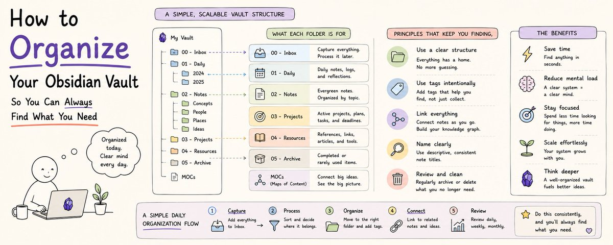

# 如何组织 Obsidian 笔记库：30 秒内找到任何笔记（完整教程）

> **来源：** [How to Organize Your Obsidian Vault So You Can Always Find What You Need（Full course）](https://x.com/cyrilxbt/status/2058373087330959829) — CyrilXBT
>
> **核心一句话：** 笔记库不是文件柜，是思维系统。**存储优化 ≠ 检索优化。** 以"我能怎么找到它"而不是"我该怎么放进去"来设计你的笔记架构。



---

## 一、为什么六个月后你的 Obsidian 会变成一团乱

> "Most Obsidian users have the same problem six months after they start."
> "They have hundreds of notes. They know the information they need is in there somewhere. They cannot find it quickly enough to be useful."

大多数 Obsidian 用户半年后都会遇到同一个问题：几百条笔记，明明知道东西就在某个地方，但就是找不快。

搜索产生太多结果。第一周设计的文件夹结构，在第六个月已经不再适用。标签贴得乱七八糟，比没有标签更糟糕。

> "This happens not because Obsidian is poorly designed."
> "It happens because most people organize their vault the way they organize a filing cabinet rather than the way they organize a thinking system."

**根本原因：** 你把笔记库当文件柜来组织。但文件柜是为存储优化的，思维系统是为**检索**优化的。这两个目标指向完全不同的组织架构。

---

## 二、检索优先原则（The Retrieval-First Principle）

> "You do not organize a vault to put things away neatly."
> "You organize a vault to get things back quickly."

**你在组织笔记库时做的每一个决策——建文件夹、打标签、定命名规则——都应该用这一个问题来检验：这样是让检索更快还是更慢？**

绝大多数组织系统在设计时考虑的是"捕获时刻"而非"检索时刻"。你建了一个叫"点子"的文件夹，因为写笔记的时候这看起来像个点子。但六个月后你在找一条商业创意笔记时，根本不记得它是在"点子"、"项目"、"商业"还是当天的日记里。

> "The folder name made sense at capture time. It tells you nothing at retrieval time."

**这套系统是从检索端设计的。** 每个结构决策都问：将来我需要这条信息时，我对它还能记得什么？就凭这些记忆线索，我怎样能找到它？

---

## 三、你永远记得的四个笔记属性

找一条笔记时，你总能记得以下四件事中的至少一件：

1. **📂 它是什么类型的内容**（项目、参考、日记、会议记录、读书笔记、想法）
2. **📅 你什么时候创建或使用过它**（本周？本月？某个具体事件关联？）
3. **🏷️ 它跟什么主题有关**（哪个领域、人物、项目、概念）
4. **📌 它当前的状态**（活跃中、已完成、已归档、进行中、待处理）

> "A well-organized vault makes it possible to filter by any one of these four dimensions or any combination of them in seconds."

一个组织良好的笔记库，应该让你能在几秒钟内按任意一个维度（或任意组合）进行筛选。

---

## 四、文件夹结构——最粗粒度的组织层

> "The mistake most people make is creating too many folders and making them too specific."

**⚠️ 黄金法则：5-8 个顶级文件夹。** 每个代表一个真正不同类型的内容，有不同的检索模式。

> "A folder called 'Python Programming Notes' seems useful when you create it. When you have fifteen such specific folders navigating between them becomes its own problem."

### 推荐结构

```
00 - INBOX/
01 - NOTES/
    daily/
    meetings/
    books/
    courses/
02 - PROJECTS/
    [active-project-name]/
03 - AREAS/
    health/
    finances/
    relationships/
    career/
    learning/
04 - RESOURCES/
    topics/
    people/
    places/
    tools/
05 - ARCHIVE/
06 - SYSTEM/
    templates/
    MOCs/
```

**各层说明：**

- **00 - INBOX** 📥 — 所有不确定归属的东西先放这。它就是一个处理队列，没有笔记在这里永久停留。
- **01 - NOTES** 📝 — 带时间戳的捕获。日记、会议记录、读书笔记、课程笔记都在这里。通过知道"大概什么时候发生"来找。
- **02 - PROJECTS** 🎯 — 一个活跃项目一个子文件夹。项目有明确产出和截止日期，完成后移到 ARCHIVE。
- **03 - AREAS** 🔄 — 没有截止日期的持续责任。健康、财务、人际关系、职业——这些永远不会"完成"。
- **04 - RESOURCES** 📚 — 参考材料，按主题组织。你的私人维基百科。需要某个主题知识时来这。
- **05 - ARCHIVE** 🗄️ — 已归档的内容。完成的项目、过时的参考、超过一年的日记。存档而非删除——存储不贵，误删重要东西才贵。
- **06 - SYSTEM** ⚙️ — 笔记库的基础设施。模板、MOC（内容地图）、配置文件。让笔记库运转的东西，而非笔记库里的内容。

---

## 五、让搜索可靠的命名规范

> "A consistent file naming convention means you can find any note by typing a partial match into the search bar and getting the right result immediately."

### 推荐格式

```
YYYY-MM-DD-[TYPE]-[TOPIC].md
```

### 示例

```
2026-05-20-daily-wednesday.md
2026-05-18-project-website-launch.md
2026-05-15-meeting-client-quarterly-review.md
2026-05-10-book-thinking-fast-and-slow.md
2026-04-28-resource-claude-prompting-techniques.md
2026-04-20-area-finances-q2-review.md
```

### 日期前缀的三大作用

1. **自动按时间排序** — 最新笔记总在最上面
2. **模糊定位** — 记不清具体名字时，靠大概时间来缩小范围
3. **防冲突** — 同一主题不同日期的笔记有不同的文件名

类型标识符让你在打开笔记前就知道里面是什么。配合主题标识，光凭文件名就能判断是不是你要找的。

---

## 六、让筛选秒级生效的属性系统

命名规范是**搜索层**，属性系统是**筛选层**。

每条笔记开头都有 YAML frontmatter，这是 Dataview 查询的基础。

### 通用属性

```yaml
---
type: [daily|meeting|project|area|resource|book|course|idea|task]
status: [active|complete|archived|reference|waiting]
date: 2026-05-20
tags: [topic1, topic2, topic3]
---
```

### 按笔记类型扩展

**项目笔记：**
```yaml
deadline: 2026-06-15
priority: high
next_action: Write the project brief
completion: 35
```

**读书笔记：**
```yaml
author: [Author Name]
finished: 2026-05-10
rating: 4
key_insight: [核心思想的一句话总结]
```

**会议记录：**
```yaml
attendees: [Name1, Name2]
decisions: [做出的关键决定]
actions: [待办事项及负责人]
```

**资源笔记：**
```yaml
topic: [主要主题]
source: [信息来源]
reliability: [high|medium|low]
```

**🔑 Status 是最重要的检索属性：**
- 找活跃项目 → 过滤 `type:project AND status:active`
- 找已读完的书 → 过滤 `type:book AND status:complete`
- 找某个主题的所有东西 → 过滤 tags 包含该主题

> "Four properties. Infinite filtering combinations."

---

## 七、真正有用的标签系统

> "Most Obsidian users either use no tags or use too many tags with no system."
> "Both produce the same result at retrieval time: tags that do not help you find anything."

### 三分类标签系统（每类有统一前缀）

**1️⃣ 主题标签（Topic Tags）** — 笔记关于什么。无前缀，纯主题名。
```
#productivity
#machine-learning
#real-estate
#stoicism
```

**2️⃣ 状态标签（Status Tags）** — 笔记在工作流中的位置。前缀 `status/` 以区分。
```
#status/active
#status/waiting
#status/someday
#status/complete
```

**3️⃣ 项目标签（Project Tags）** — 关联到具体项目。前缀 `project/`。
```
#project/website-launch
#project/book-writing
#project/client-acme
```

**三分类的意义：** 搜索时，看到前缀就知道自己在按哪个维度筛选。

- `#productivity` → 所有关于生产力的笔记（无论状态如何）
- `#status/active` → 所有活跃笔记（无论主题如何）
- `#project/website-launch` → 该项目的所有相关笔记

**🚫 防止标签膨胀的规则：只有当你会在至少五条笔记上使用它时，才创建新标签。** 只用在一两条上的标签不是可搜索的模式，是噪音。

---

## 八、内容地图（MOC）——导航层

当笔记库从几百条变成几千条，单纯的搜索和筛选在某些场景下就不够了。你不再是在找某条具体笔记，而是在一个已经积累了大量知识的主题中定位自己。

> "A Map of Content is a note whose primary purpose is to link to other notes rather than to contain original ideas. It is an index for a cluster of related notes."

### MOC 示例

```markdown
# Productivity MOC

## Core Framework Notes
[[The PARA Method Explained]]
[[Why Most Productivity Systems Fail]]
[[Energy Management vs Time Management]]

## Tool Notes
[[Obsidian Setup and Workflow]]
[[Claude Code for Productivity]]
[[N8N Automation Workflows]]

## Book Notes
[[Getting Things Done - Key Ideas]]
[[Deep Work - Key Ideas]]
[[Atomic Habits - Key Ideas]]

## Project Applications
[[Q2 2026 Productivity Audit]]
[[Content Production System Build]]

## Open Questions
What is the relationship between energy and deep work?
How does AI change the productivity calculus?
```

**MOC 不是文件夹。** 你不用把笔记移进去，你只是从 MOC 中链接到它们。

> "Create a Map of Content when a topic has accumulated more than twenty notes and navigation through backlinks alone becomes difficult."

**触发条件：** 当某个主题积累了超过 20 条笔记，纯靠反向链接导航变得困难时。

---

## 九、收件箱处理习惯

> "Every note that does not have an obvious home at capture time goes to INBOX."

新笔记如果捕获时没有明确归属，先进 INBOX。收件箱处理习惯把混乱转化为有组织的知识。

### 处理频率

每天或每周固定时间处理 INBOX。大多数人**每天下班前 15 分钟**就够。

### 处理时问三个问题

1. **这是什么类型的内容？** → 决定它属于哪个顶级文件夹
2. **它有现成的归属吗？** → 如果有相关联的项目或主题笔记，链过去或放相应的子文件夹
3. **它需要自己的笔记，还是应该追加到已有笔记中？** → 一条扩展已有笔记的想法，追加到那篇笔记里比新建文件更好

处理完：更新属性（type、status、tags）、更新文件名（匹配命名规范）、从 INBOX 移到正确文件夹。

**收件箱为空，笔记库井然有序。**

---

## 十、搜索策略

即使组织得再完美，总有时你不确定笔记在哪个文件夹或叫什么名字。

### Obsidian 的三种搜索模式

1. **全文搜索 🔍** — 输入笔记内容中的任意短语或关键词。这是最强的模式，适合你记得笔记里说过什么的时候。
2. **属性搜索 🏷️** — 直接在搜索栏中按属性筛选。`type:project status:active` 返回所有匹配的笔记。
3. **标签搜索 #️⃣** — 输入带井号的标签。`#productivity` 返回所有标记了该主题的笔记。

### 四种检索场景

| 你记得什么 | 搜索方式 |
|-----------|---------|
| 笔记说了什么 | 全文搜索，找一个独特短语 |
| 笔记类型 + 大概时间 | 组合类型筛选 + 日期范围 |
| 笔记属于哪个项目/主题 | 按项目标签或主题标签搜索 |
| 大概创建时间 | 在相关文件夹内按创建日期排序 |

> "Four search strategies. Almost every note findable in under thirty seconds."

---

## 十一、季度笔记库审查

> "Organization degrades over time without maintenance."

### 审查清单（30 分钟到 2 小时）

1. **📁 文件夹审计** — 每个文件夹是否仍代表你活跃使用的类别？有没有少于 5 条笔记的文件夹可以合并？
2. **🏷️ 标签审计** — 所有标签还相关吗？只出现在一两条笔记上的标签要不要删？有没有主题积累了足够多的笔记，值得创建一个 MOC？
3. **🗄️ 归档扫描** — 活跃文件夹里有应该归档的笔记吗？标记为 "complete" 的项目还躺在 02 - PROJECTS 里吗？参考资料过时了吗？
4. **📛 命名一致性** — 所有笔记都遵守命名规范吗？批量重命名修正不一致只需 5 分钟，但能大幅提升搜索可靠性。

> "The investment pays back every time you find a note instantly rather than spending ten minutes searching."

---

## 十二、Claude 集成：让检索变得智能

搭配 Claude Code + Filesystem MCP，你的笔记库可以用自然语言搜索。

**不需要再构造 Dataview 查询，只需用自然语言问：**

- "Find all notes about pricing strategy I created in the last six months."
- "What have I written about managing energy versus managing time?"
- "Show me every project note that is currently active and has a deadline before July."

Claude 会读取你的笔记库结构、属性和内容，返回相关笔记并解释为什么匹配。

> "The combination of a well-organized vault and Claude's natural language retrieval produces a system where you can find anything you have ever written in under thirty seconds."

> "The organizational system makes Claude's retrieval accurate. Claude's intelligence makes the organizational system's power accessible without requiring you to know the exact right query."

这是一个正反馈循环：好的组织让 AI 检索更准确，AI 的智能让组织系统的力量无需记住精确查询就能发挥。

---

## 十三、从你现在的位置开始

如果你的笔记库目前是乱的，**不要从头来过。** 渐进式重构。

### 渐进式路线图

| 时间 | 做什么 |
|------|--------|
| **第 1 周** | 创建 8 个文件夹。**先别移动任何东西。** 只建结构。 |
| **第 2 周** | 新笔记从创建时就开始正确归档。对所有新笔记应用命名规范。添加属性。 |
| **第 3 周** | 处理 INBOX 积压。把旧笔记重新归档到正确文件夹，修正命名和属性。 |
| **第 2 个月** | 开始给最重要的笔记追溯打标签。为你写得最多的主题创建第一个 MOC。 |
| **第 3 个月** | 执行首次季度笔记库审查。 |

> "The vault does not become perfectly organized on the day you implement the system."
> "It becomes progressively more organized every week you use the system."

六个月的渐进使用后，曾经让人沮丧的笔记库变成了你可以信赖的系统。每条笔记可搜索，每次检索不超过 30 秒。

> "Build the structure this weekend. The retrieval improvements start from the first note you file correctly."

---

## 总结：核心原则一览

| 维度 | 原则 |
|------|------|
| **黄金法则** | 检索优先于存储 |
| **文件夹** | 5-8 个顶级类型文件夹，不要超过 |
| **命名** | `YYYY-MM-DD-[TYPE]-[TOPIC].md` |
| **属性** | 每个笔记必带 type、status、date、tags |
| **标签** | 三分类：topic / status/* / project/* |
| **MOC** | 主题 > 20 条笔记时创建 |
| **INBOX** | 不确定先扔进来，每天 15 分钟清理 |
| **AI 辅助** | 搭配 Claude Code 做自然语言搜索 |
| **维护** | 每季度审查一次 |

---

*Processed on 2026-05-27 from https://x.com/cyrilxbt/status/2058373087330959829*
