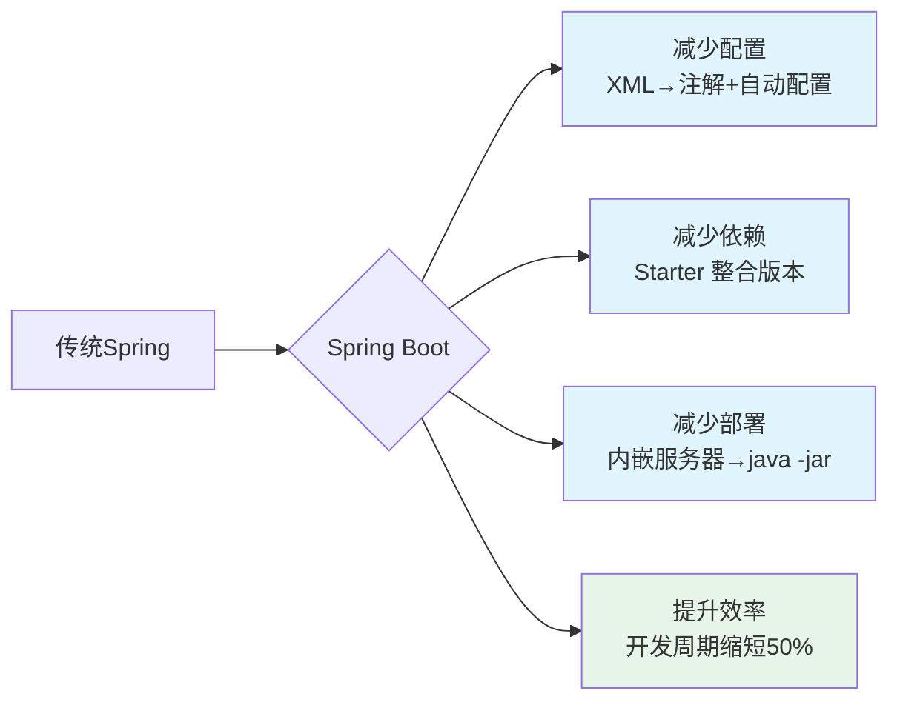
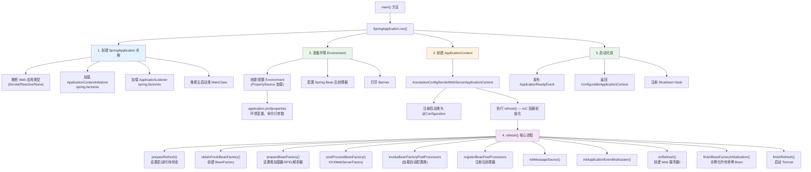
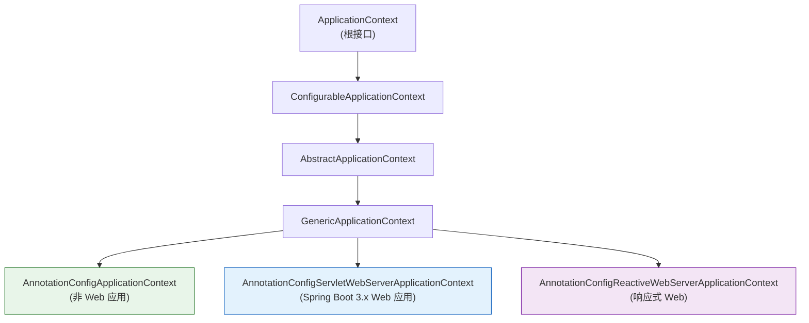
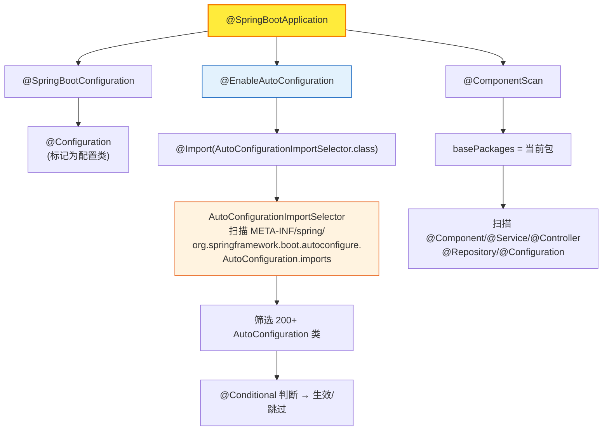
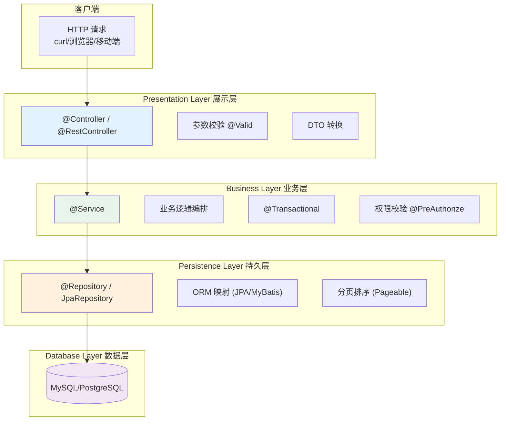
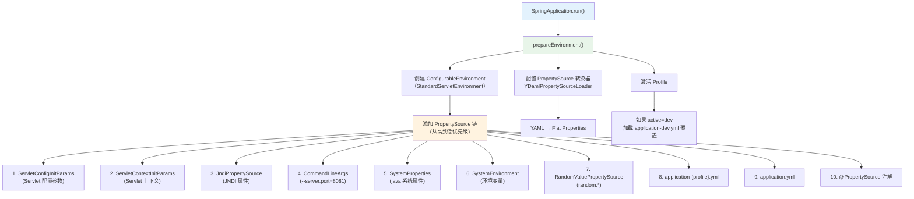

# Spring Boot 总览：从入门到核心认知

> 本文是 Spring Boot 系列第一篇，覆盖：什么是 Spring Boot、核心原理、`SpringApplication.run()` 源码级分析、自动配置原理、环境搭建、项目结构。

---

## 1. 什么是 Spring Boot

Spring Boot 是 Spring 生态的「简化器」，由 Pivotal 团队开发，核心定位是 **让 Spring 应用开发做到"开箱即用"**。

> Spring Boot helps you to create **stand-alone, production-grade Spring-based applications** that you can "just run".

它的设计哲学是 **Opinionated（有主见）**——对 Spring 平台和第三方库有预设的默认行为，开发者只需少量配置即可启动。

### 核心设计目标

出自 Spring 官方文档：

1. **极速上手**：为所有 Spring 开发提供更快的入门体验
2. **有主见但不强制**：默认值好用，但需要时可以被覆盖
3. **内置非功能性特性**：嵌入式服务器、安全、指标、健康检查、外部化配置
4. **零代码生成**：不需要 XML 配置，不需要生成代码

---

## 2. 为什么选择 Spring Boot？

### 2.1 核心价值："三减一提"



### 2.2 vs 传统 Spring

| 对比维度 | 传统 Spring | Spring Boot |
|---------|------------|-------------|
| 配置方式 | XML 为主（applicationContext.xml） | 注解为主（@Configuration）+ 自动配置 |
| 依赖管理 | 手动维护各组件版本（易冲突） | Starter 自动管理版本 |
| 服务器部署 | 打包 War → 部署到外部 Tomcat | 打包 Jar（内嵌 Tomcat），直接运行 |
| 开发效率 | 配置繁琐，启动慢 | 零配置启动，开发周期短 |
| 监控能力 | 需手动集成第三方监控 | 内置 Actuator |
| 适用场景 | 复杂企业应用（需精细配置） | 快速开发、微服务、云原生 |

### 2.3 代码量直观对比

| 配置场景 | 传统 Spring（XML + Java） | Spring Boot | 比例 |
|---------|------------------------|-------------|------|
| 配置数据源 | ~50 行 XML | 5 行 application.yml | **10:1** |
| 配置 Spring MVC | ~30 行 XML | 引入 starter，无需配置 | **30:0** |
| 配置事务管理 | ~20 行 XML | 加 `@Transactional` 即可 | **20:1** |
| 配置日志 | ~20 行 logback.xml | `logging.level.root=INFO` | **20:2** |

---

## 3. 版本选型

### 3.1 版本类型

| 类型 | 特点 | 推荐度 | 适用场景 |
|------|------|--------|---------|
| SNAPSHOT | 开发中，不稳定 | ❌ | 源码贡献者 |
| M (Milestone) | 里程碑版，待验证 | ❌ | 技术预研 |
| RELEASE | 正式版，支持 6-12 月 | ⭐⭐⭐ | 短期/非核心项目 |
| **LTS** | 长期支持，3-5 年 | ⭐⭐⭐⭐⭐ | **核心业务、企业级项目** |

### 3.2 当前主流版本选择（2026）

| Spring Boot 版本 | JDK 要求 | 支持到 | 推荐度 |
|-----------------|---------|-------|-------|
| 3.4.x (LTS) | JDK 17+ | 2027+ | ⭐⭐⭐⭐⭐ 新项目首选 |
| 3.2.x (LTS) | JDK 17+ | 2026.11 | ⭐⭐⭐⭐⭐ 稳定可靠 |
| 2.7.x (EOL) | JDK 8/11/17 | 已停止 | ❌ 不推荐 |

> ⚠️ 注意：Spring Boot 3.x 要求 JDK 17+，且改用 Jakarta EE（javax.\* → jakarta.\*）。
> 如果项目需兼容 JDK 8/11，选择 Spring Boot 2.7.x，但已 EOL，强烈建议迁移。

---

## 4. 环境搭建

### 4.1 前置要求

| 工具 | 版本要求 |
|------|---------|
| JDK | Spring Boot 3.x: JDK 17+ / 2.x: JDK 8+ |
| Maven | 3.6.3+（或 Gradle 7.5+） |
| IDE | IntelliJ IDEA、VS Code、Eclipse |

### 4.2 三种创建方式

#### 方式一：IDEA 可视化创建（推荐新手）
1. New Project → Spring Initializr
2. 填写 Group/Artifact
3. 选择依赖（如 Spring Web、Spring Data JPA）
4. Finish

#### 方式二：命令行
```bash
curl https://start.spring.io/starter.zip \
  -d dependencies=web,data-jpa,mysql,validation \
  -d javaVersion=21 \
  -o demo.zip
unzip demo.zip
```

#### 方式三：start.spring.io 网页
打开 [https://start.spring.io](https://start.spring.io)，配置后下载。

### 4.3 项目结构（Maven）

```
demo/
├── src/
│   ├── main/
│   │   ├── java/com/example/demo/
│   │   │   ├── DemoApplication.java    # 启动类（@SpringBootApplication）
│   │   │   ├── controller/             # 控制器层
│   │   │   ├── service/                # 服务层（业务逻辑）
│   │   │   ├── repository/             # 数据访问层（DAO）
│   │   │   ├── entity/                 # 实体类
│   │   │   ├── config/                 # 配置类
│   │   │   ├── dto/                    # 数据传输对象
│   │   │   └── exception/              # 异常处理
│   │   └── resources/
│   │       ├── application.yml         # 主配置（推荐 YAML）
│   │       ├── application-dev.yml     # 开发环境配置
│   │       ├── application-prod.yml    # 生产环境配置
│   │       ├── static/                 # 静态资源（CSS/JS）
│   │       └── templates/              # 模板（Thymeleaf 等）
│   └── test/
├── pom.xml
└── README.md
```

**核心文件职责：**

| 文件 | 作用 |
|------|------|
| `DemoApplication.java` | 启动类，`@SpringBootApplication` + `main()` |
| `application.yml` | 全局配置：端口、数据库、日志等 |
| `pom.xml` | 依赖管理，插件配置 |

---

## 5. 第一个 Spring Boot 应用

### 5.1 启动类

```java
package com.example.demo;

import org.springframework.boot.SpringApplication;
import org.springframework.boot.autoconfigure.SpringBootApplication;

@SpringBootApplication
public class DemoApplication {
    public static void main(String[] args) {
        SpringApplication.run(DemoApplication.class, args);
    }
}
```

### 5.2 一个简单的 REST 控制器

```java
package com.example.demo.controller;

import org.springframework.web.bind.annotation.*;

@RestController
@RequestMapping("/api")
public class HelloController {

    @GetMapping("/hello")
    public String sayHello(@RequestParam(defaultValue = "World") String name) {
        return "Hello, " + name + "! 欢迎来到 Spring Boot！";
    }
}
```

### 5.3 配置（application.yml）

```yaml
server:
  port: 8080
  servlet:
    context-path: /demo

spring:
  application:
    name: demo-app
```

### 5.4 运行

```bash
# 方式一：IDE 直接运行 DemoApplication.main()
# 方式二：Maven 打包后运行
mvn clean package -DskipTests
java -jar target/demo-0.0.1-SNAPSHOT.jar

# 访问
curl http://localhost:8080/demo/api/hello?name=Spring
# 返回：Hello, Spring! 欢迎来到 Spring Boot！
```

---

## 6. 核心原理：SpringApplication.run() 源码级分析

`SpringApplication.run()` 是整个 Spring Boot 启动过程的入口。下面按执行顺序逐步分解。

### 6.1 启动全流程架构



### 6.2 源码跟踪：new SpringApplication()

```java
// SpringApplication.java (Spring Boot 3.2.x)
public SpringApplication(ResourceLoader resourceLoader, Class<?>... primarySources) {
    this.resourceLoader = resourceLoader;
    this.primarySources = new LinkedHashSet<>(Arrays.asList(primarySources));

    // 步骤 1：推断 Web 应用类型
    // 源码：org.springframework.boot.WebApplicationType.deduceFromClasspath()
    this.webApplicationType = WebApplicationType.deduceFromClasspath();
    // 检测 classpath 是否存在:
    //   javax/servlet.Servlet + Spring Web → SERVLET
    //   org.springframework.web.reactive.DispatcherHandler → REACTIVE
    //   都没有 → NONE

    // 步骤 2：加载 BootstrapRegistryInitializer
    this.bootstrapRegistryInitializers = new ArrayList<>(
        getSpringFactoriesInstances(BootstrapRegistryInitializer.class));

    // 步骤 3：加载 ApplicationContextInitializer（从 spring.factories）
    setInitializers((Collection) getSpringFactoriesInstances(
        ApplicationContextInitializer.class));

    // 步骤 4：加载 ApplicationListener（从 spring.factories）
    setListeners((Collection) getSpringFactoriesInstances(ApplicationListener.class));

    // 步骤 5：推断 main 方法所在的主类
    this.mainApplicationClass = deduceMainApplicationClass();
    // 通过 StackTrace 找到调用 main() 的类
}
```

**关键点：** 构造阶段不加载任何 Spring Bean，只加载基础设施接口的 SPI 实现（来自 `spring.factories` 或 `META-INF/spring/*.imports`）。

### 6.3 WebApplicationType.deduceFromClasspath() 源码

```java
// WebApplicationType.java
static WebApplicationType deduceFromClasspath() {
    // 检查响应式 Web 优先
    if (ClassUtils.isPresent(WEBFLUX_INDICATOR_CLASS, null)
            && !ClassUtils.isPresent(WEBMVC_INDICATOR_CLASS, null)
            && !ClassUtils.isPresent(JERSEY_INDICATOR_CLASS, null)) {
        return WebApplicationType.REACTIVE;
    }
    // 检查 Servlet Web
    for (String className : SERVLET_INDICATOR_CLASSES) {
        if (!ClassUtils.isPresent(className, null)) {
            return WebApplicationType.NONE;
        }
    }
    return WebApplicationType.SERVLET;
}

private static final String[] SERVLET_INDICATOR_CLASSES = {
    "jakarta.servlet.Servlet",           // Spring Boot 3.x
    "org.springframework.web.context.ConfigurableWebApplicationContext"
};

private static final String WEBFLUX_INDICATOR_CLASS = 
    "org.springframework.web.reactive.DispatcherHandler";
```

### 6.4 SpringApplication.run() 核心流程源码

```java
// SpringApplication.java
public ConfigurableApplicationContext run(String... args) {
    // 计时器
    StopWatch stopWatch = new StopWatch();
    stopWatch.start();

    // 1. 创建启动上下文 BootstrapContext
    DefaultBootstrapContext bootstrapContext = createBootstrapContext();

    // 2. 配置 Headless 模式（Java 图形模式）
    configureHeadlessProperty();

    // 3. 获取所有 SpringApplicationRunListener（spring.factories）
    SpringApplicationRunListeners listeners = getRunListeners(args);
    listeners.starting(bootstrapContext);  // 发布 Starting 事件

    try {
        // 4. 准备命令行参数
        ApplicationArguments applicationArguments = new DefaultApplicationArguments(args);

        // ===== 5. 准备环境 =====
        ConfigurableEnvironment environment = prepareEnvironment(
            listeners, bootstrapContext, applicationArguments);
        // 加载：application.properties → application.yml → profile 覆盖

        // 6. 配置忽略 Bean 信息（用于 DevTools）
        configureIgnoreBeanInfo(environment);

        // 7. 打印 Banner
        Banner printedBanner = printBanner(environment);

        // ===== 8. 创建 ApplicationContext =====
        // 根据 webApplicationType 创建对应类型：
        //   SERVLET  → AnnotationConfigServletWebServerApplicationContext
        //   REACTIVE → AnnotationConfigReactiveWebServerApplicationContext
        //   NONE     → AnnotationConfigApplicationContext
        context = createApplicationContext();

        context.setApplicationStartup(applicationStartup);

        // ===== 9. 准备上下文 =====
        prepareContext(bootstrapContext, context, environment,
            listeners, applicationArguments, printedBanner);

        // ===== 10. 刷新上下文 — 核心中的核心！=====
        refreshContext(context);

        // 11. 刷新后的后处理
        afterRefresh(context, applicationArguments);

        stopWatch.stop();
        // 打印启动日志：Started DemoApplication in 2.345 seconds

        // 12. 发布启动完毕事件
        listeners.started(context);
        
        // 13. 调用 ApplicationRunner / CommandLineRunner
        callRunners(context, applicationArguments);
    } catch (Throwable ex) {
        // 异常处理：FailureAnalyzer 分析错误
        handleRunFailure(context, ex, listeners);
        throw new IllegalStateException(ex);
    }

    // 14. 发布就绪事件
    listeners.ready(context, stopWatch.getTotalTimeMillis());

    return context;
}
```

### 6.5 ApplicationContext 类型



**AnnotationConfigServletWebServerApplicationContext** 是 Spring Boot Web 应用使用的 ApplicationContext 实现。它的类继承路线：

```
→ GenericApplicationContext (持有 DefaultListableBeanFactory)
→ GenericWebApplicationContext (添加 ServletContext、ServletConfig)
→ ServletWebServerApplicationContext (添加 WebServer 管理：Tomcat/Jetty/Undertow)
→ AnnotationConfigServletWebServerApplicationContext (添加注解扫描+自动配置)
```

### 6.6 refreshContext() — IoC 容器初始化

`refresh()` 方法定义在 `AbstractApplicationContext`，是 Spring Framework 的核心方法。Spring Boot 在其执行过程中插入了 Web 服务器的启动逻辑。

```java
// AbstractApplicationContext.java
@Override
public void refresh() throws BeansException, IllegalStateException {
    synchronized (this.startupShutdownMonitor) {
        // 1. 准备刷新：设置启动时间、激活状态、初始化属性源
        prepareRefresh();

        // 2. 获取新的 BeanFactory（通常是 DefaultListableBeanFactory）
        ConfigurableListableBeanFactory beanFactory = obtainFreshBeanFactory();

        // 3. 准备 BeanFactory：设置类加载器、SPEL 解析器、注册环境 Bean
        prepareBeanFactory(beanFactory);

        try {
            // 4. BeanFactory 后处理 —— 钩子方法（子类实现）
            // Spring Boot 在这里调用 ServletWebServerFactory
            postProcessBeanFactory(beanFactory);

            // ===== 5. 最关键：执行 BeanFactoryPostProcessors =====
            // 这里会加载所有 @Configuration 类、@Bean 方法
            // 以及通过 @EnableAutoConfiguration 导入的自动配置类！
            invokeBeanFactoryPostProcessors(beanFactory);

            // 6. 注册 BeanPostProcessor
            registerBeanPostProcessors(beanFactory);

            // 7. 国际化
            initMessageSource();

            // 8. 事件广播器
            initApplicationEventMulticaster();

            // ===== 9. onRefresh — 创建 Web 服务器！=====
            // 子类 ServletWebServerApplicationContext.onRefresh()
            // 调用 createWebServer() → 创建 Tomcat/Jetty/Undertow
            onRefresh();

            // 10. 注册监听器
            registerListeners();

            // ===== 11. 实例化所有非懒加载单例 Bean =====
            // 到这里才会真正创建 Bean 实例
            finishBeanFactoryInitialization(beanFactory);

            // ===== 12. 完成刷新 — 启动 Web 服务器 =====
            // 子类 ServletWebServerApplicationContext 重写此方法
            finishRefresh();
        } catch (BeansException ex) {
            // 回滚：销毁已创建的 Bean
            destroyBeans();
            cancelRefresh(ex);
            throw ex;
        } finally {
            // 13. 重置公共缓存
            resetCommonCaches();
        }
    }
}
```

### 6.7 ServletWebServerApplicationContext.onRefresh() 源码

这是 Spring Boot Web 启动的关键，在 refresh 流程的第 9 步创建嵌入式 Web 服务器：

```java
// ServletWebServerApplicationContext.java
@Override
protected void onRefresh() {
    super.onRefresh();
    try {
        createWebServer();
    } catch (Throwable ex) {
        throw new ApplicationContextException("Unable to start web server", ex);
    }
}

private void createWebServer() {
    WebServer webServer = this.webServer;
    ServletContext servletContext = getServletContext();
    if (webServer == null && servletContext == null) {
        // 从容器中获取 ServletWebServerFactory
        // 如果有 Tomcat 依赖 → TomcatServletWebServerFactory
        // 如果有 Jetty 依赖  → JettyServletWebServerFactory
        // 如果有 Undertow  → UndertowServletWebServerFactory
        ServletWebServerFactory factory = getWebServerFactory();
        
        // 创建 WebServer（内部启动 Tomcat 监听端口）
        this.webServer = factory.getWebServer(getSelfInitializer());
    } else if (servletContext != null) {
        try {
            getSelfInitializer().onStartup(servletContext);
        } catch (ServletException ex) {
            throw new ApplicationContextException(...);
        }
    }
    // 初始化 PropertySource 等
    initPropertySources();
}
```

### 6.8 启动耗时分析

```java
// 可以在 application.yml 中开启启动耗时报告
spring:
  application:
    startup: true  # 记录 Bean 创建耗时

// 或通过编程方式
SpringApplication app = new SpringApplication(DemoApplication.class);
app.setApplicationStartup(ApplicationStartup.FLYING_BUFFER_STARTUP);
// 之后通过 JMX 或 Metrics 查看各 Bean 初始化时间
```

---

## 7. @SpringBootApplication 源码级分析

### 7.1 注解组合结构



```java
// @SpringBootApplication 源码 (Spring Boot 3.x)
@Target(ElementType.TYPE)
@Retention(RetentionPolicy.RUNTIME)
@Documented
@Inherited
@SpringBootConfiguration          // ① 标记为配置类
@EnableAutoConfiguration          // ② 开启自动配置（核心）
@ComponentScan(                   // ③ 组件扫描
    excludeFilters = {
        @Filter(type = FilterType.CUSTOM,
                classes = TypeExcludeFilter.class),
        @Filter(type = FilterType.CUSTOM,
                classes = AutoConfigurationExcludeFilter.class)
    }
)
public @interface SpringBootApplication {
    // exclude / excludeName 用于排除自动配置类
    @AliasFor(annotation = EnableAutoConfiguration.class)
    Class<?>[] exclude() default {};

    @AliasFor(annotation = EnableAutoConfiguration.class)
    String[] excludeName() default {};

    // 指定扫描包路径
    @AliasFor(annotation = ComponentScan.class, attribute = "basePackages")
    String[] scanBasePackages() default {};

    // ... 其余属性
}
```

### 7.2 @EnableAutoConfiguration 源码

```java
// EnableAutoConfiguration.java
@Target(ElementType.TYPE)
@Retention(RetentionPolicy.RUNTIME)
@Documented
@Inherited
@AutoConfigurationPackage        // 注册 AutoConfigurationPackages（记录扫描根包）
@Import(AutoConfigurationImportSelector.class)  // 核心！
public @interface EnableAutoConfiguration {
    // 排除列表
    Class<?>[] exclude() default {};
    String[] excludeName() default {};
}
```

### 7.3 AutoConfigurationImportSelector 源码流程

```java
// AutoConfigurationImportSelector.java
public class AutoConfigurationImportSelector
        implements DeferredImportSelector, BeanClassLoaderAware, ... {

    // 核心方法：返回需要注册的配置类全限定名列表
    @Override
    public String[] selectImports(AnnotationMetadata annotationMetadata) {
        if (!isEnabled(annotationMetadata)) {
            return NO_IMPORTS;
        }
        // 加载自动配置元数据
        AutoConfigurationEntry autoConfigurationEntry = getAutoConfigurationEntry(
            annotationMetadata);
        return StringUtils.toStringArray(autoConfigurationEntry.getConfigurations());
    }

    protected AutoConfigurationEntry getAutoConfigurationEntry(
            AnnotationMetadata annotationMetadata) {

        // 1. 获取所有候选配置类
        List<String> configurations = getCandidateConfigurations(annotationMetadata, exclusions);

        // 2. 去重
        configurations = removeDuplicates(configurations);

        // 3. 获取 @EnableAutoConfiguration.exclude() 排除的类
        Set<String> exclusions = getExclusions(annotationMetadata, exclusions);
        configurations.removeAll(exclusions);

        // 4. 应用过滤器（@ConditionalOnClass）
        configurations = filter(configurations, autoConfigurationMetadata);
        
        // 5. 发布 AutoConfigurationImportEvent
        fireAutoConfigurationImportEvents(configurations, exclusions);

        return new AutoConfigurationEntry(configurations, exclusions);
    }

    // 从 META-INF/spring/org.springframework.boot.autoconfigure.AutoConfiguration.imports 加载
    protected List<String> getCandidateConfigurations(
            AnnotationMetadata metadata, AnnotationAttributes attributes) {
        List<String> configurations = SpringFactoriesLoader.loadFactoryNames(
            getSpringFactoriesLoaderFactoryClass(), getBeanClassLoader());
        return configurations;
    }

    // 过滤器：检查 @ConditionalOnClass 中的类是否在 classpath 中存在
    private List<String> filter(List<String> configurations,
                                AutoConfigurationMetadata autoConfigurationMetadata) {
        // 使用 ConfigurationClassFilter
        // 对每个候选配置类，检查其 @ConditionalOnClass 条件
        // 如果引用的类不在 classpath 中，则跳过该配置
    }
}
```

### 7.4 自动配置条件过滤

Spring Boot 3.x 使用 `META-INF/spring/org.springframework.boot.autoconfigure.AutoConfiguration.imports` 而非旧的 `spring.factories`：

```properties
# 文件位置：spring-boot-autoconfigure.jar 中
# META-INF/spring/org.springframework.boot.autoconfigure.AutoConfiguration.imports

org.springframework.boot.autoconfigure.web.servlet.WebMvcAutoConfiguration
org.springframework.boot.autoconfigure.web.servlet.DispatcherServletAutoConfiguration
org.springframework.boot.autoconfigure.jdbc.DataSourceAutoConfiguration
org.springframework.boot.autoconfigure.orm.jpa.HibernateJpaAutoConfiguration
org.springframework.boot.autoconfigure.security.servlet.SecurityAutoConfiguration
# ... 一共约 200+ 条
```

**加载流程：**

1. Spring Boot 读取 `AutoConfiguration.imports`，得到约 200+ 自动配置类
2. 对每个配置类检查其 `@ConditionalOnClass`：所需的类是否在 classpath？
3. 对每个配置类检查其 `@ConditionalOnMissingBean`/`@ConditionalOnProperty` 等条件
4. 最终只注册那些条件全部满足的自动配置类
5. 典型的 Web 项目约 20-30 个自动配置生效

### 7.5 典型的自动配置示例

```java
// DataSourceAutoConfiguration 简化源码
@AutoConfiguration(before = HibernateJpaAutoConfiguration.class)
@ConditionalOnClass({ DataSource.class, EmbeddedDatabaseType.class })
@ConditionalOnMissingBean(DataSource.class)  // 用户自定义了 DataSource 就不注册
@EnableConfigurationProperties(DataSourceProperties.class)
public class DataSourceAutoConfiguration {

    // 使用 HikariCP（Spring Boot 默认连接池）
    @Configuration(proxyBeanMethods = false)
    @ConditionalOnClass(HikariDataSource.class)
    @ConditionalOnMissingBean(DataSource.class)
    @ConditionalOnProperty(
        name = "spring.datasource.type",
        havingValue = "com.zaxxer.hikari.HikariDataSource",
        matchIfMissing = true)                // 未指定 type 时默认使用 HikariCP
    static class Hikari {

        @Bean
        HikariDataSource dataSource(DataSourceProperties properties) {
            // 从 properties 读取 spring.datasource.* 配置
            HikariDataSource dataSource = properties.initializeDataSourceBuilder()
                .type(HikariDataSource.class)
                .build();
            // 设置连接池参数
            return dataSource;
        }
    }
}
```

**关键设计：** `@ConditionalOnMissingBean` 保证了**用户自定义优先**——只要用户在容器中注册了自己的 DataSource，自动配置就会自动退出。

---

## 8. 自动配置的"回退"机制

```mermaid
flowchart LR
    subgraph User["用户代码"]
        A["@Bean DataSource<br/>myDataSource()"]
    end
    
    subgraph Boot["Spring Boot 自动配置"]
        B["DataSourceAutoConfiguration"]
        B --> C{@ConditionalOnMissingBean<br/>DataSource?}
        C -->|"用户已定义 → 跳过"| D["跳过自动配置"]
        C -->|"用户未定义 → 生效"| E["注册 HikariDataSource"]
    end
    
    subgraph Result["结果"]
        F["容器中只有一个 DataSource"]
    end
    
    A --> C
    E --> F
    D --> F
    
    style A fill:#e8f5e9
    style C fill:#fff3e0,stroke:#f57c00
    style F fill:#e3f2fd
```

这种设计确保了：
1. **零配置时也能运行**（自动配置提供默认值）
2. **用户配置始终优先**（不会覆盖用户自己定义的 Bean）
3. **按需加载**（只加载 classpath 中有的依赖的配置）

---

## 9. Spring Boot 分层架构

Spring Boot 推荐的分层架构（Layered Architecture）：



**每层职责：**

- **Controller 层**：接收请求、参数校验、调用 Service、返回响应（DTO）
- **Service 层**：业务逻辑编排、事务管理、调用 Repository、DTO ↔ Entity 转换
- **Repository 层**：数据库 CRUD、自定义查询、分页排序
- **Entity 层**：数据库表映射

---

## 10. 常用 Starter 一览

| Starter | 功能 | 包含依赖 |
|---------|------|---------|
| `spring-boot-starter-web` | Web 开发 (MVC + 嵌入式 Tomcat) | spring-web, spring-webmvc, tomcat-embed-core |
| `spring-boot-starter-data-jpa` | JPA ORM | spring-data-jpa, hibernate-core, HikariCP |
| `spring-boot-starter-validation` | Bean Validation | hibernate-validator |
| `spring-boot-starter-security` | 安全认证 | spring-security-web, spring-security-config |
| `spring-boot-starter-actuator` | 应用监控 | micrometer-core, health check |
| `spring-boot-starter-test` | 单元/集成测试 | JUnit, Mockito, spring-test |
| `spring-boot-starter-data-redis` | Redis 集成 | spring-data-redis, lettuce-core |
| `spring-boot-starter-amqp` | RabbitMQ | spring-rabbit |

### Starter 的依赖管理原理

```xml
<!-- spring-boot-starter-web 内容（简化） -->
<project>
    <!-- 无需指定版本号，由 spring-boot-starter-parent 统一管理 -->
    <dependencies>
        <dependency>
            <groupId>org.springframework.boot</groupId>
            <artifactId>spring-boot-starter</artifactId>
        </dependency>
        <dependency>
            <groupId>org.springframework.boot</groupId>
            <artifactId>spring-boot-starter-tomcat</artifactId>  <!-- 内嵌 Tomcat -->
        </dependency>
        <dependency>
            <groupId>org.springframework</groupId>
            <artifactId>spring-web</artifactId>
        </dependency>
        <dependency>
            <groupId>org.springframework</groupId>
            <artifactId>spring-webmvc</artifactId>
        </dependency>
        <dependency>
            <groupId>com.fasterxml.jackson.core</groupId>
            <artifactId>jackson-databind</artifactId>
        </dependency>
        <!-- 日志：Logback -->
        <dependency>
            <groupId>org.springframework.boot</groupId>
            <artifactId>spring-boot-starter-logging</artifactId>
        </dependency>
    </dependencies>
</project>
```

---

## 11. 配置加载流程源码级分析

### 11.1 配置来源结构



### 11.2 PropertySource 链的优先级测试

```java
// 测试：同一属性在不同来源的优先级
// 启动命令：java -jar app.jar --server.port=9090
// 环境变量：export SERVER_PORT=8081
// application.yml: server.port=8080

// 最终结果：9090（命令行参数优先级最高）
```

---

## 12. Spring Boot 3.x 重要变更

| 变化 | Spring Boot 2.x | Spring Boot 3.x |
|------|----------------|----------------|
| **JDK 最低要求** | JDK 8 | **JDK 17** |
| **Jakarta EE** | javax.\* | **jakarta.\***（javax.persistence → jakarta.persistence） |
| **AOT 编译** | 不支持 | **支持**（Spring AOT：提前编译优化） |
| **GraalVM 原生镜像** | 实验性 | **正式支持**（native-image） |
| **Observability** | Micrometer 1.x | **Micrometer 2.x + 统一可观测性** |
| **自动配置** | spring.factories | **META-INF/spring/\*.imports** |
| **HttpClient** | RestTemplate | **RestClient（推荐）** |

---

## 总结

本章覆盖了 Spring Boot 的**完整认知**：

| 主题 | 深度 | 要点 |
|------|------|------|
| **启动流程** | 源码级 | `SpringApplication.run()` → 创建环境 → `refresh()` → onRefresh(创建Tomcat) → finishRefresh |
| **@SpringBootApplication** | 源码级 | 三个注解组合：@SpringBootConfiguration + @EnableAutoConfiguration + @ComponentScan |
| **自动配置** | 源码级 | `AutoConfigurationImportSelector` 扫描 `AutoConfiguration.imports` → `@Conditional` 筛选 → 条件满足才注册 |
| **ApplicationContext** | 源码级 | `AnnotationConfigServletWebServerApplicationContext` → 在 `onRefresh()` 中创建 Web 服务器 |
| **配置优先级** | 原理级 | 14 级 PropertySource 链，从命令行参数到 application.yml |
| **Starter** | 原理级 | 聚合依赖 + 自动配置 + 版本管理 |
| **条件注解** | 原理级 | `@ConditionalOnClass/MissingBean/Property` 确保不覆盖用户配置 |

### Spring Boot 启动完整流水线（概括）

```mermaid
flowchart LR
    A["main()"] --> B["new SpringApplication()"]
    B --> C["推断Web类型<br/>加载监听器"]
    C --> D["prepareEnvironment()<br/>加载配置"]
    D --> E["createApplicationContext()"]
    E --> F["refresh()<br/>IoC初始化"]
    F --> G["onRefresh()<br/>创建Tomcat"]
    G --> H["finishBeanFactoryInit()<br/>创建单例Bean"]
    H --> I["finishRefresh()<br/>启动服务器"]
    I --> J["ApplicationReadyEvent<br/>应用就绪"]
    
    style F fill:#f3e5f5,stroke:#7b1fa2,stroke-width:2px
    style J fill:#e8f5e9,stroke:#2e7d32
```



下一步（下一篇文章）：**深入 Spring Core — IoC 容器与依赖注入（DI）**
