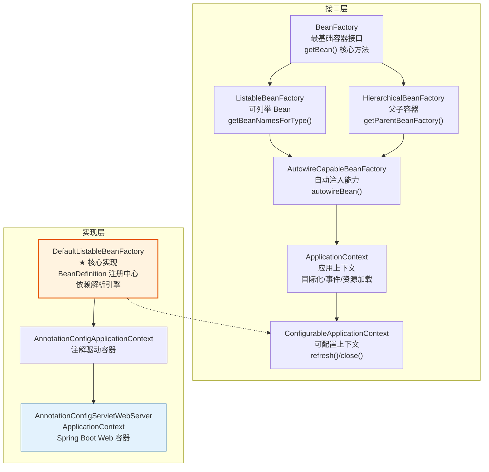
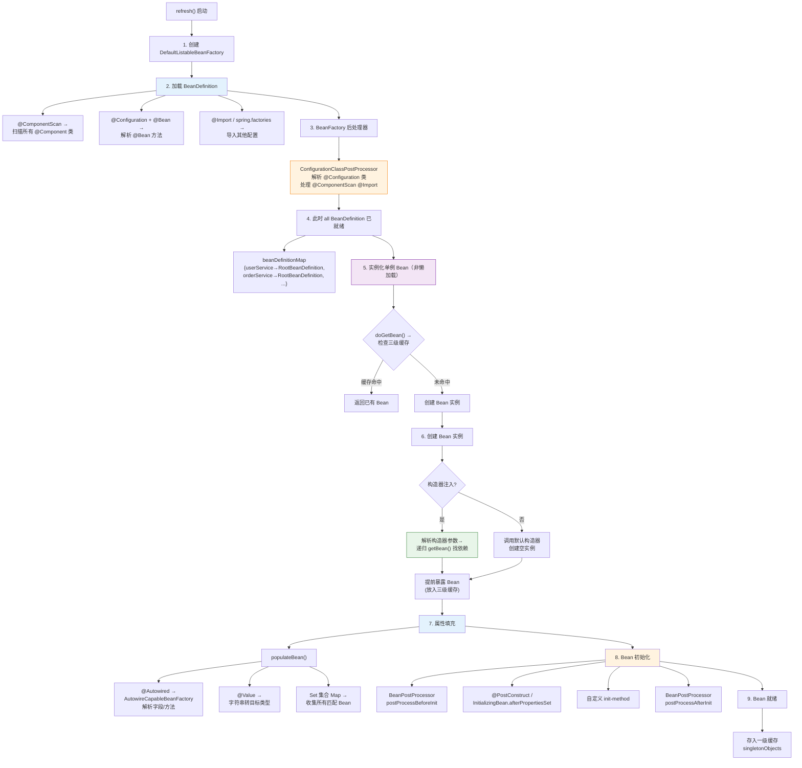
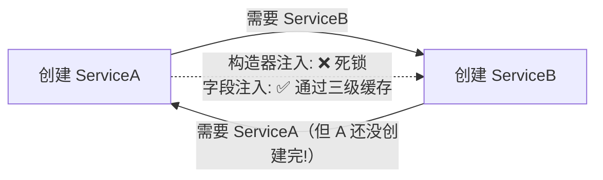
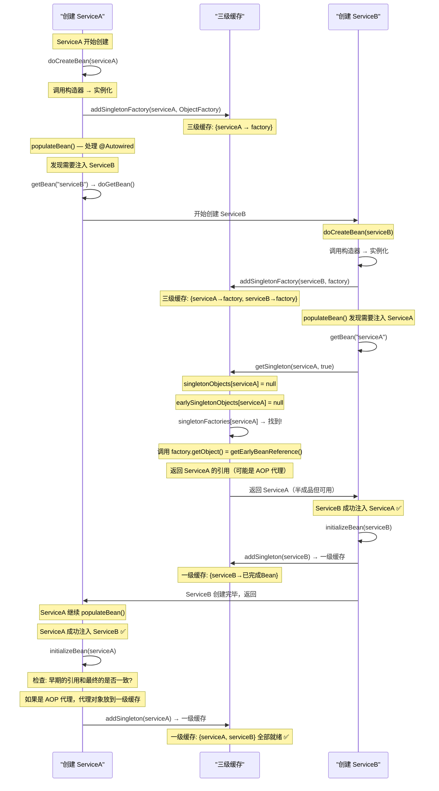
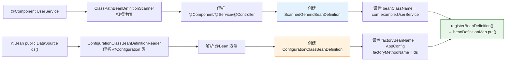
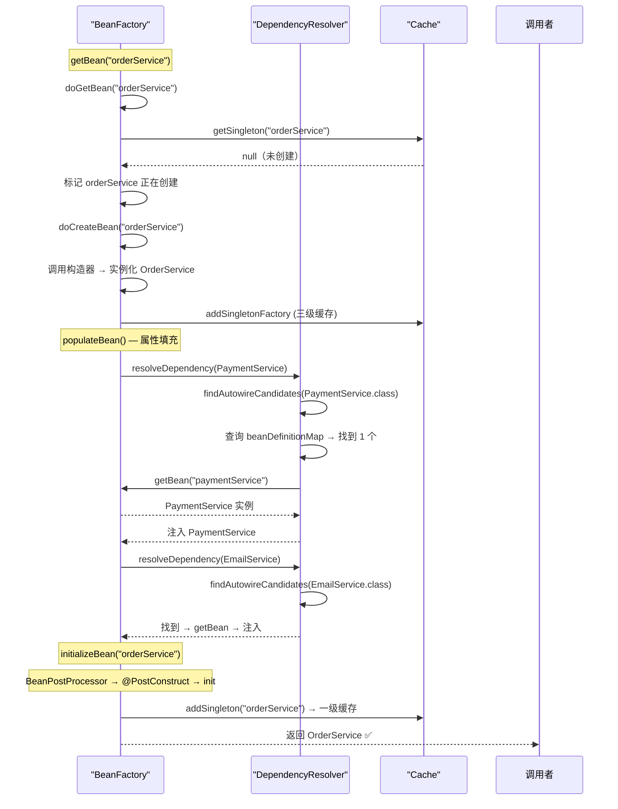

# Spring IoC 容器与依赖注入（DI）详解

> 本文为系列第 2 篇，覆盖：IoC 原理、DI 三种方式、ApplicationContext 源码体系、容器启动流程、BeanDefinition 解析、依赖解析与三级缓存、@Autowired 处理器源码、高级注入技巧。

---

## 1. 什么是 IoC（控制反转）

### 1.1 传统方式：正向控制

在传统程序设计中，对象自己控制依赖的创建：

```java
public class OrderService {
    private PaymentService paymentService;
    private EmailService emailService;

    public OrderService() {
        // ❌ 紧耦合：OrderService 自己创建依赖
        this.paymentService = new CreditCardPaymentService();
        this.emailService = new SMTPEmailService();
    }
}
```

**问题：**
- 紧耦合：`OrderService` 直接依赖具体实现类
- 难以测试：无法替换为 Mock 对象
- 难以扩展：换支付方式要改代码
- 对象生命周期管理混乱

### 1.2 IoC 方式：控制反转

**控制反转**是将对象的创建权、生命周期管理权从应用代码"反转"给容器（Spring IoC Container）。

```java
public class OrderService {
    private final PaymentService paymentService;
    private final EmailService emailService;

    // ✅ 依赖从外部注入，OrderService 不负责创建
    public OrderService(PaymentService paymentService, EmailService emailService) {
        this.paymentService = paymentService;
        this.emailService = emailService;
    }
}
```

**IoC 的本质：** 好莱坞原则 ——"不要打电话给我们，我们会打给你（Don't call us, we'll call you）"

| 特性 | 传统方式 | IoC 方式 |
|------|---------|---------|
| 谁创建对象 | 类自己 new | IoC 容器创建 |
| 谁管理生命周期 | 开发者管理 | 容器管理 |
| 耦合度 | 高（依赖具体类） | 低（依赖接口） |
| 可测试性 | 差（不能 Mock） | 好（可注入 Mock） |
| 扩展性 | 改代码 | 改配置/替换实现 |

---

## 2. 什么是依赖注入（DI）

**依赖注入**是 IoC 的一种具体实现模式：对象的依赖由外部容器注入，而非对象自己创建。

### 2.1 三种注入方式

#### 方式一：构造器注入（✅ 推荐）

```java
@Service
public class OrderService {
    private final PaymentService paymentService;
    private final EmailService emailService;

    // Spring 自动通过构造器注入依赖
    public OrderService(PaymentService paymentService, EmailService emailService) {
        this.paymentService = paymentService;
        this.emailService = emailService;
    }
}
```

**优点：**
- 依赖不可变（`final` 关键字）
- 依赖显式化：一眼看出需要什么
- 空安全：构造时所有依赖必须提供
- 便于单元测试：直接 `new OrderService(mock1, mock2)`

#### 方式二：Setter 注入

```java
@Service
public class OrderService {
    private PaymentService paymentService;

    @Autowired
    public void setPaymentService(PaymentService paymentService) {
        this.paymentService = paymentService;
    }
}
```

**适用场景：** 可选依赖、需要重新注入的场景

#### 方式三：字段注入（❌ 不推荐）

```java
@Service
public class OrderService {
    @Autowired          // ❌ 字段注入
    private PaymentService paymentService;
}
```

**缺点：**
- 依赖不可见（看不到构造器签名）
- 无法用 `final` 修饰
- 单元测试不方便（需要 reflection 或 Spring 上下文）
- 隐藏依赖关系

> 💡 **最佳实践：** 优先用构造器注入。Spring 官方也推荐这种方式。

---

## 3. Spring IoC 容器源码体系

### 3.1 容器接口层次



**核心实现是 DefaultListableBeanFactory：** 实际存储所有 BeanDefinition 和单例 Bean 的地方。

### 3.2 DefaultListableBeanFactory 源码核心

```java
// DefaultListableBeanFactory.java — Spring 容器的核心实现
public class DefaultListableBeanFactory extends AbstractAutowireCapableBeanFactory
        implements ConfigurableListableBeanFactory, BeanDefinitionRegistry, ... {

    // ===== 1. BeanDefinition 注册中心 =====
    /** 按名称存储 BeanDefinition */
    private final Map<String, BeanDefinition> beanDefinitionMap = new ConcurrentHashMap<>(256);

    /** 按名称存储注册顺序 */
    private volatile List<String> beanDefinitionNames = new ArrayList<>(256);

    /** 存储所有单例 Bean 的名称 */
    private volatile Set<String> singletonNames = new LinkedHashSet<>(256);

    // ===== 2. 按类型查找 Bean =====
    @Override
    public <T> Map<String, T> getBeansOfType(@Nullable Class<T> type) throws BeansException {
        // 遍历 beanDefinitionNames，检查每个 BeanDefinition 的 beanClass
        // 是否匹配指定类型（或父类/接口）
        // 匹配的加入结果 Map
        return doGetBeanNamesForType(type, true, false);
    }

    // ===== 3. 按名称获取 BeanDefinition =====
    @Override
    public BeanDefinition getBeanDefinition(String beanName) throws NoSuchBeanDefinitionException {
        BeanDefinition bd = this.beanDefinitionMap.get(beanName);
        if (bd == null) {
            throw new NoSuchBeanDefinitionException(beanName);
        }
        return bd;
    }

    // ===== 4. 注册 BeanDefinition =====
    @Override
    public void registerBeanDefinition(String beanName, BeanDefinition beanDefinition)
            throws BeanDefinitionStoreException {

        // 检查是否已存在
        BeanDefinition existingDefinition = this.beanDefinitionMap.get(beanName);
        if (existingDefinition != null) {
            // 允许覆盖（allowBeanDefinitionOverriding配置）
            if (!isAllowBeanDefinitionOverriding()) {
                throw new BeanDefinitionOverrideException(beanName, beanDefinition, existingDefinition);
            }
        }

        this.beanDefinitionMap.put(beanName, beanDefinition);
        this.beanDefinitionNames.add(beanName);
        // 清除按类型查找的缓存
        removeSingleton(beanName);
        clearByTypeCache();
    }
}
```

### 3.3 BeanDefinition 的结构

```java
// BeanDefinition 接口 — 一个 Bean 的完整元信息
public interface BeanDefinition extends AttributeAccessor, BeanMetadataElement {

    // Bean 的类名（全限定名，如 "com.example.UserService"）
    void setBeanClassName(@Nullable String beanClassName);

    // 作用域：singleton / prototype / request / session
    void setScope(@Nullable String scope);

    // 是否懒加载
    void setLazyInit(boolean lazyInit);

    // 初始化方法名（@PostConstruct / afterPropertiesSet）
    void setInitMethodName(@Nullable String initMethodName);

    // 销毁方法名（@PreDestroy / destroy）
    void setDestroyMethodName(@Nullable String destroyMethodName);

    // 构造器参数
    ConstructorArgumentValues getConstructorArgumentValues();

    // 属性值（用于 Setter 注入）
    MutablePropertyValues getPropertyValues();

    // 工厂 Bean 和方法（@Bean 方法相关）
    void setFactoryBeanName(@Nullable String factoryBeanName);
    void setFactoryMethodName(@Nullable String factoryMethodName);

    // Bean 的角色：APPLICATION / INFRASTRUCTURE / SUPPORT
    int getRole();

    // 其他：primary、qualifier、description 等
    boolean isPrimary();
}
```

### 3.4 容器启动流程与依赖解析



---

## 4. 三级缓存 — 循环依赖解决方案（源码级）

### 4.1 什么是循环依赖

```java
@Service
public class ServiceA {
    private final ServiceB serviceB;
    public ServiceA(ServiceB serviceB) { this.serviceB = serviceB; }
}

@Service
public class ServiceB {
    @Autowired
    private ServiceA serviceA;  // 字段注入
}
```



### 4.2 三级缓存源码

```java
// DefaultSingletonBeanRegistry.java — 负责管理单例 Bean 的注册表
public class DefaultSingletonBeanRegistry extends SimpleAliasRegistry
        implements SingletonBeanRegistry {

    // ===== 一级缓存：成品 Bean 池 =====
    /** 存放完全初始化好的单例 Bean（已完成依赖注入、初始化回调） */
    private final Map<String, Object> singletonObjects = new ConcurrentHashMap<>(256);

    // ===== 二级缓存：半成品 Bean 池 =====
    /** 存放已经实例化但尚未完成属性填充和初始化的 Bean */
    private final Map<String, Object> earlySingletonObjects = new ConcurrentHashMap<>(16);

    // ===== 三级缓存：Bean 工厂池（延迟生成代理） =====
    /** 存放 ObjectFactory，用于在需要时提前暴露 Bean 的引用 */
    /** AOP 代理就是在这里生成的：AbstractAutoProxyCreator 会包装为代理对象 */
    private final Map<String, ObjectFactory<?>> singletonFactories = new HashMap<>(16);

    // ===== 正在创建中的 Bean 集合 =====
    /** 记录当前正在创建的 Bean 名称，用于检测循环依赖 */
    private final Set<String> singletonsCurrentlyInCreation = new HashSet<>(16);
}
```

### 4.3 getSingleton() — 三级缓存查找逻辑

```java
// DefaultSingletonBeanRegistry.java
@Nullable
protected Object getSingleton(String beanName, boolean allowEarlyReference) {
    // 1. 一级缓存：检查是否已创建完
    Object singletonObject = this.singletonObjects.get(beanName);
    if (singletonObject == null && isSingletonCurrentlyInCreation(beanName)) {
        // 2. 如果正在创建中，检查二级缓存
        singletonObject = this.earlySingletonObjects.get(beanName);
        if (singletonObject == null && allowEarlyReference) {
            synchronized (this.singletonObjects) {
                // 双重检查
                singletonObject = this.singletonObjects.get(beanName);
                if (singletonObject == null) {
                    singletonObject = this.earlySingletonObjects.get(beanName);
                    if (singletonObject == null) {
                        // 3. 如果二级缓存也没有，从三级缓存获取 ObjectFactory
                        ObjectFactory<?> singletonFactory = this.singletonFactories.get(beanName);
                        if (singletonFactory != null) {
                            // 调用工厂方法：getEarlyBeanReference()
                            // 如果是 AOP 代理，这里会返回代理对象
                            singletonObject = singletonFactory.getObject();
                            // 提升到二级缓存（从三级→二级，提升查找效率）
                            this.earlySingletonObjects.put(beanName, singletonObject);
                            this.singletonFactories.remove(beanName);
                        }
                    }
                }
            }
        }
    }
    return singletonObject;
}
```

### 4.4 创建 Bean — doCreateBean() 源码

```java
// AbstractAutowireCapableBeanFactory.java
protected Object doCreateBean(String beanName, RootBeanDefinition mbd, @Nullable Object[] args) {

    // ===== 第 1 步：实例化 Bean（调用构造器）=====
    BeanWrapper instanceWrapper = null;
    if (mbd.isSingleton()) {
        instanceWrapper = this.factoryBeanInstanceCache.remove(beanName);
    }
    if (instanceWrapper == null) {
        // 核心方法：解析构造器 → 确定使用哪个构造器 → 反射创建实例
        instanceWrapper = createBeanInstance(beanName, mbd, args);
    }

    final Object bean = instanceWrapper.getWrappedInstance();

    // ===== 第 2 步：提前暴露 Bean（三级缓存的核心！）=====
    boolean earlySingletonExposure = (mbd.isSingleton()
            && this.allowCircularReferences
            && isSingletonCurrentlyInCreation(beanName));
    if (earlySingletonExposure) {
        // 将 Bean 放入三级缓存
        // 如果后续需要代理，getEarlyBeanReference() 会返回代理对象
        addSingletonFactory(beanName, () -> getEarlyBeanReference(beanName, mbd, bean));
    }

    Object exposedObject = bean;

    try {
        // ===== 第 3 步：属性填充（依赖注入）=====
        // 在这步解析 @Autowired、@Value、XML 定义的属性值
        // 对于尚未创建的依赖 Bean，会递归调用 getBean() 创建
        // 如果出现循环依赖，另一个 Bean 可以从三级缓存获取到当前 Bean 的引用
        populateBean(beanName, mbd, instanceWrapper);

        // ===== 第 4 步：初始化 =====
        // BeanPostProcessor beforeInit → @PostConstruct → afterPropertiesSet → init-method → afterInit
        exposedObject = initializeBean(beanName, exposedObject, mbd);
    } catch (Throwable ex) {
        if (ex instanceof BeanCreationException bce) {
            throw bce;
        }
        throw new BeanCreationException(mbd.getResourceDescription(), beanName, ex.getMessage(), ex);
    }

    return exposedObject;
}
```

### 4.5 三级缓存解决循环依赖的全过程



**关键结论：**

| 注入方式 | 能否解决循环依赖 | 原因 |
|---------|:--------------:|------|
| **构造器注入** | ❌ 无法解决 | 构造器执行前还没加入三级缓存，递归 getBean() 直接报错 |
| **Setter 注入** | ✅ 可以解决 | 实例化后、属性填充前已加入三级缓存 |
| **字段注入** | ✅ 可以解决 | 同 Setter 注入，发生在实例化后 |

> ⚠️ 三级缓存不解决构造器循环依赖——这是 Spring 的设计决策，因为构造器是强制依赖，循环依赖通常是设计缺陷。

### 4.6 AOP 代理与三级缓存

```java
// AbstractAutoProxyCreator.java (Spring AOP 的关键类)
// 它实现了 SmartInstantiationAwareBeanPostProcessor

@Override
public Object getEarlyBeanReference(Object bean, String beanName) {
    // 当其他 Bean 通过三级缓存引用这个 Bean 时调用
    // 如果这个 Bean 需要 AOP 代理，提前创建代理对象
    // 这样所有引用该 Bean 的其他 Bean 得到的都是同一个代理对象
    Object cacheKey = getCacheKey(bean.getClass(), beanName);
    this.earlyProxyReferences.put(cacheKey, bean);  // 记录原始引用
    return wrapIfNecessary(bean, beanName, cacheKey);  // 创建代理
}
```

**为什么需要三级缓存而不是两级？**
- 如果只需要两级缓存（earlySingletonObjects + singletonObjects），那么 Bean 实例化后直接放入二级缓存。
- **但 AOP 代理需要延迟创建**：只有发现其他 Bean 引用了当前 Bean 才创建代理（通过三级缓存的 ObjectFactory）。
- 如果没有循环依赖，代理会在 initializeBean() 中正常创建，不需要提前到三级缓存阶段。
- 三级缓存实现了 **"按需提前代理"**，避免了不必要的代理创建。

---

## 5. @Autowired 处理源码

### 5.1 AutowiredAnnotationBeanPostProcessor

```java
// AutowiredAnnotationBeanPostProcessor.java — 处理 @Autowired @Value @Inject
public class AutowiredAnnotationBeanPostProcessor
        implements SmartInstantiationAwareBeanPostProcessor, MergedBeanDefinitionPostProcessor {

    // 识别哪些注解触发自动注入
    private final Set<Class<? extends Annotation>> autowiredAnnotationTypes =
            new LinkedHashSet<>(4);

    public AutowiredAnnotationBeanPostProcessor() {
        this.autowiredAnnotationTypes.add(Autowired.class);  // Spring 原生
        this.autowiredAnnotationTypes.add(Value.class);       // @Value
        this.autowiredAnnotationTypes.add(JakartaInject.class); // @Inject (Jakarta)
        if (jakartaServletAvailable) {
            this.autowiredAnnotationTypes.add(Named.class);  // @Named
        }
    }

    // 构建注入元数据：找到所有 @Autowired 字段和方法
    @Override
    public void postProcessMergedBeanDefinition(RootBeanDefinition beanDefinition,
                                                  Class<?> beanType, String beanName) {
        // 扫描类的所有字段和方法
        // 找出所有标注了 @Autowired @Value @Inject 的成员
        // 缓存为 InjectionMetadata，避免重复扫描
        InjectionMetadata metadata = findAutowiringMetadata(beanName, beanType, null);
        metadata.checkConfigMembers(beanDefinition);
    }

    // 执行依赖注入（在 populateBean() 中调用）
    @Override
    public PropertyValues postProcessProperties(PropertyValues pvs,
                                                  Object bean, String beanName) {
        // 获取缓存的注入元数据
        InjectionMetadata metadata = findAutowiringMetadata(beanName, bean.getClass(), pvs);
        try {
            // 执行所有字段/方法的注入
            metadata.inject(bean, beanName, pvs);
        } catch (BeanCreationException ex) {
            throw ex;
        } catch (Throwable ex) {
            throw new BeanCreationException(beanName, "注入 @Autowired 依赖失败", ex);
        }
        return pvs;
    }
}
```

### 5.2 @Autowired 字段注入源码

```java
// AutowiredFieldElement.java — @Autowired 字段注入内部类
private class AutowiredFieldElement extends InjectionMetadata.InjectedElement {

    @Override
    protected void inject(Object bean, @Nullable String beanName,
                            @Nullable PropertyValues pvs) throws Throwable {
        Field field = (Field) this.member;
        Object value;

        // 如果字段缓存了值
        if (this.cached) {
            value = resolvedCachedArgument(beanName, bean);
        } else {
            // 获取依赖描述：字段类型 + 泛型参数 + @Qualifier
            DependencyDescriptor desc = new DependencyDescriptor(field, this.required);
            desc.setContainingClass(bean.getClass());

            // 解析依赖 — 核心调用链：
            // resolveDependency() → doResolveDependency() → findAutowireCandidates()
            // → BeanFactory.getBean(beanName) / getBeansOfType()
            value = beanFactory.resolveDependency(desc, beanName, autowiredBeanNames, typeConverter);
        }

        if (value != null) {
            // 通过反射设置字段值
            ReflectionUtils.makeAccessible(field);
            field.set(bean, value);
        }
    }
}
```

### 5.3 构造器注入的自动解析

```java
// AbstractAutowireCapableBeanFactory.java — 构造器自动注入
protected BeanWrapper createBeanInstance(String beanName, RootBeanDefinition mbd, @Nullable Object[] args) {

    // 1. 如果有 @Bean 工厂方法，调用工厂方法
    if (mbd.getFactoryMethodName() != null) {
        return instantiateUsingFactoryMethod(beanName, mbd, args);
    }

    // 2. 使用自动注入的构造器（即被 @Autowired 标注的构造器）
    // 或者推断出唯一构造器（只有一个构造器时自动选择）
    Constructor<?>[] ctors = determineConstructorsFromBeanPostProcessors(beanClass, beanName);
    if (ctors != null || mbd.getResolvedAutowireMode() == AUTOWIRE_CONSTRUCTOR
            || mbd.hasConstructorArgumentValues() || !ObjectUtils.isEmpty(args)) {
        return autowireConstructor(beanName, mbd, ctors, args);
    }

    // 3. 默认：使用无参构造器
    return instantiateBean(beanName, mbd);
}

// 构造器参数解析
protected BeanWrapper autowireConstructor(String beanName, RootBeanDefinition mbd,
        @Nullable Constructor<?>[] chosenCtors, @Nullable Object[] explicitArgs) {
    
    // 对每个构造器参数，调用 beanFactory.resolveDependency()
    // 如果没有显式指定参数，按类型查找 Bean
    // 找到唯一匹配 → 注入
    // 找到多个匹配 → 按 @Primary / @Priority / 字段名 选择
    // 找不到且 @Autowired(required=true) → 报错
}
```

---

## 6. Bean 定义与注册

### 6.1 注册 Bean 的源码流程



### 6.2 @Bean 方法的 BeanDefinition 特殊之处

```java
@Configuration
public class AppConfig {
    @Bean
    public DataSource dataSource() {
        return DataSourceBuilder.create()
            .url("jdbc:mysql://localhost:3306/demo")
            .build();
    }
}

// 对应的 ConfigurationClassBeanDefinition:
// beanClass: DataSource（返回类型）
// factoryBeanName: "appConfig"（配置类的 Bean 名）
// factoryMethodName: "dataSource"
// autowireMode: AUTOWIRE_CONSTRUCTOR（@Bean 参数也自动注入）

// 当 Spring 需要创建 DataSource Bean 时：
// 1. 获取 appConfig Bean
// 2. 调用 dataSource() 方法
// 3. 如果方法有参数，先注入参数
// 4. 执行方法体，返回 DataSource
```

---

## 7. 完整的依赖解析流程



---

## 8. 完整实战：构建订单处理系统

用完整的电商订单处理流程，展示 IoC/DI 的运用。

### 8.1 服务接口（面向接口编程）

```java
public interface PaymentService {
    boolean processPayment(Order order);
}

public interface EmailService {
    void sendConfirmation(Order order);
}

public interface InventoryService {
    boolean checkAvailability(String productId);
    void reserveProduct(String productId);
}
```

### 8.2 服务实现

```java
@Service
@Priority(0)  // 多实现时优先选择
public class CreditCardPaymentService implements PaymentService {
    @Override
    public boolean processPayment(Order order) {
        System.out.println("💳 信用卡支付: 订单 " + order.getId());
        return true;
    }
}

@Service
public class SMTPEmailService implements EmailService {
    @Override
    public void sendConfirmation(Order order) {
        System.out.println("📧 发送邮件至: " + order.getCustomerEmail());
    }
}

@Service
public class DatabaseInventoryService implements InventoryService {
    @Override
    public boolean checkAvailability(String productId) {
        System.out.println("🔍 检查库存: " + productId);
        return true;
    }

    @Override
    public void reserveProduct(String productId) {
        System.out.println("📦 锁定库存: " + productId);
    }
}
```

### 8.3 核心业务服务（构造器注入）

```java
@Service
public class OrderService {
    private final PaymentService paymentService;
    private final EmailService emailService;
    private final InventoryService inventoryService;

    public OrderService(PaymentService paymentService,
                        EmailService emailService,
                        InventoryService inventoryService) {
        this.paymentService = paymentService;
        this.emailService = emailService;
        this.inventoryService = inventoryService;
    }

    public void processOrder(Order order) {
        System.out.println("\n===== 处理订单: " + order.getId() + " =====");

        if (!inventoryService.checkAvailability(order.getProductId())) {
            System.out.println("❌ 库存不足");
            return;
        }
        inventoryService.reserveProduct(order.getProductId());

        if (!paymentService.processPayment(order)) {
            System.out.println("❌ 支付失败");
            return;
        }

        emailService.sendConfirmation(order);
        System.out.println("✅ 订单处理完成！\n");
    }
}
```

### 8.4 启动与测试

```java
public class Application {
    public static void main(String[] args) {
        ApplicationContext context =
            new AnnotationConfigApplicationContext("com.example");

        OrderService orderService = context.getBean(OrderService.class);
        // 容器的 getBean 搜索过程:
        // 1. 遍历 beanDefinitionNames
        // 2. 检查每个 BeanDefinition 的 beanClass 是否 OrderService 的子类/实现
        //    → 找到唯一的 OrderService Bean
        // 3. 从 singletonObjects 获取（或创建）

        orderService.processOrder(new Order("ORD-001", 99.99,
            "customer@example.com", "PROD-001"));
    }
}
```

---

## 9. 高级注入技巧

### 9.1 @Qualifier：多实现时指定

```java
public OrderService(@Qualifier("paypal") PaymentService paymentService) {
    this.paymentService = paymentService;
}
```

### 9.2 集合注入与策略模式

```java
@Service
public class PaymentRouter {

    // 注入所有 PaymentService 实现 + 名称
    private final Map<String, PaymentService> paymentServiceMap;

    public PaymentRouter(Map<String, PaymentService> paymentServiceMap) {
        this.paymentServiceMap = paymentServiceMap;
    }

    public void route(String type, Order order) {
        PaymentService ps = paymentServiceMap.get(type);
        if (ps != null) {
            ps.processPayment(order);
        }
    }
}
```

### 9.3 @Profile：环境感知

```java
@Bean
@Profile("dev")
public DataSource devDataSource() {
    return new EmbeddedDatabaseBuilder().build();
}

@Bean
@Profile("prod")
public DataSource prodDataSource() {
    return DataSourceBuilder.create()
        .url("jdbc:postgresql://prod-host:5432/db")
        .build();
}
```

### 9.4 @Value + SpEL

```java
@Value("${app.name:MyApp}")
private String appName;

@Value("#{systemProperties['user.home']}")
private String userHome;

@Value("#{T(java.lang.Math).random() * 100}")
private double randomNumber;
```

---

## 10. 最佳实践总结

| 实践 | 说明 |
|------|------|
| ✅ **优先构造器注入** | `final` + 不可变 + 显式依赖 |
| ✅ **面向接口编程** | 依赖接口而非具体类 |
| ✅ **@Primary / @Qualifier** | 管理多实现注入 |
| ✅ **集合注入** | `List<Interface>` / `Map<String, Interface>` 实现策略模式 |
| ❌ **避免字段注入** | 依赖隐藏，不可测试 |
| ❌ **避免构造器循环依赖** | 设计问题，三级缓存也救不了 |

---

## 总结

| 知识点 | 要点 |
|--------|------|
| **IoC** | 控制反转，对象创建权交给容器 |
| **DI** | 依赖注入，外部提供依赖 |
| **三种注入** | 构造器 ✅ > Setter > 字段注入 ❌ |
| **ApplicationContext** | IoC 容器核心接口，组合了 BeanFactory |
| **DefaultListableBeanFactory** | 容器的实际实现，持有 `beanDefinitionMap` + 三级缓存 |
| **三级缓存** | 单例 Bean 的三种状态：成品(singletonObjects) → 半成品(earlySingletonObjects) → 工厂(singletonFactories) |
| **@Autowired 处理器** | `AutowiredAnnotationBeanPostProcessor` 扫描字段/方法 → `resolveDependency()` → `findAutowireCandidates()` → `getBean()` |
| **BeanDefinition** | Bean 的元信息：类名、作用域、构造器参数、属性值、初始化/销毁方法 |

下一篇预告：**Spring AOP 面向切面编程详解**
