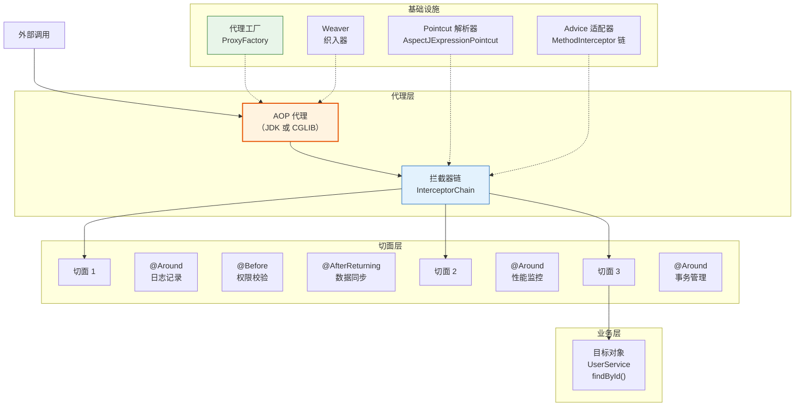
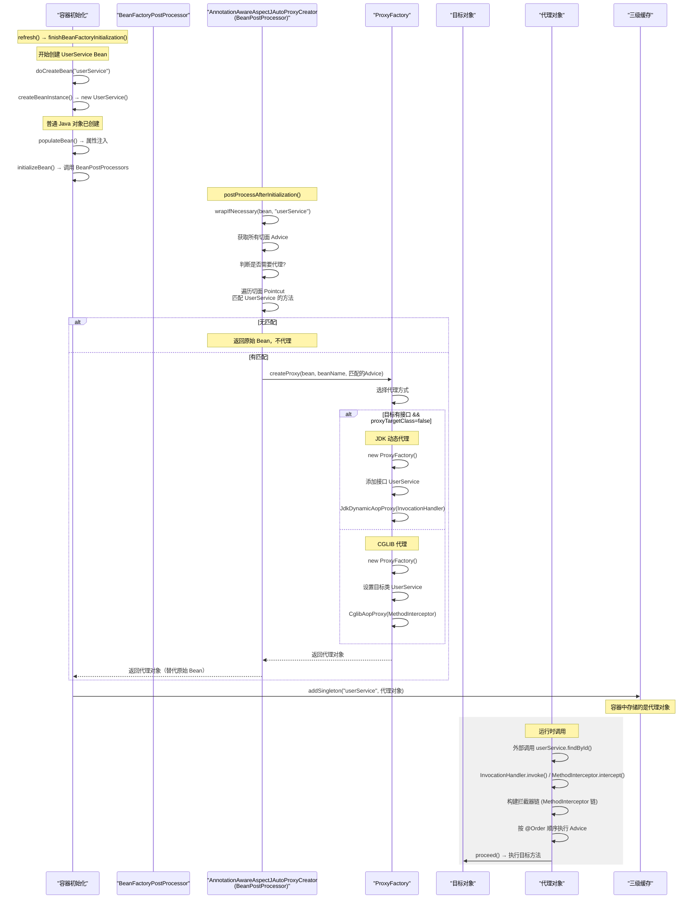
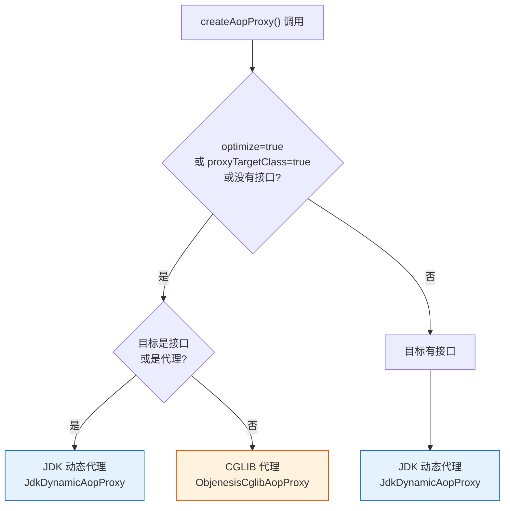
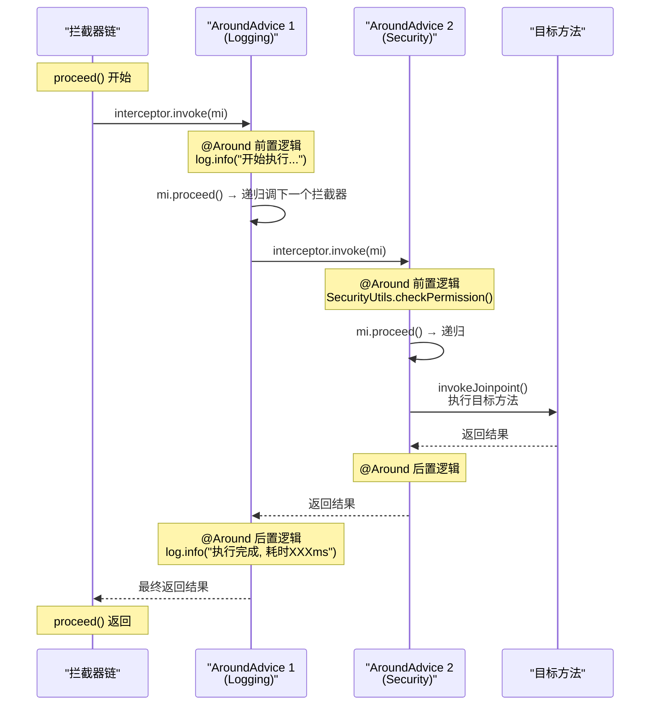

# Spring AOP 面向切面编程详解

> 本文为系列第 3 篇，覆盖：AOP 核心概念、5 种通知类型、切入点表达式、代理机制源码（JDK vs CGLIB）、`AnnotationAwareAspectJAutoProxyCreator` 源码、Spring Boot AOP 自动配置、自定义注解驱动切面、实战案例。

---

## 1. 什么是 AOP

### 1.1 从 OOP 到 AOP

**OOP（面向对象编程）** 以"类"为基本单元，关注对象的属性与行为。
**AOP（面向切面编程）** 以"切面"为基本单元，关注**横切关注点**——跨越多个类/方法的行为。

### 1.2 常见的横切关注点

| 关注点 | 说明 |
|-------|------|
| 日志记录 | 所有接口调用记录入参、出参、耗时 |
| 权限校验 | 敏感操作前检查用户身份与角色 |
| 事务管理 | 数据库操作的开启、提交、回滚（`@Transactional` 底层即 AOP） |
| 性能监控 | 统计方法执行耗时 |
| 异常处理 | 统一捕获并处理异常 |
| 缓存处理 | 查询缓存、更新缓存 |

### 1.3 没有 AOP 的痛点

```java
// 每个方法都要重复写日志代码 → 耦合、冗余、难维护
public class UserService {
    public User findById(Long id) {
        logger.info("调用 findById, 参数: {}", id);     // ❌ 日志耦合
        long start = System.currentTimeMillis();
        User user = userRepository.findById(id);
        long end = System.currentTimeMillis();
        logger.info("findById 耗时: {}ms", end - start); // ❌ 监控耦合
        return user;
    }
}
```

### 1.4 AOP 解决之道

```java
// ✅ 业务代码只关注业务
@Service
public class UserService {
    public User findById(Long id) {
        return userRepository.findById(id);
    }
}

// ✅ 日志、监控全部抽离到切面
@Aspect
@Component
public class LoggingAspect {
    @Around("execution(* com.example.service.*.*(..))")
    public Object logAround(ProceedingJoinPoint pjp) throws Throwable {
        long start = System.currentTimeMillis();
        logger.info("调用 {}，参数: {}", pjp.getSignature(), pjp.getArgs());
        Object result = pjp.proceed();
        logger.info("{} 完成，耗时 {}ms",
            pjp.getSignature(), System.currentTimeMillis() - start);
        return result;
    }
}
```

---

## 2. AOP 核心概念

| 术语 | 英文 | 说明 |
|------|------|------|
| **切面** | Aspect | 封装横切逻辑的类，用 `@Aspect` 标记 |
| **连接点** | Join Point | 程序执行中的某个点，Spring AOP 中特指**方法执行** |
| **切入点** | Pointcut | 匹配连接点的表达式，决定通知在哪些方法上执行 |
| **通知** | Advice | 切面在特定连接点执行的具体逻辑 |
| **目标对象** | Target Object | 被通知的原始业务对象 |
| **代理** | AOP Proxy | Spring 生成的代理对象，包裹目标对象 |
| **织入** | Weaving | 将切面应用到目标对象创建代理的过程 |

### 2.1 AOP 架构总览



---

## 3. AOP 自动配置与启动源码

### 3.1 @EnableAspectJAutoProxy —— 开启 AOP 的入口

Spring Boot 自动配置了 AOP，但理解其底层从 `@EnableAspectJAutoProxy` 开始：

```java
@Target(ElementType.TYPE)
@Retention(RetentionPolicy.RUNTIME)
@Documented
@Import(AspectJAutoProxyRegistrar.class)  // 核心：注册后处理器
public @interface EnableAspectJAutoProxy {

    // true → 使用 CGLIB（子类代理）；false → 使用 JDK 动态代理
    boolean proxyTargetClass() default false;

    // 是否暴露代理对象到 ThreadLocal（解决自调用问题）
    boolean exposeProxy() default false;
}
```

### 3.2 AspectJAutoProxyRegistrar 源码

```java
// AspectJAutoProxyRegistrar.java
class AspectJAutoProxyRegistrar implements ImportBeanDefinitionRegistrar {

    @Override
    public void registerBeanDefinitions(AnnotationMetadata importingClassMetadata,
                                          BeanDefinitionRegistry registry) {

        // 注册 AnnotationAwareAspectJAutoProxyCreator
        // 这是 Spring AOP 的核心——一个 BeanPostProcessor
        AopConfigUtils.registerAspectJAnnotationAutoProxyCreatorIfNecessary(registry);

        // 解析 @EnableAspectJAutoProxy 的属性
        AnnotationAttributes attributes = AnnotationAttributes.fromMap(
            importingClassMetadata.getAnnotationAttributes(
                EnableAspectJAutoProxy.class.getName()));

        if (attributes != null) {
            // 设置 proxyTargetClass（CGLIB vs JDK）
            if (attributes.getBoolean("proxyTargetClass")) {
                AopConfigUtils.forceAutoProxyCreatorToUseClassProxying(registry);
            }
            // 设置 exposeProxy（暴露代理到 AopContext）
            if (attributes.getBoolean("exposeProxy")) {
                AopConfigUtils.forceAutoProxyCreatorToExposeProxy(registry);
            }
        }
    }
}
```

### 3.3 Spring Boot 的 AopAutoConfiguration

Spring Boot 通过自动配置开启 AOP，无需手动加 `@EnableAspectJAutoProxy`：

```java
// AopAutoConfiguration.java — Spring Boot 3.x
@AutoConfiguration
@ConditionalOnClass(EnableAspectJAutoProxy.class)  // classpath 有 spring-aop
@ConditionalOnProperty(prefix = "spring.aop", name = "auto", havingValue = "true",
                        matchIfMissing = true)      // 默认开启
public class AopAutoConfiguration {

    // 配置了 @EnableAspectJAutoProxy 的效果
    @Configuration(proxyBeanMethods = false)
    @EnableAspectJAutoProxy(proxyTargetClass = false)
    @ConditionalOnProperty(prefix = "spring.aop", name = "proxy-target-class",
                            havingValue = "false", matchIfMissing = false)
    public static class JdkDynamicAutoProxyConfiguration { }

    // CGLIB 配置（Spring Boot 2.x+ 默认）
    @Configuration(proxyBeanMethods = false)
    @EnableAspectJAutoProxy(proxyTargetClass = true)
    @ConditionalOnProperty(prefix = "spring.aop", name = "proxy-target-class",
                            havingValue = "true", matchIfMissing = true)
    public static class CglibAutoProxyConfiguration { }
}
```

```yaml
# application.yml — AOP 配置
spring:
  aop:
    auto: true                  # 开启 AOP（默认）
    proxy-target-class: true    # 强制 CGLIB（默认）
```

---

## 4. AOP 代理创建源码

### 4.1 代理创建全流程



### 4.2 核心后处理器：AnnotationAwareAspectJAutoProxyCreator

```java
// AnnotationAwareAspectJAutoProxyCreator.java
// 继承关系：
// BeanPostProcessor
//   → InstantiationAwareBeanPostProcessorAdapter
//     → AbstractAutoProxyCreator            ★ 核心
//       → AbstractAdvisorAutoProxyCreator
//         → AnnotationAwareAspectJAutoProxyCreator

// 关键重写方法在 AbstractAutoProxyCreator 中：
public abstract class AbstractAutoProxyCreator
        implements SmartInstantiationAwareBeanPostProcessor, BeanFactoryAware {

    // ===== 在 Bean 初始化后处理 =====
    @Override
    public Object postProcessAfterInitialization(@Nullable Object bean, String beanName) {
        if (bean != null) {
            Object cacheKey = getCacheKey(bean.getClass(), beanName);
            // 检查是否已经提前暴露过代理（三级缓存场景）
            if (this.earlyProxyReferences.remove(cacheKey) != bean) {
                // 核心方法：如果匹配切面，则创建代理
                return wrapIfNecessary(bean, beanName, cacheKey);
            }
        }
        return bean;
    }

    // ===== 早期引用（三级缓存提前暴露代理）=====
    @Override
    public Object getEarlyBeanReference(Object bean, String beanName) {
        Object cacheKey = getCacheKey(bean.getClass(), beanName);
        // 记录需要提前代理的引用
        this.earlyProxyReferences.put(cacheKey, bean);
        // 创建代理（用于循环依赖场景）
        return wrapIfNecessary(bean, beanName, cacheKey);
    }
}
```

### 4.3 wrapIfNecessary() — 决定是否需要代理

```java
// AbstractAutoProxyCreator.java
protected Object wrapIfNecessary(Object bean, String beanName, Object cacheKey) {
    // 1. 如果已经处理过，跳过
    if (StringUtils.hasLength(beanName) && this.targetSourcedBeans.contains(beanName)) {
        return bean;
    }

    // 2. 跳过 Advice/Aspect/Pointcut 本身
    if (Boolean.FALSE.equals(this.advisedBeans.get(cacheKey))) {
        return bean;
    }

    // 3. 判断是否应该跳过（Infrastructure Bean、AOP 基础类等）
    if (isInfrastructureClass(bean.getClass()) || shouldSkip(bean.getClass(), beanName)) {
        this.advisedBeans.put(cacheKey, Boolean.FALSE);
        return bean;
    }

    // ===== 4. 核心：查找匹配的增强器 =====
    Object[] specificInterceptors = getAdvicesAndAdvisorsForBean(
        bean.getClass(), beanName, null);

    if (specificInterceptors != DO_NOT_PROXY) {
        this.advisedBeans.put(cacheKey, Boolean.TRUE);
        // 创建代理！
        Object proxy = createProxy(bean.getClass(), beanName,
            specificInterceptors, new SingletonTargetSource(bean));
        this.proxyTypes.put(cacheKey, proxy.getClass());
        return proxy;
    }

    // 没有匹配的切面 → 不代理
    this.advisedBeans.put(cacheKey, Boolean.FALSE);
    return bean;
}
```

### 4.4 getAdvicesAndAdvisorsForBean() — 匹配切面

```java
// AbstractAdvisorAutoProxyCreator.java
@Override
@Nullable
protected Object[] getAdvicesAndAdvisorsForBean(
        Class<?> beanClass, String beanName, @Nullable TargetSource targetSource) {

    // 1. 查找所有候选 Advisor（即所有的 Aspect 通知）
    List<Advisor> candidateAdvisors = findCandidateAdvisors();

    // 2. 筛选：只保留匹配当前 Bean 的 Advisor
    List<Advisor> eligibleAdvisors = findAdvisorsThatCanApply(
        candidateAdvisors, beanClass, beanName);

    // 3. 扩展：子类可在前后插入自定义 Advisor
    extendAdvisors(eligibleAdvisors);
    if (!eligibleAdvisors.isEmpty()) {
        // 4. 排序：按 @Order 值排序
        eligibleAdvisors = sortAdvisors(eligibleAdvisors);
        return eligibleAdvisors.toArray(new Advisor[0]);
    }

    return DO_NOT_PROXY;  // 无匹配 → 不代理
}
```

**匹配过程的核心逻辑：**

```java
// AopUtils.java — 判断某个切面是否匹配目标类
public static boolean canApply(Pointcut pc, Class<?> targetClass,
                                 boolean hasIntroductions) {
    // 1. 先检查 ClassFilter
    if (!pc.getClassFilter().matches(targetClass)) {
        return false;
    }

    // 2. 再检查 MethodMatcher（遍历目标类的所有方法）
    MethodMatcher methodMatcher = pc.getMethodMatcher();
    Set<Class<?>> classes = new LinkedHashSet<>();

    // 从目标类开始，遍历其所有接口和父类
    classes.add(targetClass);
    classes.addAll(ClassUtils.getAllInterfacesForClassAsSet(targetClass));

    for (Class<?> clazz : classes) {
        // 遍历该类的所有方法
        Method[] methods = ReflectionUtils.getAllDeclaredMethods(clazz);
        for (Method method : methods) {
            // 检查切入点是否匹配该方法
            if (methodMatcher.matches(method, targetClass)) {
                return true;  // 只要有一个方法匹配，就需要代理
            }
        }
    }
    return false;
}
```

### 4.5 createProxy() — 代理创建

```java
// AbstractAutoProxyCreator.java
protected Object createProxy(Class<?> beanClass, @Nullable String beanName,
        @Nullable Object[] specificInterceptors, TargetSource targetSource) {

    // 创建 ProxyFactory
    ProxyFactory proxyFactory = new ProxyFactory();
    proxyFactory.copyFrom(this);

    // 关键：是否使用 CGLIB
    // proxyTargetClass = true → CGLIB
    // proxyTargetClass = false + 有接口 → JDK 动态代理
    if (!proxyFactory.isProxyTargetClass()) {
        // 检查是否应该强制 CGLIB
        if (shouldProxyTargetClass(beanClass, beanName)) {
            proxyFactory.setProxyTargetClass(true);
        } else {
            // 检查目标类是否需要 CGLIB（没有接口时自动选择）
            evaluateProxyInterfaces(beanClass, proxyFactory);
        }
    }

    // 注册 Advisor（将 AspectJ 通知包装为 Advisor）
    Advisor[] advisors = buildAdvisors(beanName, specificInterceptors);
    proxyFactory.addAdvisors(advisors);

    proxyFactory.setTargetSource(targetSource);

    // 交给 AopProxyFactory 创建真正的代理
    AopProxyFactory aopProxyFactory = ProxyCreatorSupport
        .getAopProxyFactory();
    return aopProxyFactory.getAopProxy(proxyFactory).getProxy(beanClass.getClassLoader());
}
```

---

## 5. 代理机制源码：JDK vs CGLIB

### 5.1 DefaultAopProxyFactory — 选择代理方式

```java
// DefaultAopProxyFactory.java — Spring AOP 代理工厂
public class DefaultAopProxyFactory implements AopProxyFactory, Serializable {

    @Override
    public AopProxy createAopProxy(AdvisedSupport config) throws AopConfigException {
        // 三种选择条件：

        // CGLIB 条件：
        // 1. optimize = true（优化模式）
        // 2. proxyTargetClass = true（强制 CGLIB）
        // 3. 目标类没有接口
        if (config.isOptimize() || config.isProxyTargetClass()
                || hasNoUserSuppliedProxyInterfaces(config)) {
            Class<?> targetClass = config.getTargetClass();
            if (targetClass == null) {
                throw new AopConfigException("TargetSource 无法确定目标类");
            }

            // ⚠️ CGLIB 的限制：final 方法无法被覆盖
            if (targetClass.isInterface() || Proxy.isProxyClass(targetClass)) {
                // 目标类本身就是接口或已经是代理 → 用 JDK
                return new JdkDynamicAopProxy(config);
            }
            // 返回 CGLIB 代理
            return new ObjenesisCglibAopProxy(config);
        } else {
            // 默认：目标类有接口 → JDK 动态代理
            return new JdkDynamicAopProxy(config);
        }
    }
}
```



### 5.2 JDK 动态代理：JdkDynamicAopProxy 源码

```java
// JdkDynamicAopProxy.java — JDK 动态代理实现
final class JdkDynamicAopProxy implements AopProxy, InvocationHandler, Serializable {

    // 创建 JDK 代理实例
    @Override
    public Object getProxy(@Nullable ClassLoader classLoader) {
        // 获取目标类实现的所有接口
        Class<?>[] proxiedInterfaces = getProxiedInterfaces();

        // 使用 JDK 的 Proxy.newProxyInstance() 创建代理
        return Proxy.newProxyInstance(classLoader, proxiedInterfaces, this);
    }

    // ===== InvocationHandler：方法调用时触发 =====
    @Override
    @Nullable
    public Object invoke(Object proxy, Method method, Object[] args) throws Throwable {
        Object oldProxy = null;
        boolean setProxyContext = false;

        TargetSource targetSource = this.advised.targetSource;
        Object target = null;

        try {
            // 1. 特殊方法处理（equals/hashCode/toString）
            if (!this.equalsDefined && AopUtils.isEqualsMethod(method)) { ... }
            if (!this.hashCodeDefined && AopUtils.isHashCodeMethod(method)) { ... }
            if (method.getDeclaringClass() == DecoratingProxy.class) { ... }

            // 2. 如果 exposeProxy 开启，将代理对象存入 AopContext
            if (this.advised.exposeProxy) {
                oldProxy = AopContext.setCurrentProxy(proxy);
                setProxyContext = true;
            }

            // 3. 获取目标对象
            target = targetSource.getTarget();

            // ===== 4. 构建拦截器链 =====
            List<Object> chain = this.advised.getInterceptorsAndDynamicInterceptionAdvice(
                method, targetClass);

            if (chain.isEmpty()) {
                // 没有切面匹配 → 直接反射调用目标方法
                Object[] argsToUse = AopProxyUtils.adaptArgumentsIfNecessary(method, args);
                retVal = AopUtils.invokeJoinpointUsingReflection(target, method, argsToUse);
            } else {
                // 有切面匹配 → 创建 MethodInvocation（拦截器链）
                // ReflectiveMethodInvocation 按顺序执行拦截器
                MethodInvocation invocation = new ReflectiveMethodInvocation(
                    proxy, target, method, args, targetClass, chain);
                retVal = invocation.proceed();  // 执行链
            }

            return retVal;
        } finally {
            if (target != null && !targetSource.isStatic()) {
                targetSource.releaseTarget(target);
            }
            if (setProxyContext) {
                AopContext.setCurrentProxy(oldProxy);
            }
        }
    }
}
```

### 5.3 CGLIB 代理：CglibAopProxy 源码

```java
// CglibAopProxy.java — CGLIB 代理实现
class CglibAopProxy implements AopProxy, Serializable {

    // 创建 CGLIB 代理
    @Override
    public Object getProxy(@Nullable ClassLoader classLoader) {
        Enhancer enhancer = new Enhancer();
        enhancer.setClassLoader(classLoader);

        // 设置目标类（父类）
        enhancer.setSuperclass(proxySuperClass);

        // 设置回调方法（MethodInterceptor）
        Callback[] callbacks = getCallbacks(rootClass);
        enhancer.setCallbacks(callbacks);

        // 创建代理实例
        return enhancer.create();
    }

    // 核心回调：DynamicAdvisedInterceptor
    private static class DynamicAdvisedInterceptor implements MethodInterceptor {

        @Override
        @Nullable
        public Object intercept(Object proxy, Method method, @Nullable Object[] args,
                                  MethodProxy methodProxy) throws Throwable {
            Object target = null;

            try {
                // 获取目标对象
                target = this.advised.getTargetSource().getTarget();

                // 构建拦截器链
                List<Object> chain = this.advised.getInterceptorsAndDynamicInterceptionAdvice(
                    method, targetClass);

                if (chain.isEmpty() && Modifier.isPublic(method.getModifiers())) {
                    // 没有切面 → 直接调用 FastClass 方法（比反射快）
                    Object[] argsToUse = AopProxyUtils.adaptArgumentsIfNecessary(method, args);
                    retVal = methodProxy.invoke(target, argsToUse);
                } else {
                    // 有切面 → CglibMethodInvocation 拦截器链
                    retVal = new CglibMethodInvocation(proxy, target, method, args,
                        targetClass, chain, methodProxy).proceed();
                }
                return retVal;
            } finally {
                if (target != null) {
                    this.advised.getTargetSource().releaseTarget(target);
                }
            }
        }
    }
}
```

### 5.4 JDK vs CGLIB 对比总结

| 对比维度 | JDK 动态代理 | CGLIB |
|---------|-------------|-------|
| **原理** | 实现目标接口，通过 `InvocationHandler.invoke()` 拦截 | 继承目标类，通过 `MethodInterceptor.intercept()` 拦截 |
| **目标要求** | 必须实现接口 | 不需要接口 |
| **构造器** | 不调用目标构造器 | 调用两次构造器（父类+子类） |
| **final 方法** | ✅ 不受影响 | ❌ 无法拦截 `final` 方法 |
| **final 类** | ✅ 不受影响 | ❌ 无法代理 |
| **static 方法** | ❌ 无法拦截 | ❌ 无法拦截 |
| **private 方法** | ❌ 无法拦截 | ❌ 无法拦截 |
| **调用性能** | 反射 + 拦截器链 | FastClass 索引（比反射快） |
| **创建性能** | 快 | 稍慢（字节码生成） |
| **Spring Boot 默认** | ❌（已禁用） | ✅ `proxy-target-class=true` |
| **内部调用** | ❌ 不拦截 `this.method()` | ❌ 不拦截 `this.method()` |

---

## 6. 五种通知类型

### 6.1 通知源码：ReflectiveMethodInvocation.proceed()

```java
// ReflectiveMethodInvocation.java — 拦截器链执行
public class ReflectiveMethodInvocation implements MethodInvocation, ProxyMethodInvocation {

    private final Object proxy;
    protected final Object target;
    protected final Method method;
    protected final Method targetMethod;  // 目标方法
    protected Object[] arguments;
    private final Class<?> targetClass;
    
    // 拦截器链（@Before/@After/@Around 等被封装为 MethodInterceptor）
    protected final List<MethodInterceptor> interceptors;
    
    // 当前拦截器索引
    private int currentInterceptorIndex = -1;

    // 🎯 核心方法：逐个调用拦截器链
    @Override
    @Nullable
    public Object proceed() throws Throwable {
        // 如果拦截器链执行完毕，调用目标方法
        if (this.currentInterceptorIndex == this.interceptors.size() - 1) {
            return invokeJoinpoint();  // 反射调用目标方法
        }

        // 获取下一个拦截器
        MethodInterceptor interceptor = this.interceptors.get(++this.currentInterceptorIndex);

        // 调用拦截器的 invoke() 方法
        // 注意：拦截器内部的 proceed() 会再次回到这里，递归调用下一个
        return interceptor.invoke(this);
    }
}
```

### 6.2 通知类型详解

```java
// @Before → AspectJMethodBeforeAdvice → MethodBeforeAdviceInterceptor
public class MethodBeforeAdviceInterceptor implements MethodInterceptor, BeforeAdvice {
    @Override
    public Object invoke(MethodInvocation mi) throws Throwable {
        // 先执行 @Before 逻辑
        this.advice.before(mi.getMethod(), mi.getArguments(), mi.getThis());
        // 再调用 proceed() 继续链
        return mi.proceed();
    }
}

// @AfterReturning → AspectJAfterReturningAdvice → AfterReturningAdviceInterceptor
public class AfterReturningAdviceInterceptor implements MethodInterceptor {
    @Override
    public Object invoke(MethodInvocation mi) throws Throwable {
        // 先执行目标方法
        Object retVal = mi.proceed();
        // 再执行 @AfterReturning 逻辑
        this.advice.afterReturning(retVal, mi.getMethod(), mi.getArguments(), mi.getThis());
        return retVal;
    }
}

// @After → AspectJAfterAdvice
public class AspectJAfterAdvice implements MethodInterceptor {
    @Override
    public Object invoke(MethodInvocation mi) throws Throwable {
        try {
            // 先执行目标方法
            return mi.proceed();
        } finally {
            // 无论如何都执行 @After（类似 try-finally）
            this.advice.after(mi.getMethod(), mi.getArguments(), mi.getThis());
        }
    }
}

// @Around → AspectJAroundAdvice
public class AspectJAroundAdvice implements MethodInterceptor {
    @Override
    public Object invoke(MethodInvocation mi) throws Throwable {
        // @Around 通知内部调用了 mi.proceed() 才会执行目标方法
        // 如果不调用 mi.proceed()，目标方法永远不会执行！
        return this.advice.invoke(...);
    }
}
```

### 6.3 拦截器链执行顺序



---

## 7. 五种通知详解

### 7.1 @Before — 前置通知

```java
@Aspect
@Component
public class SecurityAspect {
    @Before("execution(* com.example.controller.*.*(..))")
    public void checkAuth(JoinPoint joinPoint) {
        // ⚠️ 不能阻止目标方法执行（除非抛异常）
        String userId = SecurityUtils.getCurrentUserId();
        if (userId == null) {
            throw new AuthenticationException("未登录");
        }
    }
}
```

### 7.2 @AfterReturning — 返回通知

```java
@AfterReturning(pointcut = "execution(* com.example.service.*.*(..))",
                 returning = "result")
public void logResult(JoinPoint joinPoint, Object result) {
    // 可以获取和查看返回值，但一般不建议修改（@Around 修改）
    log.info("{} 返回: {}", joinPoint.getSignature(), result);
}
```

### 7.3 @AfterThrowing — 异常通知

```java
@AfterThrowing(pointcut = "execution(* com.example.service.*.*(..))",
                throwing = "ex")
public void handleException(JoinPoint joinPoint, Exception ex) {
    log.error("{} 异常: {}", joinPoint.getSignature(), ex.getMessage());
    // 可触发钉钉告警、错误计数等
    alertService.sendAlert(ex);
}
```

### 7.4 @After — 后置通知（Finally）

```java
@After("execution(* com.example.service.*.*(..))")
public void cleanUp(JoinPoint joinPoint) {
    // 无论成功/异常都执行 → 类似 try-finally
    ThreadContext.remove();  // 清理 ThreadLocal
}
```

### 7.5 @Around — 环绕通知（最强大）

```java
@Around("execution(* com.example.service.*.*(..))")
public Object measureTime(ProceedingJoinPoint pjp) throws Throwable {
    long start = System.currentTimeMillis();
    try {
        Object result = pjp.proceed();  // 必须调用！否则目标不执行
        return result;
    } catch (Exception ex) {
        // 可吞掉异常返回默认值，或重新抛出
        log.error("执行异常", ex);
        throw ex;
    } finally {
        long elapsed = System.currentTimeMillis() - start;
        // 慢调用 > 1s 告警
        if (elapsed > 1000) {
            log.warn("[慢调用] {}: {}ms", pjp.getSignature(), elapsed);
        }
    }
}
```

### 7.6 执行顺序

```
@Around 前置部分
    ↓
@Before
    ↓
目标方法执行
    ↓
@AfterReturning(成功) / @AfterThrowing(异常)
    ↓
@After (Finally)
    ↓
@Around 后置部分
    ↓
返回结果 / 抛出异常
```

---

## 8. 切入点表达式

### 8.1 execution — 最常用

```
execution([可见性] 返回类型 [全限定类名.]方法名(参数) [throws 异常])
```

**通配符：**
- `*` — 任意返回值/任意类/任意方法
- `..` — 任意参数/任意子包

```java
// 匹配 controller 包所有类
@Pointcut("execution(* com.example.controller.*.*(..))")

// 匹配 service 包及其子包所有方法
@Pointcut("execution(* com.example.service..*.*(..))")

// 匹配 find 开头的方法
@Pointcut("execution(* com.example.service.*.find*(..))")
```

### 8.2 @annotation — 按注解匹配（推荐）

```java
// 匹配所有标注 @OperationLog 的方法
@Pointcut("@annotation(com.example.annotation.OperationLog)")
public void logAnnotated() {}

// 匹配 Service 类中的所有方法
@Pointcut("@within(org.springframework.stereotype.Service)")
```

### 8.3 bean — 按 Bean 名称

```java
@Pointcut("bean(userService)")
@Pointcut("bean(*Service)")
```

### 8.4 组合

```java
@Pointcut("execution(public * com.example.controller.*.*(..))")
public void controllerMethod() {}

@Pointcut("logAnnotated() && controllerMethod()")
public void controllerLog() {}

// 排除 find 方法
@Pointcut("execution(* com.example.service.*.*(..)) && !execution(* com.example.service.*.find*(..))")
public void serviceMethodExceptQuery() {}
```

---

## 9. 实战案例

### 9.1 操作日志切面（自定义注解）

```java
@Target(ElementType.METHOD)
@Retention(RetentionPolicy.RUNTIME)
public @interface OperationLog {
    String value() default "";
    String type() default "QUERY";
}

@Aspect
@Component
public class OperationLogAspect {

    @Pointcut("@annotation(com.example.annotation.OperationLog)")
    public void logPointcut() {}

    @Around("logPointcut()")
    public Object aroundLog(ProceedingJoinPoint pjp) throws Throwable {
        MethodSignature signature = (MethodSignature) pjp.getSignature();
        OperationLog annotation = signature.getMethod().getAnnotation(OperationLog.class);

        long start = System.currentTimeMillis();
        try {
            Object result = pjp.proceed();
            log.info("操作日志: operation={}, type={}, args={}, success=true, cost={}ms",
                annotation.value(), annotation.type(),
                pjp.getArgs(), System.currentTimeMillis() - start);
            return result;
        } catch (Exception e) {
            log.error("操作失败: operation={}, error={}",
                annotation.value(), e.getMessage());
            throw e;
        }
    }
}
```

### 9.2 性能监控

```java
@Aspect
@Component
public class PerformanceMonitorAspect {

    @Pointcut("execution(* com.example..service.*.*(..))")
    public void serviceMethod() {}

    @Around("serviceMethod()")
    public Object monitor(ProceedingJoinPoint pjp) throws Throwable {
        long start = System.nanoTime();
        try {
            return pjp.proceed();
        } finally {
            long ms = TimeUnit.NANOSECONDS.toMillis(System.nanoTime() - start);
            String method = pjp.getTarget().getClass().getSimpleName()
                          + "." + pjp.getSignature().getName();
            if (ms > 500) {
                log.warn("[慢调用] {}: {}ms", method, ms);
            }
            Metrics.timer("service.cost", "method", method).record(ms, TimeUnit.MILLISECONDS);
        }
    }
}
```

---

## 10. 常见问题

### 10.1 自调用问题

```java
@Service
public class UserService {

    @Transactional
    public void createUser(User user) {
        userRepository.save(user);
        // ❌ this.sendNotification() 不触发 AOP！
        sendNotification(user);
    }

    @Async
    public void sendNotification(User user) { ... }
}
```

**解决方案：**

```java
// 方案 1：注入自身（推荐）
@Service
public class UserService {
    @Autowired
    private UserService self;  // 注入代理对象

    @Transactional
    public void createUser(User user) {
        userRepository.save(user);
        self.sendNotification(user);  // ✅ 通过代理调用
    }
}

// 方案 2：AopContext.currentProxy()
// application.yml: spring.aop.expose-proxy=true
@Service
public class UserService {
    public void createUser(User user) {
        userRepository.save(user);
        ((UserService) AopContext.currentProxy()).sendNotification(user);  // ✅
    }
}

// 方案 3：提取到另一个 Service
```

### 10.2 多切面执行顺序

```java
@Aspect
@Component
@Order(1)
public class SecurityAspect { ... }

@Aspect
@Component
@Order(2)
public class LoggingAspect { ... }

@Aspect
@Component
@Order(3)
public class TransactionAspect { ... }

// @Before 顺序：1 → 2 → 3
// @After  顺序：3 → 2 → 1（相反）
```

---

## 总结

| 知识点 | 要点 |
|--------|------|
| **AOP 本质** | 将横切关注点抽离为切面，解耦业务代码 |
| **启动入口** | `@EnableAspectJAutoProxy` → `AnnotationAwareAspectJAutoProxyCreator` |
| **代理创建** | `postProcessAfterInitialization()` → `wrapIfNecessary()` → `createProxy()` |
| **JDK 动态代理** | `JdkDynamicAopProxy` — 实现接口，`InvocationHandler.invoke()` |
| **CGLIB** | `CglibAopProxy` — 继承子类，`MethodInterceptor.intercept()` |
| **拦截器链** | `ReflectiveMethodInvocation.proceed()` 递归执行 |
| **通知** | `@Around` 最强，`@Before` / `@After` / `@AfterReturning` / `@AfterThrowing` |
| **切入点** | `@annotation` 推荐，`execution` 灵活，`bean` 精准 |
| **自调用** | 内部 `this.method()` 不触发 AOP |
