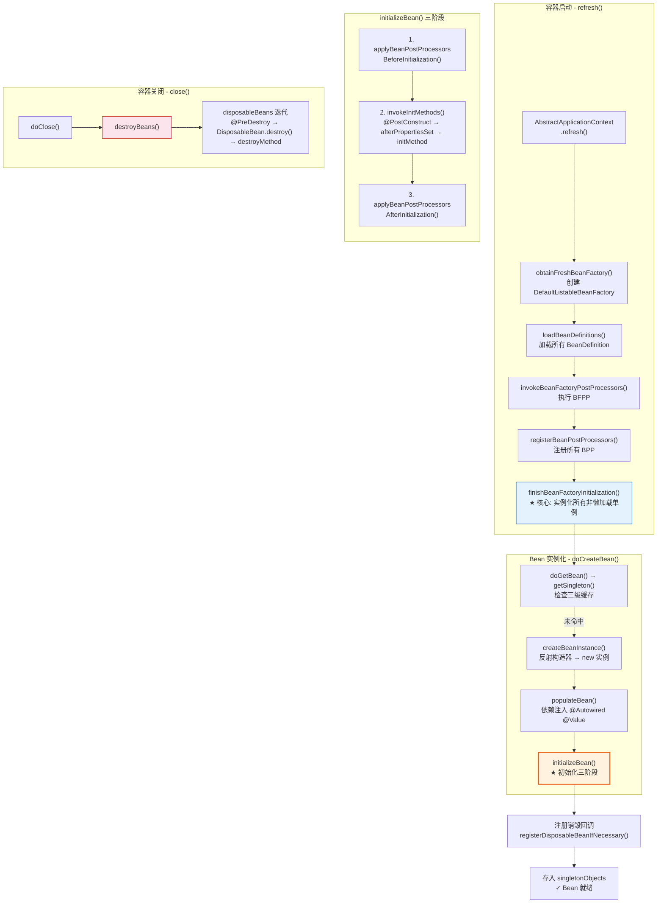
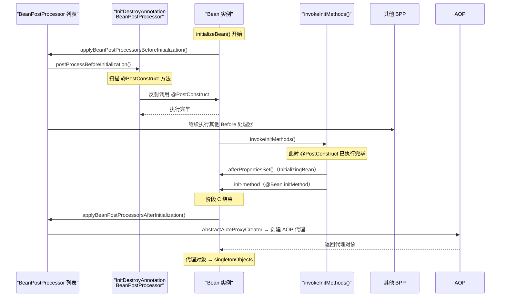
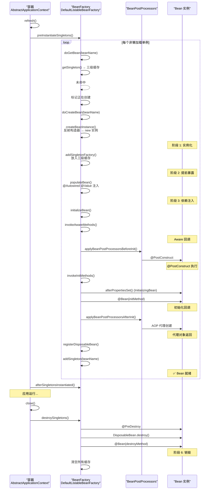
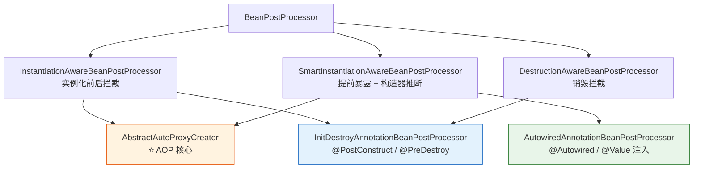

# Spring Bean 生命周期与作用域

> 本文为系列第 4 篇，覆盖：Bean 完整生命周期源码（refresh() → finishBeanFactoryInitialization() → doGetBean() → doCreateBean() → initializeBean() → disposeBeans()）、BeanPostProcessor 深入分析、初始化/销毁回调源码、6 种作用域与源码实现、懒加载机制。

---

## 1. Bean 是什么

**Bean** 就是由 Spring IoC 容器创建、装配、管理生命周期的 Java 对象。

```java
// ❌ 不是 Spring Bean——自己 new 的
UserService service = new UserService();

// ✅ 是 Spring Bean——交由容器管理
@Component
public class UserService { ... }
```

**Bean 的元信息（BeanDefinition）：**

| 属性 | 说明 |
|------|------|
| `beanClass` | 要实例化的 Java 类 |
| `scope` | 作用域（singleton / prototype / 等） |
| `lazyInit` | 是否懒加载 |
| `initMethodName` | 初始化回调方法名 |
| `destroyMethodName` | 销毁回调方法名 |
| `constructorArgumentValues` | 构造器参数 |
| `propertyValues` | 属性值 |
| `autowireMode` | 自动装配模式 |

---

## 2. 生命周期总览（源码全流程）



---

## 3. 生命周期源码深度分析

### 3.1 容器启动入口：refresh()

```java
// AbstractApplicationContext.java
@Override
public void refresh() throws BeansException, IllegalStateException {
    synchronized (this.startupShutdownMonitor) {
        // 1. 准备刷新上下文
        prepareRefresh();

        // 2. 创建 BeanFactory（DefaultListableBeanFactory），加载 BeanDefinition
        ConfigurableListableBeanFactory beanFactory = obtainFreshBeanFactory();

        // 3. 配置 BeanFactory（类加载器、SpEL 解析器等）
        prepareBeanFactory(beanFactory);

        try {
            // 4. 子类后处理（如 Web 容器的特殊配置）
            postProcessBeanFactory(beanFactory);

            // 5. ★ 执行 BeanFactoryPostProcessor（修改 BeanDefinition）
            invokeBeanFactoryPostProcessors(beanFactory);

            // 6. ★ 注册 BeanPostProcessor（注意：只注册不执行）
            registerBeanPostProcessors(beanFactory);

            // 7. 初始化 MessageSource（国际化）
            initMessageSource();

            // 8. 初始化 ApplicationEventMulticaster（事件广播器）
            initApplicationEventMulticaster();

            // 9. 子类特殊初始化（如 Web 容器的内置组件）
            onRefresh();

            // 10. 注册 ApplicationListener
            registerListeners();

            // 11. ★★★ 核心：初始化所有非懒加载单例 Bean
            finishBeanFactoryInitialization(beanFactory);

            // 12. 完成刷新（发布 ContextRefreshedEvent）
            finishRefresh();
        } catch (Throwable ex) {
            destroyBeans();
            cancelRefresh(ex);
            throw ex;
        }
    }
}
```

### 3.2 finishBeanFactoryInitialization() — 创建所有单例 Bean

```java
// AbstractApplicationContext.java
protected void finishBeanFactoryInitialization(ConfigurableListableBeanFactory beanFactory) {
    // 1. 初始化 ConversionService（类型转换服务）
    if (beanFactory.containsBean(CONVERSION_SERVICE_BEAN_NAME)
            && beanFactory.isTypeMatch(CONVERSION_SERVICE_BEAN_NAME, ConversionService.class)) {
        beanFactory.getBean(CONVERSION_SERVICE_BEAN_NAME, ConversionService.class);
    }

    // 2. 冻结配置：此后不能再修改 BeanDefinition
    beanFactory.freezeConfiguration();

    // 3. ★ 预实例化所有非懒加载单例 Bean
    beanFactory.preInstantiateSingletons();
}
```

### 3.3 preInstantiateSingletons() — DefaultListableBeanFactory

```java
// DefaultListableBeanFactory.java
@Override
public void preInstantiateSingletons() throws BeansException {
    // 获取所有 BeanDefinition 的名称（副本快照）
    List<String> beanNames = new ArrayList<>(this.beanDefinitionNames);

    // ===== 第一阶段：创建所有非懒加载单例 Bean =====
    for (String beanName : beanNames) {
        RootBeanDefinition mbd = getMergedLocalBeanDefinition(beanName);
        if (!mbd.isAbstract() && mbd.isSingleton() && !mbd.isLazyInit()) {
            if (isFactoryBean(beanName)) {
                Object bean = getBean(FACTORY_BEAN_PREFIX + beanName);
            } else {
                // ★ 核心调用链：getBean() → doGetBean() → createBean() → doCreateBean() → initializeBean()
                getBean(beanName);
            }
        }
    }

    // ===== 第二阶段：触发 SmartInitializingSingleton 回调 =====
    for (String beanName : beanNames) {
        Object singletonInstance = getSingleton(beanName);
        if (singletonInstance instanceof SmartInitializingSingleton) {
            SmartInitializingSingleton smartSingleton = (SmartInitializingSingleton) singletonInstance;
            smartSingleton.afterSingletonsInstantiated();
        }
    }
}
```

> 💡 **SmartInitializingSingleton**：在**所有**非懒加载单例初始化完成后触发。

```java
@Component
public class HealthChecker implements SmartInitializingSingleton {
    @Override
    public void afterSingletonsInstantiated() {
        // 此时所有 Bean 都已就绪
        System.out.println("✅ 所有 Bean 就绪，进行健康检查...");
        checkAllConnections();
    }
}
```

### 3.4 doGetBean() — 完整创建过程

```java
// AbstractBeanFactory.java
protected <T> T doGetBean(
        String name, @Nullable Class<T> requiredType, @Nullable Object[] args, boolean typeCheckOnly)
        throws BeansException {

    // 1. 转换 Bean 名称（处理 & 前缀、别名）
    String beanName = transformedBeanName(name);

    // 2. ★ 检查缓存——三级缓存！
    Object sharedInstance = getSingleton(beanName);
    if (sharedInstance != null && args == null) {
        // 缓存命中
        bean = getObjectForBeanInstance(sharedInstance, name, beanName, null);
    } else {
        // 3. 检查父容器
        BeanFactory parentBeanFactory = getParentBeanFactory();
        if (parentBeanFactory != null && !containsBeanDefinition(beanName)) {
            return parentBeanFactory.getBean(name, requiredType);
        }

        // 4. 标记 Bean 正在创建（检测循环依赖）
        if (!typeCheckOnly) {
            markBeanAsCreated(beanName);
        }

        try {
            // 5. 获取合并后的 BeanDefinition
            RootBeanDefinition mbd = getMergedLocalBeanDefinition(beanName);

            // 6. 检查并创建依赖
            String[] dependsOn = mbd.getDependsOn();
            if (dependsOn != null) {
                for (String dep : dependsOn) {
                    if (isDependent(beanName, dep)) {
                        throw new BeanCreationException(...);
                    }
                    registerDependentBean(dep, beanName);
                    getBean(dep);
                }
            }

            // ===== 7. ★ 创建 Bean 实例（区分作用域）=====
            if (mbd.isSingleton()) {
                sharedInstance = getSingleton(beanName, () -> createBean(beanName, mbd, args));
                bean = getObjectForBeanInstance(sharedInstance, name, beanName, mbd);
            } else if (mbd.isPrototype()) {
                Object prototypeInstance = createBean(beanName, mbd, args);
                bean = getObjectForBeanInstance(prototypeInstance, name, beanName, mbd);
            } else {
                // request / session / 自定义作用域
                String scopeName = mbd.getScope();
                Scope scope = this.registeredScopes.get(scopeName);
                Object scopedInstance = scope.get(beanName, () -> createBean(beanName, mbd, args));
                bean = getObjectForBeanInstance(scopedInstance, name, beanName, mbd);
            }
        } catch (BeansException ex) {
            cleanupAfterBeanCreationFailure(beanName);
            throw ex;
        }
    }

    // 8. 类型转换
    return adaptBeanInstance(name, bean, requiredType);
}
```

### 3.5 doCreateBean() — Bean 实例化的完整生命周期

```java
// AbstractAutowireCapableBeanFactory.java
protected Object doCreateBean(String beanName, RootBeanDefinition mbd, @Nullable Object[] args) {

    BeanWrapper instanceWrapper = null;
    if (mbd.isSingleton()) {
        instanceWrapper = this.factoryBeanInstanceCache.remove(beanName);
    }

    // ===== 阶段 1：实例化（调用构造器）=====
    if (instanceWrapper == null) {
        instanceWrapper = createBeanInstance(beanName, mbd, args);
    }
    final Object bean = instanceWrapper.getWrappedInstance();

    // ===== 阶段 2：提前暴露（三级缓存）=====
    boolean earlySingletonExposure = (mbd.isSingleton()
            && this.allowCircularReferences && isSingletonCurrentlyInCreation(beanName));
    if (earlySingletonExposure) {
        addSingletonFactory(beanName, () -> getEarlyBeanReference(beanName, mbd, bean));
    }

    Object exposedObject = bean;
    try {
        // ===== 阶段 3：依赖注入 =====
        populateBean(beanName, mbd, instanceWrapper);

        // ===== 阶段 4：初始化（核心三阶段）=====
        exposedObject = initializeBean(beanName, exposedObject, mbd);
    } catch (Throwable ex) {
        throw new BeanCreationException(...);
    }

    // ===== 阶段 5：注册销毁回调 =====
    if (mbd.isSingleton()) {
        registerDisposableBeanIfNecessary(beanName, bean, mbd);
    }

    return exposedObject;
}
```

---

## 4. initializeBean() 源码 —— 初始化的三阶段

```java
// AbstractAutowireCapableBeanFactory.java
protected Object initializeBean(String beanName, Object bean, @Nullable RootBeanDefinition mbd) {
    // ===== 阶段 A：调用 Aware 方法 =====
    // BeanNameAware.setBeanName()
    // BeanClassLoaderAware.setBeanClassLoader()
    // BeanFactoryAware.setBeanFactory()
    invokeAwareMethods(beanName, bean);

    Object wrappedBean = bean;

    // ===== 阶段 B：BeanPostProcessor.postProcessBeforeInitialization() =====
    wrappedBean = applyBeanPostProcessorsBeforeInitialization(wrappedBean, beanName);

    try {
        // ===== 阶段 C：调用初始化方法 =====
        invokeInitMethods(beanName, wrappedBean, mbd);
    } catch (Throwable ex) { throw new BeanCreationException(...); }

    // ===== 阶段 D：BeanPostProcessor.postProcessAfterInitialization() =====
    // ★★★ AOP 在这里创建代理！★★★
    wrappedBean = applyBeanPostProcessorsAfterInitialization(wrappedBean, beanName);

    return wrappedBean;
}
```

### 4.1 初始化三阶段的真实执行顺序



**真实执行顺序：**
```
1. @PostConstruct          ← InitDestroyAnnotationBeanPostProcessor (BPP.Before)
2. afterPropertiesSet()    ← InitializingBean 接口 (invokeInitMethods)
3. @Bean(initMethod)       ← invokeInitMethods
```

### 4.2 @PostConstruct 在哪被调用？

`@PostConstruct` **不是在** `invokeInitMethods()` 中调用的！它由 `InitDestroyAnnotationBeanPostProcessor` 在 `postProcessBeforeInitialization` 阶段调用：

```java
// InitDestroyAnnotationBeanPostProcessor.java
public class InitDestroyAnnotationBeanPostProcessor
        implements DestructionAwareBeanPostProcessor, MergedBeanDefinitionPostProcessor {

    // 在 postProcessBeforeInitialization 阶段调用 @PostConstruct
    @Override
    public Object postProcessBeforeInitialization(Object bean, String beanName) {
        LifecycleMetadata metadata = findLifecycleMetadata(bean.getClass());
        try {
            metadata.invokeInitMethods(bean, beanName);
        } catch (InvocationTargetException ex) {
            throw ex.getTargetException();
        }
        return bean;
    }

    // 在销毁阶段调用 @PreDestroy
    @Override
    public void postProcessBeforeDestruction(Object bean, String beanName) {
        LifecycleMetadata metadata = findLifecycleMetadata(bean.getClass());
        try {
            metadata.invokeDestroyMethods(bean, beanName);
        } catch (InvocationTargetException ex) {
            throw ex.getTargetException();
        }
    }

    // 扫描类找出 @PostConstruct / @PreDestroy 方法
    private LifecycleMetadata buildLifecycleMetadata(Class<?> clazz) {
        List<LifecycleElement> initMethods = new ArrayList<>();
        List<LifecycleElement> destroyMethods = new ArrayList<>();
        for (Method method : clazz.getMethods()) {
            if (method.getAnnotation(PostConstruct.class) != null) {
                initMethods.add(new LifecycleElement(method));
            }
            if (method.getAnnotation(PreDestroy.class) != null) {
                destroyMethods.add(new LifecycleElement(method));
            }
        }
        return new LifecycleMetadata(clazz, initMethods, destroyMethods);
    }
}
```

### 4.3 销毁方法源码

容器关闭时通过 `close()` → `doClose()` → `destroyBeans()` 触发销毁：

```java
// DisposableBeanAdapter.java — 统一管理和调用销毁
class DisposableBeanAdapter implements DisposableBean {
    @Override
    public void destroy() {
        // 1. @PreDestroy（由 InitDestroyAnnotationBeanPostProcessor 处理）
        // 2. DisposableBean.destroy()
        if (this.invokeDisposableBean) {
            ((DisposableBean) this.bean).destroy();
        }
        // 3. @Bean(destroyMethod = "...") — 反射调用
        if (this.destroyMethodRegistered) {
            invokeCustomDestroyMethod(this.destroyMethod);
        }
    }
}

// DefaultSingletonBeanRegistry.java
public void destroySingletons() {
    // 逆序销毁（先创建的后销毁）
    String[] disposableBeanNames = StringUtils.toStringArray(this.disposableBeans.keySet());
    for (int i = disposableBeanNames.length - 1; i >= 0; i--) {
        destroySingleton(disposableBeanNames[i]);
    }
    // 清空所有缓存
    this.singletonObjects.clear();
    this.singletonFactories.clear();
    this.earlySingletonObjects.clear();
    this.disposableBeans.clear();
}
```

---

## 5. 完整生命周期时序图



---

## 6. BeanPostProcessor 深入分析

### 6.1 BeanPostProcessor 接口族谱



### 6.2 BeanPostProcessor vs BeanFactoryPostProcessor

| 对比维度 | BeanFactoryPostProcessor | BeanPostProcessor |
|---------|------------------------|------------------|
| **执行时机** | Bean 实例化之前 | Bean 实例化之后 |
| **操作对象** | BeanDefinition（元数据） | Bean 实例（对象） |
| **可修改** | 作用域、属性值、懒加载等定义 | 创建代理、注入、包装 |
| **典型应用** | `PropertySourcesPlaceholderConfigurer`（解析 `${...}`） | AOP 代理、`@Autowired` 注入 |

---

## 7. Bean 作用域源码

### 7.1 作用域存储结构

```java
// AbstractBeanFactory.java
/** 自定义作用域注册表 */
private final Map<String, Scope> registeredScopes = new HashMap<>();

// Web 容器中默认注册：
// "request" → RequestScope
// "session" → SessionScope
// "application" → ApplicationScope
```

### 7.2 六种作用域

| 作用域 | 说明 | 创建时机 | 实例数 | 源码类 |
|--------|------|---------|-------|--------|
| **singleton**（默认） | 每个 IoC 容器一个实例 | 容器启动/首次引用 | 1 | — |
| **prototype** | 每次获取创建新实例 | 每次 getBean() | 多 | — |
| **request** | 每个 HTTP 请求一个实例 | 每次请求 | 多 | `RequestScope` |
| **session** | 每个 HTTP Session 一个实例 | 每次会话 | 多 | `SessionScope` |
| **application** | 每个 ServletContext 一个实例 | 应用启动 | 1 | `ApplicationScope` |
| **websocket** | 每个 WebSocket 一个实例 | 每次连接 | 多 | `WebSocketScope` |

### 7.3 Singleton 源码

```java
// AbstractAutowireCapableBeanFactory.java
if (mbd.isSingleton()) {
    // getSingleton() 通过 λ 创建并缓存
    sharedInstance = getSingleton(beanName, () -> createBean(beanName, mbd, args));
}

// DefaultSingletonBeanRegistry.java
public Object getSingleton(String beanName, ObjectFactory<?> singletonFactory) {
    synchronized (this.singletonObjects) {
        Object singletonObject = this.singletonObjects.get(beanName);
        if (singletonObject == null) {
            beforeSingletonCreation(beanName);     // 标记创建中
            try {
                singletonObject = singletonFactory.getObject();  // 创建 Bean
                addSingleton(beanName, singletonObject);         // 存入一级缓存
            } finally {
                afterSingletonCreation(beanName);  // 清除创建标记
            }
        }
        return singletonObject;
    }
}
```

### 7.4 Prototype 源码

```java
// AbstractBeanFactory.java
if (mbd.isPrototype()) {
    Object prototypeInstance;
    try {
        beforePrototypeCreation(beanName);
        try {
            prototypeInstance = createBean(beanName, mbd, args);  // 直接创建，不走缓存
        } finally {
            afterPrototypeCreation(beanName);
        }
    }
    bean = getObjectForBeanInstance(prototypeInstance, name, beanName, mbd);
}

// 关键：不经过 getSingleton() → 不进入三级缓存
//       不 registerDisposableBean() → 销毁方法不被 Spring 调用
```

### 7.5 Singleton + Prototype 注入问题

```mermaid
flowchart LR
    subgraph Problem["问题: Singleton 注入 Prototype"]
        A["Singleton<br/>OrderService"] -->|"启动时注入一次"| B["Prototype<br/>ShoppingCart"]
        Note over A: 所有请求共享同一个<br/>ShoppingCart 实例 ❌
    end

    subgraph Solution1["方案 1: ObjectFactory"]
        C["Singleton<br/>OrderService"] -->|"每次 getObject()"| D["ObjectFactory<br/>+ ShoppingCart"]
        D -->|"新实例"| E["新 ShoppingCart ✅"]
    end

    subgraph Solution2["方案 2: ScopedProxy"]
        F["Singleton<br/>OrderService"] -->|"注入代理"| G["代理"]
        G -->|"每次方法调用<br/>从 scope 获取"| H["新 ShoppingCart ✅"]
    end
```

### 7.6 自定义作用域

```java
// 1. 实现 Scope 接口
public class ThreadScope implements Scope {
    private final ThreadLocal<Map<String, Object>> threadScope =
        ThreadLocal.withInitial(HashMap::new);

    @Override
    public Object get(String name, ObjectFactory<?> objectFactory) {
        Map<String, Object> scope = threadScope.get();
        return scope.computeIfAbsent(name, k -> objectFactory.getObject());
    }

    @Override
    public Object remove(String name) {
        return threadScope.get().remove(name);
    }

    @Override
    public void registerDestructionCallback(String name, Runnable callback) {}

    @Override
    public Object resolveContextualObject(String key) { return null; }

    @Override
    public String getConversationId() {
        return "thread-" + Thread.currentThread().getId();
    }
}

// 2. 注册
@Bean
public static BeanFactoryPostProcessor customScopeRegistrar() {
    return beanFactory -> beanFactory.registerScope("thread", new ThreadScope());
}

// 3. 使用
@Component
@Scope("thread")
public class RequestTracker { ... }
```

---

## 8. 懒加载源码

```java
// DefaultListableBeanFactory.preInstantiateSingletons()
for (String beanName : beanNames) {
    RootBeanDefinition mbd = getMergedLocalBeanDefinition(beanName);
    // 跳过懒加载的 Bean
    if (!mbd.isAbstract() && mbd.isSingleton() && !mbd.isLazyInit()) {
        getBean(beanName);
    }
    // @Lazy → isLazyInit() == true → 不在此处创建
}
```

---

## 9. 完整演示

```java
@Component
public class LifecycleDemoBean implements InitializingBean, DisposableBean {

    public LifecycleDemoBean() {
        System.out.println("1️⃣ 构造器: 实例化");
    }

    @Autowired
    public void setMessage(@Value("${app.message:Hello}") String message) {
        System.out.println("2️⃣ 依赖注入: message = " + message);
    }

    @PostConstruct
    public void postConstruct() {
        System.out.println("4️⃣ @PostConstruct: 初始化");
    }

    @Override
    public void afterPropertiesSet() {
        System.out.println("5️⃣ InitializingBean.afterPropertiesSet()");
    }

    @PreDestroy
    public void preDestroy() {
        System.out.println("7️⃣ @PreDestroy: 销毁");
    }

    @Override
    public void destroy() {
        System.out.println("8️⃣ DisposableBean.destroy()");
    }
}

@Component
public class DemoBeanPostProcessor implements BeanPostProcessor {
    @Override
    public Object postProcessBeforeInitialization(Object bean, String beanName) {
        if (bean instanceof LifecycleDemoBean) {
            System.out.println("3️⃣ BPP BeforeInitialization");
        }
        return bean;
    }

    @Override
    public Object postProcessAfterInitialization(Object bean, String beanName) {
        if (bean instanceof LifecycleDemoBean) {
            System.out.println("✅ BPP AfterInitialization");
        }
        return bean;
    }
}

// 输出:
// 1️⃣ 构造器: 实例化
// 2️⃣ 依赖注入: message = Hello
// 3️⃣ BPP BeforeInitialization
// 4️⃣ @PostConstruct: 初始化
// 5️⃣ InitializingBean.afterPropertiesSet()
// ✅ BPP AfterInitialization（准备就绪）
//   ... 应用运行 ...
// 7️⃣ @PreDestroy: 销毁
// 8️⃣ DisposableBean.destroy()
```

---

## 总结

| 知识点 | 要点 |
|--------|------|
| **完整生命周期** | refresh() → preInstantiateSingletons() → doGetBean() → doCreateBean() → initializeBean() |
| **初始化三阶段** | `@PostConstruct`(InitDestroyAnnotationBPP.Before) → `afterPropertiesSet()`(InitializingBean) → `init-method`(@Bean) |
| **AOP 代理时机** | `postProcessAfterInitialization()` — initializeBean 的最后一步 |
| **SmartInitializingSingleton** | 所有单例就绪后的回调 |
| **销毁链** | `@PreDestroy` → `DisposableBean.destroy()` → `destroy-method` |
| **singleton** | 一级缓存 + 无状态安全 |
| **prototype** | 每次新实例，不管理销毁 |
| **懒加载** | 跳过 preInstantiateSingletons() |
