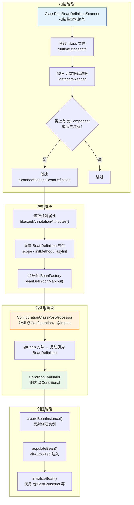
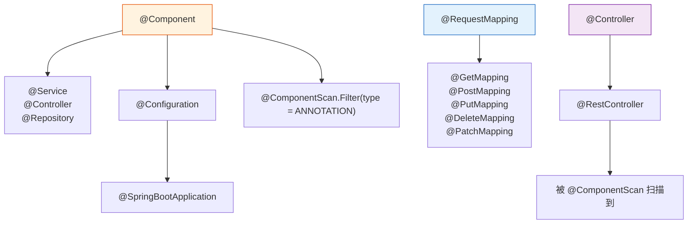
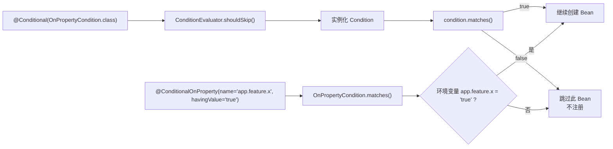
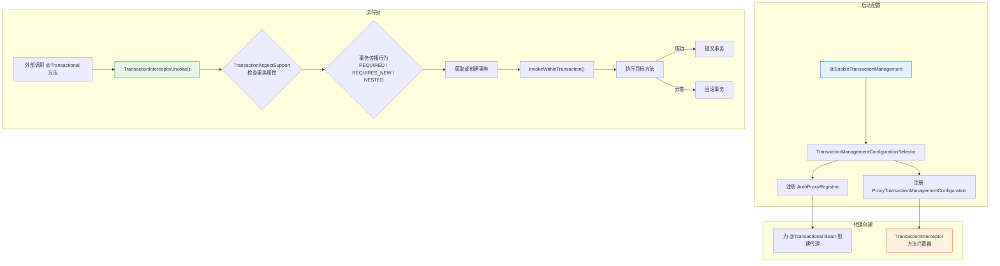
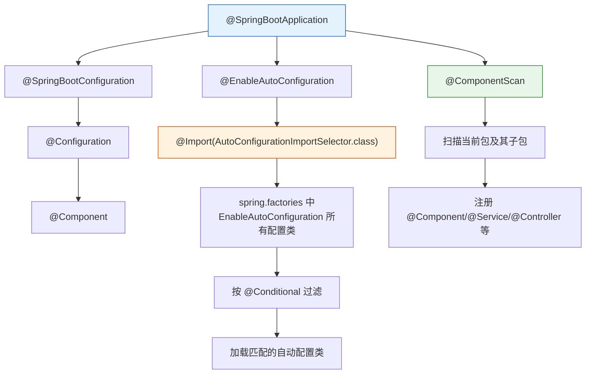

# Spring 注解体系完全指南

> 本文为系列第 5 篇，系统梳理 Spring/Spring Boot 所有核心注解，按功能分类，附源码分析、工作原理和最佳实践。

---

## 1. 注解总览

Spring 从 2.5 版本开始全面拥抱注解驱动开发，到 Spring Boot 时代，注解已成为**主要**配置方式。

```
注解分类：
├── 1. 组件注册（Stereotype）  → @Component 系列
├── 2. 依赖注入                → @Autowired / @Qualifier / @Value
├── 3. 配置类                  → @Configuration / @Bean / @ComponentScan
├── 4. Web 层                  → @RequestMapping 家族 / @RestController
├── 5. 生命周期                → @PostConstruct / @PreDestroy / @Scope
├── 6. 条件装配                → @Conditional 家族 / @Profile
├── 7. AOP                     → @Aspect / @Before / @Around / @Pointcut
├── 8. 事务                    → @Transactional / @EnableTransactionManagement
├── 9. Spring Boot 专属        → @SpringBootApplication / @ConfigurationProperties
├── 10. 数据访问               → @Entity / @Repository / @Query
└── 11. 测试                   → @SpringBootTest / @MockBean / @WebMvcTest
```

---

## 2. 注解处理机制源码

### 2.1 注解处理全流程



### 2.2 @ComponentScan 的处理

```java
// ConfigurationClassPostProcessor.java — 处理 @Configuration 类的核心
public class ConfigurationClassPostProcessor implements BeanFactoryPostProcessor {

    @Override
    public void postProcessBeanFactory(ConfigurableListableBeanFactory beanFactory) {
        // 处理所有 @Configuration 类
        processConfigBeanDefinitions(beanFactory);
    }

    public void processConfigBeanDefinitions(ConfigurableListableBeanFactory beanFactory) {
        // 1. 找出所有标注 @Configuration 的 BeanDefinition
        List<BeanDefinitionHolder> configCandidates = new ArrayList<>();
        for (String name : beanFactory.getBeanDefinitionNames()) {
            BeanDefinition bd = beanFactory.getBeanDefinition(name);
            if (bd.getAttribute(ConfigurationClassUtils.CONFIGURATION_CLASS_ATTRIBUTE) != null) {
                configCandidates.add(new BeanDefinitionHolder(bd, name));
            }
        }

        // 2. 创建 ConfigurationClassParser 解析每个配置类
        ConfigurationClassParser parser = new ConfigurationClassParser(...);
        parser.parse(configCandidates);  // ← 解析 @ComponentScan @Import @Bean 等
        parser.validate();

        // 3. 通过 parser 读取到的配置，注册更多 BeanDefinition
        Set<ConfigurationClass> configClasses = parser.getConfigurationClasses();
        // 会处理 @Bean 方法和 @Import 导入的类
        this.reader.loadBeanDefinitions(configClasses);
    }
}
```

### 2.3 ClassPathBeanDefinitionScanner 扫描过程

```java
// ClassPathBeanDefinitionScanner.java
public class ClassPathBeanDefinitionScanner ... {

    // 设置默认的注解过滤器：包含 @Component 及其派生注解
    protected void registerDefaultFilters() {
        // ★ 核心：includeFilters 默认包含 @Component
        this.includeFilters.add(new AnnotationTypeFilter(Component.class));

        // 同时也包含 @ManagedBean (JSR-250) 和 @Named (JSR-330)
        ClassLoader cl = ClassPathScanningCandidateComponentFinder.class.getClassLoader();
        try {
            this.includeFilters.add(new AnnotationTypeFilter(
                ((Class<? extends Annotation>) cl.loadClass("javax.annotation.ManagedBean")), false));
        } catch (ClassNotFoundException ex) { /* JSR-250 not on classpath */ }
        try {
            this.includeFilters.add(new AnnotationTypeFilter(
                ((Class<? extends Annotation>) cl.loadClass("jakarta.inject.Named")), false));
        } catch (ClassNotFoundException ex) { /* Jakarta Inject not on classpath */ }
    }

    public int scan(String... basePackages) {
        // 扫描指定包
        Set<BeanDefinitionHolder> beanDefinitions = doScan(basePackages);
        // 注册到容器
        registerBeanDefinitions(beanDefinitions);
        return beanDefinitions.size();
    }

    protected Set<BeanDefinitionHolder> doScan(String... basePackages) {
        for (String basePackage : basePackages) {
            // 1. 查找符合条件的候选组件
            Set<BeanDefinition> candidates = findCandidateComponents(basePackage);
            for (BeanDefinition candidate : candidates) {
                // 2. 解析 @Scope 注解
                ScopeMetadata scopeMetadata = this.scopeMetadataResolver.resolveScopeMetadata(candidate);
                candidate.setScope(scopeMetadata.getScopeName());

                // 3. 生成 Bean 名称
                String beanName = this.beanNameGenerator.generateBeanName(candidate, this.registry);

                // 4. 设置默认属性 (@Lazy @Primary @DependsOn 等)
                if (candidate instanceof AbstractBeanDefinition) {
                    postProcessBeanDefinition((AbstractBeanDefinition) candidate, beanName);
                }
                // 5. 处理 @Resource/@Lookup 等注解
                if (candidate instanceof AnnotatedBeanDefinition) {
                    AnnotationConfigUtils.processCommonDefinitionAnnotations((AnnotatedBeanDefinition) candidate);
                }

                beanDefinitions.add(new BeanDefinitionHolder(candidate, beanName));
            }
        }
        return beanDefinitions;
    }
}
```

### 2.4 元注解的继承机制

```java
// @Service 为什么能被扫描到？
// 因为它元注解了 @Component

@Target(ElementType.TYPE)
@Retention(RetentionPolicy.RUNTIME)
@Component     // ★ 元注解：Service 是 Component 的一种
public @interface Service { ... }

// 同样 @RestController = @Controller + @ResponseBody
@Target(ElementType.TYPE)
@Retention(RetentionPolicy.RUNTIME)
@Controller      // ★ 元注解
@ResponseBody    // ★ 元注解
public @interface RestController { ... }
```

**注解继承的解析源码：**

```java
// AnnotationTypeFilter.java — 判断一个类是否有某个注解（包括元注解）
public class AnnotationTypeFilter extends AbstractTypeHierarchyTraversingFilter {

    @Override
    protected boolean matchSelf(MetadataReader metadataReader) {
        // 检查当前类是否有 @Component（或派生注解）
        AnnotationMetadata metadata = metadataReader.getAnnotationMetadata();
        return metadata.hasAnnotation(this.annotationType.getName())
            || metadata.hasMetaAnnotation(this.annotationType.getName());
    }
}

// AnnotationMetadataReadingVisitor — 通过 ASM 读取注解
// 不仅读取直接注解，还递归读取元注解
// @Service → 发现 @Component → hasMetaAnnotation("org.springframework.stereotype.Component") == true
```



---

## 3. 组件注册注解

### 3.1 核心注解

| 注解 | 语义 | 用途说明 |
|------|------|---------|
| `@Component` | 通用组件 | 标记任何 Spring 管理的 Bean（最基础） |
| `@Service` | 业务层 | 服务层的类（语义化） |
| `@Repository` | 数据层 | DAO/Repository 类，额外提供异常翻译 |
| `@Controller` | 控制层 | Spring MVC 控制器 |
| `@RestController` | REST 控制器 | = `@Controller` + `@ResponseBody` |

```java
@Component
public class EmailValidator { ... }

@Service
public class UserService { ... }

@Repository
public class UserRepository { ... }

@Controller
public class UserController { ... }

@RestController
@RequestMapping("/api/users")
public class UserApiController { ... }
```

### 3.2 @Repository 的异常翻译

通过 `PersistenceExceptionTranslationPostProcessor`（一个 BeanPostProcessor）实现：

```java
// PersistenceExceptionTranslationPostProcessor.java
// 为所有 @Repository 标注的 Bean 创建代理
// 代理捕获 SQLException → 转换为 Spring 的 DataAccessException 体系
// 转换好后由 DataAccessUtils 根据异常层次匹配对应子类

// 示例：org.springframework.dao.DataIntegrityViolationException
//       org.springframework.dao.DuplicateKeyException
```

---

## 4. 依赖注入注解

### 4.1 @Autowired

```java
@Service
public class UserService {
    private final UserRepository userRepository;

    public UserService(UserRepository userRepository) {  // 构造器注入（推荐）
        this.userRepository = userRepository;
    }
}
```

**参数说明：**
- `required = true`（默认）：找不到 Bean 就报错
- `required = false`：找不到就跳过

**内部处理：** 见文章 02 IoC/DI 的 `AutowiredAnnotationBeanPostProcessor` 源码分析。

### 4.2 @Qualifier / @Primary

```java
@Primary  // 默认选这个
@Component
public class CreditCardPaymentService implements PaymentService { ... }

@Component("paypalPaymentService")
public class PayPalPaymentService implements PaymentService { ... }

// 使用时指定
@Service
public class OrderService {
    public OrderService(@Qualifier("paypalPaymentService") PaymentService paymentService) {
        this.paymentService = paymentService;
    }
}
```

### 4.3 @Value

```java
@Service
public class AppConfig {
    @Value("${app.name:MyApp}")         // 配置文件读取，默认值 MyApp
    private String appName;

    @Value("#{systemProperties['user.home']}")  // SpEL
    private String userHome;

    @Value("#{2 * T(java.lang.Math).PI}")       // SpEL 计算
    private double pi;
}
```

### 4.4 集合注入（策略模式）

```java
@Service
public class NotificationService {
    // 注入所有 PaymentService 实现
    private final List<PaymentService> paymentServices;
    // 带名称的 Map
    private final Map<String, PaymentService> paymentServiceMap;

    public NotificationService(
            List<PaymentService> paymentServices,
            Map<String, PaymentService> paymentServiceMap) {
        this.paymentServices = paymentServices;
        this.paymentServiceMap = paymentServiceMap;
    }
}
```

---

## 5. 配置类注解

### 5.1 @Configuration + @Bean

```java
@Configuration
public class AppConfig {
    @Bean
    public RestTemplate restTemplate() {
        return new RestTemplate();
    }
}
```

**内部原理：** `@Configuration` 类会被 CGLIB 增强为配置类代理：

```java
// 普通 @Configuration 被 CGLIB 增强后：
// @Bean 方法调用会先检查单例缓存
// 多次调用 restTemplate() 返回同一个实例

// 如果写的是 @Component（不是 @Configuration）：
// @Bean 方法没有代理，每次调用都是新实例！（称为 Lite 模式）
```

### 5.2 @ComponentScan

```java
@Configuration
@ComponentScan(
    basePackages = {"com.example.service", "com.example.repository"},
    excludeFilters = @ComponentScan.Filter(
        type = FilterType.REGEX,
        pattern = ".*Test.*"
    ),
    lazyInit = true
)
public class AppConfig { ... }
```

**FilterType 支持：**
| FilterType | 说明 |
|-----------|------|
| ANNOTATION | 按注解过滤 |
| ASSIGNABLE_TYPE | 按类/接口 |
| ASPECTJ | AspectJ 表达式 |
| REGEX | 正则表达式 |
| CUSTOM | 自定义 TypeFilter |

### 5.3 @Import / @ImportResource

```java
// 导入其他配置类
@Configuration
@Import({DatabaseConfig.class, CacheConfig.class})
public class AppConfig { ... }

// 导入 XML 配置
@Configuration
@ImportResource("classpath:legacy-context.xml")
public class AppConfig { ... }
```

### 5.4 @PropertySource

```java
@Configuration
@PropertySource(value = {"classpath:db.properties", "classpath:app.properties"},
                ignoreResourceNotFound = true)
public class AppConfig {
    @Value("${db.url}")
    private String dbUrl;
}
```

---

## 6. @Conditional 条件装配源码

### 6.1 @Conditional 评估流程

```java
// ConditionEvaluator.java — 评估 @Conditional 的核心
class ConditionEvaluator {

    // 判断一个 BeanDefinition 是否应该被跳过
    public boolean shouldSkip(AnnotatedTypeMetadata metadata, ConfigurationPhase phase) {
        // 1. 获取类上所有 @Conditional 注解
        for (AnnotationAttributes attributes : getConditionAnnotations(metadata)) {
            // 2. 获取条件类
            Class<? extends Condition> conditionClass = (Class<? extends Condition>)
                attributes.getClass("value");

            // 3. 实例化条件类
            Condition condition = ConditionFactory.createCondition(conditionClass);

            // 4. 执行 matches() 判断
            if (!condition.matches(this.context, new AnnotationMetadataAnnotationReader(metadata))) {
                return true;  // 条件不满足 → 跳过这个 Bean
            }
        }
        return false;  // 所有条件都满足 → 创建 Bean
    }
}
```



### 6.2 Spring Boot 的条件注解家族

| 注解 | 功能 |
|------|------|
| `@ConditionalOnClass` | classpath 存在指定类时 |
| `@ConditionalOnMissingClass` | classpath 不存在指定类时 |
| `@ConditionalOnBean` | 容器中存在指定 Bean 时 |
| `@ConditionalOnMissingBean` | 容器中不存在指定 Bean 时 |
| `@ConditionalOnProperty` | 配置项有特定值时 |
| `@ConditionalOnExpression` | SpEL 表达式的值为 true 时 |
| `@ConditionalOnResource` | 类路径存在指定资源时 |
| `@ConditionalOnWebApplication` | 当前环境是 Web 时 |
| `@ConditionalOnNotWebApplication` | 当前环境不是 Web 时 |
| `@ConditionalOnJava` | Java 版本匹配时 |

### 6.3 @Profile — 基于环境的条件

```java
@Component
@Profile("dev")
public class DevDataSource implements DataSource { ... }

@Component
@Profile("prod")
public class ProdDataSource implements DataSource { ... }

// 本质：@Profile 被 @Conditional(ProfileCondition.class) 元注解
@Target(ElementType.TYPE)
@Retention(RetentionPolicy.RUNTIME)
@Conditional(ProfileCondition.class)
public @interface Profile {
    String[] value();
}
```

---

## 7. Web 层注解

### 7.1 @RequestMapping 家族

| 注解 | 等价于 | 说明 |
|------|-------|------|
| `@RequestMapping` | — | 通用请求映射 |
| `@GetMapping` | `@RequestMapping(method = GET)` | 查询 |
| `@PostMapping` | `@RequestMapping(method = POST)` | 创建 |
| `@PutMapping` | `@RequestMapping(method = PUT)` | 全量更新 |
| `@PatchMapping` | `@RequestMapping(method = PATCH)` | 部分更新 |
| `@DeleteMapping` | `@RequestMapping(method = DELETE)` | 删除 |

```java
@RestController
@RequestMapping("/api/users")
public class UserController {
    @GetMapping("/{id}")
    public User get(@PathVariable Long id) { ... }

    @PostMapping
    public User create(@RequestBody @Valid UserCreateReq req) { ... }

    @PutMapping("/{id}")
    public User update(@PathVariable Long id, @RequestBody UserUpdateReq req) { ... }

    @DeleteMapping("/{id}")
    public void delete(@PathVariable Long id) { ... }
}
```

### 7.2 参数绑定注解

| 注解 | 说明 | 示例 |
|------|------|------|
| `@PathVariable` | URL 路径参数 | `/users/{id}` → `@PathVariable Long id` |
| `@RequestParam` | 查询参数 | `?page=1&size=20` → `@RequestParam int page` |
| `@RequestBody` | 请求体 | JSON → Java 对象 |
| `@RequestHeader` | 请求头 | `header-name` → 方法参数 |
| `@CookieValue` | Cookie | Cookie 值 |
| `@ModelAttribute` | 模型绑定 | 表单数据 → 对象 |
| `@SessionAttributes` | Session 属性 | 存储在 session 中的模型属性 |
| `@RequestAttribute` | Request 属性 | 存储在 request 中的属性 |

---

## 8. @Transactional 事务源码



### 8.1 事务代理源码

```java
// TransactionInterceptor.java
public class TransactionInterceptor extends TransactionAspectSupport implements MethodInterceptor {

    @Override
    @Nullable
    public Object invoke(MethodInvocation invocation) throws Throwable {
        // 获取当前方法的事务属性（@Transactional 的配置）
        TransactionAttributeSource tas = getTransactionAttributeSource();
        TransactionAttribute ta = tas.getTransactionAttribute(invocation.getMethod(), invocation.getThis().getClass());

        if (ta == null) {
            // 没有 @Transactional → 直接执行
            return invocation.proceed();
        }

        // 执行带事务的调用
        return invokeWithinTransaction(invocation.getMethod(), invocation.getThis().getClass(),
                invocation::proceed, ta, invocation.getThis());
    }
}

// 获取事务属性 — 解析 @Transactional 注解
// Propagation.REQUIRED → 需要事务
// Propagation.REQUIRES_NEW → 创建新事务
// Propagation.NESTED → 嵌套事务（Savepoint）
// rollbackFor → 哪些异常触发回滚
// readOnly → 只读优化
// timeout → 超时时间
// isolation → 隔离级别
```

---

## 9. @SpringBootApplication 源码

```java
// @SpringBootApplication = 三个注解的组合
@Target(ElementType.TYPE)
@Retention(RetentionPolicy.RUNTIME)
@Documented
@Inherited

@SpringBootConfiguration          // = @Configuration（标记为配置类）
@EnableAutoConfiguration          // 启动自动配置
@ComponentScan(                   // 组件扫描
    excludeFilters = @ComponentScan.Filter(
        type = FilterType.CUSTOM,
        classes = TypeExcludeFilter.class
    )
)
public @interface SpringBootApplication { ... }
```



---

## 10. 生命周期注解

| 注解 | 说明 |
|------|------|
| `@PostConstruct` | 依赖注入完成后执行（推荐用于初始化） |
| `@PreDestroy` | 容器销毁前执行（推荐用于清理） |
| `@Scope` | 定义 Bean 作用域 |
| `@Lazy` | 懒加载 |
| `@DependsOn` | 指定依赖的 Bean（确保先创建） |
| `@Role` | Bean 角色（APPLICATION / INFRASTRUCTURE） |
| `@Description` | Bean 描述 |

```java
@Component
@Scope("singleton")
@Lazy(false)
@DependsOn({"dataSource", "cacheManager"})
public class UserService {

    @PostConstruct
    public void init() {
        // 初始化逻辑
    }

    @PreDestroy
    public void destroy() {
        // 清理逻辑
    }
}
```

---

## 11. AOP 注解

| 注解 | 说明 |
|------|------|
| `@Aspect` | 标记切面类 |
| `@Pointcut` | 定义切入点表达式 |
| `@Before` | 前置通知 |
| `@After` | 后置通知（Finally） |
| `@AfterReturning` | 返回通知 |
| `@AfterThrowing` | 异常通知 |
| `@Around` | 环绕通知 |
| `@Order` | 控制多个切面的执行顺序 |
| `@EnableAspectJAutoProxy` | 开启 @AspectJ 支持 |

```java
@Aspect
@Component
@Order(1)
public class LoggingAspect {

    @Pointcut("@annotation(com.example.annotation.OperationLog)")
    public void logPointcut() {}

    @Around("logPointcut()")
    public Object logAround(ProceedingJoinPoint pjp) throws Throwable {
        long start = System.currentTimeMillis();
        try {
            return pjp.proceed();
        } finally {
            log.info("{} 耗时 {}ms", pjp.getSignature(), System.currentTimeMillis() - start);
        }
    }
}
```

---

## 12. Spring Boot 专属注解

| 注解 | 说明 |
|------|------|
| `@SpringBootApplication` | 启动类组合注解 |
| `@EnableAutoConfiguration` | 启用自动配置 |
| `@AutoConfiguration` | 标注自动配置类（3.x 替代 factory） |
| `@ConfigurationProperties` | 类型安全配置绑定 |
| `@EnableConfigurationProperties` | 启用配置属性类 |
| `@ConfigurationPropertiesScan` | 扫描 @ConfigurationProperties |
| `@ConditionalOnProperty` | 条件装配（配置项） |
| `@ConditionalOnClass` | 条件装配（类存在） |
| `@ConditionalOnMissingBean` | 条件装配（Bean 不存在） |

### @ConfigurationProperties 源码

```java
// 类型安全的配置绑定
@ConfigurationProperties(prefix = "app.datasource")
@Component
public class DataSourceProperties {
    private String url;
    private String username;
    private String password;

    // getter / setter...
}

// 绑定过程：Environment → Binder → targetClass
// 由 ConfigurationPropertiesBindingPostProcessor 在 Bean 初始化时执行：
// 1. 获取 @ConfigurationProperties(prefix = "app.datasource")
// 2. 从 Environment 中查找 app.datasource.url / app.datasource.username
// 3. 通过属性设置器注入到 Bean 实例
// 4. 支持宽松绑定：app.datasource.jdbc-url → jdbcUrl
```

---

## 13. 数据访问注解

| 注解 | 说明 |
|------|------|
| `@Entity` | JPA 实体类 |
| `@Table` | 映射表名 |
| `@Column` | 映射列名 |
| `@Id` | 主键 |
| `@GeneratedValue` | 主键生成策略 |
| `@OneToMany / @ManyToOne` | 关联关系 |
| `@Repository` | 数据访问组件（异常翻译） |
| `@Query` | 自定义 JPQL 查询 |
| `@Modifying` | 更新/删除操作 |
| `@Transactional` | 事务管理 |
| `@EnableJpaRepositories` | 启用 JPA Repository |
| `@EnableTransactionManagement` | 启用声明式事务 |
| `@EnableJpaAuditing` | 启用 JPA 审计 |
| `@CreatedDate / @LastModifiedDate` | 审计时间戳 |
| `@CreatedBy / @LastModifiedBy` | 审计操作人 |

---

## 14. 测试注解

| 注解 | 说明 |
|------|------|
| `@SpringBootTest` | 完整 Spring 上下文集成测试 |
| `@WebMvcTest` | 仅 Web 层切片测试 |
| `@DataJpaTest` | 仅 JPA 层切片测试 |
| `@RestClientTest` | REST 客户端切片测试 |
| `@JsonTest` | JSON 序列化切片测试 |
| `@MockBean` | 注入 Mockito Mock |
| `@SpyBean` | 注入 Mockito Spy |
| `@AutoConfigureMockMvc` | 配置 MockMvc |
| `@TestPropertySource` | 测试专用配置 |
| `@ActiveProfiles` | 指定测试 Profile |

---

## 15. 其他常用注解

| 注解 | 说明 |
|------|------|
| `@EnableScheduling` | 启用定时任务 |
| `@Scheduled` | 定时任务 |
| `@EnableAsync` | 启用异步调用 |
| `@Async` | 异步方法 |
| `@EnableCaching` | 启用缓存 |
| `@Cacheable` | 方法结果缓存 |
| `@CacheEvict` | 缓存清除 |
| `@EnableRetry` | 启用重试 |
| `@Retryable` | 方法重试 |
| `@Recover` | 重试耗尽后的兜底 |

---

## 16. 注解组合与扩展

### 16.1 自定义组合注解

```java
// 将常用注解组合为一个
@Target(ElementType.TYPE)
@Retention(RetentionPolicy.RUNTIME)
@Documented
@RestController
@RequestMapping("/api/v1")
public @interface V1RestController { }

// 使用：
@V1RestController
public class UserController { ... }  // 自动具备 @RestController + @RequestMapping("/api/v1")
```

### 16.2 自定义条件注解

```java
@Target({ElementType.TYPE, ElementType.METHOD})
@Retention(RetentionPolicy.RUNTIME)
@Conditional(OnRedisModeCondition.class)
public @interface ConditionalOnRedisMode {
    String value();  // "standalone" / "sentinel" / "cluster"
}

public class OnRedisModeCondition implements Condition {
    @Override
    public boolean matches(ConditionContext context, AnnotatedTypeMetadata metadata) {
        String mode = (String) metadata.getAnnotationAttributes(
            ConditionalOnRedisMode.class.getName()).get("value");
        String actual = context.getEnvironment().getProperty("redis.mode");
        return mode.equals(actual);
    }
}
```

---

## 总结

| 分类 | 核心注解 | 原理一句话 |
|------|---------|-----------|
| **组件注册** | @Component 系列 | @Component 作为元注解，被 ClassPathBeanDefinitionScanner 扫描 |
| **依赖注入** | @Autowired / @Value | AutowiredAnnotationBeanPostProcessor 在 populateBean() 阶段处理 |
| **配置类** | @Configuration / @Bean | ConfigurationClassPostProcessor 处理，CGLIB 增强保证单例 |
| **条件装配** | @Conditional 家族 | ConditionEvaluator 评估条件，不满足就跳过 BeanDefinition |
| **Web** | @RequestMapping 家族 | RequestMappingHandlerMapping 在启动时收集映射 |
| **事务** | @Transactional | TransactionInterceptor 创建事务代理，管理 begin/commit/rollback |
| **Boot** | @SpringBootApplication | 组合了 @Configuration + @ComponentScan + @EnableAutoConfiguration |
| **测试** | @SpringBootTest | 创建完整或切片的 ApplicationContext |
