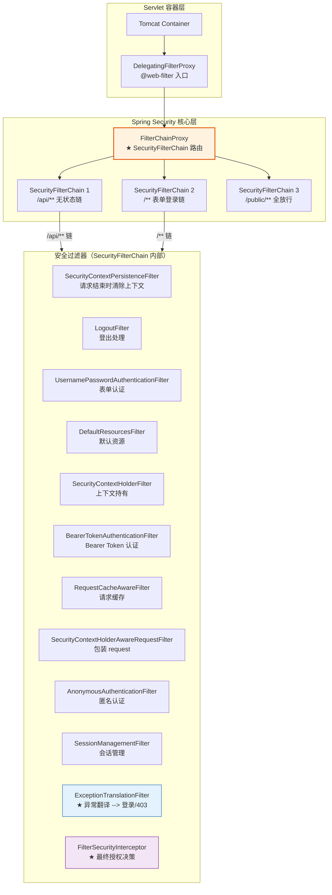
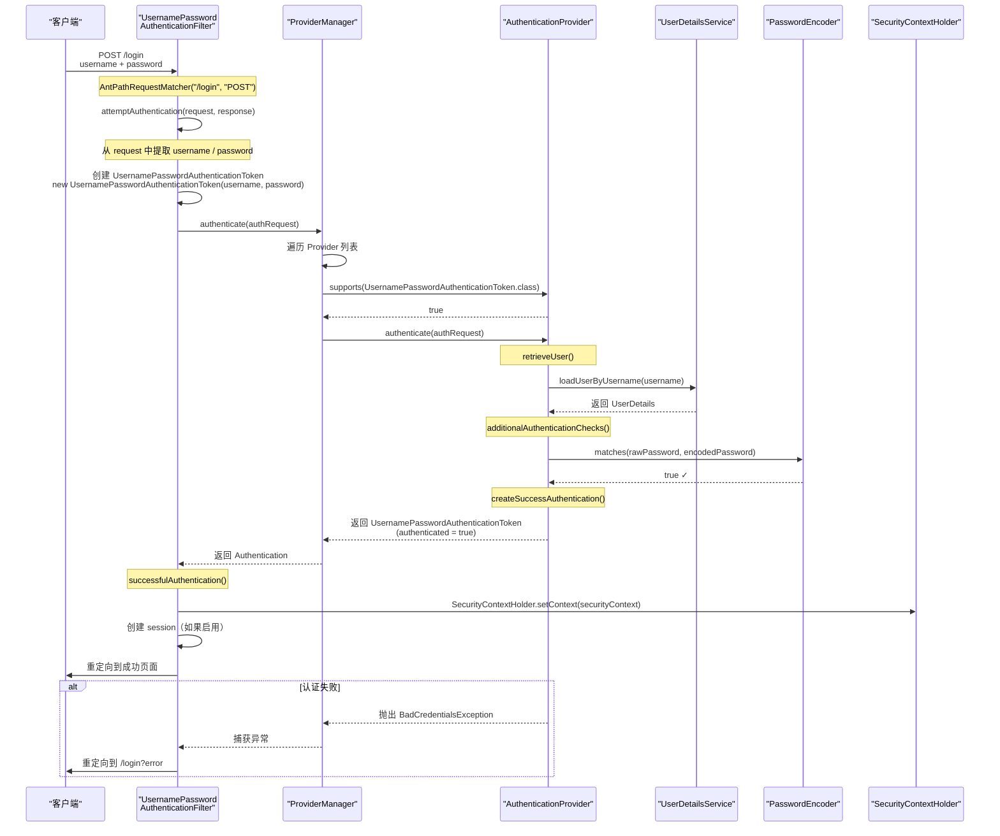
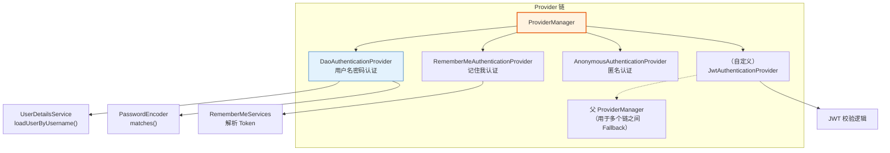
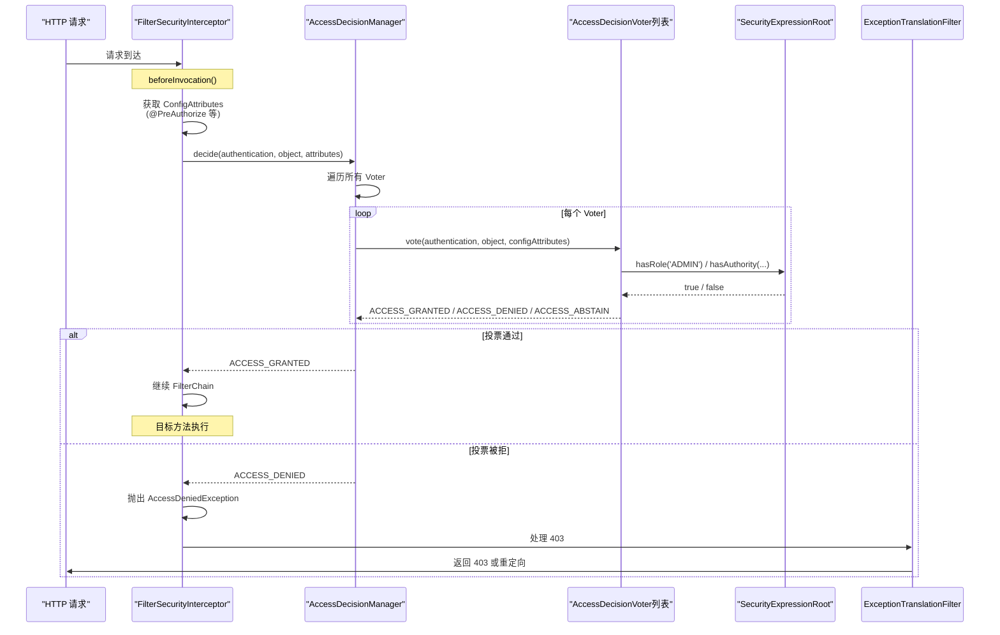

# Spring Security 安全体系完全指南

> 本文为系列第 6 篇，覆盖：FilterChain 架构源码、Authentication 完整流程、ProviderManager 链式认证、SecurityContextHolder 传播、JWT 无状态认证、OAuth2 入门、Spring Boot Security 自动配置、生产最佳实践。

---

## 1. Spring Security 是什么

Spring Security 是 Spring 生态的**安全框架**，提供：

- **认证（Authentication）**：你是谁？
- **授权（Authorization）**：你能做什么？
- **防护（Protection）**：防 CSRF、XSS、点击劫持

---

## 2. 核心架构（源码级）

### 2.1 过滤器链架构



### 2.2 DelegatingFilterProxy — Servlet 与 Spring 的桥梁

```java
// DelegatingFilterProxy.java — 在 web.xml 或 @WebFilter 中注册
// 作用：将 Servlet 容器的 Filter 委托给 Spring 容器中的 Bean
public class DelegatingFilterProxy extends GenericFilterBean {

    private String targetBeanName;  // 默认为 "springSecurityFilterChain"
    private volatile Filter delegate;  // 实际代理的 Filter

    @Override
    public void doFilter(ServletRequest request, ServletResponse response,
                          FilterChain chain) throws ServletException, IOException {
        Filter delegate = getDelegate();  // 从 Spring 容器获取

        // 委托给真正的 FilterChainProxy
        delegate.doFilter(request, response, chain);
    }

    private Filter getDelegate() {
        if (this.delegate == null) {
            synchronized (this.delegateMonitor) {
                // 从 Spring 容器获取名为 "springSecurityFilterChain" 的 Bean
                this.delegate = getApplicationContext()
                    .getBean(TARGET_BEAN_NAME, Filter.class);
            }
        }
        return this.delegate;
    }
}
```

### 2.3 FilterChainProxy — 路由到正确的 SecurityFilterChain

```java
// FilterChainProxy.java — 真正的安全过滤器入口
public class FilterChainProxy extends GenericFilterBean {

    // 多个 SecurityFilterChain 的列表
    private List<SecurityFilterChain> filterChains;

    @Override
    public void doFilter(ServletRequest request, ServletResponse response,
                          FilterChain chain) throws ServletException, IOException {
        doFilterInternal(request, response, chain);
    }

    private void doFilterInternal(ServletRequest request, ServletResponse response,
                                    FilterChain chain) throws ServletException, IOException {
        FirewalledRequest fwRequest = new FirewalledRequest((HttpServletRequest) request);
        // 创建虚拟的 FilterChain — 不要把请求返回给 Servlet 容器的原始 chain
        FilterChain originalChain = chain;

        // 收集当前请求需要经过的所有安全过滤器
        List<Filter> filters = getFilters(fwRequest);

        if (filters == null || filters.size() == 0) {
            // 没有匹配的 SecurityFilterChain
            originalChain.doFilter(fwRequest, response);
            return;
        }

        // 创建虚拟的 FilterChain — 包含所有匹配的安全过滤器
        VirtualFilterChain vfc = new VirtualFilterChain(fwRequest, chain, filters);
        vfc.doFilter(fwRequest, response);
    }

    // ★ 根据请求匹配对应的 SecurityFilterChain
    private List<Filter> getFilters(HttpServletRequest request) {
        for (SecurityFilterChain chain : this.filterChains) {
            if (chain.matches(request)) {  // 匹配 requestMatcher
                return chain.getFilters();  // 返回该链的所有过滤器
            }
        }
        return null;
    }
}
```

### 2.4 SecurityConfig 配置多 FilterChain

```java
@Configuration
@EnableWebSecurity
public class SecurityConfig {

    // ===== 链 1：/api/** 无状态（JWT）=====
    @Bean
    @Order(1)
    public SecurityFilterChain apiFilterChain(HttpSecurity http) throws Exception {
        http
            .securityMatcher("/api/**")  // 匹配 /api/**
            .authorizeHttpRequests(auth -> auth
                .requestMatchers("/api/auth/**").permitAll()
                .anyRequest().authenticated()
            )
            .sessionManagement(session -> session
                .sessionCreationPolicy(SessionCreationPolicy.STATELESS)  // 无状态
            )
            .csrf(AbstractHttpConfigurer::disable)  // REST 不需 CSRF
            // 添加 JWT 认证过滤器
            .addFilterBefore(new JwtAuthenticationFilter(), UsernamePasswordAuthenticationFilter.class);
        return http.build();
    }

    // ===== 链 2：/** 表单登录（有状态）=====
    @Bean
    @Order(2)
    public SecurityFilterChain defaultFilterChain(HttpSecurity http) throws Exception {
        http
            .authorizeHttpRequests(auth -> auth
                .requestMatchers("/login", "/register", "/css/**", "/js/**").permitAll()
                .anyRequest().authenticated()
            )
            .formLogin(form -> form
                .loginPage("/login").permitAll()
            )
            .rememberMe(remember -> remember
                .key("remember-me-key")
                .tokenValiditySeconds(86400 * 7)  // 7 天
            );
        return http.build();
    }

    // ===== 链 3：/public/** 无需认证 =====
    @Bean
    @Order(3)
    public SecurityFilterChain publicFilterChain(HttpSecurity http) throws Exception {
        http
            .securityMatcher("/public/**")
            .authorizeHttpRequests(auth -> auth.anyRequest().permitAll());
        return http.build();
    }
}
```

---

## 3. 认证流程源码

### 3.1 认证完整流程



### 3.2 UsernamePasswordAuthenticationFilter 源码

```java
// UsernamePasswordAuthenticationFilter.java
public class UsernamePasswordAuthenticationFilter extends AbstractAuthenticationProcessingFilter {

    // 默认从请求参数中获取
    public static final String SPRING_SECURITY_FORM_USERNAME_KEY = "username";
    public static final String SPRING_SECURITY_FORM_PASSWORD_KEY = "password";

    // 默认拦截 POST /login
    public UsernamePasswordAuthenticationFilter() {
        super(new AntPathRequestMatcher("/login", "POST"));
    }

    @Override
    public Authentication attemptAuthentication(HttpServletRequest request,
                                                  HttpServletResponse response)
            throws AuthenticationException {
        // 1. 提取参数
        String username = obtainUsername(request);
        String password = obtainPassword(request);

        if (username == null) username = "";
        if (password == null) password = "";

        username = username.trim();

        // 2. 创建未认证的 Token
        UsernamePasswordAuthenticationToken authRequest =
            new UsernamePasswordAuthenticationToken(username, password);

        // 3. 设置请求详情（IP、SessionId 等）
        setDetails(request, authRequest);

        // 4. ★ 委托给 AuthenticationManager
        return this.getAuthenticationManager().authenticate(authRequest);
    }

    // 成功后：创建 session、往 SecurityContextHolder 放认证信息、调用成功处理器
    @Override
    protected void successfulAuthentication(HttpServletRequest request,
                                              HttpServletResponse response,
                                              FilterChain chain,
                                              Authentication authResult) {
        SecurityContext context = SecurityContextHolder.createEmptyContext();
        context.setAuthentication(authResult);
        SecurityContextHolder.setContext(context);

        // 创建 session（可选）
        if (sessionStrategy != null) {
            sessionStrategy.onAuthentication(authResult, request, response);
        }

        // 触发成功处理器（默认：重定向到之前被保护的页面或 "/"）
        successHandler.onAuthenticationSuccess(request, response, authResult);
    }
}
```

### 3.3 ProviderManager — 链式认证

```java
// ProviderManager.java — 默认的 AuthenticationManager 实现
public class ProviderManager implements AuthenticationManager, MessageSourceAware {

    // 多个 AuthenticationProvider 组成链
    private List<AuthenticationProvider> providers = Collections.emptyList();

    // 父 AuthenticationManager（如果当前所有 Provider 都无法处理，交给父处理）
    private AuthenticationManager parent;

    @Override
    public Authentication authenticate(Authentication authentication)
            throws AuthenticationException {

        Class<? extends Authentication> toTest = authentication.getClass();
        AuthenticationException lastException = null;
        Authentication result = null;

        // 遍历所有 Provider，找到能处理该认证类型的
        for (AuthenticationProvider provider : getProviders()) {
            if (!provider.supports(toTest)) {
                continue;  // 不能处理这种认证类型 → 跳过
            }

            try {
                // 调用 Provider 的 authenticate (如 DaoAuthenticationProvider)
                result = provider.authenticate(authentication);
                if (result != null) {
                    // 成功 → 复制 details
                    copyDetails(authentication, result);
                    break;  // 退出循环
                }
            } catch (AccountStatusException | InternalAuthenticationServiceException ex) {
                throw ex;  // 严重异常立即抛出
            } catch (AuthenticationException ex) {
                lastException = ex;  // 记住最后一次异常
            }
        }

        // 如果没有 Provider 处理 → 交给父 AuthenticationManager
        if (result == null && this.parent != null) {
            result = this.parent.authenticate(authentication);
        }

        if (result != null) {
            // 擦除敏感信息（密码等）
            if (this.eraseCredentialsAfterAuthentication) {
                result.eraseCredentials();
            }
            // 发布认证成功事件
            eventPublisher.publishAuthenticationSuccess(result);
            return result;
        }

        // 所有 Provider 都不支持 → 抛出异常
        if (lastException == null) {
            lastException = new ProviderNotFoundException(this.providers);
        }
        throw lastException;
    }
}
```



### 3.4 DaoAuthenticationProvider — 最常用的 Provider

```java
// AbstractUserDetailsAuthenticationProvider.java
public Authentication authenticate(Authentication authentication) {
    Assert.isInstanceOf(UsernamePasswordAuthenticationToken.class, authentication, ...);

    String username = authentication.getName();

    // 1. 从缓存中获取用户
    boolean cacheWasUsed = true;
    UserDetails user = this.userCache.getUserFromCache(username);
    if (user == null) {
        cacheWasUsed = false;
        try {
            // 2. ★ 调用 UserDetailsService 加载用户
            user = retrieveUser(username, (UsernamePasswordAuthenticationToken) authentication);
        } catch (UsernameNotFoundException ex) { ... }
    }

    // 3. ★ 校验密码
    additionalAuthenticationChecks(user, (UsernamePasswordAuthenticationToken) authentication);

    return createSuccessAuthentication(principalToReturn, authentication, user);
}

// DaoAuthenticationProvider.java
@Override
protected void additionalAuthenticationChecks(UserDetails userDetails,
        UsernamePasswordAuthenticationToken authentication) {

    // 如果是已认证的，跳过密码检查
    if (authentication.getCredentials() == null) {
        throw new BadCredentialsException("Bad credentials");
    }

    String presentedPassword = authentication.getCredentials().toString();

    // ★ 关键：调用 PasswordEncoder.matches() 比对
    if (!this.passwordEncoder.matches(presentedPassword, userDetails.getPassword())) {
        throw new BadCredentialsException("Bad credentials");
    }
}

@Override
protected UserDetails retrieveUser(String username,
        UsernamePasswordAuthenticationToken authentication) {

    try {
        // ★ 委托给 UserDetailsService
        UserDetails loadedUser = this.getUserDetailsService().loadUserByUsername(username);
        if (loadedUser == null) {
            throw new InternalAuthenticationServiceException(
                "UserDetailsService returned null");
        }
        return loadedUser;
    } catch (UsernameNotFoundException ex) {
        throw ex;
    } catch (Exception ex) {
        throw new InternalAuthenticationServiceException(ex.getMessage(), ex);
    }
}
```

---

## 4. SecurityContextHolder 源码

```java
// SecurityContextHolder.java — 安全上下文持有者
public class SecurityContextHolder {

    // 三种存储模式
    public static final String MODE_THREADLOCAL = "THREADLOCAL";           // 默认
    public static final String MODE_INHERITABLETHREADLOCAL = "INHERITABLETHREADLOCAL";  // 子线程继承
    public static final String MODE_GLOBAL = "GLOBAL";                     // 全局共享

    private static String strategyName = System.getProperty(SYSTEM_PROPERTY);

    // 默认用 ThreadLocal
    private static SecurityContextHolderStrategy strategy;

    static {
        initialize();
    }

    private static void initialize() {
        if (strategyName == null) {
            strategyName = MODE_THREADLOCAL;
        }
        // 根据模式选择不同的策略实现
        if (strategyName.equals(MODE_THREADLOCAL)) {
            strategy = new ThreadLocalSecurityContextHolderStrategy();
        } else if (strategyName.equals(MODE_INHERITABLETHREADLOCAL)) {
            strategy = new InheritableThreadLocalSecurityContextHolderStrategy();
        } else if (strategyName.equals(MODE_GLOBAL)) {
            strategy = new GlobalSecurityContextHolderStrategy();
        }
    }

    // 获取当前上下文
    public static SecurityContext getContext() {
        return strategy.getContext();
    }

    // 设置当前上下文
    public static void setContext(SecurityContext context) {
        strategy.setContext(context);
    }

    // 清除上下文（由 SecurityContextHolderFilter 在请求结束时调用）
    public static void clearContext() {
        strategy.clearContext();
    }
}
```

**异步场景下的安全上下文传播：**

```java
// 方案 1：MODE_INHERITABLETHREADLOCAL
// 子线程自动继承父线程的 SecurityContext
// 设置方式：SecurityContextHolder.setStrategyName(SecurityContextHolder.MODE_INHERITABLETHREADLOCAL)

// 方案 2：手动传递（推荐）
@Async
public CompletableFuture<User> findUser() {
    // 从当前线程获取 SecurityContext
    SecurityContext context = SecurityContextHolder.getContext();

    return CompletableFuture.supplyAsync(() -> {
        // 在新线程中设置
        SecurityContextHolder.setContext(context);
        try {
            return userRepository.findByUsername(context.getAuthentication().getName());
        } finally {
            SecurityContextHolder.clearContext();
        }
    });
}

// 方案 3：使用 DelegatingSecurityContextRunnable / Callable
@Bean
public TaskExecutor taskExecutor() {
    return new DelegatingSecurityContextExecutorService(
        Executors.newFixedThreadPool(10));
}
```

---

## 5. 授权决策源码



```java
// FilterSecurityInterceptor.java — 授权决策过滤器
public class FilterSecurityInterceptor extends AbstractSecurityInterceptor
        implements Filter {

    @Override
    public void doFilter(ServletRequest request, ServletResponse response,
                          FilterChain chain) throws IOException, ServletException {
        // 调用父类的 beforeInvocation → 触发授权决策
        InterceptorStatusToken token = beforeInvocation(fwRequest);
        try {
            chain.doFilter(fwRequest, response);
        } finally {
            afterInvocation(token, null);
        }
    }
}

// AbstractSecurityInterceptor.beforeInvocation()
protected InterceptorStatusToken beforeInvocation(Object object) {
    // 1. 获取当前认证信息
    Authentication authenticated = SecurityContextHolder.getContext().getAuthentication();

    // 2. 获取方法的权限配置 (@PreAuthorize 等)
    Collection<ConfigAttribute> attributes = this.obtainSecurityMetadataSource()
        .getAttributes(object);

    // 3. ★ 尝试授权
    try {
        this.accessDecisionManager.decide(authenticated, object, attributes);
    } catch (AccessDeniedException ex) {
        // 授权失败 → 发布失败事件
        publishEvent(new AuthorizationFailureEvent(object, attributes, authenticated, ex));
        throw ex;  // 由 ExceptionTranslationFilter 捕获处理
    }

    // 授权成功 → 继续
    return new InterceptorStatusToken(...);
}
```

---

## 6. JWT 无状态认证完整实现

### 6.1 JwtAuthenticationFilter

```java
@Component
public class JwtAuthenticationFilter extends OncePerRequestFilter {

    private final JwtTokenProvider jwtTokenProvider;
    private final UserDetailsService userDetailsService;

    @Override
    protected void doFilterInternal(HttpServletRequest request,
                                      HttpServletResponse response,
                                      FilterChain filterChain)
            throws ServletException, IOException {

        // 1. 从请求头提取 Token
        String token = resolveToken(request);

        if (token != null && jwtTokenProvider.validateToken(token)) {
            // 2. 解析用户名
            String username = jwtTokenProvider.getUsername(token);

            // 3. 从数据库/缓存加载用户
            UserDetails userDetails = userDetailsService.loadUserByUsername(username);

            // 4. 创建认证 Token
            UsernamePasswordAuthenticationToken authentication =
                new UsernamePasswordAuthenticationToken(
                    userDetails, null, userDetails.getAuthorities());

            // 5. 设置请求详情
            authentication.setDetails(
                new WebAuthenticationDetailsSource().buildDetails(request));

            // 6. 存入 SecurityContext
            SecurityContext context = SecurityContextHolder.createEmptyContext();
            context.setAuthentication(authentication);
            SecurityContextHolder.setContext(context);
        }

        filterChain.doFilter(request, response);
    }

    private String resolveToken(HttpServletRequest request) {
        String bearerToken = request.getHeader("Authorization");
        if (bearerToken != null && bearerToken.startsWith("Bearer ")) {
            return bearerToken.substring(7);
        }
        return null;
    }
}
```

### 6.2 JwtAuthenticationProvider（Provider 方式）

```java
@Component
public class JwtAuthenticationProvider implements AuthenticationProvider {

    private final JwtTokenProvider jwtTokenProvider;
    private final UserDetailsService userDetailsService;

    @Override
    public Authentication authenticate(Authentication authentication) {
        String token = (String) authentication.getCredentials();

        // 1. 校验 Token
        if (!jwtTokenProvider.validateToken(token)) {
            throw new BadCredentialsException("Invalid JWT token");
        }

        // 2. 加载用户
        String username = jwtTokenProvider.getUsername(token);
        UserDetails userDetails = userDetailsService.loadUserByUsername(username);

        // 3. 返回已认证的 Token
        return new UsernamePasswordAuthenticationToken(
            userDetails, token, userDetails.getAuthorities());
    }

    @Override
    public boolean supports(Class<?> authentication) {
        return JwtAuthenticationToken.class.isAssignableFrom(authentication);
    }
}
```

### 6.3 SecurityConfig 配置

```java
@Configuration
@EnableWebSecurity
public class SecurityConfig {

    @Bean
    public SecurityFilterChain filterChain(HttpSecurity http,
            JwtAuthenticationFilter jwtFilter) throws Exception {
        http
            .csrf(AbstractHttpConfigurer::disable)
            .sessionManagement(session ->
                session.sessionCreationPolicy(SessionCreationPolicy.STATELESS))

            .authorizeHttpRequests(auth -> auth
                .requestMatchers("/api/auth/**").permitAll()
                .requestMatchers("/api/admin/**").hasRole("ADMIN")
                .anyRequest().authenticated()
            )

            // 插入 JWT 过滤器
            .addFilterBefore(jwtFilter, UsernamePasswordAuthenticationFilter.class)

            // 未认证和权限不足的处理器
            .exceptionHandling(ex -> ex
                .authenticationEntryPoint((req, resp, ex1) ->
                    resp.sendError(HttpServletResponse.SC_UNAUTHORIZED))
                .accessDeniedHandler((req, resp, ex2) ->
                    resp.sendError(HttpServletResponse.SC_FORBIDDEN))
            );

        return http.build();
    }
}
```

---

## 7. Spring Boot Security 自动配置

```java
// SecurityAutoConfiguration.java — Spring Boot 自动配置 Security
@AutoConfiguration(before = UserDetailsServiceAutoConfiguration.class)
@ConditionalOnClass(DefaultAuthenticationEventPublisher.class)
@EnableConfigurationProperties(SecurityProperties.class)
@Import({SpringBootWebSecurityConfiguration.class,
         WebSecurityEnablerConfiguration.class,
         SecurityDataConfiguration.class})
public class SecurityAutoConfiguration {

    @Bean
    @ConditionalOnMissingBean(AuthenticationEventPublisher.class)
    public AuthenticationEventPublisher authenticationEventPublisher(
            ApplicationEventPublisher publisher) {
        return new DefaultAuthenticationEventPublisher(publisher);
    }
}

// SecurityProperties.java — Security 配置属性
@ConfigurationProperties("spring.security")
public class SecurityProperties {
    // 默认用户（仅开发环境）
    private final User user = new User();

    public static class User {
        private String name = "user";       // 默认用户名
        private String password = UUID.randomUUID().toString();  // 随机密码
        private List<String> roles = new ArrayList<>();          // 默认角色
    }
}
```

**Spring Boot 默认安全配置：**
- 所有端点需要认证
- 默认用户：`user` + 随机密码（启动时打印在日志中）
- 启动日志：`Using generated security password: xxxxxxxx-...`
- 表单登录 + HTTP Basic 认证

---

## 8. 生产最佳实践

### 8.1 密码编码

```java
// 推荐使用 BCrypt
@Bean
public PasswordEncoder passwordEncoder() {
    return new BCryptPasswordEncoder();  // 默认强度 10
    // 或 Argon2PasswordEncoder（内存硬，更安全）
    // return PasswordEncoderFactories.createDelegatingPasswordEncoder();
}
```

### 8.2 CSRF 防护

```java
// 微服务/REST 场景：关闭 CSRF
http.csrf(AbstractHttpConfigurer::disable);

// 传统 Web 场景：开启 CSRF
http.csrf(csrf -> csrf
    .csrfTokenRepository(CookieCsrfTokenRepository.withHttpOnlyFalse())
);
```

---

## 总结

| 知识点 | 要点 |
|--------|------|
| **DelegatingFilterProxy** | Servlet → Spring 的桥梁，委托给 FilterChainProxy |
| **FilterChainProxy** | 按 `securityMatcher` 路由到匹配的 SecurityFilterChain |
| **ProviderManager** | 链式认证，遍历 Provider 列表直到找到一个能处理的 |
| **DaoAuthenticationProvider** | 最常用的 Provider：UserDetailsService.loadUserByUsername + PasswordEncoder.matches |
| **SecurityContextHolder** | ThreadLocal（默认）/ InheritableThreadLocal / Global 三种模式 |
| **FilterSecurityInterceptor** | 最终授权决策，委托 AccessDecisionManager 投票 |
| **ExceptionTranslationFilter** | 捕获安全异常 → 401 或 403 |
| **JWT 无状态** | OncePerRequestFilter 提取 Token → 创建 Authentication → 放入 SecurityContext |
