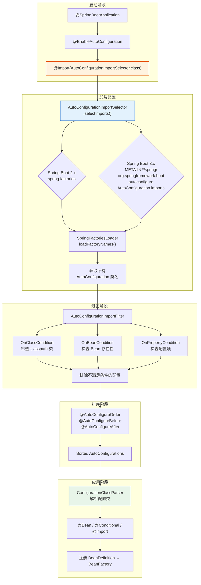
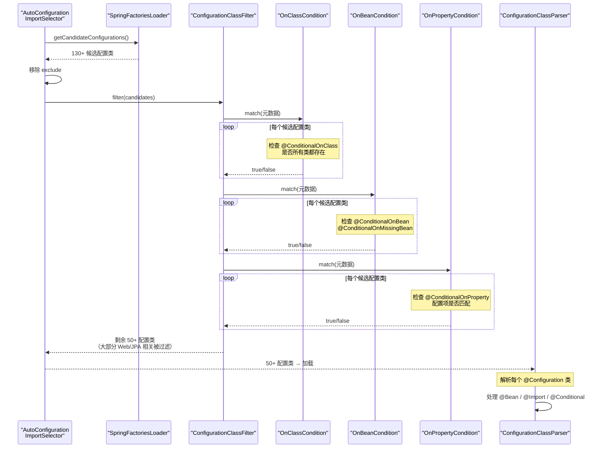
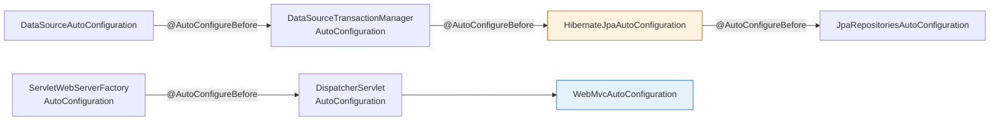

# Spring Boot Starters 与自动配置深度解析

> 本文为系列第 7 篇，覆盖：Starter 分类体系、自动配置原理（3 步流程）、`AutoConfigurationImportSelector` 源码、Spring Boot 3.x 自动配置加载 (AutoConfiguration.imports)、@Conditional 一族源码、自定义 Starter 完整实现、调试技巧。

---

## 第一部分：Spring Boot Starters

### 1.1 什么是 Starter

Starter 是一组**方便的依赖描述符**。用一个依赖替代多个库的手动组合：

```xml
<!-- 一个 Starter 搞定 Web 全部依赖 -->
<dependency>
    <groupId>org.springframework.boot</groupId>
    <artifactId>spring-boot-starter-web</artifactId>
</dependency>
```

### 1.2 官方 Starter 分类

| 分类 | Starter | 场景 |
|------|---------|------|
| **Web** | `spring-boot-starter-web` | 传统 Servlet Web |
| **WebFlux** | `spring-boot-starter-webflux` | 响应式 Web（Netty） |
| **数据 JPA** | `spring-boot-starter-data-jpa` | JPA + Hibernate |
| **数据 Redis** | `spring-boot-starter-data-redis` | Redis |
| **安全** | `spring-boot-starter-security` | Spring Security |
| **测试** | `spring-boot-starter-test` | JUnit 5 + Mockito |
| **Actuator** | `spring-boot-starter-actuator` | 监控端点 |
| **验证** | `spring-boot-starter-validation` | Bean Validation |

### 1.3 Starter 命名规范

```
官方：  spring-boot-starter-{name}
第三方：{name}-spring-boot-starter
```

---

## 第二部分：自动配置源码分析

### 2.1 自动配置全流程



### 2.2 @EnableAutoConfiguration 入口

```java
// @EnableAutoConfiguration — 开启自动配置
@Target(ElementType.TYPE)
@Retention(RetentionPolicy.RUNTIME)
@Documented
@Inherited
@AutoConfigurationPackage                              // 注册自动配置包
@Import(AutoConfigurationImportSelector.class)          // ★ 核心：导入选择器
public @interface EnableAutoConfiguration {
    // 排除特定的自动配置类
    Class<?>[] exclude() default {};
    // 排除特定的自动配置类名
    String[] excludeName() default {};
}
```

### 2.3 AutoConfigurationImportSelector — 自动配置加载核心

```java
// AutoConfigurationImportSelector.java — 实现 ImportSelector、DeferredImportSelector
public class AutoConfigurationImportSelector
        implements DeferredImportSelector, BeanClassLoaderAware, ... {

    // ===== 1. 返回要导入的配置类 =====
    @Override
    public String[] selectImports(AnnotationMetadata annotationMetadata) {
        // 检查自动配置是否开启
        if (!isEnabled(annotationMetadata)) {
            return NO_IMPORTS;
        }
        // ★ 加载自动配置元数据
        AutoConfigurationEntry autoConfigurationEntry = getAutoConfigurationEntry(annotationMetadata);
        return StringUtils.toStringArray(autoConfigurationEntry.getConfigurations());
    }

    // ===== 2. 获取自动配置条目（核心方法）=====
    protected AutoConfigurationEntry getAutoConfigurationEntry(AnnotationMetadata annotationMetadata) {
        // 检查启用
        if (!isEnabled(annotationMetadata)) {
            return EMPTY_ENTRY;
        }

        // 获取注解属性（@EnableAutoConfiguration 的 exclude 等）
        AnnotationAttributes attributes = getAttributes(annotationMetadata);

        // ===== 3. ★ 从 spring.factories / AutoConfiguration.imports 加载 =====
        List<String> configurations = getCandidateConfigurations(annotationMetadata, attributes);

        // 去重
        configurations = removeDuplicates(configurations);

        // 排除：注解上 exclude 的 + spring.autoconfigure.exclude 配置的
        Set<String> exclusions = getExclusions(annotationMetadata, attributes);
        checkExcludedClasses(configurations, exclusions);
        configurations.removeAll(exclusions);

        // ===== 4. ★ 过滤：按 @Conditional 条件过滤 =====
        configurations = getConfigurationClassFilter().filter(configurations);

        // ===== 5. 触发 AutoConfigurationImportEvent 事件 =====
        fireAutoConfigurationImportEvents(configurations, exclusions);

        return new AutoConfigurationEntry(configurations, exclusions);
    }

    // ===== 6. 加载配置类名 =====
    protected List<String> getCandidateConfigurations(AnnotationMetadata metadata,
                                                        AnnotationAttributes attributes) {
        // Spring Boot 2.x 方式：从 spring.factories
        List<String> configurations = SpringFactoriesLoader.loadFactoryNames(
            getSpringFactoriesLoaderFactoryClass(), getBeanClassLoader());

        // 如果为空（3.x 换路径了）
        if (configurations.isEmpty()) {
            // Spring Boot 3.x 方式：从 AutoConfiguration.imports
            configurations = getAutoConfigurationImportFilter()
                .getCandidates(getBeanClassLoader());
        }

        Assert.notEmpty(configurations,
            "No auto configuration classes found in META-INF/spring.factories nor " +
            "META-INF/spring/org.springframework.boot.autoconfigure.AutoConfiguration.imports");
        return configurations;
    }
}
```

### 2.4 Spring Boot 3.x 新的加载方式

```java
// Spring Boot 3.x 中，自动配置类列表存于：
// META-INF/spring/org.springframework.boot.autoconfigure.AutoConfiguration.imports
// 示例（spring-boot-autoconfigure 中的内容）：
//
// org.springframework.boot.autoconfigure.web.servlet.WebMvcAutoConfiguration
// org.springframework.boot.autoconfigure.jdbc.DataSourceAutoConfiguration
// org.springframework.boot.autoconfigure.orm.jpa.HibernateJpaAutoConfiguration
// org.springframework.boot.autoconfigure.jdbc.DataSourceTransactionManagerAutoConfiguration
// org.springframework.boot.autoconfigure.security.servlet.SecurityAutoConfiguration
// ...

// SpringFactoriesLoader 的替代——更快的加载：
// 1. 不扫描所有 META-INF/spring.factories
// 2. 直接读取特定文件的配置类列表
// 3. 启动速度提升
```

### 2.5 AutoConfigurationImportFilter — 条件过滤链

```java
// AutoConfigurationImportFilter.java — 批量过滤配置类
@FunctionalInterface
public interface AutoConfigurationImportFilter {

    // 批量匹配：输入所有候选类名，输出匹配结果布尔数组
    boolean[] match(String[] autoConfigurationClasses,
                     AutoConfigurationMetadata autoConfigurationMetadata);
}

// 实现类：ConfigurationClassFilter
class ConfigurationClassFilter {

    private final List<AutoConfigurationImportFilter> filters = new ArrayList<>();

    ConfigurationClassFilter(ClassLoader classLoader, List<String> autoConfigurationClasses) {
        // 注册三个内置过滤器
        this.filters.add(new OnClassCondition());     // 检查 classpath 是否存在
        this.filters.add(new OnBeanCondition());      // 检查 Bean 是否存在
        this.filters.add(new OnPropertyCondition());  // 检查配置属性
    }

    List<String> filter(List<String> configurations) {
        // 批量过滤（性能优化：减少反射调用）
        for (AutoConfigurationImportFilter filter : this.filters) {
            // 一次性过滤所有配置类
            boolean[] match = filter.match(configurations.toArray(new String[0]),
                autoConfigurationMetadata);
            // 移除不匹配的
            List<String> remaining = new ArrayList<>();
            for (int i = 0; i < match.length; i++) {
                if (match[i]) {
                    remaining.add(configurations.get(i));
                }
            }
            configurations = remaining;
        }
        return configurations;
    }
}
```



### 2.6 OnClassCondition 源码

```java
// OnClassCondition.java — 最常用的条件
class OnClassCondition extends SpringBootCondition
        implements AutoConfigurationImportFilter {

    // 批量匹配版本
    @Override
    public boolean[] match(String[] autoConfigurationClasses,
                             AutoConfigurationMetadata autoConfigurationMetadata) {
        boolean[] matches = new boolean[autoConfigurationClasses.length];

        for (int i = 0; i < autoConfigurationClasses.length; i++) {
            // 获取该配置类标注的 @ConditionalOnClass 的 value
            String classCondition = autoConfigurationMetadata.get(
                autoConfigurationClasses[i], "ConditionalOnClass");
            if (classCondition == null) {
                matches[i] = true;  // 没有条件 → 通过
            } else {
                // 检查 classpath 是否包含指定的类
                matches[i] = hasRequiredClasses(classCondition);
            }
        }
        return matches;
    }

    // 单类匹配（用于 @Bean 方法级别的 @ConditionalOnClass）
    @Override
    public ConditionOutcome getMatchOutcome(ConditionContext context,
                                              AnnotatedTypeMetadata metadata) {

        // 获取 @ConditionalOnClass 注解的值
        MultiValueMap<String, Object> params = metadata
            .getAllAnnotationAttributes(ConditionalOnClass.class.getName());
        List<String> classNames = (List<String>) params.get("value");

        // 检查类是否存在
        List<String> missing = new ArrayList<>();
        for (String className : classNames) {
            if (!ClassUtils.isPresent(className, context.getClassLoader())) {
                missing.add(className);
            }
        }

        if (!missing.isEmpty()) {
            return ConditionOutcome.noMatch(
                "missing required classes: " + missing);
        }
        return ConditionOutcome.match("all classes found");
    }
}
```

### 2.7 自动配置排序

```java
// Spring Boot 自动配置排序注解：
@AutoConfigureOrder(Ordered.HIGHEST_PRECEDENCE)      // 全局优先级
@AutoConfigureBefore(DataSourceAutoConfiguration.class) // 在其之前
@AutoConfigureAfter(JdbcTemplateAutoConfiguration.class) // 在其之后

// 排序实现：AutoConfigurationSorter
class AutoConfigurationSorter {
    List<String> getInPriorityOrder(Collection<String> classNames) {
        // 1. 构建依赖图（before / after 关系）
        // 2. 拓扑排序
        // 3. 按 @AutoConfigureOrder 排
        // 4. 返回排序后的列表
    }
}
```



---

## 第三部分：@Conditional 详细源码

### 3.1 @Conditional 家族

```java
// 所有条件注解的元注解
@Target({ElementType.TYPE, ElementType.METHOD})
@Retention(RetentionPolicy.RUNTIME)
@Documented
public @interface Conditional {
    Class<? extends Condition>[] value();  // Condition 实现类
}
```

### 3.2 Condition 接口

```java
// Condition.java
@FunctionalInterface
public interface Condition {
    // 评估条件
    boolean matches(ConditionContext context, AnnotatedTypeMetadata metadata);
}

// ConditionContext — 条件评估的上下文（提供了全部必需信息）
public interface ConditionContext {
    BeanDefinitionRegistry getRegistry();          // Bean 定义注册表
    ConfigurableListableBeanFactory getBeanFactory(); // Bean 工厂
    Environment getEnvironment();                 // 环境配置
    ResourceLoader getResourceLoader();           // 资源加载器
    ClassLoader getClassLoader();                 // 类加载器
}
```

### 3.3 @ConditionalOnClass 源码

```java
@Target({ElementType.TYPE, ElementType.METHOD})
@Retention(RetentionPolicy.RUNTIME)
@Documented
@Conditional(OnClassCondition.class)  // 元注解 @Conditional
public @interface ConditionalOnClass {
    Class<?>[] value() default {};     // 类（编译期可检查）
    String[] name() default {};        // 类名（运行时动态）
}

// OnClassCondition 实际利用 ClassUtils.isPresent()：
// → 通过 Class.forName() 尝试加载类
// → 如果抛出 ClassNotFoundException → 类不存在
// → 实现轻量、快速的条件判断
```

### 3.4 @ConditionalOnBean 源码

```java
// 检查容器中是否存在指定 Bean
@Conditional(OnBeanCondition.class)
public @interface ConditionalOnBean {
    Class<?>[] value() default {};     // Bean 类型
    String[] name() default {};        // Bean 名称
    Class<? extends Annotation>[] annotation() default {};  // 注解类型
}

// OnBeanCondition.getMatchOutcome()
// → 遍历 beanDefinitionNames
// → 按类型/名称/注解匹配
// → 如果找到 → ConditionOutcome.match()
// → 如果没找到 → ConditionOutcome.noMatch()
```

### 3.5 @ConditionalOnProperty 源码

```java
// 检查配置项的值
@Retention(RetentionPolicy.RUNTIME)
@Target({ElementType.TYPE, ElementType.METHOD})
@Documented
@Conditional(OnPropertyCondition.class)
public @interface ConditionalOnProperty {
    String prefix() default "";               // 配置前缀，如 "spring.datasource"
    String[] name() default {};               // 配置名
    String havingValue() default "";          // 期望值
    boolean matchIfMissing() default false;   // 配置缺失时是否匹配
}

// OnPropertyCondition → RelaxedPropertyResolver.resolvePlaceholders()
// → 从 Environment 中读取 ${prefix.name}
// → 与 havingValue 比较
// → 如果 matchIfMissing=true，配置缺失也通过
```

---

## 第四部分：自动配置类源码示例

### 4.1 DataSourceAutoConfiguration

```java
// DataSourceAutoConfiguration.java
@AutoConfiguration
@ConditionalOnClass({DataSource.class, EmbeddedDatabaseType.class})
// 必须有 H2 / HSQL / Derby 之一或自定义 DataSource
@EnableConfigurationProperties(DataSourceProperties.class)
// 绑定 spring.datasource.* 配置
@Import({DataSourcePoolMetadataProvidersConfiguration.class,
         DataSourceInitializationConfiguration.class})
public class DataSourceAutoConfiguration {

    // 默认嵌入数据源（仅在没有自定义 DataSource 时生效）
    @Configuration(proxyBeanMethods = false)
    @Conditional(DataSourceAutoConfiguration.EmbeddedDatabaseCondition.class)
    @ConditionalOnMissingBean({DataSource.class})
    @Import({EmbeddedDataSourceConfiguration.class})
    static class EmbeddedDatabaseConfiguration { ... }

    // 连接池配置（有 HikariCP 时）
    @Configuration(proxyBeanMethods = false)
    @ConditionalOnClass(HikariDataSource.class)
    @ConditionalOnMissingBean(DataSource.class)
    @ConditionalOnProperty(name = "spring.datasource.type",
                            havingValue = "com.zaxxer.hikari.HikariDataSource",
                            matchIfMissing = true)
    static class Hikari {
        @Bean
        HikariDataSource dataSource(DataSourceProperties properties) {
            HikariDataSource dataSource = properties
                .initializeDataSourceBuilder()
                .type(HikariDataSource.class).build();
            // 设置连接池参数
            dataSource.setMaximumPoolSize(properties.getMaximumPoolSize());
            ...
            return dataSource;
        }
    }
}
```

### 4.2 WebMvcAutoConfiguration

```java
@AutoConfiguration(after = { DispatcherServletAutoConfiguration.class,
                              TaskExecutionAutoConfiguration.class,
                              ValidationAutoConfiguration.class })
                        // 必须在这些之后加载
@ConditionalOnWebApplication(type = Type.SERVLET)
@ConditionalOnClass({ Servlet.class, DispatcherServlet.class, WebMvcConfigurer.class })
@ConditionalOnMissingBean(WebMvcConfigurationSupport.class)
@AutoConfigureOrder(Ordered.HIGHEST_PRECEDENCE + 10)
public class WebMvcAutoConfiguration {

    // 默认的 ViewResolver（当没有用户定义时）
    @Bean
    @ConditionalOnMissingBean
    public InternalResourceViewResolver defaultViewResolver() {
        return new InternalResourceViewResolver();
    }
}
```

---

## 第五部分：自定义 Starter 生产级实现

### 5.1 项目结构

```
my-spring-boot-starter/
├── pom.xml
├── src/main/java/com/example/starter/
│   ├── MyService.java                  # 核心功能
│   ├── MyProperties.java               # 配置属性
│   └── MyAutoConfiguration.java        # 自动配置
├── src/main/resources/META-INF/
│   ├── spring/
│   │   └── org.springframework.boot.autoconfigure.AutoConfiguration.imports
│   └── additional-spring-configuration-metadata.json  # IDE 提示
```

### 5.2 核心代码

```java
// 1. 配置属性
@ConfigurationProperties(prefix = "my.starter")
public class MyProperties {
    private boolean enabled = true;
    private String message = "Hello from My Starter";
    // getter / setter...
}

// 2. 核心服务
public class MyService {
    private final MyProperties properties;
    public MyService(MyProperties properties) {
        this.properties = properties;
    }
    public void doSomething() {
        System.out.println(properties.getMessage());
    }
}

// 3. 自动配置
@AutoConfiguration
@ConditionalOnClass(MyService.class)
@EnableConfigurationProperties(MyProperties.class)
public class MyAutoConfiguration {

    @Bean
    @ConditionalOnMissingBean
    @ConditionalOnProperty(prefix = "my.starter", name = "enabled",
                            havingValue = "true", matchIfMissing = true)
    public MyService myService(MyProperties properties) {
        return new MyService(properties);
    }
}
```

### 5.3 AutoConfiguration.imports

```
# src/main/resources/META-INF/spring/org.springframework.boot.autoconfigure.AutoConfiguration.imports
com.example.starter.MyAutoConfiguration
```

---

## 第六部分：调试技巧

```properties
# application.yml — 调试自动配置
debug=true           # 输出自动配置正/负匹配报告
logging.level.org.springframework.boot.autoconfigure=DEBUG
```

```bash
# 列出所有自动配置匹配情况
mvn spring-boot:run -Ddebug

# 输出：
# ============================
# AUTO-CONFIGURATION REPORT
# ============================
# Positive matches（匹配成功的自动配置）:
#   DataSourceAutoConfiguration matched:
#     - @ConditionalOnClass found required class 'javax.sql.DataSource' (OnClassCondition)
#
# Negative matches（匹配失败的自动配置）:
#   QuartzAutoConfiguration:
#     Did not match:
#       - @ConditionalOnClass did not find required class 'org.quartz.Scheduler' (OnClassCondition)
```

---

## 总结

| 知识点 | 要点 |
|--------|------|
| **入口** | `@EnableAutoConfiguration` → `@Import(AutoConfigurationImportSelector.class)` |
| **加载** | Spring Boot 2.x: `spring.factories`；3.x: `AutoConfiguration.imports` |
| **过滤** | `ConfigurationClassFilter` 内按 `OnClassCondition` / `OnBeanCondition` / `OnPropertyCondition` 逐一过滤 |
| **排序** | `@AutoConfigureBefore` / `@AutoConfigureAfter` / `@AutoConfigureOrder` 拓扑排序 |
| **条件注解** | 全部基于 `@Conditional` 元注解 + `Condition` 接口 |
| **自定义 Starter** | `AutoConfiguration.imports` 注册 → `@ConditionalOnClass` + `@ConditionalOnMissingBean` 保障扩展性 |
| **调试** | `debug=true` 自动配置报告 |
