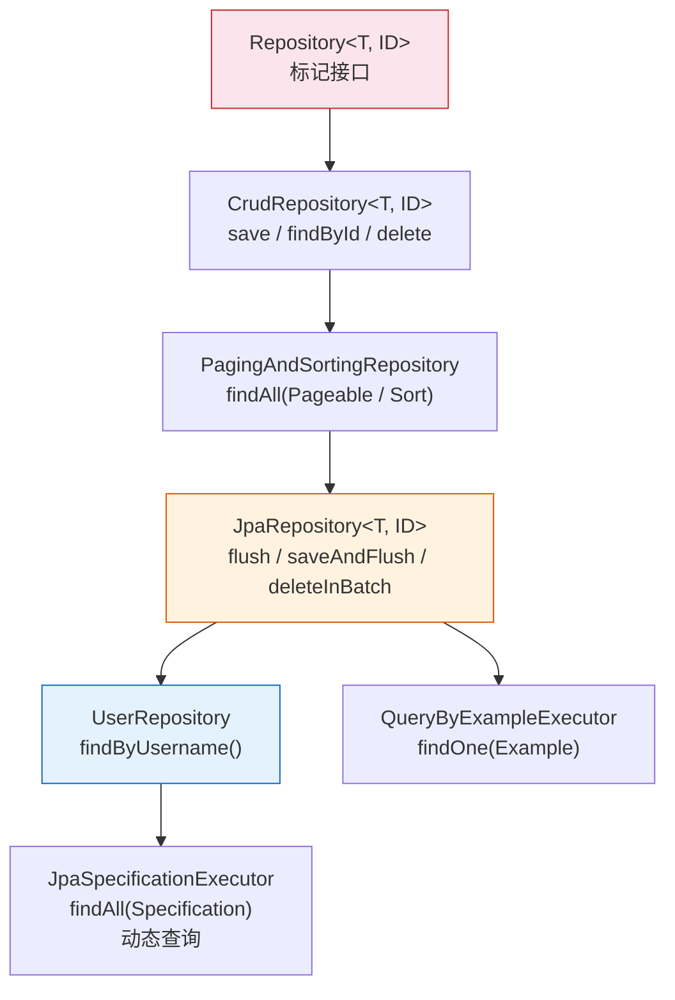
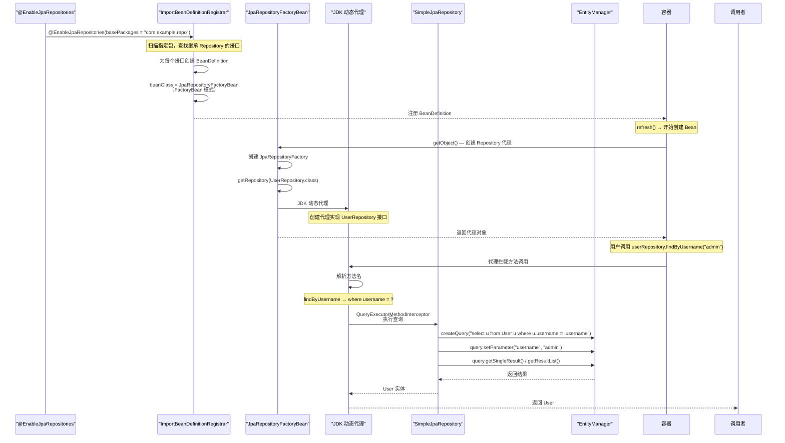
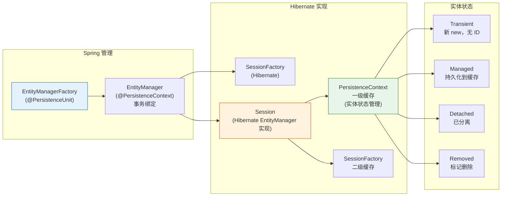
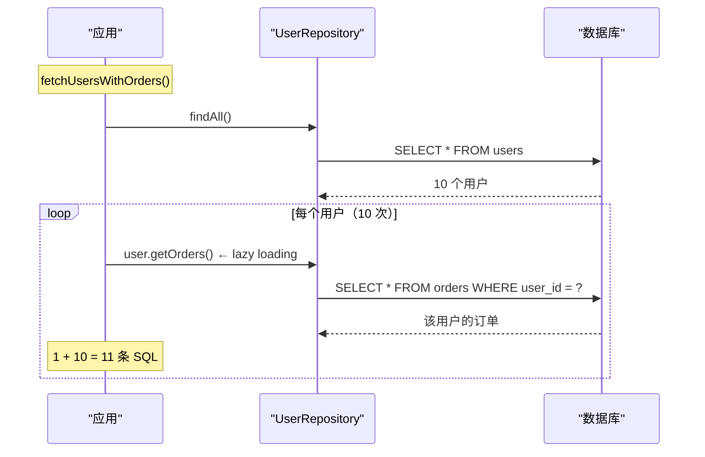
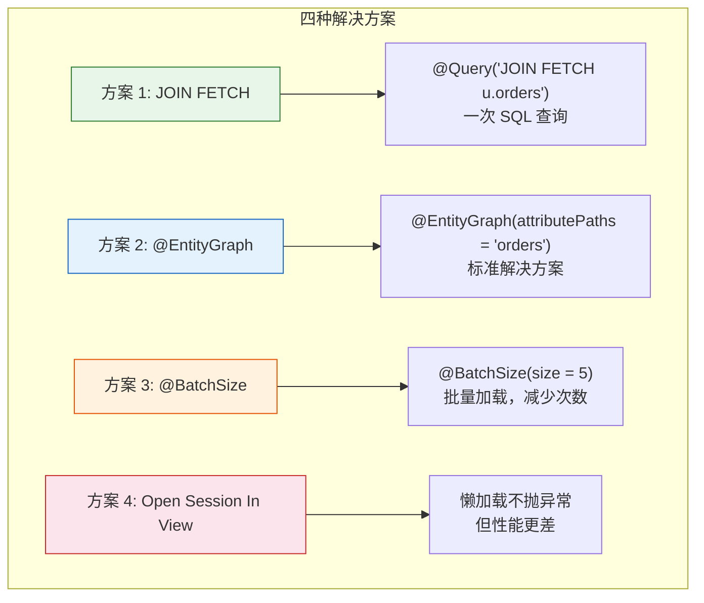

# Spring Data JPA 与 Hibernate 实战

> 本文为系列第 9 篇，覆盖：Repository 体系源码、JPA Repository 代理创建、@Query 方法推导、Hibernate Session/EntityManager 生命周期、N+1 问题与优化方案、Auditing 源码。

---

## 第一部分：Spring Data JPA 体系

### 1.1 Repository 接口层次



### 1.2 Repository 代理创建源码



### 1.3 JpaRepositoryFactoryBean — 创建 Repository 代理

```java
// JpaRepositoryFactoryBean.java — 每个 Repository 接口的 FactoryBean
public class JpaRepositoryFactoryBean<T extends Repository<S, ID>, S, ID>
        extends AbstractEntityManagerFactoryBean<T> {

    private Class<?> repositoryInterface;  // 如 UserRepository.class

    // ★ getObject() 返回 Repository 代理
    @Override
    public T getObject() {
        return getFactory().getRepository(getObjectType());
    }

    // 创建 JpaRepositoryFactory
    protected RepositoryFactorySupport createRepositoryFactory() {
        EntityManager em = entityManager.getObject();
        return new JpaRepositoryFactory(em);  // ★ 核心工厂
    }
}

// JpaRepositoryFactory.java — 创建 Repository 代理
public class JpaRepositoryFactory extends RepositoryFactorySupport {

    private final EntityManager entityManager;

    @Override
    public <T> T getRepository(Class<T> repositoryInterface) {
        return getRepository(repositoryInterface, null);
    }

    @Override
    protected Object getTargetRepository(RepositoryInformation information) {
        // ★ 真正的实现类：SimpleJpaRepository
        return new SimpleJpaRepository<T, ID>(information.getDomainType(), entityManager);
    }

    @Override
    protected Class<?> getRepositoryBaseClass() {
        return SimpleJpaRepository.class;
    }

    // ★ 创建代理，通过 JDK 动态代理
    @Override
    protected RepositoryProxyFactory getRepositoryProxyFactory() {
        return new RepositoryProxyFactory();
    }
}
```

### 1.4 SimpleJpaRepository — 默认实现

```java
// SimpleJpaRepository.java — CrudRepository/JpaRepository 接口的默认实现
public class SimpleJpaRepository<T, ID> implements JpaRepositoryImplementation<T, ID> {

    private final EntityManager em;                         // JPA 核心 API
    private final Class<T> domainClass;                     // 实体类型

    // 保存（新增 + 合并）
    @Transactional
    @Override
    public <S extends T> S save(S entity) {
        if (entityInformation.isNew(entity)) {
            em.persist(entity);               // INSERT
            return entity;
        } else {
            return em.merge(entity);           // UPDATE（先查再合并）
        }
    }

    // 查找
    @Override
    public Optional<T> findById(ID id) {
        // 1. 检查 PersistenceContext（一级缓存）
        // 2. 如果不在缓存，发 SQL
        return Optional.ofNullable(em.find(domainClass, id));
    }

    // 查询全部
    @Override
    public List<T> findAll() {
        return getQuery(null, Sort.unsorted()).getResultList();
    }

    // ★ 方法名查询 — 核心：通过方法名推导 Query
    @Override
    public List<T> findAll(@Nullable Specification<T> spec, Sort sort) {
        return getQuery(spec, sort).getResultList();
    }
}
```

---

## 2. 方法名推导查询源码

```java
// PartTreeJpaQuery.java — 方法名 → JPQL 转换器
class PartTreeJpaQuery extends AbstractJpaQuery {

    private final PartTree tree;       // 方法名解析树
    private final JpaQueryCreator creator;

    PartTreeJpaQuery(JpaQueryMethod method, EntityManager em) {
        // 1. 解析方法名：findByUsernameAndAge
        //    → [Subject: findBy] + [Predicate: UsernameAndAge]
        this.tree = new PartTree(method.getName(), domainClass);

        // 2. 创建 JPA 查询构造器
        this.creator = new JpaQueryCreator(tree, em.getCriteriaBuilder(),
            new ParameterMetadataProvider(...));
    }

    // 执行查询
    @Override
    public Query doCreateQuery(Object[] values) {
        // 绑定参数并返回 TypedQuery
        return creator.createQuery(values);
    }
}

// PartTree 解析示例：
// "findByUsernameAndAge" →
//    tree.isDistinct()      = false
//    tree.isDelete()        = false
//    tree.isExistsProjection() = false
//    tree.getParts()        = [Username, And, Age]
//      → Part("Username"):   Property = "username",  Type = SIMPLE_PROPERTY
//      → Part("Age"):        Property = "age",       Type = SIMPLE_PROPERTY
// 最终生成：select u from User u where u.username = ?1 and u.age = ?2
```

### 2.1 方法名关键词

```java
public interface UserRepository extends JpaRepository<User, Long> {

    // 关键字 → 对应的 JPQL
    List<User> findByAgeGreaterThan(Integer age);
    // → where u.age > :age

    List<User> findByUsernameLike(String pattern);
    // → where u.username like :pattern

    List<User> findByAgeBetween(Integer from, Integer to);
    // → where u.age between :from and :to

    List<User> findByUsernameContaining(String keyword);
    // → where u.username like %:keyword%

    Page<User> findBy(Pageable pageable);
    // → select u from User u
}
```

---

## 3. Hibernate 与 EntityManager

### 3.1 EntityManager + Session 关系



### 3.2 实体生命周期状态

```java
// 1. Transient（瞬时）：new 出来，没有 ID，没有 Session 关联
User user = new User();
user.setUsername("admin");

// 2. Managed（持久化）：调用 persist 或 save
entityManager.persist(user);
// → 放入 PersistenceContext（一级缓存）
// → 脏检查：事务提交时自动 UPDATE

// 3. Detached（游离）：Session 关闭或 detach
entityManager.detach(user);
// → 修改不再自动同步

// 4. Removed（删除）
entityManager.remove(user);
// → 事务提交时 DELETE
```

### 3.3 Spring 事务与 EntityManager

```java
// @Transactional 开启后：
// 1. EntityManager 通过 ThreadLocal 绑定到当前线程
// 2. 同一个事务内多次获取 EM 获得同一个实例
// 3. 一级缓存跨 Repository 共享（同一事务内）
// 4. 事务提交时自动 flush + close

@Service
public class UserService {

    @PersistenceContext
    private EntityManager entityManager;

    @Transactional
    public void transactionalMethod() {
        User user = userRepository.findById(1L).get();  // SQL 1
        user.setUsername("updated");

        // 不需要手动 update！脏检查自动同步
        // 事务提交时：UPDATE user SET username = ? WHERE id = ?
    }
}
```

---

## 4. @Query 与 JPQL 详解

### 4.1 JPQL 示例

```java
public interface UserRepository extends JpaRepository<User, Long> {

    // 用对象属性名而非数据库列名
    @Query("SELECT u FROM User u WHERE u.email = :email")
    Optional<User> findByEmail(@Param("email") String email);

    // 只查部分字段
    @Query("SELECT u.username, u.email FROM User u WHERE u.age > :age")
    List<Object[]> findUsernamesByAge(@Param("age") Integer age);

    // 关联查询
    @Query("SELECT o FROM Order o JOIN FETCH o.user WHERE o.id = :id")
    Optional<Order> findOrderWithUser(@Param("id") Long id);
}
```

### 4.2 原生 SQL

```java
public interface UserRepository extends JpaRepository<User, Long> {

    @Query(value = "SELECT * FROM users u WHERE u.username LIKE %?1%",
           nativeQuery = true)
    List<User> searchByUsername(String keyword);

    // 分页原生 SQL（需额外 countQuery）
    @Query(value = "SELECT * FROM users WHERE age > ?1",
           countQuery = "SELECT COUNT(*) FROM users WHERE age > ?1",
           nativeQuery = true)
    Page<User> findByAgeGreaterThanNative(Integer age, Pageable pageable);
}
```

---

## 5. N+1 问题源码分析

### 5.1 N+1 产生原因



### 5.2 解决方案



```java
// 方案 1：JPQL JOIN FETCH
@Query("SELECT u FROM User u JOIN FETCH u.orders WHERE u.id = :id")
Optional<User> findByIdWithOrders(@Param("id") Long id);

// 方案 2：@EntityGraph
@EntityGraph(attributePaths = {"orders"})
@Query("SELECT u FROM User u WHERE u.username = :username")
Optional<User> findByUsernameWithOrders(@Param("username") String username);

// 方案 3：@BatchSize
@Entity
@BatchSize(size = 10)  // 一次加载 10 个关联
public class Order { ... }
```

---

## 6. 分页与排序

```java
public interface UserRepository extends JpaRepository<User, Long> {

    Page<User> findByAge(Integer age, Pageable pageable);
    Slice<User> findByUsernameLike(String username, Pageable pageable);
}

@Service
public class UserService {

    public Page<User> getUsersByAge(int age, int page, int size) {
        Pageable pageable = PageRequest.of(page, size, Sort.by("username").ascending());
        return userRepository.findByAge(age, pageable);
    }
}
```

---

## 7. Auditing 审计

### 7.1 配置

```java
@Configuration
@EnableJpaAuditing
public class JpaConfig { }

// 或指定 AuditorAware
@Configuration
@EnableJpaAuditing(auditorAwareRef = "auditorProvider")
public class JpaConfig {
    @Bean
    public AuditorAware<String> auditorProvider() {
        return () -> Optional.ofNullable(SecurityContextHolder.getContext()
            .getAuthentication())
            .map(auth -> auth.getName());  // 从 SecurityContext 获取当前用户
    }
}
```

### 7.2 使用

```java
@Entity
@EntityListeners(AuditingEntityListener.class)  // ★ 重点：注册监听器
public class BaseEntity {

    @CreatedDate
    @Column(updatable = false)
    private LocalDateTime createdAt;

    @LastModifiedDate
    private LocalDateTime updatedAt;

    @CreatedBy
    @Column(updatable = false)
    private String createdBy;

    @LastModifiedBy
    private String updatedBy;
}
```

### 7.3 AuditingEntityListener 源码

```java
// AuditingEntityListener.java — JPA 实体监听器
public class AuditingEntityListener {

    @PrePersist       // 插入前调用
    @PreUpdate        // 更新前调用
    public void touchForAudit(Object target) {
        if (target != null) {
            // 获取当前时间
            if (dateTimeProvider != null) {
                // 调用 @CreatedDate / @LastModifiedDate 对应的 setter
                setCreatedDate(target);
                setLastModifiedDate(target);
            }
            if (auditorAware != null) {
                // 从 AuditorAware 获取当前用户
                // 调用 @CreatedBy / @LastModifiedBy setter
                setCreatedBy(target);
                setLastModifiedBy(target);
            }
        }
    }
}
```

---

## 8. 实体映射与关系

```java
@Entity
@Table(name = "users")
public class User {

    @Id
    @GeneratedValue(strategy = GenerationType.IDENTITY)
    private Long id;

    @Column(nullable = false, unique = true, length = 50)
    private String username;

    @Column(nullable = false)
    private String password;

    // ===== 关联关系 =====

    @OneToMany(mappedBy = "user", cascade = CascadeType.ALL,
               fetch = FetchType.LAZY, orphanRemoval = true)
    private List<Order> orders = new ArrayList<>();

    @OneToOne(mappedBy = "user", cascade = CascadeType.ALL)
    private Profile profile;

    @ManyToMany
    @JoinTable(name = "user_roles",
        joinColumns = @JoinColumn(name = "user_id"),
        inverseJoinColumns = @JoinColumn(name = "role_id"))
    private List<Role> roles = new ArrayList<>();
}

@Entity
@Table(name = "orders")
public class Order {

    @Id
    @GeneratedValue(strategy = GenerationType.IDENTITY)
    private Long id;

    @ManyToOne(fetch = FetchType.LAZY)
    @JoinColumn(name = "user_id", nullable = false)
    private User user;
}
```

### 8.1 FetchType 选择

| FetchType | 说明 | 典型场景 |
|-----------|------|---------|
| `LAZY`（默认一对多） | 延迟加载，使用时才查 | `@OneToMany`、`@ManyToMany` |
| `EAGER`（默认多对一） | 立即加载，随主实体一起查 | `@ManyToOne`、`@OneToOne` |

> 建议：**默认全部 LAZY**，在查询时通过 `JOIN FETCH`/`@EntityGraph` 按需加载。

---

## 总结

| 知识点 | 要点 |
|--------|------|
| **Repository 代理** | `JpaRepositoryFactoryBean` → `JpaRepositoryFactory` → `JDK Proxy` + `SimpleJpaRepository` |
| **方法名推导** | `PartTree` 解析方法名 → `JpaQueryCreator` → `CriteriaQuery` |
| **SimpleJpaRepository** | `save`(persist + merge)、`findById`(一级缓存优先) |
| **EntityManager** | Spring 通过 `@PersistenceContext` 注入事务绑定的 EM |
| **实体状态** | Transient → Managed → Detached / Removed |
| **N+1** | 懒加载在每个循环中触发 SQL → `JOIN FETCH` / `@EntityGraph` / `@BatchSize` |
| **Auditing** | `@PrePersist`/`@PreUpdate` 监听器 + `AuditorAware` 获取当前用户 |
| **分页** | `Pageable`(总数查询) vs `Slice`(无总数查询，性能更好) |
