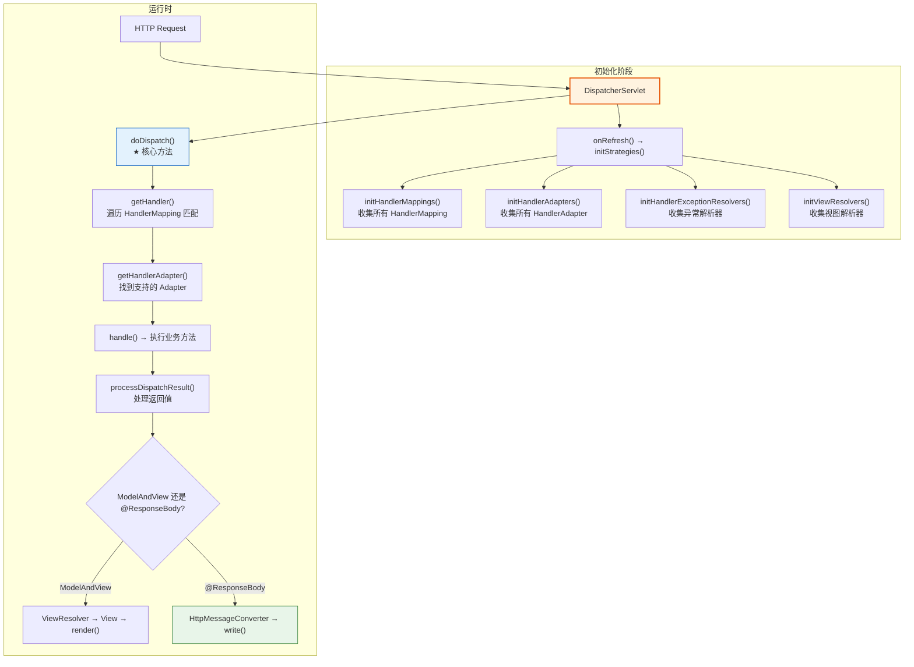
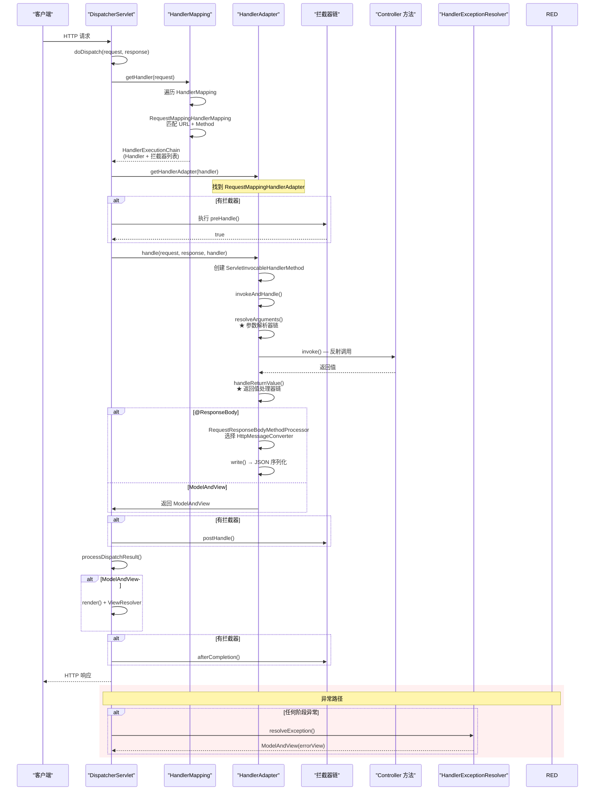
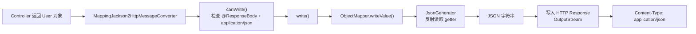
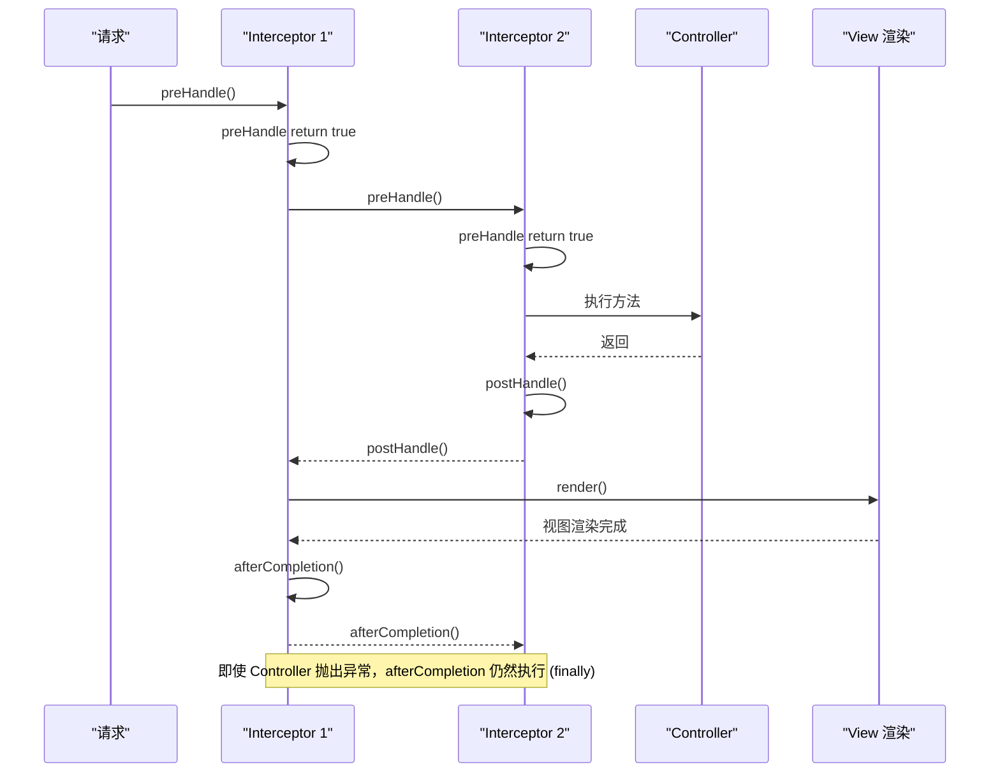

# Spring MVC 请求处理完全指南

> 本文为系列第 10 篇，覆盖：DispatcherServlet 源码（doDispatch 完整流程）、HandlerMapping 与 HandlerAdapter、参数解析器链、HttpMessageConverter、返回值处理器、拦截器链、异常解析器、WebMvcAutoConfiguration 自动配置。

---

## 1. DispatcherServlet 架构

### 1.1 核心组件



### 1.2 DispatcherServlet 初始化

```java
// DispatcherServlet.java
public class DispatcherServlet extends FrameworkServlet {

    // ★ 容器刷新后调用：初始化所有策略对象
    @Override
    protected void onRefresh(ApplicationContext context) {
        initStrategies(context);
    }

    // 初始化所有策略组件
    protected void initStrategies(ApplicationContext context) {
        initMultipartResolver(context);        // 文件上传解析器
        initLocaleResolver(context);           // 国际化解析器
        initThemeResolver(context);            // 主题解析器

        initHandlerMappings(context);          // ★ 处理器映射器
        initHandlerAdapters(context);          // ★ 处理器适配器
        initHandlerExceptionResolvers(context); // ★ 异常解析器

        initRequestToViewNameTranslator(context); // 请求到视图名翻译
        initViewResolvers(context);            // 视图解析器
        initFlashMapManager(context);          // FlashMap 管理器
    }

    // 收集所有 HandlerMapping
    private void initHandlerMappings(ApplicationContext context) {
        List<HandlerMapping> mappings = new ArrayList<>();

        // 1. 从容器中获取所有 HandlerMapping Bean
        Map<String, HandlerMapping> beans = BeanFactoryUtils
            .beansOfTypeIncludingAncestors(context, HandlerMapping.class, true, false);
        mappings.addAll(beans.values());

        // 2. 排序（按 @Order / Ordered）
        AnnotationAwareOrderComparator.sort(mappings);

        // 3. 设置到 DispatcherServlet
        this.handlerMappings = mappings;
    }
}
```

---

## 2. doDispatch() — 请求处理核心源码



### 2.1 doDispatch 源码

```java
// DispatcherServlet.java — ★ 请求处理核心
protected void doDispatch(HttpServletRequest request, HttpServletResponse response) throws Exception {
    HttpServletRequest processedRequest = request;
    HandlerExecutionChain mappedHandler = null;
    boolean multipartRequestParsed = false;

    try {
        // 1. 检查是否是文件上传请求
        processedRequest = checkMultipart(request);
        multipartRequestParsed = (processedRequest != request);

        // 2. ★ 获取 HandlerExecutionChain（Handler + 拦截器列表）
        mappedHandler = getHandler(processedRequest);
        if (mappedHandler == null) {
            // 没有匹配的 Handler → 返回 404
            noHandlerFound(processedRequest, response);
            return;
        }

        // 3. ★ 获取 HandlerAdapter
        HandlerAdapter ha = getHandlerAdapter(mappedHandler.getHandler());

        // 4. 执行拦截器 preHandle
        if (!mappedHandler.applyPreHandle(processedRequest, response)) {
            // preHandle 返回了 false → 请求在拦截器中被拦截
            return;
        }

        // 5. ★ 实际调用 Controller 方法
        ModelAndView mv = ha.handle(processedRequest, response, mappedHandler.getHandler());

        // 6. 执行拦截器 postHandle（异步请求跳过）
        if (asyncManager.isConcurrentHandlingStarted()) {
            return;
        }
        mappedHandler.applyPostHandle(processedRequest, response, mv);

        // 7. ★ 处理返回结果（渲染视图 / 处理响应）
        processDispatchResult(processedRequest, response, mappedHandler, mv, dispatchException);

    } catch (Exception ex) {
        // 异常路径：统一由 HandlerExceptionResolver 处理
        dispatchException = ex;
    } catch (Throwable err) {
        dispatchException = new NestedServletException("Handler dispatch failed", err);
    }

    // 8. ★ 异常处理
    processDispatchResult(processedRequest, response, mappedHandler, mv, dispatchException);

    // 9. 最终清理
    if (mappedHandler != null) {
        mappedHandler.applyAfterConcurrentHandlingStarted(processedRequest, response);
    }
}

// ★ 处理结果 / 异常
private void processDispatchResult(HttpServletRequest request, HttpServletResponse response,
                                     HandlerExecutionChain mappedHandler,
                                     ModelAndView mv, Exception exception) throws Exception {

    boolean errorView = false;

    if (exception != null) {
        // 有异常：遍历 HandlerExceptionResolver 链
        ModelAndView exMv = null;
        for (HandlerExceptionResolver resolver : this.handlerExceptionResolvers) {
            exMv = resolver.resolveException(request, response, mappedHandler.getHandler(), exception);
            if (exMv != null) {
                break;  // 找到一个能处理的就停
            }
        }
        mv = exMv;
        errorView = true;
    }

    if (mv != null && !mv.wasCleared()) {
        // ★ 渲染视图（JSP / Thymeleaf / JSON）
        render(mv, request, response);
    }

    // 最终调用 afterCompletion
    if (mappedHandler != null) {
        mappedHandler.triggerAfterCompletion(request, response, null);
    }
}
```

---

## 3. HandlerMapping — 请求映射匹配

### 3.1 HandlerMapping 接口

```java
// HandlerMapping.java
public interface HandlerMapping {

    // 根据请求获取 HandlerExecutionChain
    @Nullable
    HandlerExecutionChain getHandler(HttpServletRequest request) throws Exception;
}
```

### 3.2 常见的 HandlerMapping

| 实现类 | 说明 | 默认顺序 |
|-------|------|---------|
| `RequestMappingHandlerMapping` | 处理 @RequestMapping 注解（最常用） | 0 |
| `SimpleUrlHandlerMapping` | 显式 URL 映射（XML/Java 配置） | 随用 |
| `BeanNameUrlHandlerMapping` | Bean 名称以 "/" 开头的作为 URL | 2 |
| `WelcomePageHandlerMapping` | Spring Boot 欢迎页映射 | 最低 |

### 3.3 RequestMappingHandlerMapping 源码

```java
// RequestMappingHandlerMapping.java — @RequestMapping 的核心处理器
public class RequestMappingHandlerMapping extends RequestMappingInfoHandlerMapping
        implements MatchableHandlerMapping {

    // 初始化：收集所有 @RequestMapping 信息
    @Override
    public void afterPropertiesSet() {
        // 扫描所有 Bean，找到标注 @RequestMapping 的方法
        // 构建 MappingRegistry（URL → HandlerMethod 的映射）
        super.afterPropertiesSet();
    }

    // 匹配请求
    @Override
    protected HandlerMethod getHandlerInternal(HttpServletRequest request) throws Exception {
        // 1. 获取请求的 URL、Method、Headers、Params
        String lookupPath = getUrlPathHelper().getLookupPathForRequest(request);

        // 2. 精确匹配
        // 3. 通配符匹配（/**  /api/v1/**）
        // 4. 按 consumes / produces / headers 过滤
        // 5. 排序（精确匹配优先）
        return lookupHandlerMethod(lookupPath, request);
    }
}
```

### 3.4 MappingRegistry 存储结构

```java
// RequestMappingInfoHandlerMapping 内部类
class MappingRegistry {
    // URL → 所有匹配该 URL 的 HandlerMethod 映射
    private final Map<String, List<MappingRegistration<HandlerMethod>>> urlLookup = new LinkedHashMap<>();

    // 映射名 → HandlerMethod（用于 MvcUriComponentsBuilder）
    private final Map<String, List<HandlerMethod>> nameLookup = new ConcurrentHashMap<>();

    // 完整的映射注册（RequestMappingInfo → MappingRegistration）
    private final Map<T, MappingRegistration<T>> registry = new HashMap<>();

    // 所有 HandlerMethod 缓存
    private final Map<T, HandlerMethod> mappingLookup = new LinkedHashMap<>();
}
```

---

## 4. HandlerAdapter — 参数绑定与执行

### 4.1 RequestMappingHandlerAdapter

```java
// RequestMappingHandlerAdapter.java — @RequestMapping 方法的适配器
public class RequestMappingHandlerAdapter extends AbstractHandlerMethodAdapter
        implements BeanFactoryAware, InitializingBean {

    // ★ 初始化：收集所有参数解析器和返回值处理器
    @Override
    public void afterPropertiesSet() {
        // 注册默认的参数解析器（24 个）
        if (this.argumentResolvers == null) {
            List<HandlerMethodArgumentResolver> resolvers = getDefaultArgumentResolvers();
            this.argumentResolvers = new HandlerMethodArgumentResolverComposite();
            this.argumentResolvers.addResolvers(resolvers);
        }

        // 注册默认的返回值处理器（15 个）
        if (this.returnValueHandlers == null) {
            List<HandlerMethodReturnValueHandler> handlers = getDefaultReturnValueHandlers();
            this.returnValueHandlers = new HandlerMethodReturnValueHandlerComposite();
            this.returnValueHandlers.addHandlers(handlers);
        }
    }

    // ★ 执行请求
    @Override
    protected ModelAndView handleInternal(HttpServletRequest request,
                                            HttpServletResponse response,
                                            HandlerMethod handlerMethod) throws Exception {
        ModelAndView mav;
        // 检查是否需要 Session 同步（@SessionAttributes）
        checkRequest(request);

        // 调用 invokeHandlerMethod
        mav = invokeHandlerMethod(request, response, handlerMethod);
        return mav;
    }

    // ★ 核心：创建 ServletInvocableHandlerMethod 并调用
    protected ModelAndView invokeHandlerMethod(HttpServletRequest request,
                                                 HttpServletResponse response,
                                                 HandlerMethod handlerMethod) throws Exception {

        ServletInvocableHandlerMethod invocableMethod = createInvocableHandlerMethod(handlerMethod);

        // 设置参数解析器
        invocableMethod.setHandlerMethodArgumentResolvers(this.argumentResolvers);
        // 设置返回值处理器
        invocableMethod.setHandlerMethodReturnValueHandlers(this.returnValueHandlers);
        // 设置数据绑定
        invocableMethod.setDataBinderFactory(binderFactory);
        // 设置验证工厂
        invocableMethod.setValidator(validator);

        ModelAndViewContainer mavContainer = new ModelAndViewContainer();

        // ★ 执行！
        invocableMethod.invokeAndHandle(webRequest, mavContainer);

        // 返回 ModelAndView
        return getModelAndView(mavContainer, modelFactory, webRequest);
    }
}
```

---

## 5. 参数解析器链

### 5.1 HandlerMethodArgumentResolver

```java
// HandlerMethodArgumentResolver.java — 参数解析器
public interface HandlerMethodArgumentResolver {

    // 是否支持该参数
    boolean supportsParameter(MethodParameter parameter);

    // 解析参数值
    @Nullable
    Object resolveArgument(MethodParameter parameter,
                            ModelAndViewContainer mavContainer,
                            NativeWebRequest webRequest,
                            WebDataBinderFactory binderFactory) throws Exception;
}
```

### 5.2 24 个默认参数解析器

```mermaid
graph TB
    A["参数解析器链<br/>遍历直到找到 support=true"] --> B["PathVariableMethodArgumentResolver<br/>@PathVariable"]
    A --> C["RequestParamMethodArgumentResolver<br/>@RequestParam"]
    A --> D["RequestBodyAdvice<br/>后 → RequestResponseBodyMethodProcessor<br/>@RequestBody"]
    A --> E["ModelAttributeMethodProcessor<br/>@ModelAttribute"]
    A --> F["RequestHeaderMethodArgumentResolver<br/>@RequestHeader"]
    A --> G["CookieValueMethodArgumentResolver<br/>@CookieValue"]
    A --> H["SessionAttrMethodArgumentResolver<br/>@SessionAttribute"]
    A --> I["RequestAttributeMethodArgumentResolver<br/>@RequestAttribute"]

    A --> J["ServletModelAttributeMethodProcessor<br/>非注解参数（User 对象）"]
    A --> K["ServletRequestMethodArgumentResolver<br/>HttpServletRequest"]
    A --> L["ServletResponseMethodArgumentResolver<br/>HttpServletResponse"]
    A --> M["HttpSessionMethodArgumentResolver<br/>HttpSession"]
    A --> N["PrincipalMethodArgumentResolver<br/>Principal / Authentication"]
    A --> O["PageableHandlerMethodArgumentResolver<br/>Pageable / Sort"]

    style A fill:#fff3e0,stroke:#e65100
    style C fill:#e3f2fd,stroke:#1565c0
    style D fill:#e8f5e9,stroke:#2e7d32
    style O fill:#f3e5f5,stroke:#7b1fa2
```



### 5.3 参数解析流程

```java
// HandlerMethodArgumentResolverComposite.java
public class HandlerMethodArgumentResolverComposite implements HandlerMethodArgumentResolver {

    // 参数解析器列表
    private final List<HandlerMethodArgumentResolver> argumentResolvers = new ArrayList<>();

    @Override
    public Object resolveArgument(MethodParameter parameter, ...) {
        // ★ 遍历解析器链，找到第一个支持该参数的
        HandlerMethodArgumentResolver resolver = getArgumentResolver(parameter);
        if (resolver == null) {
            throw new IllegalArgumentException("找不到支持该参数的解析器");
        }
        // 调用解析器
        return resolver.resolveArgument(parameter, mavContainer, webRequest, binderFactory);
    }

    @Nullable
    private HandlerMethodArgumentResolver getArgumentResolver(MethodParameter parameter) {
        // 遍历所有注册的解析器
        for (HandlerMethodArgumentResolver resolver : this.argumentResolvers) {
            if (resolver.supportsParameter(parameter)) {
                return resolver;  // 找到第一个支持的
            }
        }
        return null;
    }
}
```

### 5.4 @RequestBody 解析流程

```java
// RequestResponseBodyMethodProcessor.java — 处理 @RequestBody 和 @ResponseBody
public class RequestResponseBodyMethodProcessor
        extends AbstractMessageConverterMethodProcessor {

    // ===== @RequestBody 解析（读请求体）=====
    @Override
    public Object resolveArgument(MethodParameter parameter, ...) {
        parameter = parameter.nestedIfOptional();

        // 将请求体转换为参数类型
        Object arg = readWithMessageConverters(webRequest, parameter, paramType);

        // 校验（@Valid）
        if (parameter.hasParameterAnnotations()) {
            // 获取 @Valid 注解
            Annotation[] anns = parameter.getParameterAnnotations();
            for (Annotation ann : anns) {
                if (ann.annotationType().getSimpleName().startsWith("Valid")) {
                    // 执行 Bean Validation
                    validator.validate(arg, ...);
                }
            }
        }
        return arg;
    }

    // 读取请求体：遍历 HttpMessageConverter
    protected <T> Object readWithMessageConverters(NativeWebRequest webRequest,
                                                     MethodParameter parameter,
                                                     Class<T> paramType) {
        // 获取 Content-Type
        MediaType contentType = webRequest.getHeader("Content-Type");

        // ★ 遍历所有注册的 HttpMessageConverter
        for (HttpMessageConverter<?> converter : this.messageConverters) {
            // 检查是否支持该类型
            if (converter.canRead(paramType, contentType)) {
                // 从请求体读取并转换
                return converter.read(paramType, webRequest);
            }
        }

        throw new HttpMediaTypeNotSupportedException(contentType);
    }
}
```

---

## 6. HttpMessageConverter — 消息转换

### 6.1 消息转换器链

```java
// Spring Boot 默认注册的 HttpMessageConverter（按顺序）：
// 1. ByteArrayHttpMessageConverter       — byte[]
// 2. StringHttpMessageConverter           — String (text/plain)
// 3. ResourceHttpMessageConverter         — Resource
// 4. ResourceRegionHttpMessageConverter   — ResourceRegion
// 5. MappingJackson2HttpMessageConverter  — JSON (application/json) ★
// 6. MappingJackson2XmlHttpMessageConverter — XML
// 7. SourceHttpMessageConverter          — javax.xml.transform.Source
// 8. AllEncompassingFormHttpMessageConverter — 表单数据
```

### 6.2 @ResponseBody 写回流程

```java
// RequestResponseBodyMethodProcessor — 处理 @ResponseBody
@Override
public void handleReturnValue(@Nullable Object returnValue, MethodParameter returnType,
                                ModelAndViewContainer mavContainer,
                                NativeWebRequest webRequest) throws Exception {

    // 标记请求已处理（不需要视图解析器）
    mavContainer.setRequestHandled(true);

    // ★ 将返回值写入响应体
    writeWithMessageConverters(returnValue, returnType, webRequest);
}

// 写回响应
protected <T> void writeWithMessageConverters(@Nullable T value, ...) {

    // 1. 确定返回类型和 MediaType
    Class<?> valueType = value.getClass();
    MediaType contentType = getProducibleMediaType(valueType, targetType, ...);

    // 2. ★ 遍历消息转换器
    for (HttpMessageConverter<?> converter : this.messageConverters) {
        GenericHttpMessageConverter genericConverter = ...
        if (genericConverter.canWrite(targetType, valueType, contentType)) {
            // 3. 写入响应体
            ((HttpMessageConverter<T>) converter).write(value, contentType, outputMessage);
            return;
        }
    }

    // 找不到合适的转换器 → 500
    throw new HttpMediaTypeNotAcceptableException(...);
}
```

### 6.3 Jackson 序列化流程



---

## 7. 拦截器链

### 7.1 HandlerInterceptor 接口

```java
// HandlerInterceptor.java
public interface HandlerInterceptor {

    // 请求处理前执行（Controller 方法调用前）
    default boolean preHandle(HttpServletRequest request,
                               HttpServletResponse response,
                               Object handler) throws Exception {
        return true;  // true = 继续请求；false = 中断
    }

    // Controller 方法执行后执行（视图渲染前）
    default void postHandle(HttpServletRequest request,
                             HttpServletResponse response,
                             Object handler,
                             @Nullable ModelAndView modelAndView) throws Exception { }

    // 请求完成后执行（视图渲染后，finally 语义）
    default void afterCompletion(HttpServletRequest request,
                                  HttpServletResponse response,
                                  Object handler,
                                  @Nullable Exception ex) throws Exception { }
}
```

### 7.2 执行顺序



---

## 8. 异常解析器

```java
// HandlerExceptionResolver — 统一异常处理
public interface HandlerExceptionResolver {
    @Nullable
    ModelAndView resolveException(HttpServletRequest request,
                                   HttpServletResponse response,
                                   @Nullable Object handler,
                                   Exception ex);
}

// 内置异常解析器（按顺序）：
// 1. ErrorPageResolvers
// 2. ExceptionHandlerExceptionResolver       — @ExceptionHandler 注解 ★
// 3. ResponseStatusExceptionResolver          — @ResponseStatus
// 4. DefaultHandlerExceptionResolver          — 默认 Spring 异常（404/405/415...）
```

---

## 9. Spring Boot 自动配置

```java
// WebMvcAutoConfiguration.java — 自动配置 Spring MVC
@AutoConfiguration(after = { DispatcherServletAutoConfiguration.class })
@ConditionalOnWebApplication(type = Type.SERVLET)
@ConditionalOnClass({ Servlet.class, DispatcherServlet.class, WebMvcConfigurer.class })
@ConditionalOnMissingBean(WebMvcConfigurationSupport.class)
@AutoConfigureOrder(Ordered.HIGHEST_PRECEDENCE + 10)
public class WebMvcAutoConfiguration {

    // 自动注册：
    // HiddenHttpMethodFilter          — 支持 PUT/DELETE via _method
    // FormContentFilter               — 支持 PUT/DELETE 表单参数
    // OrderdHidden...                 — 排序过滤器
    // WebMvcConfigurer 复合配置       — 用户自定义配置通过这个接口

    // 自动配置：
    // ContentNegotiationManager       — 内容协商（支持 JSON/XML）
    // ViewResolver                    — 视图解析
    // StaticResourceHandler           — 静态资源处理（classpath:/static/）
    // WelcomePageHandlerMapping       — 欢迎页
    // Formatter                       — 日期格式化
    // MessageCodesResolver            — 错误码解析
}
```

---

## 10. 完整 Controller 示例

```java
@RestController
@RequestMapping("/api/users")
public class UserController {

    @GetMapping("/{id}")                                 // @PathVariable
    public User getById(@PathVariable Long id) { ... }

    @GetMapping                                              // @RequestParam
    public Page<User> list(@RequestParam(defaultValue = "1") int page,
                           @RequestParam(defaultValue = "20") int size) { ... }

    @PostMapping                                             // @RequestBody
    public User create(@Valid @RequestBody UserCreateReq req) { ... }

    @DeleteMapping("/{id}")
    public void delete(@PathVariable Long id) { ... }
}
```

---

## 总结

| 知识点 | 要点 |
|--------|------|
| **DispatcherServlet** | `doDispatch()` — 整个请求处理入口：getHandler → getHandlerAdapter → preHandle → handle → postHandle → render → afterCompletion |
| **HandlerMapping** | 遍历列表，`RequestMappingHandlerMapping` 匹配 @RequestMapping |
| **HandlerAdapter** | `RequestMappingHandlerAdapter` 管理参数解析器链 + 返回值处理器链 + 消息转换器 |
| **参数解析器** | 24 个解析器，按序查找第一个 `supportsParameter()` 返回 true 的 |
| **HttpMessageConverter** | 8 个转换器，`canRead()`/`canWrite()` 选择 → `read()`/`write()` |
| **拦截器** | preHandle(return true/false) → postHandle → afterCompletion(finally) |
| **异常解析器** | `ExceptionHandlerExceptionResolver`(@ExceptionHandler) → `DefaultHandlerExceptionResolver` |
| **数据校验** | `@Valid` + 参数解析器触发 → `Errors` / `MethodArgumentNotValidException` |
