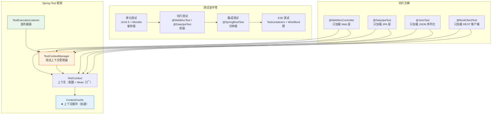
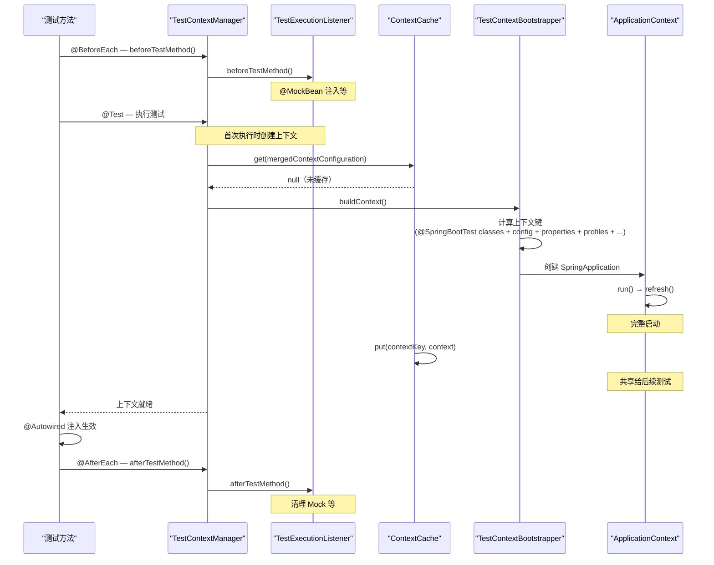
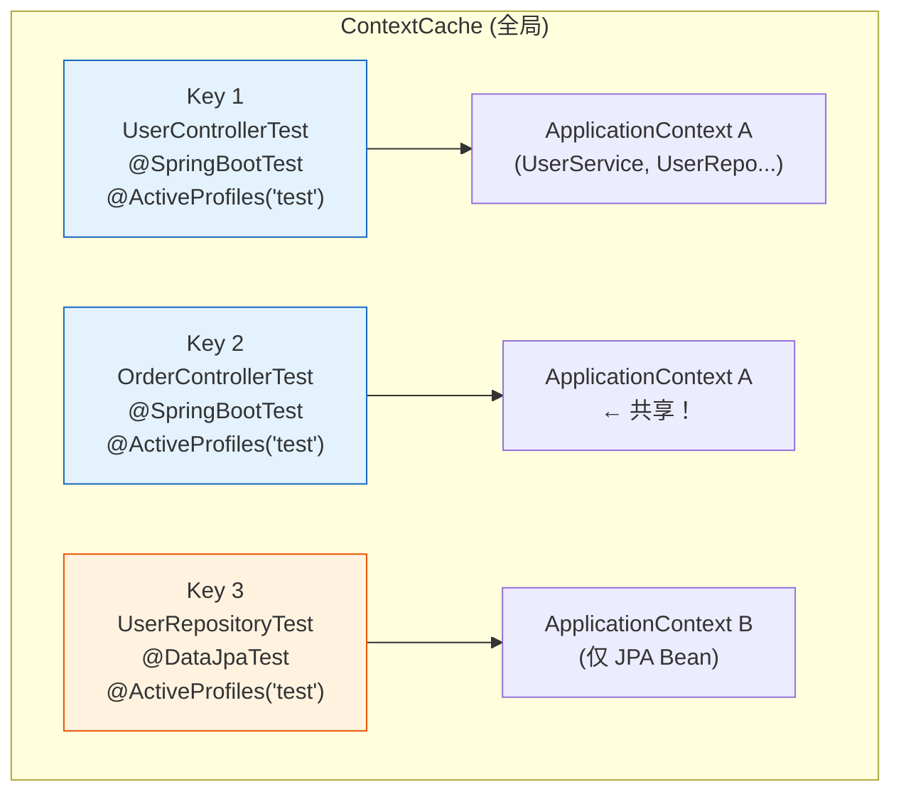
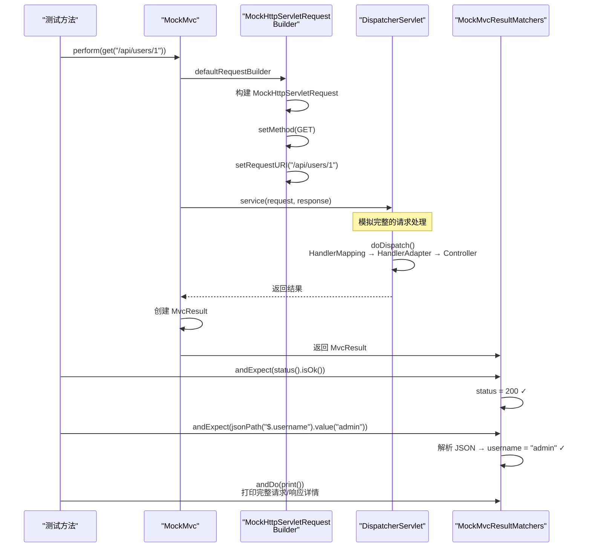
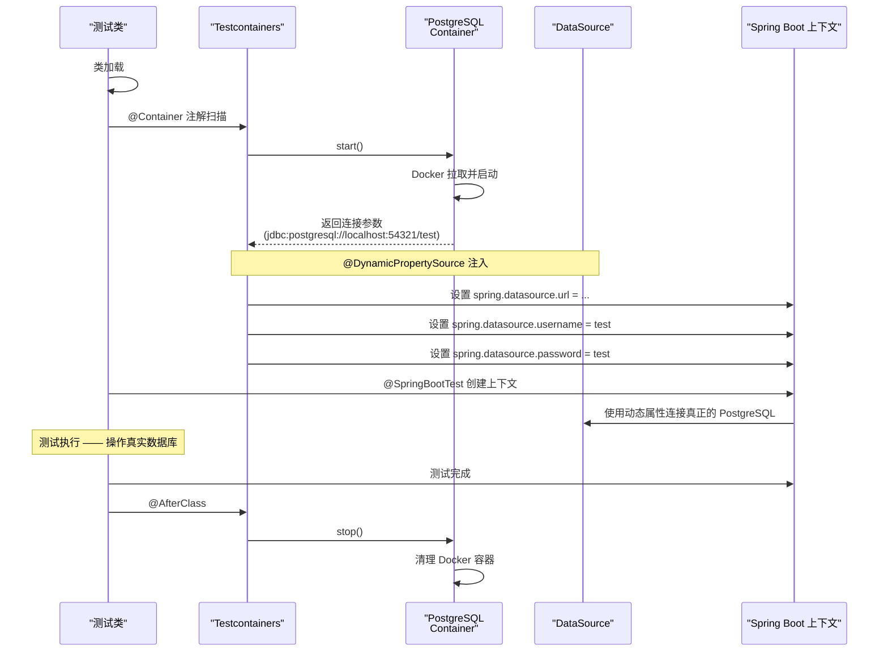

# Spring Boot 测试体系全解

> 本文为系列第 11 篇，覆盖：测试金字塔、@SpringBootTest 源码（TestContextManager + ContextCache）、切片测试原理、MockMvc 内部机制、@MockBean 通过 BeanPostProcessor 替换 Bean、Testcontainers 生命周期、Mockito 深入。

---

## 1. 测试架构总览



---

## 2. 上下文管理源码

### 2.1 @SpringBootTest 上下文创建



### 2.2 上下文缓存原理

```java
// DefaultContextCache.java — 测试上下文缓存
// 键：MergedContextConfiguration（所有配置的综合）
// 值：ApplicationContext
// 全局缓存，不同测试类如果配置相同，共享同一个上下文

// 上下文键的计算要素：
// 1. @ContextConfiguration(classes = {...}) 或 @SpringBootTest(classes = ...)
// 2. @ActiveProfiles({"test", "dev"})
// 3. @TestPropertySource(locations = "classpath:test.properties")
// 4. @PropertySource
// 5. ContextCustomizer（@DynamicPropertySource 等）
//
// 如果所有要素相同，共享上下文 → 加速测试执行
// 缓存最大 32 个上下文（超出就淘汰最旧的）

// 验证：启动日志
// "BeanFactory for ...ApplicationContext is stale"
// "Reusing context for same configuration..."
```



### 2.3 @WebMvcTest 切片原理

```java
// @WebMvcTest — 仅加载 Web 层
@Target(ElementType.TYPE)
@Retention(RetentionPolicy.RUNTIME)
@Documented
@Inherited
@BootstrapWith(WebMvcTestContextBootstrapper.class)  // 专用启动器
@ExtendWith(SpringExtension.class)
@TypeExcludeFilters(WebMvcTypeExcludeFilter.class)   // ★ 类型过滤！
@AutoConfigureWebMvc
@AutoConfigureMockMvc                                // ★ 自动配置 MockMvc
@ImportAutoConfiguration
public @interface WebMvcTest {
    // 指定要测试的 Controller
    Class<?>[] value() default {};
}

// WebMvcTypeExcludeFilter — 排除非 Web 层 Bean
// 只包含：
//   - 被测试的 Controller 类
//   - @ControllerAdvice / @RestControllerAdvice
//   - @JsonComponent
//   - WebMvcConfigurer
//   - Converter / Formatter
//   - Filter
// 排除：
//   - @Service / @Component / @Repository
//   - @ConfigurationProperties
//   - 大多数自动配置（DataSource / JPA / Security 等）
```

### 2.4 @DataJpaTest 切片原理

```java
// @DataJpaTest — 仅加载 JPA 层
@Target(ElementType.TYPE)
@Retention(RetentionPolicy.RUNTIME)
@Documented
@Inherited
@BootstrapWith(DataJpaTestContextBootstrapper.class)
@ExtendWith(SpringExtension.class)
@Transactional                         // ★ 默认事务，测试后回滚
@TypeExcludeFilters(DataJpaTypeExcludeFilter.class)
@AutoConfigureCache
@AutoConfigureDataJpa
@AutoConfigureTestDatabase              // ★ 自动配置嵌入式数据库
@ImportAutoConfiguration
public @interface DataJpaTest {
    // 默认使用嵌入式数据库（H2）而不是真实数据库
}
```

---

## 3. MockMvc 源码分析

### 3.1 MockMvc 内部机制



### 3.2 完整的控制器测试

```java
@WebMvcTest(UserController.class)   // 只加载 UserController
class UserControllerTest {

    @Autowired
    private MockMvc mockMvc;         // ★ 自动注入 MockMvc

    @MockBean
    private UserService userService; // ★ Mock Service 层

    @Test
    void shouldReturnUser_whenUserExists() throws Exception {
        // 准备 Mock 数据
        User mockUser = new User(1L, "admin", "admin@example.com");
        when(userService.findById(1L)).thenReturn(mockUser);

        // 执行请求 + 断言
        mockMvc.perform(get("/api/users/1")
                .accept(MediaType.APPLICATION_JSON))
            .andExpect(status().isOk())
            .andExpect(jsonPath("$.id").value(1))
            .andExpect(jsonPath("$.username").value("admin"))
            .andExpect(jsonPath("$.email").value("admin@example.com"))
            .andDo(print());  // 打印完整请求/响应

        // 验证 Service 被调用
        verify(userService).findById(1L);
        verifyNoMoreInteractions(userService);
    }

    @Test
    void shouldReturn404_whenUserNotFound() throws Exception {
        when(userService.findById(999L)).thenThrow(new UserNotFoundException(999L));

        mockMvc.perform(get("/api/users/999"))
            .andExpect(status().isNotFound())
            .andExpect(jsonPath("$.message").value("User not found: 999"));

        verify(userService).findById(999L);
    }
}
```

---

## 4. @MockBean 源码分析

```java
// @MockBean — 替换容器中的 Bean 为 Mock 对象
@Target({ElementType.FIELD, ElementType.TYPE})
@Retention(RetentionPolicy.RUNTIME)
@Documented
public @interface MockBean {
    // 要 Mock 的类型（与方法返回类型相同则自动推断）
    Class<?>[] value() default {};

    // Bean 的名称（有多个同一类型时指定）
    String[] name() default {};
}

// MockitoPostProcessor — 核心：BeanFactoryPostProcessor 版
// 在 BeanFactory 初始化后，注册 BeanPostProcessor
// 对所有 @MockBean 字段：
//   1. 创建 Mockito Mock 对象
//   2. 用 Mock 替换容器中已有的 Bean
//   3. 注入到测试类的字段中
//
// 替换时机：
//   - 如果 Bean 尚未创建：替换 BeanDefinition 的 beanClass
//   - 如果 Bean 已创建：用 singletonObjects 覆盖（替换单例）

// 实现要点：
// MockitoPostProcessor 注册在 TestContextManager 中
// 通过 postProcessBeanFactory() 修改 BeanDefinition
// 或通过 postProcessAfterInitialization() 包装已创建的 Bean
```

---

## 5. Testcontainers 源码

### 5.1 Testcontainers 生命周期



### 5.2 完整的 Testcontainers 测试

```java
@DataJpaTest
@AutoConfigureTestDatabase(replace = AutoConfigureTestDatabase.Replace.NONE)
// ★ 禁用自动嵌入式数据库，用真实的 PostgreSQL
@Testcontainers
class UserRepositoryTest {

    // 1. 静态容器（所有测试共享一次）
    @Container
    static PostgreSQLContainer<?> postgres = new PostgreSQLContainer<>("postgres:15")
        .withDatabaseName("testdb");

    // 2. 动态注入连接属性
    @DynamicPropertySource
    static void configureProperties(DynamicPropertyRegistry registry) {
        registry.add("spring.datasource.url", postgres::getJdbcUrl);
        registry.add("spring.datasource.username", postgres::getUsername);
        registry.add("spring.datasource.password", postgres::getPassword);
    }

    @Autowired
    private UserRepository userRepository;

    @Test
    void shouldFindUserByUsername() {
        User user = new User("admin", "admin@example.com");
        userRepository.save(user);

        Optional<User> found = userRepository.findByUsername("admin");

        assertThat(found).isPresent();
        assertThat(found.get().getEmail()).isEqualTo("admin@example.com");
    }
}
```

---

## 6. 完整测试示例

```java
@SpringBootTest(webEnvironment = SpringBootTest.WebEnvironment.RANDOM_PORT)
class UserControllerIntegrationTest {

    @Autowired
    private TestRestTemplate restTemplate;  // ★ 真实的 HTTP 客户端

    @Autowired
    private UserRepository userRepository;

    @BeforeEach
    void setUp() {
        userRepository.deleteAll();
        userRepository.save(new User("admin", "admin@example.com"));
    }

    @Test
    void shouldReturnUser_whenRequestById() {
        ResponseEntity<User> response = restTemplate.getForEntity(
            "/api/users/1", User.class);

        assertThat(response.getStatusCode()).isEqualTo(HttpStatus.OK);
        assertThat(response.getBody().getUsername()).isEqualTo("admin");
    }
}
```

---

## 7. Mockito 高级用法

### 7.1 BDDMockito 风格

```java
@ExtendWith(MockitoExtension.class)
class UserServiceTest {

    @Mock
    private UserRepository userRepository;

    @InjectMocks
    private UserService userService;

    @Test
    void shouldCreateUser_whenUsernameNotExists() {
        // Given — BDD 风格
        UserCreateReq req = new UserCreateReq("新用户", "password123");
        User savedUser = new User(1L, "新用户", "encodedPassword");

        given(userRepository.findByUsername("新用户")).willReturn(Optional.empty());
        given(passwordEncoder.encode("password123")).willReturn("encodedPassword");
        given(userRepository.save(any(User.class))).willReturn(savedUser);

        // When
        User result = userService.create(req);

        // Then
        assertThat(result.getId()).isEqualTo(1L);
        assertThat(result.getUsername()).isEqualTo("新用户");

        verify(userRepository).findByUsername("新用户");
        verify(userRepository).save(any(User.class));
    }

    @Test
    void shouldThrowException_whenUsernameExists() {
        given(userRepository.findByUsername("admin"))
            .willReturn(Optional.of(new User("admin", "...")));

        UserCreateReq req = new UserCreateReq("admin", "password");

        assertThatThrownBy(() -> userService.create(req))
            .isInstanceOf(DuplicateUsernameException.class)
            .hasMessageContaining("admin");

        verify(userRepository, never()).save(any());
    }
}
```

### 7.2 ArgumentCaptor — 捕获参数验证

```java
@ExtendWith(MockitoExtension.class)
class NotificationServiceTest {

    @Mock
    private EmailClient emailClient;

    @InjectMocks
    private NotificationService notificationService;

    @Test
    void shouldSendEmailWithCorrectContent() {
        // When
        notificationService.sendWelcomeEmail("user@example.com");

        // Then — 捕获发送的 Email 对象
        ArgumentCaptor<Email> emailCaptor = ArgumentCaptor.forClass(Email.class);
        verify(emailClient).send(emailCaptor.capture());

        Email sent = emailCaptor.getValue();
        assertThat(sent.getTo()).isEqualTo("user@example.com");
        assertThat(sent.getSubject()).contains("欢迎");
        assertThat(sent.getBody()).contains("注册成功");
    }
}
```

### 7.3 Mockito 校验模式

```java
verify(userRepository, times(3)).save(any());        // 精确次数
verify(userRepository, atLeast(2)).findById(any());   // 至少
verify(userRepository, atMost(5)).findAll();           // 至多
verify(userRepository, never()).deleteAll();            // 从未
verify(userRepository, timeout(100)).save(any());       // 超时

verifyNoInteractions(userRepository);                   // 无任何交互
verifyNoMoreInteractions(userRepository);               // 无额外交互
```

### 7.4 @Mock vs @InjectMocks 原理

```java
// @Mock → Mockito.mock(UserRepository.class)
// 创建一个空的 Mock 对象，所有方法返回默认值
// (null / 0 / false / 空集合)

// @InjectMocks → 创建真实实例并注入 Mock
// 1. 优先构造器注入
// 2. 其次 Setter 注入
// 3. 最后字段注入

// @Spy → Mockito.spy(realObject)
// 部分 Mock：未 Stub 的方法调用真实实现
```

---

## 8. 测试最佳实践

| 实践 | 说明 |
|------|------|
| ✅ **测试金字塔** | 单元测试 > 切片测试 > 集成测试 > E2E |
| ✅ **@WebMvcTest** | 只测 Controller 逻辑，Mock 其他层 |
| ✅ **@DataJpaTest** | 只测 Repository（默认回滚） |
| ✅ **Testcontainers** | 集成测试用真实数据库 |
| ✅ **MockMvc** | 模拟 HTTP 请求验证 Controller |
| ❌ **避免 @SpringBootTest 滥用** | 启动慢，只用于集成/端到端测试 |
| ❌ **避免共享可变状态** | 测试间应隔离 |

---

## 总结

| 知识点 | 要点 |
|--------|------|
| **@SpringBootTest** | 完整上下文创建，`ContextCache` 共享（相同配置复用） |
| **@WebMvcTest** | `WebMvcTypeExcludeFilter` 只保留 Web 层 Bean |
| **@DataJpaTest** | 默认事务回滚 + 嵌入式数据库 |
| **MockMvc** | 模拟 `DispatcherServlet.doDispatch()`，不启动真实服务器 |
| **@MockBean** | `MockitoPostProcessor` 在 BeanFactory 中替换 Bean |
| **Testcontainers** | Docker 容器生命周期：`@Container` + `@DynamicPropertySource` |
| **ContextCache** | 全局上下文缓存，键为 `MergedContextConfiguration` |
