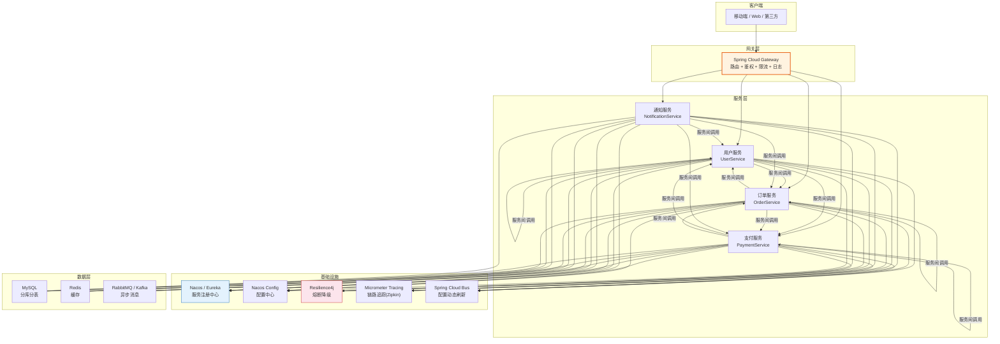
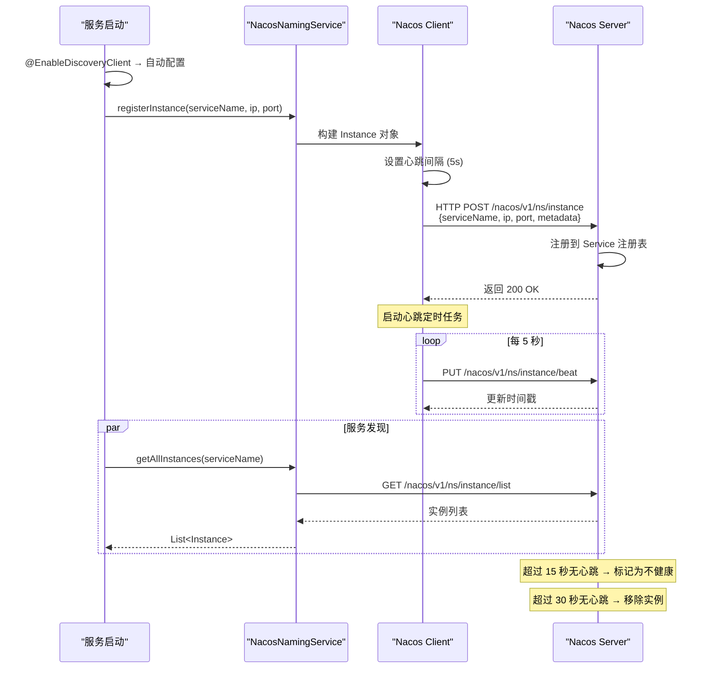
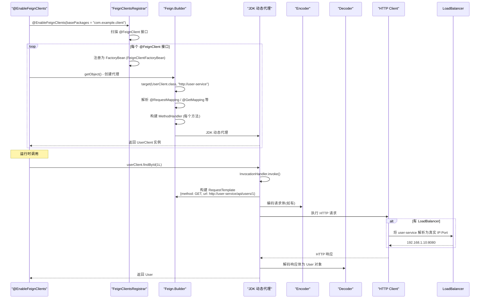
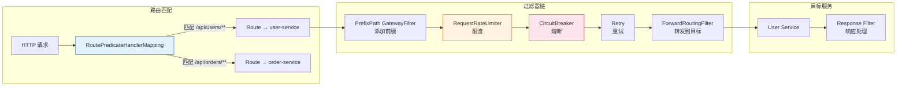
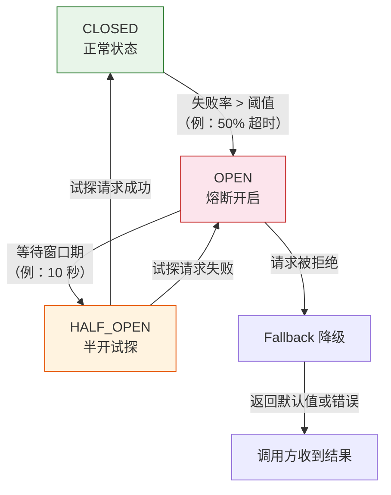

# 微服务与 Spring Cloud 实战入门

> 本文为系列第 12 篇，覆盖：服务注册发现源码（Eureka Client 心跳/Nacos NamingService）、OpenFeign 代理创建、Gateway 过滤器链、Spring Cloud LoadBalancer、Resilience4j 熔断状态机、微服务架构挑战与解决方案。

---

## 第一部分：微服务架构

### 1.1 架构总览



---

## 第二部分：服务注册发现源码

### 2.1 Nacos 注册发现流程



### 2.2 NacosNamingService 核心

```java
// NacosNamingService.java — Nacos 服务注册与发现核心
public class NacosNamingService implements NamingService {

    private final NamingHttpClientManager clientManager;   // HTTP 客户端
    private final BeatReactor beatReactor;                  // 心跳管理器
    private final HostReactor hostReactor;                  // 服务发现缓存

    // ★ 注册实例
    @Override
    public void registerInstance(String serviceName, String groupName,
                                  Instance instance) throws NacosException {
        // 1. 定时发送心跳
        if (instance.isEphemeral()) {   // 临时实例（默认）
            // 创建 BeatInfo（包含心跳间隔、服务名、IP、端口）
            BeatInfo beatInfo = new BeatInfo();
            beatInfo.setServiceName(NamingUtils.getGroupedName(serviceName, groupName));
            beatInfo.setIp(instance.getIp());
            beatInfo.setPort(instance.getPort());

            // 启动心跳任务
            beatReactor.addBeatInfo(NamingUtils.getGroupedName(serviceName, groupName), beatInfo);
        }

        // 2. 调用 Nacos Server API 注册
        reqApi(UtilAndComs.nacosUrlInstance, params, HttpMethod.POST);
    }

    // ★ 获取实例列表
    @Override
    public List<Instance> getAllInstances(String serviceName, String groupName,
                                            List<String> clusters, boolean subscribe) {
        // 从 HostReactor 获取（带缓存 + 自动刷新）
        ServiceInfo serviceInfo = hostReactor.getServiceInfo(
            NamingUtils.getGroupedName(serviceName, groupName),
            StringUtils.join(clusters, ","));
        return serviceInfo.getHosts();  // 返回健康的实例列表
    }
}
```

### 2.3 Eureka Client 注册源码

```java
// DiscoveryClient.java — Eureka 客户端核心
public class DiscoveryClient implements EurekaClient {

    private final InstanceInfo instanceInfo;  // 当前服务实例信息
    private final HeartbeatThread heartbeatThread;  // 心跳线程
    private final CacheRefreshThread cacheRefreshThread;  // 缓存刷新

    // ★ 初始化
    public DiscoveryClient(ApplicationInfoManager appInfoManager, EurekaClientConfig config) {
        // 1. 获取所属的 region/zone
        // 2. 创建 InstanceInfo（应用名、IP、端口、健康 URL）
        this.instanceInfo = appInfoManager.getInfo();

        // 3. 注册到 Eureka Server
        if (config.shouldRegisterWithEureka()) {
            boolean registered = register();
            if (registered) {
                // 4. 启动心跳线程（每 30 秒发送）
                heartbeatThread = new HeartbeatThread();
                scheduler.schedule(heartbeatThread, 30, TimeUnit.SECONDS);
            }
        }

        // 5. 启动缓存刷新线程（每 30 秒拉取注册表）
        cacheRefreshThread = new CacheRefreshThread();
        scheduler.schedule(cacheRefreshThread, 30, TimeUnit.SECONDS);
    }

    // ★ 服务注册
    boolean register() {
        // 发送 HTTP POST 到 Eureka Server
        // 路径：POST /eureka/apps/{appName}
        // 请求体：InstanceInfo（JSON/XML）
        EurekaHttpResponse<Void> httpResponse = eurekaTransport.registrationClient
            .register(instanceInfo);
        return httpResponse.getStatusCode() == 204;  // 204 No Content → 成功
    }

    // ★ 心跳线程（每 30 秒执行）
    private class HeartbeatThread implements Runnable {
        public void run() {
            // 发送 HTTP PUT 到 Eureka Server
            // 路径：PUT /eureka/apps/{appName}/{instanceId}
            EurekaHttpResponse<InstanceInfo> r = eurekaTransport.registrationClient
                .sendHeartBeat(instanceInfo.getAppName(), instanceInfo.getId(),
                    instanceInfo, null);

            if (r.getStatusCode() == 404) {
                // 服务端没有该实例 → 重新注册
                register();
            }
        }
    }
}
```

---

## 第三部分：OpenFeign 声明式调用源码

### 3.1 Feign 代理创建流程



### 3.2 Feign 核心源码

```java
// Feign.java — 核心构建器
public abstract class Feign {

    public static Builder builder() {
        return new Builder();
    }

    // ★ 创建代理的目标接口
    public <T> T target(Class<T> apiType, String url) {
        return target(new HardCodedTarget<>(apiType, url));
    }

    public <T> T target(Target<T> target) {
        // 创建代理
        return build().newInstance(target);
    }

    // ReflectiveFeign — 实际的代理创建
    public static class ReflectiveFeign extends Feign {

        @Override
        public <T> T newInstance(Target<T> target) {
            // 1. 解析接口的所有方法 → MethodHandler
            Map<String, MethodHandler> nameToHandler = targetToHandlersByName.apply(target);

            // 2. 创建 JDK 动态代理
            InvocationHandler handler = new FeignInvocationHandler(target, nameToHandler);
            T proxy = (T) Proxy.newProxyInstance(target.type().getClassLoader(),
                new Class<?>[] {target.type()}, handler);

            return proxy;
        }
    }

    // ★ InvocationHandler：每次方法调用时
    static class FeignInvocationHandler implements InvocationHandler {

        @Override
        public Object invoke(Object proxy, Method method, Object[] args) throws Throwable {
            // 1. equals / hashCode / toString 直接处理
            if (method.getDeclaringClass() == Object.class) {
                return method.invoke(this, args);
            }

            // 2. 查找对应的 MethodHandler → 执行 HTTP 请求
            MethodHandler handler = dispatch.get(method);
            return handler.invoke(args);  // ★ 发送 HTTP 请求 + 解析响应
        }
    }
}
```

---

## 第四部分：Gateway 过滤器链



---

## 第五部分：Resilience4j 熔断状态机



```java
// CircuitBreaker 配置
@Bean
public Customizer<Resilience4JCircuitBreakerFactory> defaultCustomizer() {
    return factory -> factory.configureDefault(id -> new Resilience4JConfigBuilder(id)
        .circuitBreakerConfig(CircuitBreakerConfig.custom()
            .slidingWindowSize(10)              // 滑动窗口 10 次调用
            .minimumNumberOfCalls(5)            // 最少 5 次才能计算
            .failureRateThreshold(50)           // 50% 失败率 → 熔断
            .waitDurationInOpenState(Duration.ofSeconds(10))  // 打开窗口 10s
            .permittedNumberOfCallsInHalfOpenState(3)  // 半开时最多试探 3 次
            .build())
        .timeLimiterConfig(TimeLimiterConfig.custom()
            .timeoutDuration(Duration.ofSeconds(3))
            .build())
        .build());
}
```

---

## 第六部分：生产配置实战

### 6.1 服务注册 (Nacos)

```yaml
# application.yml — 每个服务都需要
spring:
  application:
    name: user-service
  cloud:
    nacos:
      discovery:
        server-addr: 192.168.1.100:8848   # Nacos 地址
        namespace: production                # 命名空间隔离环境
        group: DEFAULT_GROUP
        heart-beat-interval: 5000            # 心跳间隔 5s
        heart-beat-timeout: 15000            # 心跳超时 15s
        ephemeral: true                      # 临时实例
server:
  port: 8080
```

### 6.2 OpenFeign 调用

```yaml
spring:
  cloud:
    openfeign:
      client:
        config:
          default:
            connect-timeout: 5000            # 连接超时 5s
            read-timeout: 10000              # 读取超时 10s
            logger-level: HEADERS
      compression:
        request:
          enabled: true
        response:
          enabled: true
      circuitbreaker:
        enabled: true                        # 集成 Resilience4j
```

### 6.3 Gateway 路由

```yaml
spring:
  cloud:
    gateway:
      routes:
        - id: user-service
          uri: lb://user-service
          predicates:
            - Path=/api/users/**
          filters:
            - StripPrefix=1
            - name: RequestRateLimiter
              args:
                redis-rate-limiter.replenishRate: 100
                redis-rate-limiter.burstCapacity: 200
        - id: order-service
          uri: lb://order-service
          predicates:
            - Path=/api/orders/**
          filters:
            - StripPrefix=1
      default-filters:
        - DedupeResponseHeader=Access-Control-Allow-Origin
```

---

## 第七部分：配置中心（Spring Cloud Config）

```java
// ConfigServicePropertySourceLocator — 从配置中心拉取
public class ConfigServicePropertySourceLocator
        implements PropertySourceLocator {

    @Override
    public PropertySource<?> locate(Environment environment) {
        // 1. 从 Environment 获取 spring.cloud.config 配置
        // 2. 构造 URL: GET /{application}/{profile}/{label}
        // 3. 返回 PropertySource → 合并到 Spring Environment
        //
        // 例如：http://config-server:8888/user-service/test/main
        // 返回：{ "spring.datasource.url": "jdbc:mysql://...", ... }
        return null;
    }
}
```

---

## 总结

| 知识点 | 要点 |
|--------|------|
| **Nacos 注册** | `NacosNamingService.registerInstance()` → HTTP POST + 5s 心跳 |
| **Eureka 注册** | `DiscoveryClient.register()` → HTTP POST `/eureka/apps/{appName}` |
| **Feign 代理** | `Feign.ReflectiveFeign.newInstance()` → JDK Proxy + MethodHandler |
| **Gateway** | `RoutePredicateHandlerMapping` 匹配路由 → `GatewayFilterChain` |
| **LoadBalancer** | 替换 Ribbon，RoundRobin / 自定义 LoadBalancer |
| **Resilience4j** | 状态机：CLOSED → OPEN → HALF_OPEN，滑动窗口计算失败率 |
| **Config** | `ConfigServicePropertySourceLocator` 拉取远程配置 |
