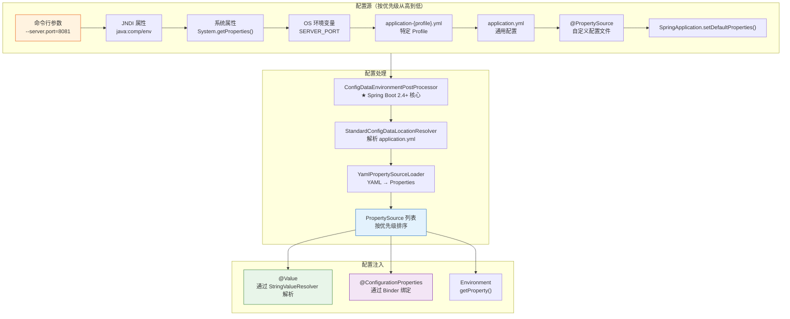
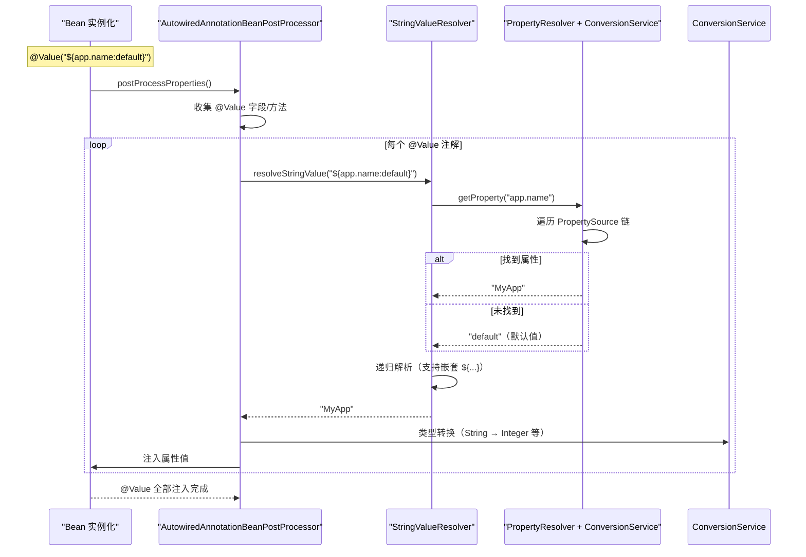
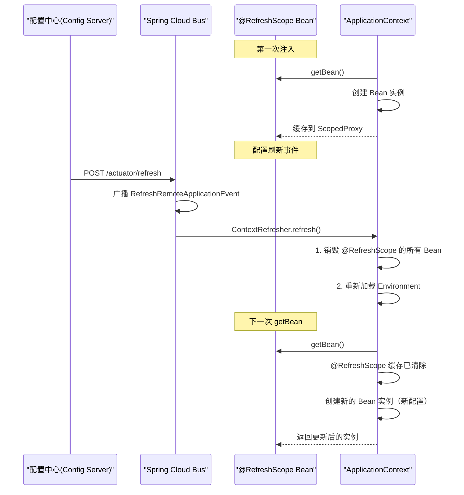

# Spring 配置管理深度指南

> 本文为系列第 14 篇，覆盖：PropertySource 优先级链（源码）、ConfigDataEnvironmentPostProcessor（Spring Boot 2.4+）、@Value 解析原理（StringValueResolver）、@ConfigurationProperties 绑定（Binder API）、Profile 匹配、配置刷新、加密。

---

## 1. 配置架构总览



---

## 2. PropertySource 优先级链源码

### 2.1 PropertySource 类层次

```java
// PropertySource.java — Spring 配置源抽象
public abstract class PropertySource<T> {
    protected final String name;    // 属性源名称（如 "application.yml"）
    protected final T source;       // 属性数据源

    // 获取属性值
    public abstract Object getProperty(String name);
}

// 常见的 PropertySource 实现：
// ┌──────────────────────────────────────────────┐
// │ MapPropertySource             — Map 属性源    │
// │ SystemEnvironmentPropertySource — OS 环境变量 │
// │ PropertiesPropertySource      — .properties  │
// │ ResourcePropertySource        — Properties 文件│
// │ OriginTrackedMapPropertySource — YAML 属性(含源)│
// │ CompositePropertySource       — 组合属性源    │
// └──────────────────────────────────────────────┘
```

### 2.2 Spring Boot 2.4+ ConfigData 处理

```java
// ConfigDataEnvironmentPostProcessor.java — ★ 配置处理入口
public class ConfigDataEnvironmentPostProcessor
        implements EnvironmentPostProcessor, Ordered {

    @Override
    public void postProcessEnvironment(ConfigurableEnvironment environment,
                                        SpringApplication application) {
        // 1. 创建 EnvironmentPostProcessor 应用上下文
        // 2. 收集所有 ConfigDataLocationResolver（定位配置源）
        //    - StandardConfigDataLocationResolver: 解析 application.yml/properties
        //    - ConfigTreeConfigDataLocationResolver: 配置树（K8s ConfigMap）
        // 3. 收集所有 ConfigDataLoader（加载配置数据）
        //    - StandardConfigDataLoader: 加载 yml/properties 文件
        // 4. 应用配置到 Environment

        // 1. 导入配置
        ConfigDataEnvironment configDataEnvironment = new ConfigDataEnvironment(
            environment, application.getResourceLoader(),
            application.getAdditionalProfiles(), application.getEnvironmentPostProcessors());

        configDataEnvironment.process();        // ★ 处理所有配置源
        configDataEnvironment.processAndApply(); // ★ 应用到 Environment
    }
}

// ConfigDataLocationResolver — 定位配置文件的解析器
public class StandardConfigDataLocationResolver
        implements ConfigDataLocationResolver<StandardConfigDataResource> {

    @Override
    public List<StandardConfigDataResource> resolve(ConfigDataLocationResolverContext context,
                                                      ConfigDataLocation location) {
        // 解析 location 如 "classpath:/config/"
        // 查找以下文件（按优先级）：
        //   application-{profile}.properties
        //   application-{profile}.yml / yaml
        //   application.properties
        //   application.yml / yaml
        // 返回有序的资源列表
    }
}
```

---

## 3. @Value 解析原理

### 3.1 解析流程



### 3.2 源码

```java
// AutowiredAnnotationBeanPostProcessor.java — 处理 @Value 注入
public class AutowiredAnnotationBeanPostProcessor
        extends InstantiationAwareBeanPostProcessorAdapter {

    // 字段注入时调用
    @Override
    public PropertyValues postProcessProperties(PropertyValues pvs,
                                                  Object bean, String beanName) {
        // 1. 查找 Bean 中有 @Value 和 @Autowired 的字段/方法
        InjectionMetadata metadata = findAutowiringMetadata(beanName, bean.getClass(), pvs);
        // 2. 注入
        metadata.inject(bean, beanName, pvs);
        return pvs;
    }
}

// InjectionMetadata — 缓存了需要注入的目标
// 对每个 @Value 字段：
//   1. 获取注解值 "${app.name:default}"
//   2. 调用 StringValueResolver 解析占位符
//   3. 类型转换（int → Integer 等）
//   4. 反射设置字段值

// EmbeddedValueResolver — 核心解析器
public class EmbeddedValueResolver implements StringValueResolver {
    private final ConfigurableBeanFactory beanFactory;

    @Override
    public String resolveStringValue(String strVal) {
        // 使用 PropertyPlaceholderHelper 解析 ${...}
        // 通过 PropertyResolver 从 Environment 获取值
        return this.beanFactory.resolveEmbeddedValue(strVal);
    }
}
```

---

## 4. @ConfigurationProperties 绑定源码

### 4.1 绑定流程

```mermaid
flowchart LR
    A["配置源<br/>application.yml"] --> B["PropertySource 列表"]
    B --> C["ConfigurationPropertiesBindingPostProcessor"]

    C --> D["扫描 @EnableConfigurationProperties<br/>+ @ConfigurationProperties Bean"]

    D --> E["Binder API<br/>Spring Boot 2.0+"]

    E --> F["OriginTrackedMapPropertySource<br/>扁平化为键值对"]
    F --> G["属性名转换<br/>spring.datasource.url → spring.datasource.url"]
    G --> H["类型转换<br/>ConversionService<br/>String → int/List/Map/Duration"]

    H --> I["校验<br/>@Valid / JSR-303"]
    I --> J["注入到<br/>Bean 实例"]
```



### 4.2 源码

```java
// @ConfigurationProperties 绑定 — 核心 Binder API
public class ConfigurationPropertiesBinder {

    private final Binder binder;  // Spring Boot 2.0+ 类型安全绑定

    // 绑定属性到 Java Bean
    public void bind(Bindable<?> target) {
        // 1. Binder 从 Environment 的所有 PropertySource 收集属性
        // 2. 按属性名前缀过滤（如 "spring.datasource"）
        // 3. 属性名松匹配（relaxed binding）：
        //    spring.datasource.url
        //    spring.datasource.URL
        //    spring.datasource.jdbc-url
        //    spring.datasource.jdbcUrl
        // 4. 类型转换：ConversionService 自动转换
        // 5. 数组/集合/嵌套对象递归绑定

        this.binder.bind("spring.datasource", Bindable.of(DataSourceProperties.class));
    }
}

// 完整示例
@Component
@ConfigurationProperties(prefix = "app.datasource")
@Validated
public class DataSourceProperties {

    @NotEmpty
    private String url;

    @NotEmpty
    private String username;

    @NotEmpty
    private String password;

    private int maxPoolSize = 10;          // 有默认值

    private Duration connectionTimeout = Duration.ofSeconds(30);  // Duration 类型

    private List<String> initSql;          // 列表

    private Map<String, String> properties = new HashMap<>();   // 映射

    // getters / setters
}

// application.yml 对应配置：
// app:
//   datasource:
//     url: jdbc:mysql://localhost:3306/test
//     username: root
//     password: secret
//     max-pool-size: 20
//     connection-timeout: 30s
//     init-sql:
//       - CREATE TABLE IF NOT EXISTS ...
//       - INSERT INTO ...
//     properties:
//       hibernate.dialect: org.hibernate.dialect.MySQLDialect
```

### 4.3 @Value vs @ConfigurationProperties

| 维度 | @Value | @ConfigurationProperties |
|------|--------|--------------------------|
| **类型安全** | ❌ 手动类型转换 | ✅ 自动绑定 |
| **松绑定** | ❌ 必须精确匹配 | ✅ `jdbc-url` / `jdbcUrl` 均可 |
| **嵌套对象** | ❌ 不支持 | ✅ 支持嵌套 POJO |
| **校验** | ❌ 需手动 | ✅ @Validated + JSR-303 |
| **默认值** | `${key:default}` 语法 | Java 字段默认值 |
| **复杂类型** | ❌ 不支持 | ✅ List / Map / Duration 等 |
| **推荐场景** | 单个属性（临时配置） | 完整配置组（结构化） |

---

## 5. Profile 源码

```java
// Profile 激活优先级：
// 1. SpringApplication.setAdditionalProfiles() — 编程方式
// 2. spring.profiles.active — 配置文件
// 3. spring.profiles.include — 包含的 Profile
// 4. 默认：default

// PriorityOrdered 排序（@ActiveProfiles 中的第一个匹配）

// Profiles.of() — 表达式匹配
public class Profiles {
    // 支持：
    //   "dev"              — 精确匹配
    //   "dev & cloud"      — 与：同时激活
    //   "dev | cloud"      — 或：任一激活
    //   "!prod"            — 非：当前不是 prod
    //   "(dev | test) & !mysql" — 组合
}
```

---

## 6. 配置刷新（@RefreshScope）



```yaml
management:
  endpoints:
    web:
      exposure:
        include: refresh  # 暴露 /actuator/refresh
```

```java
@Component
@RefreshScope
@ConfigurationProperties(prefix = "app.features")
public class FeatureFlags {
    private boolean newCheckoutEnabled;
    private String maintenanceMessage;

    // getters / setters
}
```

---

## 7. 配置加密

```xml
<dependency>
    <groupId>com.github.ulisesbocchio</groupId>
    <artifactId>jasypt-spring-boot-starter</artifactId>
    <version>3.0.5</version>
</dependency>
```

```yaml
# application.yml
jasypt:
  encryptor:
    password: ${JASYPT_PASSWORD}  # 密钥从环境变量读取
    algorithm: PBEWithMD5AndDES

spring:
  datasource:
    password: ENC(encryptedPasswordHere)  # ENC() 包裹加密内容
```

---

## 总结

| 知识点 | 要点 |
|--------|------|
| **PropertySource 优先级** | 命令行 > JNDI > 系统属性 > 环境变量 > 配置文件 > 默认值 |
| **ConfigDataEnvironmentPostProcessor** | Spring Boot 2.4+ 配置处理入口，调用 ConfigDataLocationResolver |
| **@Value 解析** | AutowiredAnnotationBeanPostProcessor → StringValueResolver → PropertyResolver |
| **@ConfigurationProperties 绑定** | ConfigurationPropertiesBindingPostProcessor → Binder API |
| **Profile** | Profiles.of("dev & !prod") 表达式匹配 |
| **@RefreshScope** | `ContextRefresher.refresh()` → 销毁 Scoped Bean → 重建 |
| **加密** | Jasypt / Spring Cloud Config 加密 |
