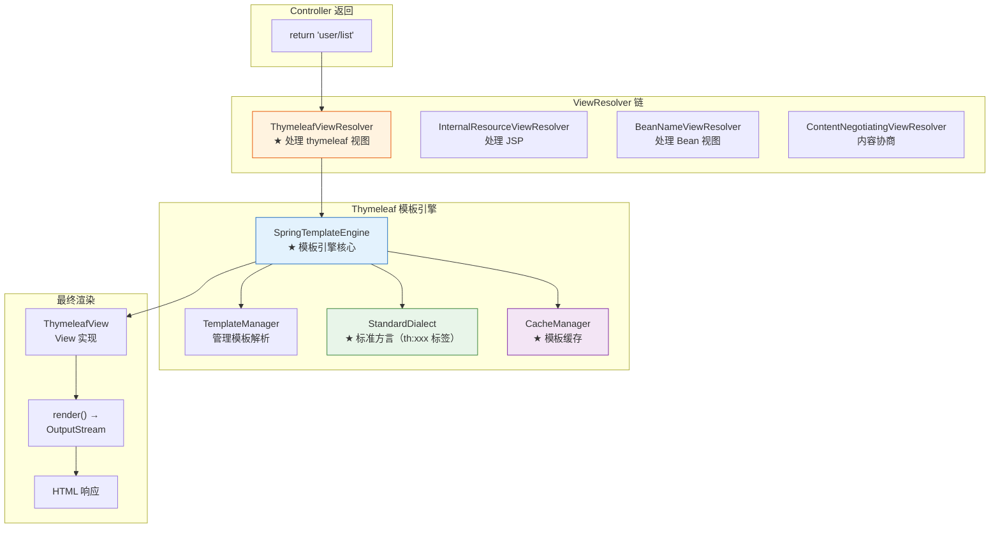
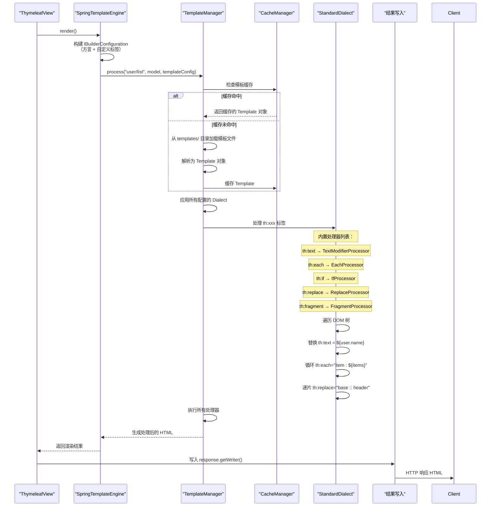

# Spring Boot 视图技术：Thymeleaf 与模板引擎

> 本文为系列第 15 篇，覆盖：Thymeleaf 源码分析（ThymeleafViewResolver / SpringTemplateEngine / StandardDialect）、模板缓存、表达式语法、布局与片段、国际化、JSP 兼容配置、模板引擎选型对比。

---

## 1. 视图解析架构



---

## 2. ThymeleafViewResolver 源码

```java
// ThymeleafViewResolver.java — Spring Boot 中解析 Thymeleaf 视图
public class ThymeleafViewResolver extends AbstractCachingViewResolver
        implements Ordered {

    // 模板引擎实例
    private SpringTemplateEngine templateEngine;

    // 字符编码（默认 UTF-8）
    private String characterEncoding = "UTF-8";

    // 内容类型
    private String contentType = "text/html";

    // 是否强制缓存（生产环境为 true）
    private boolean cache = true;

    // 视图名后缀
    private String suffix = ".html";

    // ★ 根据视图名创建 View 对象
    @Override
    protected View loadView(String viewName, Locale locale) throws Exception {
        // 1. 解析视图名
        //    如果以 "redirect:" 开头 → 创建 RedirectView
        //    如果以 "forward:" 开头 → 创建 InternalResourceView
        //    否则 → 创建 ThymeleafView

        if (viewName.startsWith("redirect:")) {
            return new RedirectView(viewName.substring("redirect:".length()));
        }

        if (viewName.startsWith("forward:")) {
            return new InternalResourceView(viewName.substring("forward:".length()));
        }

        // ★ 创建 ThymeleafView
        ThymeleafView view = new ThymeleafView(viewName);

        // 设置模板名（去掉后缀，例如 "user/list.html" → "user/list"）
        view.setTemplateName(getTemplateName(viewName));

        // 设置模板引擎
        view.setTemplateEngine(this.templateEngine);

        view.setCharacterEncoding(this.characterEncoding);
        view.setContentType(this.contentType);
        view.setStaticVariables(this.staticVariables);
        view.setLocale(locale);

        return view;
    }
}
```

---

## 3. SpringTemplateEngine 渲染流程



### 3.1 底层渲染源码

```java
// SpringTemplateEngine.java — 核心渲染
public class SpringTemplateEngine extends TemplateEngine {

    // 初始化：注册 SpringEL 表达式支持
    @Override
    protected void initialize() {
        // 1. 注册默认方言（StandardDialect + SpringStandardDialect 扩展）
        //   - 支持 SpringEL（${user.name} 通过 Spring 容器解析）
        //   - 支持 th:field（表单绑定，Spring MVC 集成）
        //   - 支持 th:errors（校验错误）

        // 2. 注册自定义方言（@Bean → IDialect）
        //   - 通过 addDialect() 注册

        // 3. 初始化模板解析器
        //   - SpringResourceTemplateResolver（从 classpath:/templates/ 加载）
    }
}

// ThymeleafView.java — 实际 View 渲染
public class ThymeleafView extends AbstractThymeleafView {

    @Override
    public void render(Map<String, ?> model, HttpServletRequest request,
                        HttpServletResponse response) throws Exception {
        // 1. 合并模型数据
        //    - Controller 中 addAttribute() 的数据
        //    - @ModelAttribute 方法添加的数据
        Map<String, Object> mergedModel = new HashMap<>();
        mergedModel.putAll(this.staticVariables);
        if (model != null) {
            mergedModel.putAll(model);
        }

        // 2. 创建 Thymeleaf 上下文
        IWebContext context = new WebContext(request, response, servletContext,
            response.getLocale(), mergedModel);

        // 3. 调用模板引擎渲染
        templateEngine.process(templateName, context, response.getWriter());
    }
}
```

---

## 4. 模板语法与处理

### 4.1 常用属性

| 属性 | 示例 | 说明 |
|------|------|------|
| `th:text` | `<p th:text="${user.name}">默认</p>` | 替换文本内容 |
| `th:utext` | `<p th:utext="${htmlContent}">` | 不转义 HTML |
| `th:each` | `<tr th:each="u : ${users}">` | 循环 |
| `th:if` | `<div th:if="${user.active}">` | 条件 |
| `th:unless` | `<div th:unless="${user.deleted}">` | 否定条件 |
| `th:switch` | `<div th:switch="${role}">` | 分支 |
| `th:object` | `<div th:object="${user}">` | 绑定对象 |
| `th:field` | `<input th:field="*{email}">` | 表单字段绑定 |
| `th:errors` | `<p th:errors="*{email}">` | 校验错误 |
| `th:replace` | `<div th:replace="fragments/header :: header">` | 替换式片段 |
| `th:insert` | `<div th:insert="fragments/header :: header">` | 插入式片段 |
| `th:fragment` | `<header th:fragment="header">` | 定义片段 |

### 4.2 处理器源码（以 th:each 为例）

```java
// EachProcessor.java — 处理 th:each
public final class EachProcessor extends AbstractProcessor {

    @Override
    protected void doProcess(ITemplateContext context, IProcessableElementTag tag,
                              IElementTagStructureHandler structureHandler) {

        // 1. 解析 th:each 值：th:each="item : ${items}"
        //    → 分解为 iterVar = "item", expression = "${items}"
        EachParsed parsed = parseEachAttribute(tag);

        // 2. 在上下文中解析表达式 ${items}
        Object iteratedValue = parsed.getExpression().execute(context);

        // 3. 遍历并重复生成标签
        if (iteratedValue instanceof Iterable) {
            for (Object item : (Iterable<?>) iteratedValue) {
                // 将 "item" 设为当前变量
                context.setVariable(parsed.getIterVar(), item);

                // 重新生成标签（递归处理子标签）
                structureHandler.setBody(tag.getBody());
            }
        }
    }
}
```

---

## 5. 模板缓存

```yaml
# application.yml
spring:
  thymeleaf:
    cache: true           # 生产环境开启缓存
    check-template-location: true
    prefix: classpath:/templates/
    suffix: .html
    mode: HTML            # 模板模式
    encoding: UTF-8
```

```java
// CacheManager — 模板缓存
// 默认实现：StandardCacheManager
// 缓存键：模板名 + 语言环境
// 缓存值：解析后的 ITemplate (DOM 树)

// Spring Boot 生产环境默认开启缓存
// 开发时关闭 (spring.thymeleaf.cache=false)
// 开启时模板只解析一次，后续请求直接使用缓存的 DOM 树
```

---

## 6. 布局与片段

### 6.1 布局示例

```html
<!-- fragments/base.html — 基础布局 -->
<!DOCTYPE html>
<html th:fragment="layout(title, content)">
<head>
    <meta charset="UTF-8">
    <title th:replace="${title}">默认标题</title>
    <link rel="stylesheet" href="/css/common.css">
</head>
<body>
    <header th:replace="fragments/header :: header"></header>
    <main th:replace="${content}">
        <!-- 子页面内容将插入到这里 -->
    </main>
    <footer th:replace="fragments/footer :: footer"></footer>
</body>
</html>

<!-- user/list.html — 子页面 -->
<!DOCTYPE html>
<html th:replace="fragments/base :: layout(~{::title}, ~{::main})">
<head>
    <title>用户列表</title>
</head>
<body>
    <main>
        <h1>用户列表</h1>
        <table>
            <tr th:each="user : ${users}">
                <td th:text="${user.id}">ID</td>
                <td th:text="${user.username}">用户名</td>
                <td th:text="${user.email}">邮箱</td>
            </tr>
        </table>
    </main>
</body>
</html>
```

---

## 7. 国际化

```java
// Thymeleaf 的国际化通过 Spring MessageSource 实现
// 在类路径下创建 messages.properties / messages_zh_CN.properties

// messages.properties
user.list.title=User List
user.create=Create User

// messages_zh_CN.properties
user.list.title=用户列表
user.create=创建用户
```

```html
<!-- Thymeleaf 模板中使用 -->
<h1 th:text="#{user.list.title}">用户列表</h1>
<a th:text="#{user.create}">创建用户</a>

<!-- 带参数的国际化 -->
<!-- messages.properties: welcome.message=Welcome, {0}! -->
<p th:text="#{welcome.message(${session.user.name})}">Welcome!</p>
```

---

## 8. JSP 兼容

```yaml
# 如果需要同时支持 Thymeleaf 和 JSP
spring:
  mvc:
    view:
      prefix: /WEB-INF/views/
      suffix: .jsp
  thymeleaf:
    enabled: true  # Thymeleaf 也启用
```

```java
@Configuration
public class ViewConfig {
    @Bean
    public InternalResourceViewResolver jspViewResolver() {
        InternalResourceViewResolver resolver = new InternalResourceViewResolver();
        resolver.setPrefix("/WEB-INF/views/");
        resolver.setSuffix(".jsp");
        resolver.setOrder(2);  // 优先级低于 Thymeleaf
        return resolver;
    }
}
```

---

## 9. 模板引擎对比

| 特性 | Thymeleaf | JSP | FreeMarker |
|------|-----------|-----|------------|
| **自然模板** | ✅ 可直接浏览器打开 | ❌ 依赖服务器 | ❌ 依赖服务器 |
| **语法** | 属性式（th:xxx） | 标签式（<c:forEach>） | FTL 指令 |
| **Spring 集成** | 原生（SpringEL） | JSTL | 一般 |
| **性能** | 高（缓存 DOM） | 中 | 高 |
| **学习曲线** | 平缓 | 简单 | 中等 |
| **推荐场景** | Spring Boot 首选 | 遗留系统 | 非 HTML（邮件/XML） |

---

## 总结

| 知识点 | 要点 |
|--------|------|
| **ThymeleafViewResolver** | 解析视图名、区分 redirect:/forward:、创建 ThymeleafView |
| **SpringTemplateEngine** | 初始化 StandardDialect + SpringEL 支持 |
| **渲染流程** | TemplateManager → CacheManager(缓存) → Dialect 处理 DOM → 输出 |
| **th:each 处理** | EachProcessor 解析表达式 → 遍历 → 重复生成标签 |
| **模板缓存** | StandardCacheManager 缓存解析后的 DOM 树 |
| **布局** | th:fragment 定义 + th:replace/insert 引入 |
| **国际化** | #{key} 引用 MessageSource |
